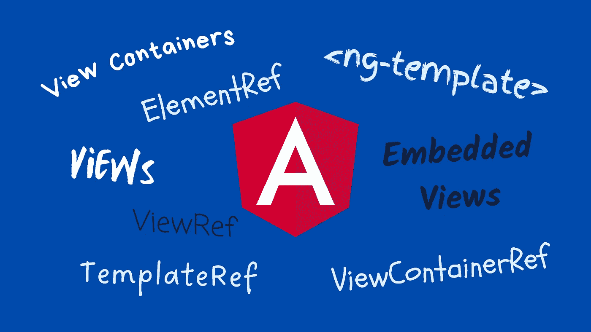
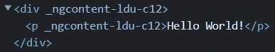
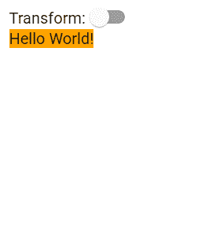
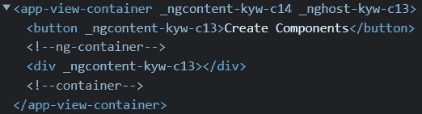
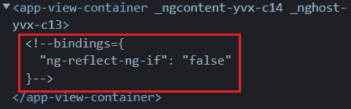
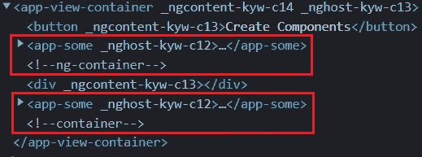
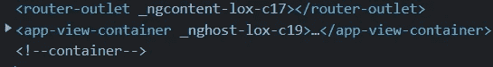

# 角度 DOM 操作:ElementRef、TemplateRef 和 ViewContainerRef

> 原文：<https://javascript.plainenglish.io/angular-elementref-templateref-viewcontainerref-8517b7ce3274?source=collection_archive---------1----------------------->

## 概述 Angular 中的元素、模板、视图和视图容器，以及如何以编程方式修改 DOM。

Photo created using Canva — Resources from the [Angular PressKit](https://angular.io/presskit)

在本文中，我们将研究 Angular 中的一些 DOM 操作技术。如果元素、模板、视图和视图容器这些术语听起来令人困惑或陌生，那么这一个就是为您准备的。

所以，让我们开始吧！

# 元素 ElementRef

元素几乎是我们在网页上看到(或看不到)的所有东西。例如，输入字段、链接、图像和其他可能不可见的东西都是元素。

`[ElementRef](https://angular.io/api/core/ElementRef)`类是本地元素的简单包装器，本地元素通常是浏览器中的 DOM 元素。它提供了一种访问`nativeElement`对象的方法，公开了相关本地元素的所有方法和属性。

我们如何得到一个 ElementRef？

一种方法是使用`@ViewChild`装饰器。我们在模板文件中分配一个模板变量。

然后我们使用`@ViewChild`装饰器来查询来自*视图*的元素(很快会有更多关于这个术语的内容)。

这是第 8 行在控制台中显示的内容:

或者，我们可以在感兴趣的元素上使用指令。

并在指令的构造函数中使用依赖注入。

通过`nativeElement`对象，我们可以访问它的所有方法和属性，并操纵元素。

注意`nativeElement`的默认类型是`any`类型(`T = any`)。这意味着如果我们仅仅使用`ElementRef`作为类型，我们的`nativeElement`将是`any`类型。我们可以做得更好！

相反，我们使用像这样的强类型`ElementRef<HTMLElement>`，它支持智能感知。我们还可以使用更具体的类型，比如如果元素是一个输入标签，就使用`HTMLInputElement`等等。

在我们的演示中，我们修改了`appElement`指令来接收一个`boolean`输入，并根据它的值来转换`div`元素。

我们不会深入这个实现的细节，因为有更重要的事情需要关注。您可以在本文末尾提供的 StackBlitz 中找到并研究代码。

注意，使用`ElementRef`操作 DOM 应该小心！

官方的角度文件指出

> “[……]允许直接访问 DOM 会使您的应用程序更容易受到 XSS 攻击。”

简单地说，如果我们只是想使用`ElementRef`获得关于 DOM 元素的信息，这没有任何风险。风险在于修改 DOM 元素的特定情况。

长话短说，为了防止 XSS 攻击，Angular 默认将所有值视为不可信。当一个值从模板绑定或插值中插入到 DOM 中时，Angular 会自动清理和转义不受信任的值。

通过直接通过`ElementRef`访问和修改 DOM，我们绕过了这种净化机制，这可能使我们的应用程序容易受到 XSS 攻击。

阅读[安全指南](https://angular.io/guide/security#preventing-cross-site-scripting-xss)了解更多信息。

# 视图— ViewRef

我们在上一节中使用了术语*视图*。那么，到底什么是视图呢？

根据 Angular 的文档，[视图](https://angular.io/guide/glossary#view)是“可以一起创建和销毁的显示元素的最小分组”。

这个定义听起来耳熟吗？

没错。简单地说，组件类及其模板文件定义了一个视图。

`[ViewRef](https://angular.io/api/core/ViewRef)`类代表代码中的角度视图。一个`ViewRef`可以是一个组件模板(*宿主视图*)或者一个`TemplateRef` ( *嵌入视图*)。

# 查看容器—视图容器参考

*视图容器*是用于动态创建、添加或删除视图的容器。视图容器可以包含:

*   *主机视图*，通过用`createComponent`方法实例化一个组件来创建
*   *嵌入式视图*，通过用`createEmbeddedView`方法实例化一个`TemplateRef`来创建

`[ViewContainerRef](https://angular.io/api/core/ViewContainerRef)`类代表代码中的视图容器。它是我们用来以编程方式管理视图的 API。

这是如何工作的？

为了通过代码动态地添加或删除组件，我们需要获得一个视图容器。像使用`ElementRef`一样，这可以使用`@ViewChild`装饰器或指令来完成。

让我们检查第一种方法。

我们将模板变量分配给想要添加组件的容器。

然后在类文件中，我们查询视图。只是这一次我们做的有点不同。观察`{ read: ViewContainerRef }`部分。

现在，当用户点击按钮时，一个`SomeComponent`实例被创建并添加到每个视图容器中。

分别，有一个`remove`方法。我们可以有选择地传递我们想要销毁的视图的从 0 开始的索引。如果我们不传递任何东西，那么最后一个视图将被删除。

你知道吗？

每个视图容器都有一个唯一的锚元素(一对一的关系)。在我们的演示中，HTML 最初看起来像这样:

`<!--ng-container-->`和`<!--container-->`是我们两个视图容器的锚元素。

那么，下面这个案例呢？

即使在什么都不渲染的情况下，Angular 仍然会使用锚元素。

此外，当视图被添加到视图容器中时，它们将成为锚元素的兄弟！

单击“创建组件”按钮将创建组件，并将其作为同级组件添加到锚定元素，如下所示:

顺便说一下，这也正是`<router-outlet>`的情况。布线元件的标签没有出现在`<router-outlet>`标签内。相反，它以兄弟姐妹的形式出现。

# 模板— <ng-template>—模板参考—嵌入视图</ng-template>

模板是一组可以重用的 HTML 元素。在`<ng-template>`中定义的视图被称为嵌入式视图。嵌入式视图在实例化之前不会呈现。

`[TemplateRef](https://angular.io/api/core/TemplateRef)`类“代表一个可以用来实例化嵌入式视图的嵌入式模板”。

我们使用组件模板文件中的`<ng-template>`标签来定义一个模板。

然后，在组件类中，我们可以通过使用`ViewContainerRef`的`createEmbeddedView`方法按需实例化一个嵌入式视图。

如果我们想从一开始就嵌入视图，我们可以简单地使用`ngTemplateOutlet`，就像这样:

你可以[阅读更多关于](/creating-reusable-configurable-angular-components-b7fcba2f5f38) `[ngTemplateOutlet](/creating-reusable-configurable-angular-components-b7fcba2f5f38)` [的文章](/creating-reusable-configurable-angular-components-b7fcba2f5f38)。

你可以在下面的 StackBlitz 中找到一个工作演示。别忘了[订阅我的简讯](https://vkagklis.medium.com/subscribe)来关注更多类似的内容！

# 结论

在本文中，我们讨论了一些术语(元素、模板、视图和视图容器)及其代码内表示(ElementRef、TemplateRef、ViewRef 和 ViewContainerRef)。

我们还用简单的例子演示了如何利用这些类以编程方式操作 DOM。

我希望你喜欢这篇文章，并且你学到了一些新的东西。

*感谢阅读！*

*更多内容看* [***说白了。报名参加我们的***](https://plainenglish.io/) **[***免费周报***](http://newsletter.plainenglish.io/) *。关注我们关于*[***Twitter***](https://twitter.com/inPlainEngHQ)[***LinkedIn***](https://www.linkedin.com/company/inplainenglish/)*[***YouTube***](https://www.youtube.com/channel/UCtipWUghju290NWcn8jhyAw)*[***不和***](https://discord.gg/GtDtUAvyhW) *。对增长黑客感兴趣？检查* [***电路***](https://circuit.ooo/) *。*****