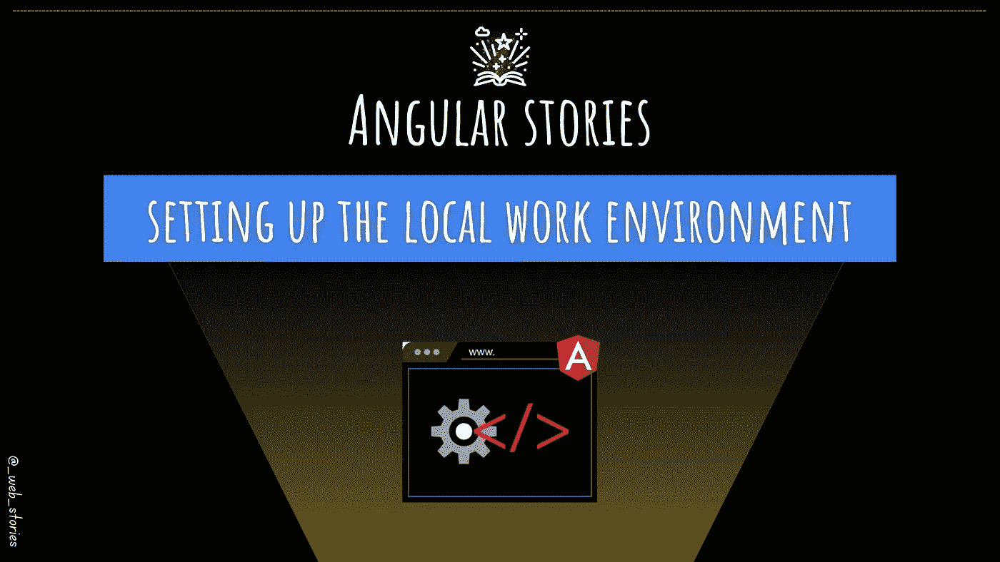

# 如何设置局部角度环境

> 原文：<https://javascript.plainenglish.io/angular-environment-setup-d0bc8cec3e4f?source=collection_archive---------22----------------------->

## 关于设置本地 Angular 开发环境的简短指南



By FAM

## 你好👋

在上一集中，我们建立了一个关于 Angular 的全局观念，它是什么，为什么值得学习，它有什么有趣的地方。

这篇文章是我们构建 Angular 应用的第一步。我们将建立一个专业的本地工作环境，这样我们就可以开始 Angular 的旅程。

# 我们将要使用的工具

*   [**Node.js**](https://nodejs.org/en/) **:** 这是一个 JavaScript 运行时环境，允许我们在服务器上运行 js。
*   [**npm**](https://www.npmjs.com/) 或 [**纱**](https://classic.yarnpkg.com/lang/en/) 包管理器:安装和管理 JS 包。
*   [**Angular CLI**](https://www.npmjs.com/package/@angular/cli)**:**Angular 命令行界面，只用命令就能在一瞬间高效生成角度特征。
*   [**VSCode:**](https://code.visualstudio.com/) 迄今为止我用过的最好的代码编辑器，并且仍然在我的前端项目中使用。
*   [**Git**](https://git-scm.com/downloads)**:**这是我们的版本控制系统，用于跟踪您的编码和文件随时间的变化。

# VSCode 扩展

VSCode 扩展确实是很棒的工具，可以让你的编码生活变得更容易，并提高你的生产力。

## [角语服务](https://marketplace.visualstudio.com/items?itemName=Angular.ng-template)

这个扩展为角度模板、完成、信息、定位定义等提供了丰富的编辑体验。

## [有角度的片段](https://marketplace.visualstudio.com/items?itemName=johnpapa.Angular2)

这个扩展将提高你的生产率，你不必从头到尾写你的代码，特别是循环代码块，比如循环、HTTP 调用、RxJS 操作符等等。

## [自动重命名标签](https://marketplace.visualstudio.com/items?itemName=formulahendry.auto-rename-tag)

自动重命名成对的 HTML 标签。有了这个扩展，您不需要同时更改开始和结束标记。更改开始标记将自动更新结束标记。

## [GitLens](https://marketplace.visualstudio.com/items?itemName=eamodio.gitlens)

这是获得关于 git repo 的见解和信息的一个很好的扩展。编码时，您可以单击代码行，查看提交当前行的人和提交的名称。超级实用当你和一个团队一起工作，需要澄清一段代码时，你会马上找到作者询问(尽管他/她是否还在团队中😜).它有很多很棒的功能。

## [git-自动配置](https://marketplace.visualstudio.com/items?itemName=shyykoserhiy.git-autoconfig)

你不想把你的代码推到你公司的 Git 账户上。这个扩展允许你在你的 VSCode 中配置多个 Git 账户，你可以选择账户用于你正在工作的项目。

## [ESLint](https://marketplace.visualstudio.com/items?itemName=dbaeumer.vscode-eslint)

这是任何开发人员的必备技能之一。扩展分析代码并提前为您发现问题。不努力！

# 安装角形

我们将使用 Angular CLI 及其提供的强大功能来快速生成我们需要的内容。因此，我们必须按照您的要求安装 npm 或 yarn:

```
***npm install -g*** [***@angular/cli***](http://twitter.com/angular/cli)
```

就是这样！您已经准备好创建您的 Angular 应用程序了！这将是下一集。我们将了解 Angular 应用程序的架构和结构，以及它是如何运行的！敬请期待😉

今天就到这里，看阿雅🙋

如果您有任何问题或反馈，请点击评论或通过 LinkedIn 联系我— **我洗耳恭听！**

[**想请我喝杯咖啡吗？☕️**](https://www.buymeacoffee.com/fatimaamzil)

> 让我们为 2022 年打造一个更好的‘我们’！

## 了解有关 2022 年网络快车计划的更多信息:

I- [一般网络知识](https://medium.com/geekculture/2022-web-program-chapter-n-1-is-done-499fb0707220?source=your_stories_page----------------------------------------)

[II-网页框架:HTML](https://famzil.medium.com/your-html-essentials-69d9b2349355?source=your_stories_page----------------------------------------)

[三-网页样式:CSS](https://medium.com/geekculture/recap-of-the-css-chapter-ae388d51e564?source=your_stories_page----------------------------------------)

[IV-网络互动:JavaScript](https://levelup.gitconnected.com/congrats-to-js-chapter-finishers-e38a3ca1612c)

[V- BOM & DOM](http://8c48)

[VI- Web 性能](/my-web-articles-roadmap-for-2022-20387cab9b07#e71b)

[七-工具](https://famzil.medium.com/6-essential-frontend-tools-a95995f85eee?source=your_stories_page-------------------------------------)

## VIII-角形

*   [路线图](https://famzil.medium.com/angular-stories-the-opening-c44d6341e8f3)

[](https://medium.com/geekculture/2022-web-program-is-launched-f38a3280af1a) [## 2022 网络计划启动！

### 改变来自心态和习惯

medium.com](https://medium.com/geekculture/2022-web-program-is-launched-f38a3280af1a) 

与想成为 web 开发人员的人分享该程序！这将有助于保持进步，并在旅途中互相帮助。

*如果你喜欢我的文章，* [***订阅***](https://famzil.medium.com/subscribe) *获取我的最新。如果你自己喜欢体验媒介，可以考虑通过**[***报名会员来支持我和其他成千上万的作家。它每月只需花费***5 美元，它支持我们，作家，你也有机会用你的作品* ***赚钱*** *。当然，你可以随时取消会员资格。通过报名****](https://famzil.medium.com/membership) ***[*这个链接*](https://famzil.medium.com/membership) *，你就直接用你的一部分费用来支持我，不会多花你多少钱。如果你这样做了，万分感谢！*****

**下面我们就**联系一下** [**中**](https://medium.com/@famzil/)**[**Linkedin**](https://www.linkedin.com/in/fatima-amzil-9031ba95/)**[**脸书**](https://www.facebook.com/The-Front-End-World)**[**insta gram**](https://www.instagram.com/the_frontend_world/)**[**you**](https://www.youtube.com/channel/UCaxr-f9r6P1u7Y7SKFHi12g)**********

******[](https://famzil.medium.com/membership) [## 通过我的推荐链接——FAM 加入 Medium

### 作为一个媒体会员，你的会员费的一部分会给你阅读的作家，你可以完全接触到每一个故事…

famzil.medium.com](https://famzil.medium.com/membership)****** 

*******更多内容请看*[***plain English . io***](https://plainenglish.io/)*。报名参加我们的* [***免费周报***](http://newsletter.plainenglish.io/) *。关注我们关于*[***Twitter***](https://twitter.com/inPlainEngHQ)[***LinkedIn***](https://www.linkedin.com/company/inplainenglish/)*[***YouTube***](https://www.youtube.com/channel/UCtipWUghju290NWcn8jhyAw)*[***不和***](https://discord.gg/GtDtUAvyhW) *。*********