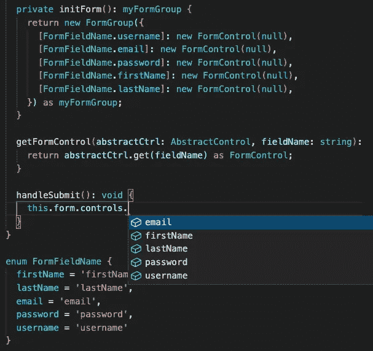

# 角形类型支持每个开发人员需要的

> 原文：<https://javascript.plainenglish.io/angular-form-typings-support-that-every-dev-needs-e198d4c1b63d?source=collection_archive---------2----------------------->

你有没有想过为什么 Angular reactive form 没有**智能感知**支持？这里是你如何在你的下一个角度形态中设置它们以获得更好的形态类型。

# Angular 中窗体设置的标准方法🌤

首先，这是一个典型的反应式表单是如何在项目中建立的

form.html

form.ts

在将 formControlName 与模板中的表单进行匹配时，您是否发现了我无意中犯的一个打字错误？在 formControlName 中用一个额外的`s`设置了`password`字段😢。像这样的错误可能要花我们几个小时才能发现，尤其是当你的表单很大的时候👹。

# 一种更好的角度窗体设置方法😎

为了解决我们过去都面临的这种模板打字错误问题，我们可以实现一对 enum 和 const 来标准化命名，以避免打字错误。

将此枚举和常量添加到您的模型文件或 TS 文件中，以标准化表单标签和表单字段名称。

请注意，在您声明了表单的模型之后，您可以立即在表单标签中使用它，并享受来自 IDE 的 **IntelliSense** 的帮助。

您还可以享受 **IntelliSense** 支持，使用您在 TS 文件中声明的枚举，自动将您的 formControl 传递到模板中的`[formControlName]`绑定。

form.html

form.ts

有了这个实现，您肯定可以避免模板中的打字错误和错误，并且无论何时您想要修改表单字段标签或字段名称，您只需要更改您的模型，一切仍然会自动工作。

当我们试图访问表单控件值时，我们得到了同样的智能感知/类型支持吗？让我们来看看这个。

我们可以看到，表单控件没有将我们的字段名识别为它的属性。当然，我们将使用 IDE 建议的解决方法，用`['username']`来获取 formControl 信息。

用方括号访问表单控件是我们总是试图避免的事情，因为我们对 Angular 使用了 Typescript，所以我们希望在访问表单控件时得到强类型化实现的最佳实践。幸运的是，只需做一些调整，我们就可以在表单中为表单控件设置输入支持。

将这个额外的接口和类型添加到您的模型文件或 TS 文件中。替换您的`initForm()`和您的`form`变量声明的返回类型，以使用这个新创建的`myFormGroup`，您将能够在访问您的表单控件时看到 **IntelliSense** 支持。

最后，完成所有设置后，从今天起，您可以访问无错误和无错误的表单模板，并在 TS 文件中为您的反应式表单提供强大的打字功能。🎉

form.ts

# 摘要

希望您在阅读完这篇文章后感到放心，并为实现完全 TypeScript **IntelliSense** 支持的无错别字或无 bug 表单感到高兴。如果你正在使用另一种方式严格输入你的角形，请在下面的评论中告诉我。我很想看看我们还能采用什么方法来严格定义我们的角度应用程序。干杯！

 [## 用我的推荐链接- DevJo 加入媒体

### 作为一个媒体会员，你的会员费的一部分会给你阅读的作家，你可以完全接触到每一个故事…

medium.com](https://medium.com/@devjo/membership) 

*更多内容看* [***说白了。报名参加我们的***](http://plainenglish.io/) **[***免费周报***](http://newsletter.plainenglish.io/) *。在我们的* [***社区获得独家访问写作机会和建议***](https://discord.gg/GtDtUAvyhW) *。***