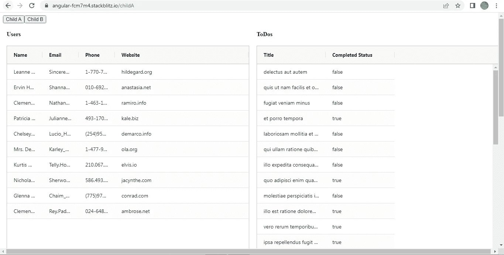
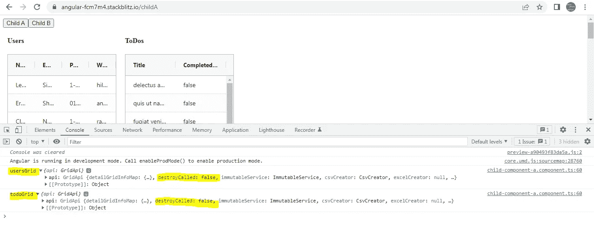
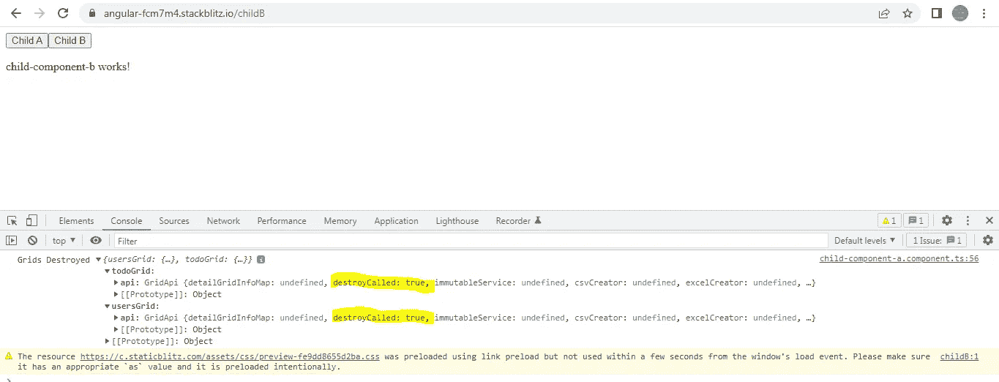

# 如何在 Angular 中一起清除多个 Ag-Grid 表的引用

> 原文：<https://javascript.plainenglish.io/angular-how-can-you-clear-the-references-of-multiple-ag-grid-tables-together-353610b0c126?source=collection_archive---------5----------------------->

## 如何在 Angular 中一起清除多个 Ag-Grid 表的参考的指南。


Photo by [Christopher Gower](https://unsplash.com/@cgower?utm_source=medium&utm_medium=referral) on [Unsplash](https://unsplash.com?utm_source=medium&utm_medium=referral)

这个故事关注两点:

1.  如何通过组件中的单个变量跟踪多个 Ag-Grid 表。
2.  当组件被销毁时，销毁所有 Ag-Grid 参考。

我们将使用 2 个组件来演示这个用例。ChildAComponent 包含 2 个 Ag-Grid 表和 2 组数据，添加 ChildBComponent 只是为了检查当我们切换到 ChildBComponent(即 ChildAComponent 被销毁)时如何删除 Ag-Grid 引用。



正如您在上面的应用程序截图中看到的，我们有 2 个 Ag-Grid 表显示用户和 ToDos 数据。

**子组件模板。**

Ag-Grid 表是不言自明的。

为了跟踪这两个表，我们将事件对象和一个唯一的字符串作为参数传递给**ongriddready()**。我们将在课堂上看到，如何利用弦来实现我们的目标。

**儿童组件类**

1.  我们已经从 **users.ts** 和 **todos.ts** 中导出了用户和 ToDos 数据。数据在这里并不重要。
2.  **gridList** 是一个包含两个属性 **usersGrid** 和 **todoGrid** 的对象。这是传递给模板中的**ongriddready()**的两个字符串。

```
public **gridList** = { 
**usersGrid**: {}, 
**todoGrid**: {}, 
};
```

3.现在让我们检查一下**ongriddready()**。category 参数只不过是我们之前传递的唯一字符串。正如我们所知，**网格列表**的两个属性只不过是作为参数传递给两个网格的**ongriddready()**的两个唯一字符串。

在该方法中，我们正在访问**网格列表**的每个属性。每个属性都只是一个空对象。我们正在给每个对象添加一个 **API 属性**，这个 **API 属性**被设置为 **params.api.**

```
**onGridReady(params, category) {** 
**this.gridList[category].api = params.api;** 
console.log(category, this.gridList[category]); 
}
```



在上面的截图中，我们已经记录了 **usersGrid** 和 **todoGrid** 的值。

4.当我点击**子 B** 按钮时，我们切换到**子 B 组件。**调用 **ngOnDestroy()** 生命周期钩子。在这个钩子中，我们遍历 **gridList 的每个属性，**访问 API 属性，然后调用 **destroy()。**

如您所见，在下面的截图中, **destroyCalled 属性**被设置为 true:



您可以查看以下全部作品:

[](https://stackblitz.com/edit/angular-fcm7m4?file=src/child-component-a/child-component-a.component.ts) [## 角形(叉形)堆叠

### 一个基于 rxjs，tslib，core-js，zone.js，@angular/core，@angular/forms，@angular/common 的 angular-cli 项目…

stackblitz.com](https://stackblitz.com/edit/angular-fcm7m4?file=src/child-component-a/child-component-a.component.ts) 

*更多内容请看*[***plain English . io***](https://plainenglish.io/)*。报名参加我们的**[***免费周报***](http://newsletter.plainenglish.io/) *。关注我们关于*[***Twitter***](https://twitter.com/inPlainEngHQ)*和*[***LinkedIn***](https://www.linkedin.com/company/inplainenglish/)*。加入我们的**[***社区不和谐***](https://discord.gg/GtDtUAvyhW) *。***