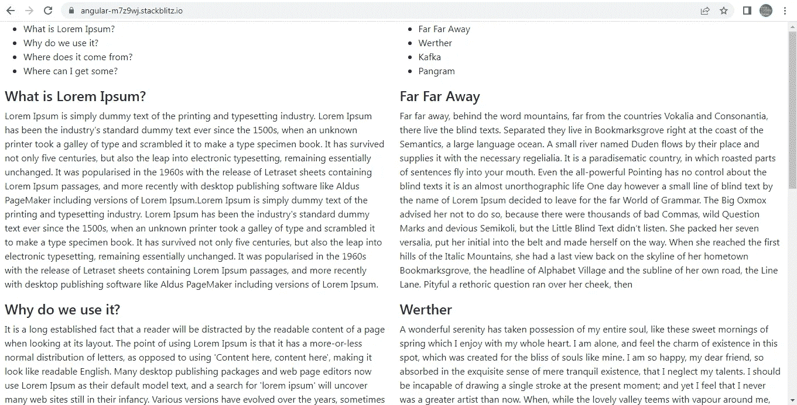
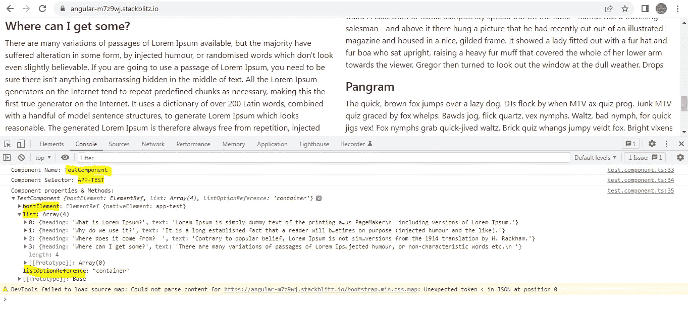
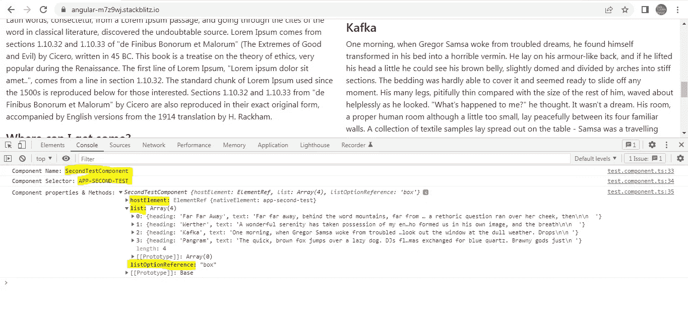
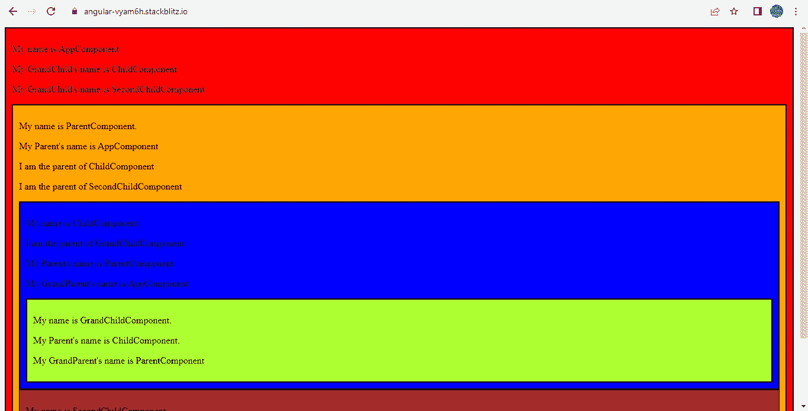
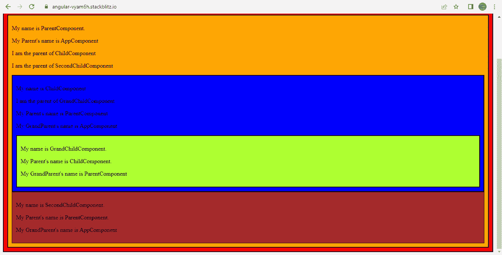

# 如何在 Angular 中访问指令内的所有主机组件详细信息

> 原文：<https://javascript.plainenglish.io/angular-how-you-can-access-all-host-component-details-inside-the-directive-f728a5fb1182?source=collection_archive---------2----------------------->

## 关于如何使用 DI 访问子/孙组件中的父/祖组件详细信息以及在 Angular 中访问父/祖组件中的子/孙组件详细信息的指南。


Photo by [Chris Ried](https://unsplash.com/@cdr6934?utm_source=medium&utm_medium=referral) on [Unsplash](https://unsplash.com?utm_source=medium&utm_medium=referral)

我最近在我的工作项目中遇到了一个场景，我想在组件之间重用**“点击链接时滚动到文本”**功能，而不管组件是什么。这个场景要求访问指令中的主机组件。我花了很多时间试图使这个可重复使用，并愿意分享我用来解决这个问题的方法。

这就是 Angular 应用程序的样子。



在这个例子中，我使用了两个组件 **TestComponent** 和 **SecondTestComponent** 。这两个组件执行相似的功能。它们显示 4 个选项的列表，后跟 4 段文本。点击列表选项会让用户滚动到相应的段落。

拥有两个组件的目的是为了表明不管组件是什么，解决方案都是可重用的。

**AppComponent 模板:**这是托管 **TestComponent** 和 **SecondTestComponent** 的引导组件。

在讨论这两个组件之前，我想展示一下这两个组件中使用的数据结构。我们对 2 个组件使用了 2 组不同的数据，但这 2 组数据的结构保持不变。这是一个由 4 个对象组成的数组。每个对象包含两个属性:**标题**和**文本。**

下面我展示了用于**测试组件**的数据集。

现在，让我们转到 **TestComponent 类。**

**列表**属性包含从 firstList.ts 导出的 **firstList** 数组

**listOptionReference** 只是一个字符串，我们将使用它来唯一地标识 4 个段落中的每一个。

为了访问子指令中的父 **TestComponent** (我们还没有讨论过)，我们需要一个**类接口**。TestComponent 以类接口令牌的名义给自己提供了一个**别名**。

为什么我们不能直接将测试组件注入到指令的构造函数中？如果我们确定**测试组件**是该指令的唯一父组件，这是可能的。但是在我们的例子中，该指令将在多个组件中重用，并且**我们事先不知道组件名**。

因此，我们添加了一个别名提供者，如下所示。提供者对象由一个通用的帮助器函数 **returnProvider()返回。**我们将组件的名称作为参数传递。

```
providers: [**returnProvider(TestComponent)**],
```

基类和 returnProvider()在 **utility.ts.** 中定义，非常简单，如下所示:

```
**export abstract class Base {}**export function **returnProvider**(component: any) {
return **{ provide: Base, useExisting: forwardRef(() => component) };**
}
```

**Base** 是抽象类，是 TestComponent 类的接口令牌。TestComponent 实现基类。

**forwardRef** 打破了我们通过让 TestComponent 引用自身而创建的循环引用。

您一定想知道，为什么我们将 **ElementRef** 实例注入到 TestComponent 的构造函数中。

```
constructor(**private hostElement: ElementRef**) { }
```

原因是为了实现滚动功能，我们需要访问指令中的 TestComponent <app-test>元素。我们将很快看到这是如何实现的。</app-test>

SecondTestComponent 类是 TestComponent 类的副本，但具有不同的数据和不同的 listOptionReference。

**TestComponent 模板:**在模板中，我们首先遍历**列表数组属性**来显示列表选项。每个列表选项都是一个< li >标签，标签上附有带有选择器**跳转**的**跳转指令**。

当用户点击列表选项时，用户将被滚动到相应的段落。滚动操作由指令执行。

因此，这个指令接受用户需要滚动到的段落的 **ID 作为@Input。**

为了显示段落，我们再次遍历了相同的**列表**数组属性，并显示了**标题和文本属性**。

该段落的 id 将是**容器 0、容器 1、容器 2 和容器 3** 。

**“容器”**是 **listOptionReference** 属性的字符串值。为了使它唯一，我们将列表数组的**迭代索引附加到它上面。**

现在让我们转到**跳转指令**。

@Input **jumpTo** 包含用户需要滚动到的段落的 ID。

我们在构造函数中注入了一个**基类**的引用来访问主机组件。

```
constructor(**private host: Base**) {}
```

当我们点击一个列表选项时，下面的 **onClick()** 执行。

```
**@HostListener(‘click’) onClick() {** 
console.log(**‘Component Name:’, this.host.constructor.name**); console.log(**‘Component Selector:’, this.host[‘hostElement’].nativeElement.tagName** ); console.log(**‘Component properties & Methods:’, this.host**); **this.host[‘hostElement’].nativeElement .querySelector(`#${this.jumpTo}`) .scrollIntoView();** }
```

我们首先记录 3 条信息:

1.  主机组件类名
2.  主机组件选择器
3.  宿主组件方法和属性



Logging the TestComponent Details in the JumpDirective



Logging the SecondTestComponent Details in the JumpDirective

我们还可以访问之前注入到主机组件类中的 **hostElement 引用**。(TestComponent 或 SecondTestComponent)。

我们将使用这个引用来访问主机组件中的任何 DOM 元素。我们用它来滚动到与点击的列表选项相对应的段落。

```
this.host[‘hostElement’].nativeElement .querySelector(`#${this.jumpTo}`) .scrollIntoView();
```

通过这种方式，我们能够实现滚动功能，而不用考虑组件，并且只需向指令传递最少的数据。

您可以查看下面的完整工作示例。

[](https://stackblitz.com/edit/angular-m7z9wj?file=src/app/test/test.component.html) [## 角形(叉形)堆叠

### 一个基于 rxjs，tslib，core-js，zone.js，@angular/core，@angular/forms，@angular/common 的 angular-cli 项目…

stackblitz.com](https://stackblitz.com/edit/angular-m7z9wj?file=src/app/test/test.component.html) 

最后，我有一个简单的例子，说明如何使用已经解释过的**依赖注入(DI)技术**访问子/孙组件**中的父/祖父母组件。**

我们使用 **DI 和@ViewChild /@ViewChildren** 访问父/祖父组件中的子/孙详细信息。



我们有 5 个组件: **AppComponent、ParentComponent、ChildComponent、SecondChildComponent 和 GrandChildComponent** 。

我们的目标是让每个组件都可以被所有其他组件访问。下面是我们如何实现这一目标的工作示例。

[](https://stackblitz.com/edit/angular-vyam6h?file=src/parent/parent.component.css) [## 角形(叉形)堆叠

### 一个基于 rxjs，tslib，core-js，zone.js，@angular/core，@angular/forms，@angular/common 的 angular-cli 项目…

stackblitz.com](https://stackblitz.com/edit/angular-vyam6h?file=src/parent/parent.component.css) 

请评论任何改进和建议。

*更多内容看* [***说白了。报名参加我们的***](https://plainenglish.io/) **[***免费周报***](http://newsletter.plainenglish.io/) *。关注我们关于*[***Twitter***](https://twitter.com/inPlainEngHQ)*和**[***LinkedIn***](https://www.linkedin.com/company/inplainenglish/)*。加入我们的* [***社区***](https://discord.gg/GtDtUAvyhW) *。****