# 角度:重新加载/刷新一个组件或整个应用程序，并跨多个组件重用逻辑

> 原文：<https://javascript.plainenglish.io/angular-how-you-can-reload-refresh-a-single-component-or-the-entire-application-and-reuse-the-logic-c6e975a278c3?source=collection_archive---------0----------------------->

## 关于如何重新加载/刷新单个组件或整个应用程序以及跨多个组件重用逻辑的角度教程。

重装单个组件和重装整个应用程序有很大的不同。我们将看到这两者是如何实现的。

这是一个非常简单的应用程序。有 3 个组件: **AppComponent** 托管 **TestComponent** ，TestComponent 托管 **ChildComponent** 。

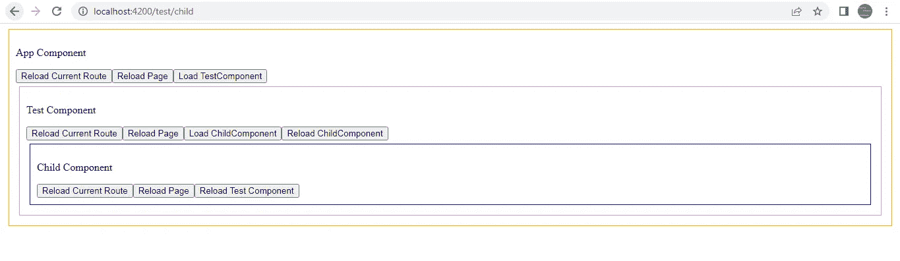

Angular Application

我们只有两个目标:

1.  能够重新加载当前路由、子路由、父路由和整个应用程序。
2.  使用继承将此功能添加到单个组件中，以便任何其他组件都可以扩展和重用它。

让我们首先检查 AppComponent、TestComponent 和 ChildComponent 将要扩展的**CommonFunctionalityComponent**。

在组件中，我们编写了两个方法: **reloadComponent()** 来重新加载另一个组件或当前路线，以及 **reloadPage()** 来重新加载整个应用程序。

**reloadPage()** 是不言自明的。

在 **reloadComponent()** 中，我们接受了 2 个参数: **self** 和 **urlToNavigateTo** 。

如果**自身包含真值**，则暗示当前路线需要重新加载。

第二个参数 **urlToNavigateTo** 是必需的，仅当 **self 为 false 时，**因为在这种情况下，如果我们不想重新加载当前路线，我们需要在第二个参数中指定我们想要加载的路径。

```
const url=self ? this.router.url :urlToNavigateTo;
```

因此，如果参数 **self 为真**，则 **url 常量**将包含当前路线的路径，否则它将包含参数 **urlToNavigateTo 的值。**

```
**this.router.navigateByUrl(‘/’,{skipLocationChange:true})**.then(()=>{
**this.router.navigate([`/${url}`])**.then(()=>{
console.log(`After navigation I am on:${this.router.url}`)
})
})
```

在上面这段代码中，我首先导航到“/”，而不改变 URL，这由属性 **skipLocationChange 负责。**发布这个导航，我正在导航到常量 **url** 中包含的路径。

一.现在让我们看看 **AppComponent** 是如何扩展**CommonFunctionalityComponent 的。**

**AppComponent 模板:**我们有 3 个按钮来重新加载当前路径，重新加载整个应用程序，最后加载 **TestComponent** 。

**reloadPage()** 继承自**CommonFunctionalityComponent。**

**reloadCurrent()** 由 AppComponent 类定义。

**AppComponent 类:**

在 AppComponent 类中，我们只定义了 **reloadCurrent()** ，其中我们调用了从**CommonFunctionalityComponent 继承的 **reloadComponent()** 。**

我们已经将 **true** 作为参数传递给了 **reloadComponent()，**，这意味着我们希望重新加载当前路线，而不是导航到任何其他路线。

这是我们的应用程序目前的样子。在控制台中可以看到，AppComponent 的**构造函数()**和 **ngOnInit()** 已经执行:

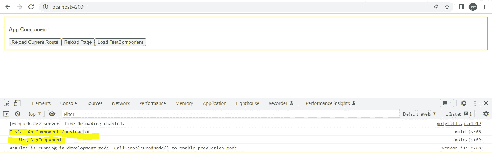

AppComponent

1.  首先，我点击**重新加载当前路线**按钮。正如您在控制台中看到的，导航已经成功，但是 **AppComponent** 没有再次重新加载。只能通过重新加载整个页面来重新加载 AppComponent。

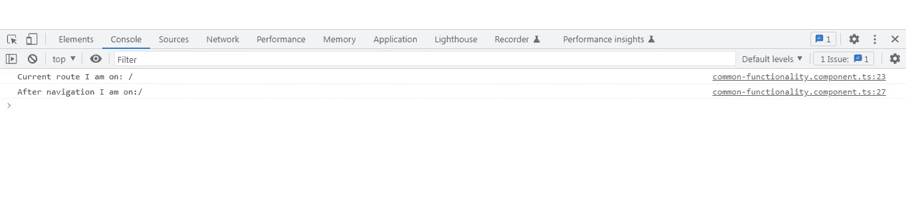

Reload Current Route

2.接下来，我们单击**重新加载页面**按钮，该按钮调用 **window.location.reload()。**这将按照预期重新加载 AppComponent。AppComponent 的**构造函数()**和 **ngOnInit()** 已经执行:

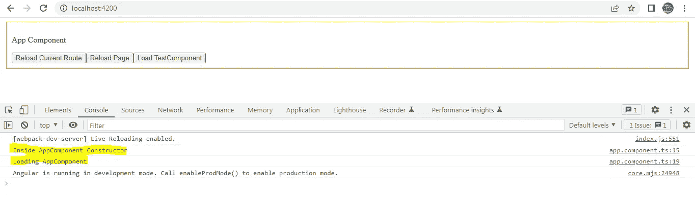

Reload Page

3.点击**加载 TestComponent** 按钮，将加载 TestComponent。正如您在下面的控制台中看到的，TestComponent 的**构造函数()**和 **ngOnInit()** 被执行:

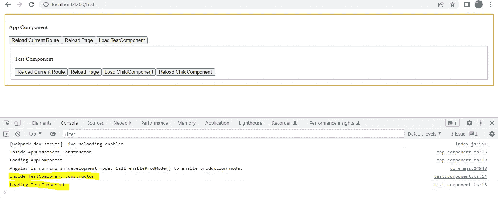

二。进行到**测试组件**。

**TestComponent 模板**:该模板有 4 个按钮，分别用于重新加载当前路线、重新加载页面、加载**子组件**和重新加载子组件:

**测试组件类**:

在 **reloadCurrent()** 中，我们调用了从**CommonFunctionalityComponent 继承而来的 **reloadComponent()** 。**

我们已经将 **true** 作为参数传递给 **reloadComponent()，**，这意味着我们希望重新加载当前路线，而不是导航到任何其他路线。

**reloadChild()** 也将调用 **reloadComponent()** ，但使用不同的参数。我们传递 **false** 作为第一个参数，表示我们不想重新加载当前路线，第二个参数指定我们希望重新加载的路线。

1.  点击**重新加载当前路线**按钮将产生如下输出。TestComponent **构造函数()**和 **ngOnInit()** 再次执行。

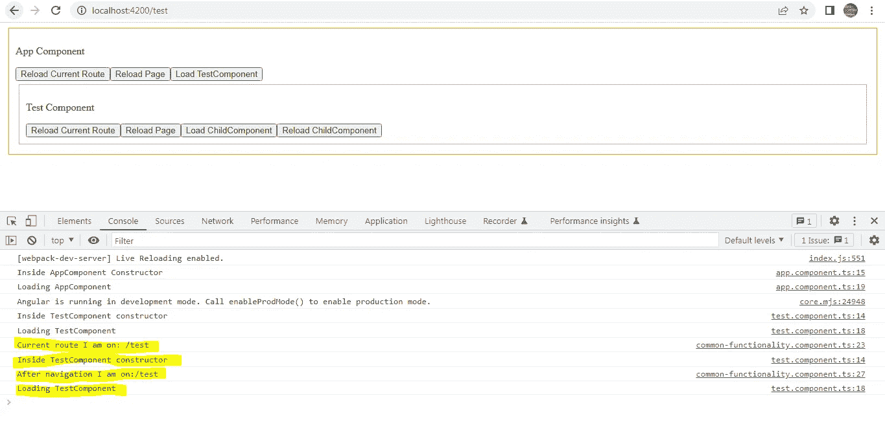

2.点击**重新加载页面**按钮，将再次重新加载整个应用程序。AppComponent 和 TestComponent 的**构造函数()**和 **ngOnInit()** 执行。

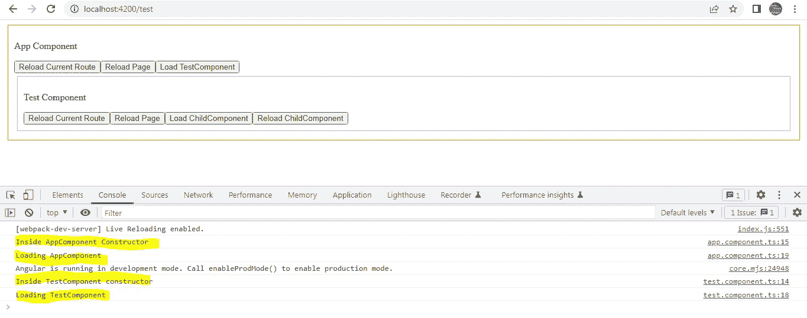

3.点击**加载子组件**按钮，将加载子组件。ChildComponent 的**构造函数()**和 **ngOnInit()** 执行。

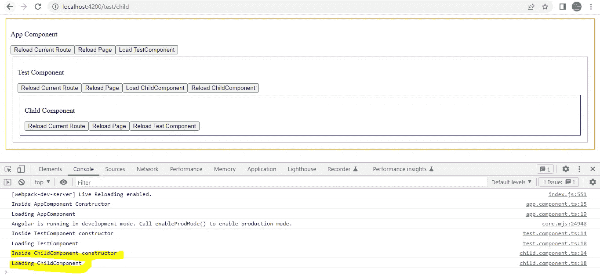

4.点击**重新加载 ChildComponent** 按钮**，**将再次执行 ChildComponent 和 TestComponent 的**构造函数()**和 **ngOnInit()** 。

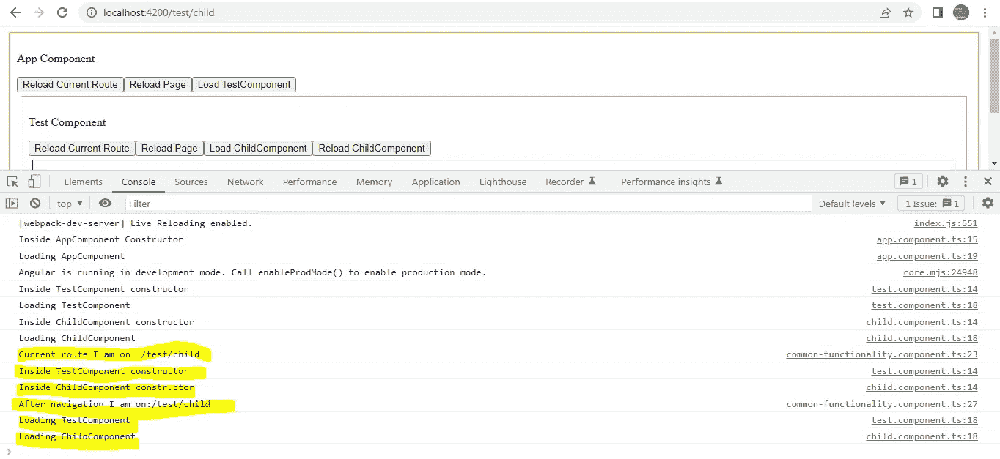

三。继续处理**子组件**类。类和模板是不言自明的，因为它们遵循与 AppComponent 和 TestComponent 相似的模式。

**子组件模板:**

**子组件类:**

1.  点击**重新加载当前路径**按钮，将再次执行 ChildComponent 和 TestComponent 的**构造函数()**和 **ngOnInit()** 。

2.点击**重新加载页面**按钮，将再次执行 AppComponent、ChildComponent 和 TestComponent 的**构造函数()**和 **ngOnInit()** 。

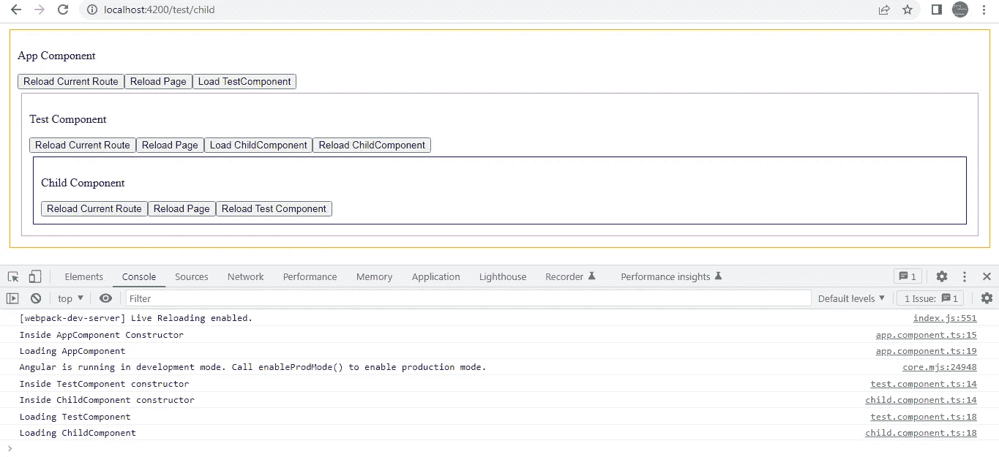

3.点击**重新加载测试组件**按钮，我们将导航到**/测试**路径，再次执行**测试组件**的**构造函数()**和 **ngOnInit()** 。

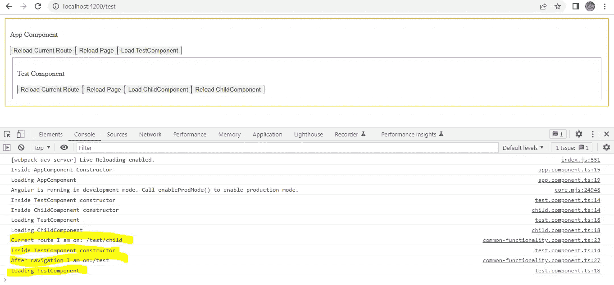

完整代码可从以下网址获得:

[](https://github.com/ramyabala221190/reloadComponentAndWindow.git) [## GitHub-ramyabala 221190/reloadComponentAndWindow:如何在…

### 此项目是使用 Angular CLI 版本 13.3.4 生成的。为开发服务器运行 ng serve。导航到…

github.com](https://github.com/ramyabala221190/reloadComponentAndWindow.git) 

## 进一步阅读

[](/code-documentation-is-broken-but-i-think-swimm-may-have-fixed-it-daaa7547d834) [## 代码文档被破坏了——但是我认为 Swimm 可能已经修复了它

### 传统的文档管理系统让软件开发人员失望了，是时候来点新的了。游泳吗…

javascript.plainenglish.io](/code-documentation-is-broken-but-i-think-swimm-may-have-fixed-it-daaa7547d834) [](/create-a-multi-page-job-application-form-using-angular-f0b1640f4195) [## 使用 Angular 创建多页工作申请表

### 一步一步的教程，以建立一个多页的工作申请表使用 Angular 和 SurveyJS，一个免费的，开源的…

javascript.plainenglish.io](/create-a-multi-page-job-application-form-using-angular-f0b1640f4195) [](https://plainenglish.io/blog/create-an-employee-satisfaction-survey-using-angular-and-store-results-in-a-mongodb-collection) [## 使用 Angular 创建员工满意度调查，并将结果存储在 MongoDB 集合中

### 一步一步的教程来建立一个员工满意度调查使用 Angular 和 SurveyJS，一个免费的，开源的…

简明英语. io](https://plainenglish.io/blog/create-an-employee-satisfaction-survey-using-angular-and-store-results-in-a-mongodb-collection) 

*更多内容请看*[***plain English . io***](https://plainenglish.io/)*。报名参加我们的* [***免费周报***](http://newsletter.plainenglish.io/) *。关注我们关于* [***推特***](https://twitter.com/inPlainEngHQ)[***领英***](https://www.linkedin.com/company/inplainenglish/)**和* [***不和***](https://discord.gg/GtDtUAvyhW) *。**