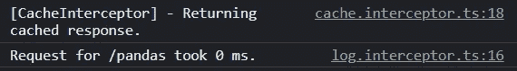

# 角度截击机:完全指南

> 原文：<https://javascript.plainenglish.io/angular-interceptors-a-complete-guide-7294e2317ecf?source=collection_archive---------0----------------------->

## 角度拦截器

## 什么是角拦截器？它是如何工作的？如何创建一个并提供给应用程序？怎么绕过他们？阅读以了解更多信息。

Photo by author

*Angular 拦截器*，也称为 *HTTP 拦截器，*是 Angular 中我最喜欢的 HTTP 特性之一。我喜欢拦截器的原因是它们促进了干净的代码。您只需在一个地方编写几行代码，它们就可以全局地应用于每个 HTTP 请求和响应。

在本文中，我们将研究:

*   什么是 ***角度拦截器*** 它是如何工作的
*   如何实现并向我们的应用程序提供一个或多个拦截器
*   如何使用角度拦截器改变请求和响应
*   如果需要，如何绕过特定的或所有的拦截器
*   作为演示应用程序一部分的其他用例

所以，让我们开始吧！

# 什么是角拦截器？

简单地说，Angular 中的拦截器是实现`HttpInterceptor`接口的服务。它们是为拦截 HTTP 客户端-服务器通信而构建的。

`[HttpInterceptor](https://angular.io/api/common/http/HttpInterceptor)`接口的官方文档声明:

> 拦截器位于`[HttpClient](https://angular.io/api/common/http/HttpClient)`接口和`[HttpBackend](https://angular.io/api/common/http/HttpBackend)`之间。

让我们借助图表来解释这是什么意思。

一端是我们的应用程序(客户端),它使用`HttpClient`来创建请求。另一端是后端(服务器),负责响应这些请求。在请求从我们的应用程序发出之前，它们会通过一系列拦截器。

这个链包含了我们提供给应用程序的所有拦截器(稍后会有更多内容)。在这个链的末端，总会有 Angular 添加的最后一个处理程序，即`HttpBackend`。因此，这个链总是至少有一个处理程序。

`HttpBackend`将请求分派给服务器。在下一节中，我们将看到如何使用`HttpBackend`来绕过前面的处理程序。

在所有其他情况下，请求和响应通过整个拦截器链。这使得拦截器成为全局改变请求和响应的完美场所。

# 制造角度拦截器

要创建一个拦截器，我们只需要一个服务来实现`HttpInterceptor`接口。这个接口只有一个我们需要实现的方法，即`intercept`方法。

类型为`HttpRequest`的第一个参数`req`表示实际的请求到达服务器的路径。

第二个参数`next`，类型为`HttpHandler`，代表链中的下一个拦截器。

最后，返回的类型是一个`HttpEvent`类型的`Observable`。在大多数情况下，这表示对普通 HTTP 请求的响应。

> **注意:**我们说普通 HTTP 请求是因为有一个枚举叫做`[HttpEventType](https://angular.io/api/common/http/HttpEventType)`，它的值代表单独的事件，比如上传/下载进度事件等。

# 提供 HTTP 拦截器

像任何其他服务一样，我们不能使用拦截器，除非我们将它提供给应用程序。然而，拦截器的提供不同于普通服务。它们需要在`NgModule`中提供。

我们将`HTTP_INTERCEPTORS`令牌传递给`providers`数组中的`provide`属性。尽管我们可能有多个拦截器，但我们对所有拦截器使用同一个令牌。

接下来，我们将包含拦截器的类名传递给`useClass`属性。

最后，我们设置了`multi`属性，对于拦截器，该属性应该设置为`true`。这将依赖注入(DI)机制注入的`provide`令牌配置为一个值数组。这个“值数组”包含我们提供的拦截器。

一个重要的细节是**拦截器是按照它们被提供的顺序应用的**。换句话说，顺序很重要。现在，看看我们之前的图表，应该很容易看出请求是按照我们提供拦截器的顺序处理的，而响应是按照相反的顺序处理的。

例如，在前面的代码片段中，处理请求的顺序是:`LogInterceptor` > `CacheInterceptor` > `AuthInterceptor` > `MockInterceptor`，而处理响应的顺序正好相反:`MockInterceptor` > `AuthInterceptor` > `CacheInterceptor` > `LogInterceptor`。

# 变更请求和响应

因为所有请求都将通过拦截器链，所以拦截器是对请求和响应进行全局变异的最佳场所。

要改变请求，我们需要在`intercept`方法中做的第一件事是克隆请求。我们必须这样做，因为请求对象是只读的*。因此，我们不能只是修改它。我们需要创建一个副本，对该副本进行变异，然后将变异后的副本传递给链中的下一个处理程序。*

*`intercept`方法返回的类型是`Observable`。因此，我们可以通过使用 RxJs 管道操作符来改变响应，比如前面代码片段中所示的`map`操作符。*

*与我们对响应所做的类似，我们需要克隆事件，变异副本，并返回变异后的副本。*

# *将元数据传递给拦截器*

*在某些情况下，我们可能希望将一些信息传递给其中一个拦截器。一种方法是使用服务作为中介。但是有另一种方法可以用更少的代码开销做到这一点。*

*在我们的演示中，`AuthInterceptor`为所有请求设置了`Authorization`头。登录到应用程序时，登录请求不需要在其头中设置授权令牌。此外，由于我们尚未登录，我们根本没有令牌。*

*我们如何告诉`AuthInterceptor`忽略登录请求？
输入`HttpContextToken`。*

*我们在同一个文件中定义了一个`HttpContextToken`和`AuthInterceptor`。我们将默认值设置为`false`。我们还实现了拦截器将如何使用这个令牌。在我们的例子中，我们只想忽略任何将这个上下文令牌设置为`true`的请求。*

*然后，在登录方法中，我们将上下文令牌设置为`true`。*

*`AuthInterceptor`将使用这个令牌并传递请求，而不对其进行修改。除非明确设置，否则其余请求的令牌将使用默认值`false`。*

*这只是为了演示的目的。我们可以简单地检查一下`token`来决定是否绕过拦截器。关键是我们可以用同样的方式使用一个`HttpContextToken`来传递我们想要的任何信息。*

> *注意:我们没有真正的后端。因此，在本文末尾的 StackBlitz 中，您会发现一个不同的实现，它不会忽略请求。相反，它创建一个模拟 JWT 令牌并返回它。*

# *绕过拦截链*

*最后，在一些罕见的情况下，我们可能希望完全绕过拦截器链。*

*为了绕过这个链，我们简单地注入`HttpBackend`处理程序，并将其提供给一个本地`HttpClient`实例。使用这个实例发出请求不会触发任何提供的拦截器。*

# *角度拦截器的使用案例*

*我们已经涵盖了你需要知道的关于角度拦截器的所有内容。现在，让我们看一些用例。*

## *记录*

*对于拦截器，我们可以做的一件事是记录请求/响应元数据，比如请求的方法和 URL、响应的状态代码和文本，等等。*

*在我们的演示中，我们记录了每个响应所用的时间。注意，这只是一个演示。我们想要强调缓存响应的好处，所以我们有意识地选择首先提供`LogInterceptor`。*

## *贮藏*

*HTTP 拦截器的另一个重要用途是缓存请求的响应。这可以带来许多好处，例如降低网络利用率、减少后端服务器的负载，以及提高响应能力和用户体验。*

*我们可以缓存的唯一响应是针对`GET`请求的。`CacheInterceptor`检查响应是否在缓存中。如果是，它将返回缓存的响应。否则，它将请求传递给下一个处理程序。*

## *添加请求标题*

*链中的第三个拦截器是`AuthInterceptor`，它为所有通过的请求添加了`Content-Type`和`Authorization`头。*

*我们没有为每个请求设置头，而是使用这个拦截器来拦截所有请求，并在将它们传递给下一个处理程序之前添加所需的头。*

*我们在`CacheInterceptor`之后提供了`AuthInterceptor`，因为如果响应已经被缓存，请求就不会被分派，因此不需要设置任何头。*

## *嘲弄的回应*

*我们提供的最后一种拦截器是`MockInterceptor`。因为我们没有后端服务器，所以我们用一些数据创建一个模拟响应。出于演示目的，我们还添加了一个模拟延迟。*

# *演示应用程序*

*你可以在下面的 StackBlitz 中找到一个工作演示，或者只在这个 GitHub 库中找到代码。别忘了[订阅我的简讯](https://vkagklis.medium.com/subscribe)来关注更多类似的内容。*

*我们第一次访问`/pandas`页面时，它请求数据。控制台中会打印以下记录，数据会在模拟延迟后出现。*

**

*下次我们访问页面时，将从缓存中检索响应。这个链在`CacheInterceptor`处停止，所以我们看不到下一个拦截器的任何日志记录。最后，经过的时间下降到 0 毫秒，数据立即出现。*

**

# *结论*

*在本文中，我们研究了 Angular 中的拦截器。我们解释了它们是什么以及它们是如何工作的。我们为我们的应用程序创建并提供了几个拦截器。*

*我们还讨论了像将元数据传递给角度拦截器或用`HttpBackend`绕过拦截器链这样的情况。最后，我们展示了一个演示应用程序来看看它们的运行情况。*

*感谢您的阅读。我希望你喜欢这篇文章，并且你学到了一些新的东西。如果有，请考虑通过我的推荐链接注册 Medium:*

* [## 通过我的推荐链接加入 Medium—kakk lis Vasileios

### 阅读 Kagklis Vasileios(以及媒体上成千上万的其他作家)的每一个故事。您的会员费直接…

kagklis.medium.com](https://kagklis.medium.com/membership)* 

**更多内容请看*[***plain English . io***](https://plainenglish.io/)*。报名参加我们的* [***免费周报***](http://newsletter.plainenglish.io/) *。关注我们关于*[***Twitter***](https://twitter.com/inPlainEngHQ)**和*[***LinkedIn***](https://www.linkedin.com/company/inplainenglish/)*。查看我们的* [***社区不和谐***](https://discord.gg/GtDtUAvyhW) *加入我们的* [***人才集体***](https://inplainenglish.pallet.com/talent/welcome) *。***