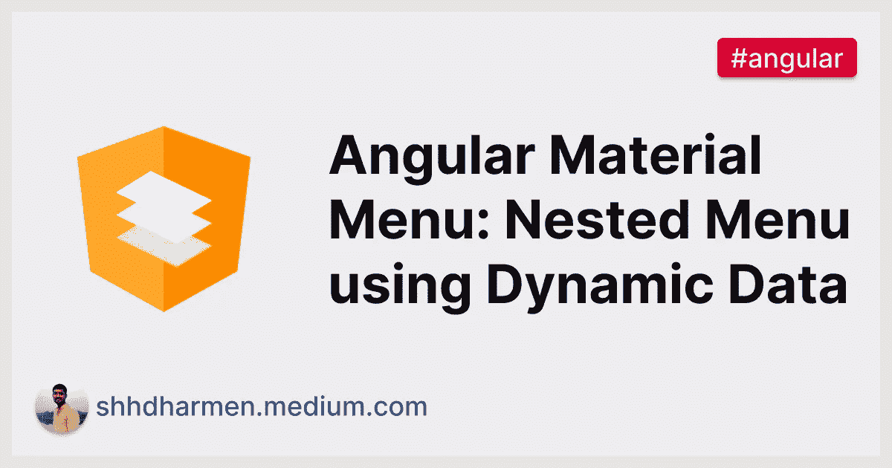
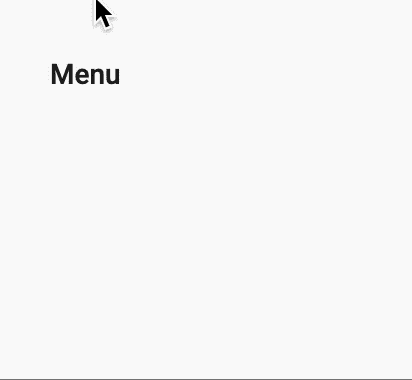
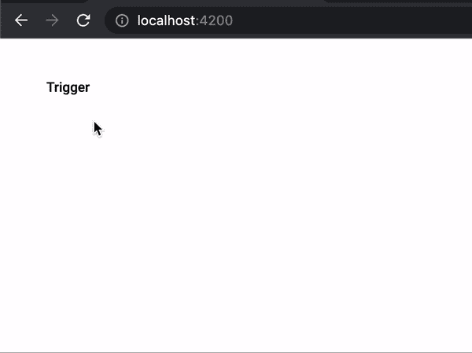
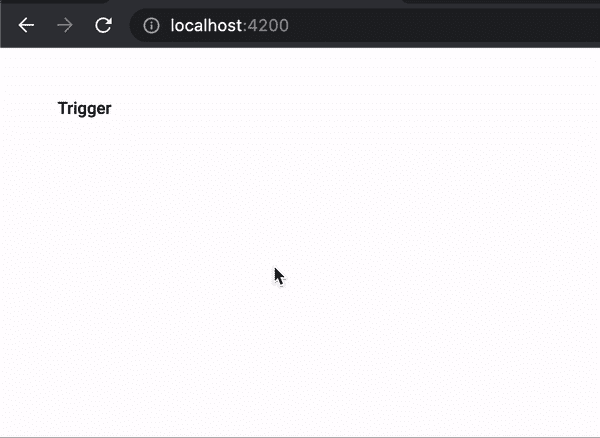

# 角度材质菜单:使用动态数据的嵌套菜单

> 原文：<https://javascript.plainenglish.io/angular-material-menu-nested-menu-using-dynamic-data-5d97e23c0693?source=collection_archive---------16----------------------->

## 如何从动态数据创建嵌套菜单



> “角度材质”菜单是一个包含选项列表的浮动面板。在本教程中，我们将学习如何从动态数据中创建嵌套菜单。

我们将首先学习 Angular Material 菜单的基础知识，以及如何使用静态 HTML 模板渲染嵌套菜单。

然后我们将理解为什么以及需要什么样的改变来从数据中动态地呈现嵌套菜单。

## 角度材料菜单

`[<mat-menu>](https://material.angular.io/components/menu/overview)`是一个包含选项列表的浮动面板。元素本身并不呈现任何东西。菜单通过应用`matMenuTriggerFor`指令来附加和打开:

```
<button mat-button [matMenuTriggerFor]="menu">Menu</button>
<mat-menu #menu="matMenu">
  <button mat-menu-item>Item 1</button>
  <button mat-menu-item>Item 2</button>
</mat-menu>
```



## 静态嵌套菜单

为了用静态数据或简单地从 HTML 模板中呈现嵌套菜单，除了在触发子菜单的`mat-menu-item`上设置`[matMenuTriggerFor]`之外，我们还必须定义根菜单和子菜单:

```
<button mat-button [matMenuTriggerFor]="animals">Animal index</button>

<mat-menu #animals="matMenu">
  <button mat-menu-item [matMenuTriggerFor]="vertebrates">Vertebrates</button>
</mat-menu>

<mat-menu #vertebrates="matMenu">
  <button mat-menu-item [matMenuTriggerFor]="fish">Fishes</button>
  <button mat-menu-item>Amphibians</button>
  <button mat-menu-item>Reptiles</button>
  <button mat-menu-item>Birds</button>
  <button mat-menu-item>Mammals</button>
</mat-menu>

<mat-menu #fish="matMenu">
  <button mat-menu-item>Baikal oilfish</button>
  <button mat-menu-item>Bala shark</button>
  <button mat-menu-item>Ballan wrasse</button>
  <button mat-menu-item>Bamboo shark</button>
  <button mat-menu-item>Banded killifish</button>
</mat-menu>
```

输出如下所示:


## 动态嵌套菜单

经常需要从动态数据构建菜单，尤其是在商业或企业应用程序中。例如，根据登录用户的权限加载特性。数据可能来自 REST API。

我们将举一个例子，从数据库中加载条目及其子条目。我们将为每一个有孩子的项目呈现一个嵌套菜单。

## 数据库ˌ资料库

对于数据库，我们将假设以下服务。您也可以将实际的 REST API 与该服务连接起来:

```
import { Injectable } from "@angular/core";
import { delay, of } from "rxjs";

@Injectable({ providedIn: "root" })
export class DynamicDatabase {
  dataMap = new Map<string, string[]>([
    ["Fruits", ["Apple", "Orange", "Banana"]],
    ["Vegetables", ["Tomato", "Potato", "Onion"]],
    ["Apple", ["Fuji", "Macintosh"]],
    ["Onion", ["Yellow", "White", "Purple"]],
    ["Macintosh", ["Yellow", "White", "Purple"]],
  ]);

  rootLevelNodes: string[] = ["Fruits", "Vegetables"];

  getChildren(node: string) {
    // adding delay to mock a REST API call
    return of(this.dataMap.get(node)).pipe(delay(1000));
  }

  isExpandable(node: string): boolean {
    return this.dataMap.has(node);
  }
}
```

上述服务的代码很简单:

*   `dataMap`代表数据，这可能是实际的数据库
*   `rootLevelNodes`表示要呈现的第一个节点
*   `getChildren`将返回特定节点的项目。我们将使用它来呈现子菜单项
*   `isExpandable`将返回是否有孩子。我们将用它来确定是否需要一个子菜单

## 嵌套菜单

现在明白了，动态数据不能简单的按照`MatMenu`的标准 HTML 模板。以下是原因:

1.  我们不能加载`<mat-menu>`，直到我们知道这个项目有子项目
2.  直到`<mat-menu>`被加载到 DOM 中，我们才能将`[matMenuTrigger]`附加到`mat-menu-item`

因此，为了处理上述问题，我们将依次遵循以下方法:

1.  从节点列表中读取节点
2.  检查是否有任何节点可扩展
3.  如果是，那么用 loader 创建一个子菜单`<mat-menu>`，并在渲染节点的`mat-menu-item`中用`[matMenuTrigger]`附加它
4.  一旦用户单击节点，获取并呈现子菜单中的子节点
5.  对于子菜单的子节点，同样遵循相同的方法，从步骤 2 开始
6.  如果没有，那么只需创建节点的`mat-menu-item`

## 根组件

为了实现上述方法，我们将创建一个`app-menu`组件，并在`app-root`中使用它:

```
<!-- src/app/app.component.html -->

<app-menu
  [trigger]="'Food'"
  [data]="initialData"
  [isRootNode]="true"
></app-menu>// src/app/app.component.ts

import { Component } from "@angular/core";
import { DynamicDatabase } from "./dynamic-database.service";

@Component({
  selector: "app-root",
  templateUrl: "app.component.html",
})
export class AppComponent {
  title = "mat-menu-dynamic-data";
  initialData: string[] = [];
  constructor(private database: DynamicDatabase) {
    this.initialData = this.database.rootLevelNodes.slice();
  }
}
```

我们正在读取`rootLevelNodes`，并在`app-menu`中将其作为`data`传递。

## 菜单组件

对于菜单，最初，我们希望显示一个按钮，它将触发一个菜单:

```
<!-- src/app/menu/menu.component.html -->

<button mat-button [matMenuTriggerFor]="menu">
  {{ trigger }}
</button>
<mat-menu #menu="matMenu">
  <button mat-menu-item *ngFor="let node of data">{{ node }}</button>
</mat-menu>
```

这个类看起来是这样的:

```
// src/app/menu/menu.component.ts

export class MenuComponent {
  @Input() data: string[] = [];
  @Input() trigger = "Trigger";
  @Input() isRootNode = false;
}
```

## 递归

现在，要呈现一个嵌套菜单，我们只需要在这段代码中处理递归。并为每个嵌套菜单生成相同的 DOM 结构。

因此，首先，我们将更改`<mat-menu>`中的代码:

```
<!-- src/app/menu/menu.component.html -->

<button mat-button [matMenuTriggerFor]="menu">
  {{ trigger }}
</button>
<mat-menu #menu="matMenu">
  <ng-container *ngFor="let node of data; let i = index">
    <button mat-menu-item>
      <app-menu
        [trigger]="node"
        *ngIf="isExpandable(node); else menuItem"
      ></app-menu>
    </button>
    <ng-template #menuItem>
      <button mat-menu-item>{{ node }}</button>
    </ng-template>
  </ng-container>
</mat-menu>
```

现在，在菜单内部，我们正在检查每个节点，如果`isExpandable`方法返回`true`，我们将在其中再次呈现`app-menu`。

`isExpandable`方法将简单地从`DynamicDatabase`服务中调用`isExpandable`:

```
// src/app/menu/menu.component.ts

// ...

export class MenuComponent {

  // ...

  isExpandable(node: string): boolean {
    return this.database.isExpandable(node);
  }
}
```

让我们看看输出:


请注意，文本也可以在`mat-menu-item`中悬停。那是因为`mat-button`。当`app-menu`在内部渲染时，我们必须将按钮的指令从`mat-button`更改为`mat-menu-item`，让我们这样做:

```
<!-- src/app/menu/menu.component.html -->

<button *ngIf="isRootNode" mat-button [matMenuTriggerFor]="menu">
  {{ trigger }}
</button>
<button *ngIf="!isRootNode" mat-menu-item [matMenuTriggerFor]="menu">
  {{ trigger }}
</button>
<mat-menu #menu="matMenu">
  <ng-container *ngFor="let node of data; let i = index">
    <button mat-menu-item>
      <app-menu
        [trigger]="node"
        *ngIf="isExpandable(node); else menuItem"
      ></app-menu>
    </button>
    <ng-template #menuItem>
      <button mat-menu-item>{{ node }}</button>
    </ng-template>
  </ng-container>
</mat-menu>
```

现在让我们看看输出:


它现在很好地呈现了根项目，但是子菜单是空白的。让我们给它添加数据。

## 数据

我们希望在呈现并打开菜单后加载数据。所以，我们将使用`(menuOpened)`事件来加载`data`。`menuOpened`当相关菜单打开时发出事件。

我们只想为非根项目加载`data`，因为对于根项目，`data`来自父组件。

```
<!-- src/app/menu/menu.component.html -->

<button *ngIf="isRootNode" mat-button [matMenuTriggerFor]="menu">
  {{ trigger }}
</button>
<button
  *ngIf="!isRootNode"
  mat-menu-item
  [matMenuTriggerFor]="menu"
  (menuOpened)="getData(trigger)"
>
  {{ trigger }}
</button>

<!-- rest remains same -->
```

让我们在`menu.component.ts`中创建一个`getData`方法:

```
// src/app/menu/menu.component.ts

// ...
export class MenuComponent {
  // ...

  isLoading = false;
  dataLoaded = false;

  getData(node: string) {
    if (!this.dataLoaded) {
      this.isLoading = true;
      this.database.getChildren(node).subscribe((d) => {
        this.data = d?.slice() || [];
        this.isLoading = false;
        this.dataLoaded = true;
      });
    }
  }
}
```

通过`getData`，我们又创建了 2 个标志:

1.  `isLoading` -指示是否正在获取`data`
2.  `dataLoaded` -指示`data`是否已经加载并阻止进一步的提取

现在让我们看看输出:



请注意，数据在特定时间后被加载，这是因为我们在`DynamicDatabase.getChildren`中添加了一个`delay`来模拟一个 API 调用。如果数据已经加载，并且在这种情况下菜单项被立即呈现，它就不会再次获取数据。

## 装货设备

最后剩下的事情是当`data`被获取时显示一个加载器。我们已经有了`isLoading`标志，让我们用它来显示`[<mat-spinner>](https://material.angular.io/components/progress-spinner/overview)`:

```
<!-- src/app/menu/menu.component.html -->

<!-- rest remains same -->

<mat-menu #menu="matMenu">
  <button
    mat-menu-item
    *ngIf="isLoading"
    style="display: flex; justify-content: center; align-items: center"
  >
    <mat-spinner mode="indeterminate" diameter="24"></mat-spinner>
  </button>
  <ng-container *ngFor="let node of data; let i = index">
    <!-- rest remains same -->
  </ng-container>
</mat-menu>
```

请注意，我添加了一些内嵌样式，以便`<mat-spinner>`显示在`mat-menu-item`的中心。

现在让我们看看输出:



## 摘要

我们从一个简单的菜单示例开始，使用静态 HTML 模板呈现嵌套菜单。

然后，我们理解了嵌套菜单中动态数据的需要，以及用简单的 HTML 模板实现动态性的问题。

然后我们创建了一个`app-menu`组件。首先，我们加载了一个带有根项目的菜单，作为来自父组件的`data`输入。

然后我们处理递归，基于`isExpandable`标志在`app-menu`内部渲染`app-menu`。接下来我们实现了基于`menuOpened`事件获取数据，最后我们在获取数据时显示了一个加载器。

所有上述代码可在 GitHub repo 上找到: [mat-menu-dynamic-data](https://github.com/shhdharmen/mat-menu-dynamic-data) 。

*原为发表于* [*的深度文章*](https://indepth.dev/tutorials/angular/angular-material-nested-menu-dynamic-data) *。*

*更多内容请看*[***plain English . io***](http://plainenglish.io/)*。报名参加我们的* [***免费周报***](http://newsletter.plainenglish.io/) *。在我们的* [***社区***](https://discord.gg/GtDtUAvyhW) *获得独家获得写作机会和建议。*