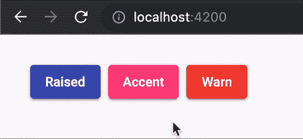

# 角度材质主题系统:完全指南

> 原文：<https://javascript.plainenglish.io/angular-material-theming-system-complete-guide-3e52e9b986a6?source=collection_archive---------3----------------------->

在这篇文章中，我们将学习自定义主题，修改排版，以及更多使用新的 SASS mixins。


> 在 Angular Material 的最新版本中，SASS 主题化 API 已经被重新设计。在这篇文章中，我们将学习使用新的 SASS mixins 自定义主题、修改排版和更多内容。

在这篇文章中，你将学习什么是角度材质主题化，以及为了遵守 SASS 的新模块系统，最近有什么变化。

然后，我们将建立一个有角材料的项目。然后，我们将添加一个自定义主题，并了解一些重要的混合，`core`，`define-palette`，`define-light-theme`，我们将应用一个自定义主题的角度材料组件。我们还将学习如何使用预先构建的主题。

设置好主题后，我们会了解排版，也会对页眉标签(`<h1>`、`<h2>`等)进行修改。)进行申请。

接下来，我们将使用`define-dark-theme`创建一个黑暗主题。我们将为黑暗主题实现延迟加载，这样它只在需要的时候加载。

在添加了对多个主题的支持后，我们将学习如何将 Angular Material 的主题应用到自定义组件中。我们将以一个`alert`组件为例，并对其应用主题。

我们还将了解如何自定义角形材质组件的样式。我们将以`MatButton`为例，为其添加新的变体。

最后，我们将学习如何将 Angular Material 版本 10 的旧代码库更新到最新版本，即 13。我们将看到如何解决 SASS 错误，以及每个版本中的主要变化。

## 角度材质用户界面组件

Angular 团队构建并维护公共 UI 组件和工具，以帮助我们构建自己的定制组件。`@angular/material`是[材质设计](https://material.io/)用于角度应用的 UI 组件。

Angular Material 还提供了一些工具，帮助开发人员用通用的交互模式构建他们自己的定制组件。

## 角材料的主题系统

在角形材料中，主题是颜色和版式选项的集合。每个主题都包括三个调色板，用于确定组件颜色:原色、强调色和警告色。

Angular Material 的主题系统附带了一套预定义的颜色和排版样式规则。主题系统是基于谷歌的材料设计规范。您还可以为应用程序中的组件自定义颜色和版式样式。

## SASS 基础

在继续之前，如果您熟悉 [SASS 基础知识](https://sass-lang.com/guide)，包括[变量](https://sass-lang.com/documentation/variables)、[函数](https://sass-lang.com/documentation/at-rules/function)、[混合](https://sass-lang.com/documentation/at-rules/mixin)，以及[使用](https://sass-lang.com/documentation/at-rules/use)，那就太好了。

## 角材中 SASS 的新变化

SASS 推出了新的模块系统，包括 2019 年从`@import`到`@use`的迁移。 [@use](https://sass-lang.com/documentation/at-rules/use) 规则加载来自其他 SASS 样式表的混合、函数和变量，并将来自多个样式表的 CSS 组合在一起。由`@use`加载的样式表被称为“模块”。

通过切换到`@use`语法，我们可以更容易地确定哪些 CSS 没有被使用，并减少编译后的 CSS 输出的大小。无论这些样式被加载多少次，每个模块都只被包含一次。

角形材料 v12 包括从`@import`用法到`@use`用法的迁移，所有导入角形材料 SASS 样式。他们在版本 12 中更新了所有风格的代码库。你可以查看那个[特殊版本](https://github.com/angular/components/releases/tag/12.0.0)来获得更多信息。

主题 API 表面的这种重构更容易理解和阅读，帮助像我们这样的开发人员更好地利用这种新的模块系统。

## 使用角度材料设置项目

*注意:在撰写本文时，我使用的是 Angular 版本 13，本文描述的方法应该也适用于版本 12。对于老版本，可以跳转到* [*更新指南*](#angular-update-guide) *。*

在本节中，我们将学习如何使用新的混音和功能，如`core-theme`、`all-components-theme`、`define-palette`等。概括而言，以下是我们将要完成的主要任务:

1.  创建自定义主题
2.  使用预先构建的主题
3.  修改版式
4.  创造一个黑暗的主题
5.  将角度材质的主题应用于自定义组件
6.  自定义角度材质组件样式

让我们首先用 SASS 创建一个新的 Angular 项目:

```
ng new my-app --style=scss --defaults
```

通过运行以下命令，使用 Angular CLI 的安装[示意图](https://material.angular.io/guide/schematics)来设置您的 Angular Material 项目:

```
ng add @angular/material
```

`ng add`命令将安装角度材料、[组件开发套件(CDK)](https://material.angular.io/cdk/categories) 、[角度动画](https://angular.io/guide/animations)，并询问您以下问题以确定包括哪些功能:

1.  选择一个预置的主题名称，或者为自定义主题选择“自定义”:选择**自定义**
2.  设置全局角度材料排版样式？:**是**
3.  为有角度的材质设置浏览器动画？:**是**

你完了！现在，角形材质已配置好，可以在应用程序中使用。

## 创建自定义主题

一个**主题文件**是一个 SASS 文件，它使用棱角分明的材质 SASS mixins 来产生颜色和排版 CSS 样式。

让我们跳到`src/styles.scss`文件，看看我们的主题:

```
// src/styles.scss

@use "@angular/material" as mat;

@include mat.core();

$my-app-primary: mat.define-palette(mat.$indigo-palette);
$my-app-accent: mat.define-palette(mat.$pink-palette, A200, A100, A400);
$my-app-warn: mat.define-palette(mat.$red-palette);

$my-app-theme: mat.define-light-theme(
  (
    color: (
      primary: $my-app-primary,
      accent: $my-app-accent,
      warn: $my-app-warn,
    ),
  )
);

@include mat.all-component-themes($my-app-theme);

html,
body {
  height: 100%;
}
body {
  margin: 0;
  font-family: Roboto, "Helvetica Neue", sans-serif;
}
```

让我们把上面的代码分解成几个部分来了解更多。

## `core`米欣

```
@include mat.core();
```

在主题文件中你首先会注意到的是`core` mixin。Angular Material 定义了一个名为`core`的 mixin，其中包括多个组件使用的通用特征的必备样式，例如[波纹](https://github.com/angular/components/blob/0d3a730631fae77ce4af49b4b9853da2a5fe09f9/src/material/core/_core.scss#L13)。即使您定义了多个主题，核心 mixin 也必须为您的应用程序包含一次。

## 定义主题

角度材质将主题表示为包含您的颜色和排版选择的 SASS 地图。颜色是通过调色板定义的。

调色板是代表部分颜色空间的颜色集合。这个集合中的每个值称为一个色调。在材料设计中，调色板中的每种色调都有一个标识号。这些标识号包括 50，然后每 100 个值在 100 和 900 之间。这些数字将调色板中的色调从最亮到最暗排序。角度材质将调色板表示为 SASS 贴图。

**`**define-palette**`**功能****

```
$my-app-primary: mat.define-palette(mat.$indigo-palette);
$my-app-accent: mat.define-palette(mat.$pink-palette, A200, A100, A400);
$my-app-warn: mat.define-palette(mat.$red-palette);
```

**构建一个主题需要 2 个调色板:`primary`和`accent`，其中`warn`调色板是可选的。**

**`define-palette` SASS 函数接受一个调色板，以及四个可选的色调数字。这四种色调依次代表:“默认”色调、“较亮”色调、“较暗”色调和“文本”色调。**

**组件使用这些色调为自身的不同部分选择最合适的颜色。例如，`[MatButton](https://github.com/angular/components/blob/0d3a730631fae77ce4af49b4b9853da2a5fe09f9/src/material/button/_button-theme.scss#L64)` [的主题](https://github.com/angular/components/blob/0d3a730631fae77ce4af49b4b9853da2a5fe09f9/src/material/button/_button-theme.scss#L64)使用色调生成字体颜色:**

```
// src/material/button/_button-theme.scss
// content reduced for brevity

// Applies a property to an mat-button element for each of the supported palettes.
@mixin _theme-property($theme, $property, $hue) {
  $primary: map.get($theme, primary);
  $accent: map.get($theme, accent);
  $warn: map.get($theme, warn);
  $background: map.get($theme, background);
  $foreground: map.get($theme, foreground);

  &.mat-primary {
    #{$property}: theming.get-color-from-palette($primary, $hue);
  }
  &.mat-accent {
    #{$property}: theming.get-color-from-palette($accent, $hue);
  }
  &.mat-warn {
    #{$property}: theming.get-color-from-palette($warn, $hue);
  }

  &.mat-primary,
  &.mat-accent,
  &.mat-warn,
  &.mat-button-disabled {
    &.mat-button-disabled {
      $palette: if($property == "color", $foreground, $background);
      #{$property}: theming.get-color-from-palette($palette, disabled-button);
    }
  }
}

@mixin color($config-or-theme) {
  $config: theming.get-color-config($config-or-theme);
  $foreground: map.get($config, foreground);

  .mat-button,
  .mat-icon-button,
  .mat-stroked-button {
    @include _theme-property($config, "color", text);
  }
}
```

**在我们的例子中，我们使用了预定义的调色板，即`$indigo-palette`、`$pink-palette`和`$red-palette`。你可以在 Angular Material GitHub [repo 的文件中查看其他调色板:](https://github.com/angular/components/blob/master/src/material/core/theming/_palette.scss)**

```
// src/material/core/theming/_palette.scss
// content reduced for brevity

$red-palette: (
  50: #ffebee,
  100: #ffcdd2,
  200: #ef9a9a,
  300: #e57373,
  // ...
  contrast: (
    50: $dark-primary-text,
    100: $dark-primary-text,
    200: $dark-primary-text,
    300: $dark-primary-text,
    // ...
  )
);

$pink-palette: (
  50: #fce4ec,
  100: #f8bbd0,
  200: #f48fb1,
  300: #f06292,
  // ...
  contrast: (
    50: $dark-primary-text,
    100: $dark-primary-text,
    200: $dark-primary-text,
    300: $dark-primary-text,
    // ...
  )
);
```

****创建自己的调色板****

**您也可以通过定义如下所示的 SASS 映射来创建自己的调色板:**

```
$indigo-palette: (
 50: #e8eaf6,
 100: #c5cae9,
 200: #9fa8da,
 300: #7986cb,
 // ... continues to 900
 contrast: (
   50: rgba(black, 0.87),
   100: rgba(black, 0.87),
   200: rgba(black, 0.87),
   300: white,
   // ... continues to 900
 )
);
```

****`**define-light-theme**`**功能******

```
**$my-app-theme: mat.define-light-theme(
  (
    color: (
      primary: $my-app-primary,
      accent: $my-app-accent,
      warn: $my-app-warn,
    ),
  )
);**
```

****你可以用来自`define-palette`的结果通过调用`define-light-theme`或`define-dark-theme`来构建一个主题。浅色和深色主题的选择决定了整个组件中使用的背景色和前景色。****

## ****将主题应用于组件****

```
**@include mat.all-component-themes($my-app-theme);**
```

****Angular Material 提供了一种“主题”混合，可以为颜色和排版设计风格，这就是`all-component-themes`混合。****

****可以查看源文件:`[src/material/core/theming/_all-theme.scss](https://github.com/angular/components/blob/97ec228ada31e55f76a7e0171c715bb0b8d07e9c/src/material/core/theming/_all-theme.scss#L40)`看 mixin `all-component-themes`:****

```
**// src/material/core/theming/_all-theme.scss

@mixin all-component-themes($theme-or-color-config) {
  $dedupe-key: 'angular-material-theme';
  @include theming.private-check-duplicate-theme-styles($theme-or-color-config, $dedupe-key) {
    @include core-theme.theme($theme-or-color-config);
    @include autocomplete-theme.theme($theme-or-color-config);
    @include badge-theme.theme($theme-or-color-config);
    @include bottom-sheet-theme.theme($theme-or-color-config);
    @include button-theme.theme($theme-or-color-config);
    // other material components' themes...
  }
}**
```

****此外，还有一个“color”mixin，它发出所有组件的颜色样式，还有一个“topology”mixin，它发出所有组件的排版样式。他们是`all-component-colors`和`all-component-typographies`mixin。****

****出现在`[src/material/core/color/_all-color.scss](https://github.com/angular/components/blob/97ec228ada31e55f76a7e0171c715bb0b8d07e9c/src/material/core/color/_all-color.scss#L5)`的`all-component-colors` mixin 具有:****

```
**// src/material/core/color/_all-color.scss

@mixin all-component-colors($config-or-theme) {
  $config: if(theming.private-is-theme-object($config-or-theme),
      theming.get-color-config($config-or-theme), $config-or-theme);

  @include all-theme.all-component-themes((
    color: $config,
    typography: null,
    density: null,
  ));
}**
```

****`all-components-typography`米辛出现在`[src/material/core/typography/_all-typography.scss](https://github.com/angular/components/blob/97ec228ada31e55f76a7e0171c715bb0b8d07e9c/src/material/core/typography/_all-typography.scss#L42)`:****

```
**// src/material/core/typography/_all-typography.scss

@mixin all-component-typographies($config-or-theme: null) {
  $config: if(theming.private-is-theme-object($config-or-theme),
      theming.get-typography-config($config-or-theme), $config-or-theme);

  @include badge-theme.typography($config);
  @include typography.typography-hierarchy($config);
  @include autocomplete-theme.typography($config);
  @include bottom-sheet-theme.typography($config);
  @include button-theme.typography($config);
  // other components' typographies
}**
```

****这些混音为所有 35 个以上的角形材料组件发射样式。这将产生不必要的 CSS，除非您的应用程序正在使用库中的每个组件。让我们看看`build`命令后的`styles`大小，然后我会告诉你如何减少它:****

********

******仅包括使用过的组件主题******

****就像`all-component-colors`、`all-component-typographies`和`all-component-themes`一样，每一个有角的材质组件都有一个`color`、一个`typography`和一个`theme` mixin。****

****您可以在`[src/material/button/_button-theme.scss](https://github.com/angular/components/blob/master/src/material/button/_button-theme.scss)`查看`MatButton`的混音:****

```
**// src/material/button/_button-theme.scss
// content reduced for brevity

@mixin color($config-or-theme) {
  $config: theming.get-color-config($config-or-theme);
  $primary: map.get($config, primary);
  $accent: map.get($config, accent);
  $warn: map.get($config, warn);
  // sets up color for buttons
}

@mixin typography($config-or-theme) {
  $config: typography.private-typography-to-2014-config(
      theming.get-typography-config($config-or-theme));
  .mat-button, .mat-raised-button, .mat-icon-button, .mat-stroked-button,
  .mat-flat-button, .mat-fab, .mat-mini-fab {
    font: {
      family: typography-utils.font-family($config, button);
      size: typography-utils.font-size($config, button);
      weight: typography-utils.font-weight($config, button);
    }
  }
}

@mixin theme($theme-or-color-config) {
  $theme: theming.private-legacy-get-theme($theme-or-color-config);
  @include theming.private-check-duplicate-theme-styles($theme, 'mat-button') {
    $color: theming.get-color-config($theme);
    $typography: theming.get-typography-config($theme);

    @if $color != null {
      @include color($color);
    }
    @if $typography != null {
      @include typography($typography);
    }
  }
}**
```

****我们可以为应用程序中使用的每个组件应用样式，包括它们的每个主题 SASS 混合。****

****首先，我们将从`styles.scss`中删除`all-component-themes`，并添加`core-theme`:****

```
**// @include mat.all-component-themes($my-app-theme); <-- removed
@include mat.core-theme($my-app-theme);**
```

****`core-theme`为跨多个组件使用的公共功能发出主题相关的样式，如波纹。****

****接下来，我们需要添加组件相关的样式。在本例中，我们将只使用`[MatButton](https://material.angular.io/components/button/overview)`，因此我们将添加`button-theme`:****

```
**@include mat.button-theme($my-app-theme);**
```

****你可以用同样的方法添加其他组件。但是，每个主题只需要一次`core-theme`。让我们看看`styles`建成后的尺寸。****

********

****请注意，只使用所需组件的主题是如何缩小样式大小的。在我们的示例中，之前是 72.31 kB，现在减少到 23.52 kB，几乎减少了 58%。****

****为了更好地管理代码，我们将主题相关的代码移到`styles/themes/_light.scss`:****

```
**// src/styles/themes/_light.scss

@use "sass:map";
@use "@angular/material" as mat;

$my-app-light-primary: mat.define-palette(mat.$indigo-palette);
$my-app-light-accent: mat.define-palette(mat.$pink-palette, A200, A100, A400);

$my-app-light-warn: mat.define-palette(mat.$red-palette);

$my-app-light-theme: mat.define-light-theme(
  (
    color: (
      primary: $my-app-light-primary,
      accent: $my-app-light-accent,
      warn: $my-app-light-warn,
    ),
  )
);**
```

****并在`styles.scss`中使用相同的:****

```
**// styles.scss

@use "@angular/material" as mat;

@use "./styles/themes/light";

@include mat.core();

@include mat.core-theme(light.$my-app-light-theme);
@include mat.button-theme(light.$my-app-light-theme);

html,
body {
  height: 100%;
}
body {
  margin: 0;
  font-family: Roboto, "Helvetica Neue", sans-serif;
}**
```

## ****创建自定义主题后的输出****

****让我们在应用程序中添加一个`[mat-raised-button]`，看看它是什么样子的:****

```
**<button mat-raised-button color="primary">Raised</button>
<button mat-raised-button color="accent">Accent</button>
<button mat-raised-button color="warn">Warn</button>**
```

****输出应该如下所示:****

********

## ****使用预先构建的主题****

****当我们安装角材料时，我们在主题选择中选择了“自定义”。如果你想要任何预建的主题，你可以选择任何主题而不是“自定义”。提供了 4 个预置主题:****

****例如，如果您想使用`indigo-pink.css`的主题，您只需要将该文件包含在项目的`angular.json`文件的`styles`数组中:****

```
**"styles": [
    "./node_modules/@angular/material/prebuilt-themes/indigo-pink.css",
    // other styles
],**
```

## ****修改版式****

*****排版是一种排列字体的方式，使文字在显示时清晰、易读、有吸引力。Angular Material 的主题系统支持为库的组件定制排版设置。此外，Angular Material 还提供了将排版样式应用于您自己的应用程序中的元素的 API。*****

****当我们通过 schematics 安装 Angular Material 时，它在`index.html`中为我们设置了字体资源:****

```
**<link href="https://fonts.googleapis.com/css2?family=Roboto:wght@300;400;500&display=swap" rel="stylesheet">**
```

****并且为了支持`Roboto`，它还在`styles.scss`中加入了一些全局样式:****

```
**body {
  font-family: Roboto, "Helvetica Neue", sans-serif;
}**
```

## ****排版水平****

****在 Material 主题中，每一组字体都是根据它对应的应用程序结构的哪一部分(比如标题)来分类的。你可以从 2014 版材料设计规范中的[排版层面了解更多信息。](https://material.io/archive/guidelines/style/typography.html#typography-styles)****

******定义一个级别******

****您可以使用`define-typography-config` SASS 功能定义排版级别。该函数依次接受`font-size`、`line-height`、`font-weight`、`font-family`和`letter-spacing`的 CSS 值。您也可以按名称指定参数，如下例所示。****

```
**@use '@angular/material' as mat;

$my-custom-level: mat.define-typography-level(
  $font-family: Roboto,
  $font-weight: 400,
  $font-size: 1rem,
  $line-height: 1,
  $letter-spacing: normal,
);**
```

## ****排版配置****

****角度材料使用**排版配置**处理所有这些级别。角度材质将此配置表示为 SASS 贴图。这个地图包含每个级别的样式，以名称为关键字。您可以使用`define-typography-config` SASS 功能创建排版配置。`define-typography-config`的每个参数都是可选的；如果未指定，级别的样式将默认为材质设计的基线。****

****在这个例子中，我们将改变标题的排版，我们将使用 [Work Sans](https://fonts.google.com/specimen/Work+Sans) 作为`font-family`。让我们看看怎么做。****

******包括字体资产******

****首先，我们将在`index.html`中的`<head>`底部添加字体:****

```
**<link rel="stylesheet" href="https://fonts.googleapis.com/css2?family=Work+Sans:wght@300;400;500&display=swap">**
```

******标题字体系列 SASS 变量******

****接下来，创建一个文件`styles/typography/_config.scss`并在其中创建一个变量:****

```
**// src/styles/typography/_config.scss

$heading-font-family: "'Work Sans', sans-serif";**
```

******创建配置******

****现在是使用`styles/typography/_config.scss`中的`define-typography-config`创建配置的时候了:****

```
**$my-app-typography: mat.define-typography-config(
  $display-4: mat.define-typography-level(112px, $font-family: $heading-font-family),
  $display-3: mat.define-typography-level(56px, $font-family: $heading-font-family),
  $display-2: mat.define-typography-level(45px, $font-family: $heading-font-family),
  $display-1: mat.define-typography-level(34px, $font-family: $heading-font-family),
  $headline: mat.define-typography-level(24px, $font-family: $heading-font-family),
  $title: mat.define-typography-level(20px, $font-family: $heading-font-family),
);**
```

****为了定制整个应用程序的组件排版，我们将把定制排版配置传递给`styles.scss`中的`core` mixin:****

```
**// src/styles.scss

@use "@angular/material" as mat;

@use "./styles/themes/light";
@use "./styles/typography/config" as typography;

@include mat.core(typography.$my-app-typography);

// rest remains same**
```

****将排版配置传递给核心 mixin 会将指定的值应用到所有角度材料组件。如果没有指定 config，`core`将发出默认的材料设计排版样式。****

******主题特定排版******

****除了`core` mixin，我们可以在包含任何`theme` mixin 时指定您的排版配置，如下所示:****

```
**$custom-theme: mat.define-light-theme((
   color: (
     primary: $custom-primary,
     accent: $custom-accent,
   ),
   typography: $custom-typography,
  ));**
```

****因为`core` mixin 总是发出排版样式，指定一个排版配置给`theme` mixin 会导致重复的排版 CSS。如果您需要指定根据应用程序的行为有条件应用的多种版式样式，那么您应该只在应用主题时提供版式配置。****

******在应用程序中使用排版样式******

****有角度的材料的原生元素'如果内容被包裹在内，排版工作'。席子排版`CSS class. If you check the`index.html`file,`席子排版`class is added to thetag. It was done when we ran` ng add @angular/material `。****

****如果您不想将整个应用程序包装在一个`mat-typography`类中，您也可以使用在[级别表](#typography-level)中列出的单个类。****

## ****修改排版后的输出****

****我们暂时修改一下`index.html`中`<body>`的内容:****

```
**<body>
    <!-- This header will *not* be styled because it is outside `.mat-typography` -->
    <h1>Top header (Material Typography doesn't apply here)</h1>

    <!-- This paragraph will be styled as `body-1` via the `.mat-body` CSS class applied -->
    <p class="mat-body">Introductory text</p>

    <div class="mat-typography">
      <!-- This header will be styled as `title` because it is inside `.mat-typography` -->
      <h2>Inner header</h2>

      <!-- This paragraph will be styled as `body-1` because it is inside `.mat-typography` -->
      <p>Some inner text</p>
      <app-root></app-root>
    </div>
  </body>**
```

****如果你看一下输出，你会知道排版是如何工作的:****

********

****修改排版后，下面是`src/styles/typography/_config.scss`的内容:****

```
**// src/styles/typography/_config.scss

@use "@angular/material" as mat;

$heading-font-family: "'Work Sans', sans-serif";
$my-app-typography: mat.define-typography-config(
  $display-4:
    mat.define-typography-level(112px, $font-family: $heading-font-family),
  $display-3:
    mat.define-typography-level(56px, $font-family: $heading-font-family),
  $display-2:
    mat.define-typography-level(45px, $font-family: $heading-font-family),
  $display-1:
    mat.define-typography-level(34px, $font-family: $heading-font-family),
  $headline:
    mat.define-typography-level(24px, $font-family: $heading-font-family),
  $title: mat.define-typography-level(20px, $font-family: $heading-font-family),
);**
```

****而下面是`style.scss`的内容:****

```
**// src/styles.scss

@use "@angular/material" as mat;

@use "./styles/themes/light";
@use "./styles/typography/config" as typography;

@include mat.core(typography.$my-app-typography);

@include mat.core-theme(light.$my-app-light-theme);
@include mat.button-theme(light.$my-app-light-theme);

html,
body {
  height: 100%;
}
body {
  margin: 0;
  font-family: Roboto, "Helvetica Neue", sans-serif;
}**
```

## ****创造一个黑暗的主题****

****现在我们将在应用程序中添加一个黑色主题。在`styles/themes`文件夹中创建一个名为`dark.scss`的新文件，内容如下:****

```
**// src/styles/themes/dark.scss

@use "sass:map";
@use "@angular/material" as mat;

@use "../typography/config" as typography;
@use "../components";

$my-app-dark-primary: mat.define-palette(mat.$blue-grey-palette);
$my-app-dark-accent: mat.define-palette(mat.$amber-palette, A200, A100, A400);
$my-app-dark-warn: mat.define-palette(mat.$deep-orange-palette);
$my-app-dark-theme: mat.define-dark-theme(
  (
    color: (
      primary: $my-app-dark-primary,
      accent: $my-app-dark-accent,
      warn: $my-app-dark-warn,
    ),
  )
);

.dark-theme {
  @include mat.core-color($my-app-dark-theme);
  @include mat.button-color($my-app-dark-theme);
}**
```

****注意，我们使用了一个类选择器`.dark-theme`来渲染一个黑暗的主题。****

## ****避免重复的主题样式****

****在创作`dark-theme`的时候，我们用的是`core-color`和`button-color`，而不是原来主题里用的`core-theme`和`button-theme`。背后的原因是我们只想改变`dark-theme`中的颜色，其他所有样式都应该保持不变。如果我们使用`theme` mixins，它将再次生成所有不需要的样式。****

## ****背景和字体颜色的更改****

****为了完成背景和字体颜色的主题设置，我们需要将类`mat-app-background`添加到`index.html`中的`<body>`标签中:****

```
**<body class="mat-typography mat-app-background">
  <app-root></app-root>
</body>**
```

## ****懒惰装载黑暗主题****

****对于我们的应用程序，`dark-theme`是一个额外的主题，可以根据用户的偏好来加载。因此，我们将延迟加载它，而不是让它成为默认应用程序的一部分。****

****让我们在项目的`angular.json`中对此进行更改:****

```
**"styles": [
              "src/styles.scss",
              {
                "input": "src/styles/themes/dark.scss",
                "bundleName": "dark-theme",
                "inject": false
              }
            ],**
```

> ****你可以在:[了解更多关于惰性加载样式表的知识，如何在 Angular 中从 bundle 中排除样式表并惰性加载？](https://indepth.dev/tutorials/angular/lazy-load-stylesheets)****

****为了根据用户的选择加载`dark-theme`,我们将简单地实现一个名为`style-manager.service.ts`的服务，每当我们想要改变主题时，我们将简单地从这个服务中调用`toggleDarkTheme`:****

```
**// style-manager.service.ts

import { Injectable } from '@angular/core';

@Injectable({ providedIn: 'root' })
export class StyleManager {
  isDark = false;

  toggleDarkTheme() {
    if (this.isDark) {
      this.removeStyle('dark-theme');
      document.body.classList.remove('dark-theme');
      this.isDark = false;
    } else {
      const href = 'dark-theme.css';
      getLinkElementForKey('dark-theme').setAttribute('href', href);
      document.body.classList.add('dark-theme');
      this.isDark = true;
    }
  }

  removeStyle(key: string) {
    const existingLinkElement = getExistingLinkElementByKey(key);
    if (existingLinkElement) {
      document.head.removeChild(existingLinkElement);
    }
  }
}

function getLinkElementForKey(key: string) {
  return getExistingLinkElementByKey(key) || createLinkElementWithKey(key);
}

function getExistingLinkElementByKey(key: string) {
  return document.head.querySelector(
    `link[rel="stylesheet"].${getClassNameForKey(key)}`
  );
}

function createLinkElementWithKey(key: string) {
  const linkEl = document.createElement('link');
  linkEl.setAttribute('rel', 'stylesheet');
  linkEl.classList.add(getClassNameForKey(key));
  document.head.appendChild(linkEl);
  return linkEl;
}

function getClassNameForKey(key: string) {
  return `style-manager-${key}`;
}**
```

****以上是一个非常固执己见的方法，你可以根据你的需要改变它。****

## ****创建暗主题后的输出****

****现在，让我们利用`app.component.ts`中的上述服务:****

```
**// src/app/app.component.ts

import { Component } from '@angular/core';
import { StyleManager } from './shared/services/style-manager.service';

@Component({
  selector: 'app-root',
  templateUrl: './app.component.html',
  styleUrls: ['./app.component.scss'],
})
export class AppComponent {
  title = 'my-app';
  isDark = this.styleManager.isDark;

  constructor(private styleManager: StyleManager) {}

  toggleDarkTheme() {
    this.styleManager.toggleDarkTheme();
    this.isDark = !this.isDark;
  }
}**
```

****接下来，我们将在`app.component.html`中添加一个按钮来切换明暗主题:****

```
**<!-- src/app/app.component.html -->

<div>
  <h1>Angular Material Theming System: Complete Guide</h1>
  <button
    mat-icon-button
    (click)="toggleDarkTheme()"
    class="theme-toggle"
    aria-label="Toggle Dark Theme"
  >
    <mat-icon>{{ isDark ? "dark_mode" : "light_mode" }}</mat-icon>
  </button>
  <div class="demo-buttons">
    <button mat-raised-button color="primary">Raised</button>
    <button mat-raised-button color="accent">Accent</button>
    <button mat-raised-button color="warn">Warn</button>
  </div>
</div>**
```

****现在让我们看看输出:****

********

****请注意，当我们更改主题时，它会更改按钮和文本的颜色和背景颜色。还要注意的是`dark-theme.css`只在用户切换到黑暗主题时被包含。****

## ****将角度材质的主题应用于自定义组件****

****假设下面的模板有一个`alert`组件:****

```
**<div class="alert" role="alert">
  <h4 class="alert-heading"><mat-icon>thumb_up</mat-icon> Well done!</h4>
  <button mat-icon-button aria-label="Close" class="alert-close">
    <mat-icon>close</mat-icon>
  </button>
  <p class="alert-message">
    You did a great job! To get your reward,
    <a href="#" class="alert-link">click here</a>.
  </p>
  <hr />
  <p class="alert-footer">
    Your reward will be credited to your account within 24 Hour.
  </p>
</div>**
```

****它的造型如下:****

```
**// alert.scss

.alert {
  position: relative;
  padding: 1rem 1rem;
  margin-bottom: 1rem;
  border: 1px solid transparent;
  border-radius: 0.25rem;

  color: #084298;
  background-color: #cfe2ff;
  border-color: #b6d4fe;

  .alert-link {
    color: #06357a;
  }

  hr {
    margin: 1rem 0;
    color: inherit;
    background-color: currentColor;
    border: 0;
    opacity: 0.25;
    height: 1px;
  }

  .alert-heading {
    color: inherit;
    font-size: calc(1.275rem + 0.3vw);
  }

  .alert-link {
    font-weight: 700;
  }

  mat-icon {
    color: currentColor;
    vertical-align: middle;
    font-size: inherit;
    line-height: inherit;
    height: inherit;
    width: inherit;
  }

  .alert-close {
    position: absolute;
    top: 0;
    right: 0;
    z-index: 2;

    mat-icon {
      color: #000;
      font-size: 24px;
      line-height: 1;
      height: 24px;
      width: 24px;
    }
  }

  .alert-footer {
    font-size: 80%;
    margin-bottom: 0;
  }
}**
```

****使用上述样式，它看起来如下所示:****

********

****现在，我们想将角度材质的主题应用到`alert`组件中，这样颜色和排版就可以与主题相匹配。****

## ****分离主题样式****

****每个角度材质组件都有一个 SASS 文件，该文件定义了定制该组件颜色和字体的混合。例如，`MatButton`有`button-color`和`button-typography`的混合物。每个 mixin 分别为该组件发出所有颜色和字体样式。****

****我们将通过定义自己的混合来反映`alert`组件中的这种结构。这些混搭应该接受有角度的材质主题，他们可以从中读取颜色和排版值。然后，我们将在您的应用程序中包含这些混合，以及 Angular Material 自己的混合。****

****这将是一个逐步的过程。****

******第 1 步:将基于主题的样式提取到单独的文件中******

****为了改变这个文件，让它参与到 Angular Material 的主题化系统中，我们将样式分成了两个文件，颜色和排版样式被移到了混搭中。按照惯例，新文件名以`-theme`结尾。此外，文件以下划线(`_`)开头，表示这是一个 SASS 部分文件。有关部分文件的更多信息，请参见 [SASS 文档](https://sass-lang.com/guide#topic-4)。****

```
**// alert.scss

.alert {
  position: relative;
  padding: 1rem 1rem;
  margin-bottom: 1rem;
  border: 1px solid transparent;
  border-radius: 0.25rem;

  hr {
    margin: 1rem 0;
    color: inherit;
    background-color: currentColor;
    border: 0;
    opacity: 0.25;
    height: 1px;
  }

  .alert-heading {
    color: inherit;
  }

  .alert-link {
    font-weight: 700;
  }

  mat-icon {
    color: currentColor;
    vertical-align: middle;
    font-size: inherit;
    line-height: inherit;
    height: inherit;
    width: inherit;
  }

  .alert-close {
    position: absolute;
    top: 0;
    right: 0;
    z-index: 2;

    mat-icon {
      color: #000;
      font-size: 24px;
      line-height: 1;
      height: 24px;
      width: 24px;
    }
  }

  .alert-footer {
    margin-bottom: 0;
  }
}**
```

****我们将主题相关的内容移到`_alert-theme.scss`:****

```
**// _alert-theme.scss

@mixin color($theme) {
  .alert {
    color: #084298;
    background-color: #cfe2ff;
    border-color: #b6d4fe;

    .alert-link {
      color: #06357a;
    }
  }
}

@mixin typography($theme) {
  .alert {
    .alert-heading {
      font-size: calc(
        1.275rem + 0.3vw
      );
    }
    .alert-footer {
      font-size: 80%;
    }
  }
}**
```

******第 2 步:使用主题中的值******

****现在基于主题的样式驻留在 mixin 中，我们可以从传递到 mixin 的主题中提取我们需要的值。****

******读取颜色值******

****要读取主题的颜色值，可以使用`get-color-config` SASS 功能。该函数返回一个包含主题的主要、强调和警告选项板的 SASS 图，以及一个指示是否设置了暗模式的标志。以下是一个例子:****

```
**@use 'SASS:map';
@use '@angular/material' as mat;

$color-config:    mat.get-color-config($theme);
$primary-palette: map.get($color-config, 'primary');
$accent-palette:  map.get($color-config, 'accent');
$warn-palette:    map.get($color-config, 'warn');
$is-dark-theme:   map.get($color-config, 'is-dark');**
```

******读取排版值******

****要从主题中读取版式值，您可以使用`get-typography-config` SASS 函数。例如:****

```
**@use '@angular/material' as mat;

$typography-config: mat.get-typography-config($theme);
$my-font-family: mat.font-family($typography-config);**
```

****让我们在`_alert-theme.scss`中进行更改:****

```
**// _alert-theme.scss

@use "sass:map";
@use "@angular/material" as mat;

@mixin color($theme) {
  // Get the color config from the theme.
  $color-config: mat.get-color-config($theme);

  // Get the primary color palette from the color-config.
  $primary-palette: map.get($color-config, "primary");

  .alert {
    color: mat.get-color-from-palette($primary-palette, 700);
    background-color: mat.get-color-from-palette($primary-palette, 100);
    border-color: mat.get-color-from-palette($primary-palette, 300);

    .alert-link {
      color: mat.get-color-from-palette($primary-palette, 900);
    }
  }
}

@mixin typography($typography-config) {
  .alert {
    .alert-heading {
      @include mat.typography-level($typography-config, "title");
    }
    .alert-footer {
      @include mat.typography-level($typography-config, "caption");
    }
  }
}**
```

******第三步:添加一个主题混音******

****为了方便起见，我们将添加一个包含颜色和排版的`theme` mixin。****

```
**// _alert-theme.scss

// rest remains same

@mixin theme($theme, $typography-config) {
  $color-config: mat.get-color-config($theme);
  @if $color-config != null {
    @include color($theme);
  }

  @if $typography-config != null {
    @include typography($typography-config);
  }
}**
```

****第四步:在你的应用程序中包含主题 mixin****

****首先，我们将在`src/styles/components`文件夹中创建`_index.scss`，它将保存我们所有组件的 mixins。它会有一个主题混音。****

```
**// src/styles/components/_index.scss

@use "../../app/shared/components/alert/alert-theme" as alert;

@mixin theme($theme, $typography-config) {
  @include alert.theme($theme, $typography-config);
}**
```

****接下来，我们将把这个`theme` mixin 和其他主题 mixin 一起包含在`styles.scss`的应用程序中:****

```
**// src/styles.scss

@use "@angular/material" as mat;

@use "./styles/themes/light";
@use "./styles/components";
@use "./styles/typography/config" as typography;

@include mat.core(typography.$my-app-typography);

@include mat.core-theme(light.$my-app-light-theme);
@include mat.button-theme(light.$my-app-light-theme);
@include components.theme(
  light.$my-app-light-theme,
  typography.$my-app-typography
);

html,
body {
  height: 100%;
}
body {
  margin: 0;
  font-family: Roboto, "Helvetica Neue", sans-serif;
}**
```

****我们也将在`src/styles/theme/dark.scss`中包含这个主题:****

```
**// src/styles/themes/dark.scss

@use "sass:map";
@use "@angular/material" as mat;

@use "../typography/config" as typography;
@use "../components";

$my-app-dark-primary: mat.define-palette(mat.$blue-grey-palette);
$my-app-dark-accent: mat.define-palette(mat.$amber-palette, A200, A100, A400);
$my-app-dark-warn: mat.define-palette(mat.$deep-orange-palette);
$my-app-dark-theme: mat.define-dark-theme(
  (
    color: (
      primary: $my-app-dark-primary,
      accent: $my-app-dark-accent,
      warn: $my-app-dark-warn,
    ),
  )
);

.dark-theme {
  @include mat.core-color($my-app-dark-theme);
  @include mat.button-color($my-app-dark-theme);
  @include components.theme(
    $my-app-dark-theme,
    typography.$my-app-typography
  );
}**
```

****现在让我们来看看警报:****

********

****它适用于明暗主题。并且“工作 Sans”系列的标题字体也应用于警报的标题。****

## ****自定义角度材质组件样式****

****在最后一节中，我们将学习如何自定义角形材质组件的样式。要定制任何角度材质组件的样式，我们可以简单地创建 CSS 类并使用它们。对于这个例子，我们将定制`[MatButton](https://material.angular.io/components/button/overview)`的样式。****

****角形材料提供 3 种变型:`primary`、`accent`和`warn`。如果您检查为这些变体生成的 HTML 代码，例如`<button mat-button color=”primary”>Primary</button>`，您会发现它为按钮添加了类`mat-primary`:****

********

****对于这个例子，我们将为`MatButton`添加两个变量:`success`和`info`。因此，基于以上发现，我们将需要添加对`mat-success`和`mat-info`类的支持。****

****现在，我们可能首先想到简单地为`mat-success`和`mat-info`类添加`color`和`background-color`。但是，如果你检查一下`MatButton`的 DOM 结构，它不仅仅是一个简单的按钮，它包含了多个元素来支持连锁反应:****

********

****因此，要正确设计 button 的新变体，我们需要遵循一种特定的方法。让我们开始吧。****

## ****步骤 1:创建调色板的变体映射****

****让我们首先为`light`和`dark`主题创建`success`和`info`调色板。而且我们会和`components.theme` mixin 一起用。****

****我们将创建如下图所示的`variant` [映射](https://sass-lang.com/documentation/values/maps)，然后使用其中的每个调色板来创建按钮的变体:****

```
**$variants: (
    success: $success-palette,
    info: $info-palette
)**
```

****让我们首先在最后的`src/styles/theme/_light.scss`中为`light`主题创建一个变体地图:****

```
**// src/styles/themes/_light.scss

// rest remains same

$my-app-light-success: mat.define-palette(mat.$green-palette);
$my-app-light-info: mat.define-palette(mat.$blue-palette);

$my-app-light-variants: (
  success: $my-app-light-success,
  info: $my-app-light-info,
);**
```

****对于`success`，我们使用`[$green-palette](https://github.com/angular/components/blob/97ec228ada31e55f76a7e0171c715bb0b8d07e9c/src/material/core/theming/_palette.scss#L337)`，对于`info`，我们使用`[$blue-palette](https://github.com/angular/components/blob/97ec228ada31e55f76a7e0171c715bb0b8d07e9c/src/material/core/theming/_palette.scss#L205)`。****

****接下来，我们将把`components.theme` mixin 中的这个变体映射作为第三个参数传递给`src/styles.scss`:****

```
**// src/styles.scss

// rest remains same

@include components.theme(
  light.$my-app-light-theme,
  typography.$my-app-typography,
  light.$my-app-light-variants
);

// rest remains same**
```

****接下来，我们将在`src/styles/theme/dark.scss`中为`dark`主题创建相同的变体贴图，并在`components.theme` mixin 中传递它:****

```
**// src/styles/themes/dark.scss

// rest remains same

$my-app-dark-success: mat.define-palette(mat.$light-green-palette);
$my-app-dark-info: mat.define-palette(mat.$light-blue-palette);

$my-app-dark-variants: (
  success: $my-app-dark-success,
  info: $my-app-dark-info,
);

.dark-theme {
  @include mat.core-color($my-app-dark-theme);
  @include mat.button-color($my-app-dark-theme);
  @include components.theme(
    $my-app-dark-theme,
    typography.$my-app-typography,
    $my-app-dark-variants
  );
}**
```

****对于`dark`主题，我们使用`[$light-green-palette](https://github.com/angular/components/blob/97ec228ada31e55f76a7e0171c715bb0b8d07e9c/src/material/core/theming/_palette.scss#L370)`和`[$light-blue-palette](https://github.com/angular/components/blob/97ec228ada31e55f76a7e0171c715bb0b8d07e9c/src/material/core/theming/_palette.scss#L238)`作为`success`和`info`的变体。****

## ****步骤 2:在组件的主题混合中添加变体映射****

****`components.theme` mixin 中的`src/styles/components/_index.scss`截至目前有两种说法:`$theme`和`$typography-config`。我们现在将为变体映射添加第三个参数:****

```
**// src/styles/components/_index.scss

@use "../../app/shared/components/alert/alert-theme" as alert;

@mixin theme($theme, $typography-config, $variants) {
  @include alert.theme($theme, $typography-config);
}**
```

****我们将在接下来的步骤中看到如何使用`$variants`地图。****

## ****步骤 3:为按钮创建变体****

****为了创建按钮的`success`和`info`变体，我们将从`[src/material/button/_button-theme.scss](https://github.com/angular/components/blob/master/src/material/button/_button-theme.scss)`开始遵循相同的方法。****

****如果你看一下[按钮主题的源代码](https://github.com/angular/components/blob/master/src/material/button/_button-theme.scss)，按钮的样式需要 5 个混音才能正常工作:****

1.  ****`_focus-overlay-color` -将焦点样式应用于每个支持的调色板的 mat-button 元素****
2.  ****`_ripple-background` -将背景色应用为波纹。****
3.  ****`_ripple-color` -将包括每个变体的`_ripple-background`****
4.  ****`_theme-property` -将属性应用于变体中每个受支持调色板的`mat-button`元素****
5.  ****`color` -将对每种 `[mat-button](https://material.angular.io/components/button/overview)`类型的[应用上述所有 4 种混音。它们是基本型、凸起型、描边型、扁平型、图标型和 fab 型。](https://material.angular.io/components/button/overview)****

****让我们在`src/styles/components/button`处创建一个文件`_variants.scss`，内容如下:****

```
**// src/styles/components/button/_variants.scss

@use "sass:map";
@use "sass:meta";
@use "@angular/material" as mat;

$_ripple-opacity: 0.1;

// Applies a focus style to an mat-button element for each of the supported palettes.
@mixin _focus-overlay-color($config-or-theme, $variants) {
  $config: mat.get-color-config($config-or-theme);

  @each $variant, $variant-palette in $variants {
    &.mat-#{$variant} .mat-button-focus-overlay {
      background-color: mat.get-color-from-palette($variant-palette);
    }
  }
}

@mixin _ripple-background($palette, $hue, $opacity) {
  $background-color: mat.get-color-from-palette($palette, $hue, $opacity);
  background-color: $background-color;
  @if (meta.type-of($background-color) != color) {
    opacity: $opacity;
  }
}

@mixin _ripple-color($theme, $hue, $opacity, $variants) {
  @each $variant, $variant-palette in $variants {
    &.mat-#{$variant} .mat-ripple-element {
      @include _ripple-background($variant-palette, $hue, $opacity);
    }
  }
}

// Applies a property to an mat-button element for each of the supported palettes.
@mixin _theme-property($theme, $property, $hue, $variants) {
  $background: map.get($theme, background);
  $foreground: map.get($theme, foreground);

  @each $variant, $variant-palette in $variants {
    &.mat-#{$variant} {
      #{$property}: mat.get-color-from-palette($variant-palette, $hue);
    }

    &.mat-#{$variant} {
      &.mat-button-disabled {
        $palette: if($property == "color", $foreground, $background);
        #{$property}: mat.get-color-from-palette($palette, disabled-button);
      }
    }
  }
}

@mixin color($config-or-theme, $variants) {
  $config: mat.get-color-config($config-or-theme);
  $foreground: map.get($config, foreground);
  $background: map.get($config, background);

  .mat-button,
  .mat-icon-button,
  .mat-stroked-button {
    @include _theme-property($config, "color", text, $variants);
    @include _focus-overlay-color($config, $variants);
  }

  .mat-flat-button,
  .mat-raised-button,
  .mat-fab,
  .mat-mini-fab {
    @include _theme-property($config, "color", default-contrast, $variants);
    @include _theme-property($config, "background-color", default, $variants);
    @include _ripple-color(
      $config,
      default-contrast,
      $_ripple-opacity,
      $variants
    );
  }
}**
```

## ****步骤 4:在组件主题中包含按钮颜色混合****

****是时候在`src/styles/components/_index.scss`将`button.color` mixin 包含在`components.theme`中了:****

```
**// src/styles/components/_index.scss

@use "../../app/shared/components/alert/alert-theme" as alert;
@use "./button/variants" as button-variants;

@mixin theme($theme, $typography-config, $variants) {
  @include alert.theme($theme, $typography-config);
  @include button-variants.color($theme, $variants);
}**
```

****就是这样！现在可以用`color=”success”`和`color=”info”`加上`MatButton`。让我们将它们添加到最后的`app.component.html`中:****

```
**<button mat-button color="success">Success</button>
<button mat-stroked-button color="success">Success Stroked</button>
<button mat-flat-button color="success">Success Flat</button>
<button mat-raised-button color="success">Success Raised</button>
<button mat-icon-button color="success">
  <mat-icon>check_circle</mat-icon>
</button>
<button mat-fab color="success">
  <mat-icon>check_circle</mat-icon>
</button>
<button mat-mini-fab color="success">
  <mat-icon>check_circle</mat-icon>
</button>

<button mat-button color="info">Info</button>
<button mat-stroked-button color="info">Info Stroked</button>
<button mat-flat-button color="info">Info Flat</button>
<button mat-raised-button color="info">Info Raised</button>
<button mat-icon-button color="info">
  <mat-icon>info</mat-icon>
</button>
<button mat-fab color="info">
  <mat-icon>info</mat-icon>
</button>
<button mat-mini-fab color="info">
  <mat-icon>info</mat-icon>
</button>**
```

****现在让我们来看看输出:****

********

## ****将旧项目更新为 Angular Material 的最新版本****

****如果您当前的项目使用比版本 12 旧的 Angular 材料，并希望更新到版本 13，那么请遵循本节，否则您可以跳转到[摘要](#summary)。****

****对于这个例子，我们将从我的“[角形材料组件定制主题系列](https://indepth.dev/posts/1320/custom-theme-for-angular-material-components-series-part-1-create-a-theme)”中获取代码。该代码可在[深度主题-材料-组件](https://github.com/shhdharmen/indepth-theming-material-components)获得。****

****如果您在项目的文件夹中运行`ng version`,您会注意到使用了版本`10.1`。我们想把它升级到版本`13`。****

## ****角度更新指南****

****我们将遵循[角度更新指南](https://update.angular.io/)的指导方针。Angular CLI 不支持一次跨多个主要版本迁移。因此，我们将单独迁移每个主要版本。****

****打开项目文件夹中的终端，运行下面的命令。在每个命令之后，您必须提交您的更改，否则 Angular CLI 将不允许您继续操作。****

****在运行以下任何命令时，如果您遇到任何类似`Could not resolve dependency`或`Conflicting peer dependency`的错误，请执行以下操作:****

1.  ****恢复`package.json`的更改****
2.  ****用`npm i`再次安装依赖项****
3.  ****用`--force`运行更新命令****

## ****版本 10 到 11****

******将 Angular 更新至版本 11******

```
**npx @angular/cli@11 update @angular/core@11 @angular/cli@11**
```

******将角度材料更新至版本 11******

```
**npx @angular/cli@11 update @angular/material@11**
```

****这样，我们已经将项目更新到版本 11。运行`npm start`检查一次。现在，我们将把项目升级到版本 12。****

## ****版本 11 到 12****

******将 Angular 更新至版本 12******

```
**npx @angular/cli@12 update @angular/core@12 @angular/cli@12**
```

******将角度材料更新至版本 12******

```
**npx @angular/cli@12 update @angular/material@12**
```

******版本 12 的变化******

****使用上面的命令，您将看到许多变化，让我们了解一下有什么变化。****

******从** `**@import**` **迁移到** `**@use**`****

****您将注意到的第一个主要变化是从`@import`到`@use`的迁移。所以在所有的`.scss`文件中，下面的`@import`****

```
**@import "~@angular/material/theming";**
```

****更改为下面的`@use`:****

```
**@use "~@angular/material" as mat;**
```

****`@use`规则加载来自其他 SASS 样式表的混合、函数和变量，并将来自多个样式表的 CSS 组合在一起。由`@use`加载的样式表被称为“模块”。****

****萨斯团队不鼓励继续使用`@import`规则。SASS 将在接下来的几年里逐渐淘汰它，并最终从语言中完全消失****

******API 重构******

****为了坚持上述的模块体系，很多 API 也是返工的。为了更好的开发者体验，它们已经被重构。比如`mat-get-color-config`改成`mat.get-color-config`。`mat-color`改为`mat.get-color-from-palette`。****

******更新后修复错误******

****现在，如果您尝试运行项目，它将抛出错误。让我们逐一解决这些错误。****

******值不是有效的 CSS 值******

****您将看到的第一个错误在`sidenav.component.scss-theme.scss`的第 7 行:****

```
**7 │   $config: mat-get-color-config($config-or-theme);
  │                                 ^^^^^^^^^^^^^^^^**
```

****为了解决这个问题，我们将把`mat-get-color-config`改为`mat.get-color-config`。并在`dialog.component.scss-theme.scss`中做同样的修改:****

```
**$config: mat.get-color-config($config-or-theme);**
```

******未定义的混音******

****您将看到的下一个错误在第 28 行:****

```
**28 │         @include _mat-toolbar-color($val);
   │         ^^^^^^^^^^^^^^^^^^^^^^^^^^^^^^^^^**
```

****以上错误是因为在 Angular Material 版本 12 中，组件的颜色混合被重构。我们不能再简单地使用混音了。因此，我们将使用它的 SASS 代码，而不是使用`MatToolbar`的颜色混合。因此，`sidenav.component.scss-theme.scss`和`dialog.component.scss-theme.scss`文件中的上面一行改为下面两行:****

```
**background-color: mat.get-color-from-palette($val);
color: mat.get-color-from-palette($val, default-contrast);**
```

****现在您的项目应该运行良好。****

******遵守最新的 SASS 变更******

****根据最新的 SASS 变更，`[map](https://sass-lang.com/documentation/modules/map)`模块功能应在新的模块系统中使用。为此，首先我们将使用`@use`规则来使用`SASS:map`模块:****

```
**@use "sass:map";**
```

****然后，只需将`sidenav.component.scss-theme.scss`和`dialog.component.scss-theme.scss`文件中的所有`map-get`更改为`map.get`:****

```
**$primary: map.get($config, primary);
$accent: map.get($config, accent);
$warn: map.get($config, warn);
$foreground: map.get($config, foreground);
$background: map.get($config, background);**
```

## ****版本 12 到 13****

******将 Angular 更新至版本 13******

```
**npx @angular/cli@13 update @angular/core@13 @angular/cli@13**
```

******将角度材料更新至版本 12******

```
**npx @angular/cli@13 update @angular/material@13**
```

******波浪线的移除******

****在上面的命令之后，除了依赖项，你会注意到所有`.scss`文件中的一个主要变化是从`@use "~@angular/material" as mat;`中移除了`~`(波浪号)。****

****背后的原因是 [SASS-loader](https://webpack.js.org/loaders/sass-loader) 不赞成使用`~`，建议将其从代码中移除。****

******为什么要去掉？******

****加载程序将首先尝试将`@use`解析为一个相对路径。如果无法解析，加载程序将尝试解析`node_modules`中的`@use`。****

## ****摘要****

****在这篇文章中，我们首先了解了什么是有角度的材质主题，它是基于谷歌的材质设计规范。然后我们了解到，在 Angular Material 版本 12 中，`@import`规则迁移到了`@use`，SASS APIs 进行了重构，以获得更好的开发人员体验。****

****我们从一个空白项目开始，添加了棱角分明的材料。接下来，我们理解了`core` mixin、`define-palette`函数、调色板和`define-light-theme`函数，我们创建了一个自定义主题。然后我们首先使用`all-components-theme`将我们的自定义主题应用到所有组件，最后我们优化它只使用`core-theme`和`button-theme`并减少最终样式的大小。****

****我们还学习了如何通过在`angular.json`的`styles`数组中添加主题的样式表路径来使用预构建的主题。例如，我们可以添加`./node_modules/@angular/material/prebuilt-themes/indigo-pink.css`来在我们的应用程序中使用`indigo-pink`主题。****

****然后我们从排版开始。我们首先理解了字体层次以及如何使用`define-typography-level`来创建一个。接下来，我们学习了角度材质使用排版配置处理所有这些级别，角度材质将这种配置表示为 SASS 贴图。我们使用`define-typography-config`创建了一个自定义配置，并将其应用于`core` mixin，这样自定义排版就可以应用于整个应用程序。****

****接下来，我们在一个单独的文件`themes/dark-theme.scss`中创建了一个黑暗主题。然后，我们只使用颜色混合，即`core-color`和`button-color`，而不是主题混合，以避免重复的风格生成。最后，我们在`angular.json`中做了一些改变，黑暗主题只在需要的时候按需加载。****

****然后，我们按照一步一步的过程来添加对自定义组件的 Angular Material 主题系统的支持。****

****最后，我们学习了如何定制角状材质的按钮组件，即`[MatButton](https://material.angular.io/components/button/overview)`。在这一点上，我们主要遵循其源代码中的方法，并添加了两个新的变体:`success`和`info`。****

****我们在本文中创建的项目可以在 GitHub repo 上的[angular-material-theming-system-complete-guide](https://github.com/shhdharmen/angular-material-theming-system-complete-guide)获得。****

****在新系统中，我们还通过一个旧项目中的例子，了解了如何将旧的角度材质版本更新到最新版本。****

## ****信用****

****在写这篇文章时，我参考了[角度材料指南](https://material.angular.io/guides)。****

*****最初发表于*[*depth . dev*](https://indepth.dev/tutorials/angular/angular-material-theming-system-complete-guide)*。*****

*****更多内容看* [*说白了。报名参加我们的*](http://plainenglish.io/) [*免费每周简讯*](http://newsletter.plainenglish.io/) *。在我们的* [*社区*](https://discord.gg/GtDtUAvyhW) *获得独家写作机会和建议。*****