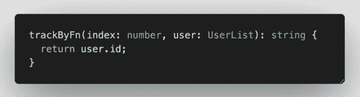

# 角度性能检查 2022:你不想错过这个

> 原文：<https://javascript.plainenglish.io/angular-performance-check-2022-you-dont-want-to-miss-out-on-this-1e0f70008098?source=collection_archive---------6----------------------->

## 是时候在慢下来之前对你的角度应用性能做一次常规检查了💩堆积起来并引发火灾🔥！

# 1.更改检测:onPush v.s. onDefault

我们将从查看将组件的**变更检测**策略从`OnDefault`变更为`OnPush`开始。默认情况下，当您使用 **Angular CLI** 创建组件时，默认的 **changeDetection** 策略将是`OnDefault`，这将使您的 DOM 在该组件中的数据发生变化时进行更新。角度检查组件树中的更改。因此，如果您的父元素或根元素发生变化，它将触发其子组件和孙组件的 DOM 更新。

您可以将您的组件 **changeDetection** 策略更新为`OnPush`，这样 Angular 将只在您调用它时检查和更新 DOM。

将***changeedetorref***注入到您的组件构造函数中，调用***markForCheck()***方法，强制您的组件及其下的子组件检查变更，并相应地更新 DOM。此外，如果在这个父/根组件的组件树中有不需要 DOM 更新而不管数据变化的子组件(哑组件)，您可以选择通过使用 **detach()** 方法从组件中分离 **changeDetector** 。

Injecting changeDetectorRef to your component

Call detach() method in constructor to detach your component from change detection

这个小小的改变可以让你节省大量的内存，优化组件的重新渲染周期。

# 2.将 trackBy 与*ngFor 一起使用

指令帮助我们在角度模板中迭代数组。但是，每次数组更新或更改时，整个 DOM 树都会重新呈现，这可能会带来潜在的性能损失。为了让 Angular 知道你只需要重新渲染特定的 DOM 而不是 **ngFor** 使用的整个 DOM 树，我们可以使用 ***trackBy*** 来优化我们的 **ngFor** 循环性能。

Typical trackByFunction for ngFor loops

Add trackBy method next to the array with semi-colon separator

# 3.使用延迟加载策略

惰性加载组件/页面有助于保持您的 Angular 应用程序第一次加载时负载较轻， ***只加载用户当前在*** 上的那些页面。它优化了 web 应用程序的加载速度，并为您的用户提供了更好的 UX。一旦您模块化了您的特性/页面，您就可以利用延迟加载的能力来优化您的应用程序加载时间和性能。你可以在如下所示的***app-routing . module . ts***文件中设置你的懒加载。

Lazy loading from app-routing file

请注意，延迟加载不只是在应用程序路由文件中工作。只要您的项目中有适当的嵌套结构，它也可以在后续的子路由文件中工作。这对于从事微前端工作的大型开发团队来说尤其受欢迎。每个团队在项目的一个模块上工作，将他们的页面模块化，并在一个模块中的嵌套子路由文件中延迟加载它们。

更多关于角度惰性加载的信息，请访问官方文档。

 [## 有角的

### Angular 是一个构建移动和桌面 web 应用程序的平台。加入数百万开发者的社区…

angular.io](https://angular.io/guide/lazy-loading-ngmodules) 

# 4.对于长数据集列表，使用虚拟滚动或无限滚动或分页

您是否有一长串需要向管理员用户或客户显示的项目？您的浏览器在您的 web 应用程序中呈现 100 多个 DOM 项目是否需要太长时间？是时候考虑在你的 web 应用中使用虚拟滚动或无限滚动策略了。虚拟和无限滚动有助于在浏览器中重用和回收 DOM 元素，以显示用户可查看的项目。列表中隐藏的项目不会出现在 DOM 中，因此有助于节省 web 应用程序的渲染时间。这些策略有助于优化在给定的长项目列表中向用户显示的 DOM 元素的数量，并且不会呈现列表中那些在滚动时不在视图中的项目。我不会用这里的细节来烦你。

使用[角材](https://material.angular.io/cdk/scrolling/overview)或 [ngx-virtual-scroll](https://www.npmjs.com/package/ngx-virtual-scroller) 可以了解更多关于虚拟滚动的信息。使用 [ngx-infinite-scroll](https://www.npmjs.com/package/ngx-infinite-scroll) 可以找到更多关于无限滚动的信息。或者，你可以浏览下面的网站，找到更多的插件和工具来优化你的滚动项目列表。

 [## 2022 年 10 大最佳角度无限卷轴库| Openbase

### 2022 年 10 大最佳角度无限卷轴库对比:ngx-scrollspy，ng2-scrollspy，od-virtualscroll…

openbase.com](https://openbase.com/categories/js/best-angular-infinite-scroll-libraries) 

# 5.优化捆绑和预加载

正如我在第三点中提到的，延迟加载模块有助于加快应用程序的加载时间，因为我们将应用程序分成多个包，只有在与它们交互时才延迟加载它们。然而，这种策略的一个缺点是，当用户导航到一个延迟加载的模块时，如果模块很大，可能需要一些时间来加载该模块。

为了进一步优化页面加载，您可以选择**预加载**延迟加载的模块，这样当您想要呈现延迟加载的功能模块时，导航就变得即时了。**当用户与应用程序的当前模块/页面交互时，预加载**在后台完成。这可以通过将**预加载策略**至**预加载所有模块**设置为:

add preloadingStrategy declaration in RouterModule.forRoot()

在加载时，所有的延迟加载模块将在您的第一个画图模块加载后在后台加载，当您想要加载其他功能模块时，您将获得更快的页面加载和即时导航。这甚至可以通过创建您自己的定制**预加载策略**来进一步优化，如下图[所示](https://vsavkin.com/angular-router-preloading-modules-ba3c75e424cb)在应用程序初始化时仅加载路线的子集。

# 摘要

希望这篇文章能让你对如何检查你的 Angular 应用程序的性能有所了解。使用上面强调的这几个点来确定你的组件或页面的瓶颈，并从那里优化它，使你的 Angular 应用程序再次快速和高性能！💯

如果你有其他有助于优化角度应用的性能检查，请在下面的评论中告诉我。我也很想了解一下。干杯！

 [## 用我的推荐链接- DevJo 加入媒体

### 作为一个媒体会员，你的会员费的一部分会给你阅读的作家，你可以完全接触到每一个故事…

medium.com](https://medium.com/@devjo/membership) 

*更多内容请看*[***plain English . io***](https://plainenglish.io/)*。报名参加我们的* [***免费周报***](http://newsletter.plainenglish.io/) *。关注我们关于*[***Twitter***](https://twitter.com/inPlainEngHQ)*和*[***LinkedIn***](https://www.linkedin.com/company/inplainenglish/)*。加入我们的* [***社区不和谐***](https://discord.gg/GtDtUAvyhW) *。*