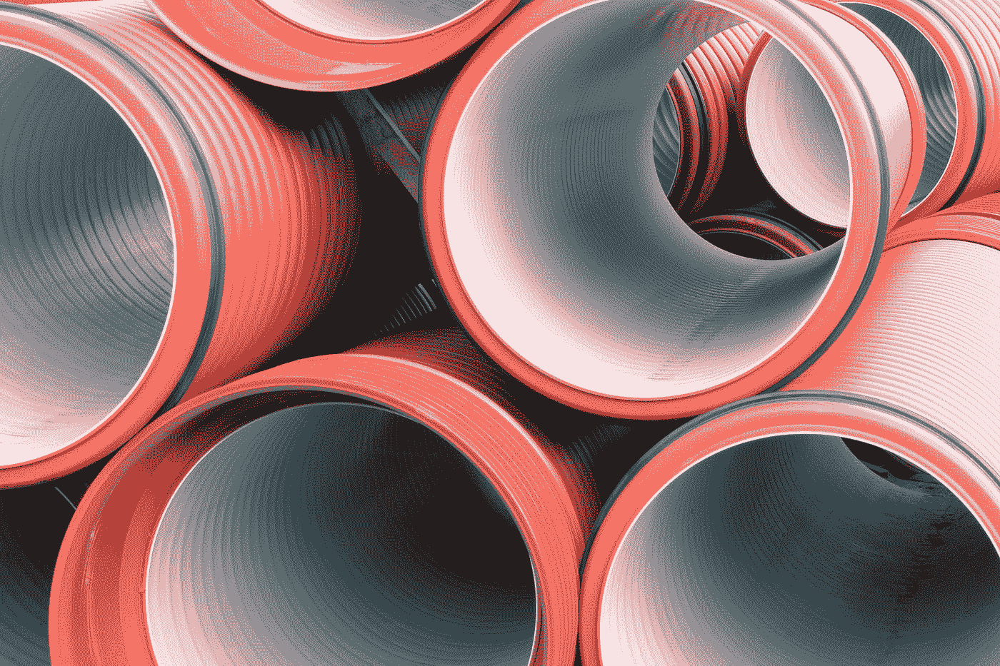
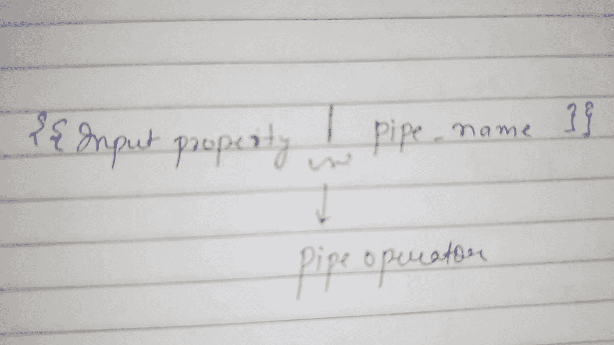
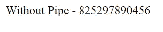
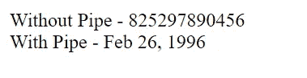
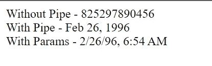
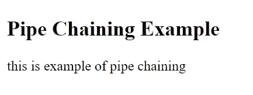
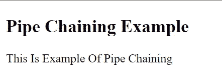

# 简化的角形管道

> 原文：<https://javascript.plainenglish.io/angular-pipes-simplified-41ec4e1711f3?source=collection_archive---------8----------------------->

## 第 1 部分:基础知识



Photo by [Pawel Czerwinski](https://unsplash.com/@pawel_czerwinski?utm_source=medium&utm_medium=referral) on [Unsplash](https://unsplash.com?utm_source=medium&utm_medium=referral)

如果您一直在与 Angular 合作，那么您一定听说过并使用过这些管道。今天，在本教程中，我们将简化什么是管道，为什么要使用管道以及如何使用管道。

为了简单起见，我们将管道分为两部分。在今天的部分中，我们将对它们进行基本介绍，并了解如何使用角形内置管道。在下一部分中，我们将更多地研究定制管道。

## ***什么是管道，为什么要用管道？***

管道用于将数据转换成更加用户友好和可读的格式。

例如，假设有一个日期以纪元格式如 1652947314 存储在数据库中。现在，如果我们按原样显示这些数据，对用户来说没有任何意义。因此，将这个日期转换成用户友好的格式是我们使用管道的原因。

> **重要提示——管道仅出于可视化目的改变数据，但对被操作的属性值没有影响。**

## ***如何使用管道？***

使用管道的基本语法是—



Pipe Syntax

以上面讨论的例子为例，假设我们从服务端获得一个时间作为响应——825297890456，并且需要在视图中显示该时间。

如果我们进行普通的属性绑定，输出将如下所示:

```
.ts 
export class AppComponent {timeKey = 825297890456;}.html
<span>{{timeKey}}</span>
```



Without Pipe

从用户的角度来看，这些只是随机数，不会有任何意义。为了使它更具可读性，我们可以使用有角度的内置管道“date ”,如下面的代码片段所示

```
<span>Without Pipe - {{timeKey}}</span><br><span>With Pipe - {{timeKey | date}}</span>
```



With Pipe

这对用户来说更有意义。此外，我们可以看到 timeKey 属性保持不变，从不带管道的值可以明显看出这一点。

## ***管道的附加参数***

我们还可以使用冒号向管道传递额外的参数，即`:`。让我们看看下面的片段，让它更清楚。

```
<span>Without Pipe - {{timeKey}}</span><br><span>With Pipe - {{timeKey | date}}</span><br><span>With Params - {{timeKey | date : 'short'}}</span>
```

现在，你可以看到在`:`之后，我们提供了一个额外的参数`‘short’`(Angular 的内置参数)，它将日期转换为“M/d/yy，h:mm a”的格式。



Pipe with Params

你可以在这里找到角形内置管道[的完整列表。](https://angular.io/api?type=pipe)

## ***管道链接***

在使用管道时，另一个非常有用的重要概念是链接，即我们可以将一个管道执行的输出提供给下一个管道，依此类推，HTML 中的结果是我们在最后一个管道执行后得到的结果。

看看下面的例子——

```
.ts
export class AppComponent {pipeChainingString = 'THIS IS EXAMPLE OF PIPE CHAINING';} .html<h2>Pipe Chaining Example</h2><span>{{pipeChainingString | lowercase}}</span>
```

输出:



这是一个简单管道实现的例子，其中完整的字符串被转换为小写。

让我们在这里使用链接。

```
<span>{{pipeChainingString | lowercase | titlecase }}</span>
```

这里，第一个`lowercase`将把整个字符串转换成小写，同样的输入被提供给`titlecase`管道，管道反过来只把第一个字符转换成大写，如下所示



Pipe Chaining

所以，简而言之，这就是关于 pipe 以及如何使用内置 pipe 的基础知识。

如果您有任何疑问或顾虑，请在回复部分告诉我。

关于我——我是一个编程爱好者，喜欢阅读和写作前端设计、JavaScript 和 UI/UX 相关的东西。点击[这里](https://medium.com/@avinash.dev21987)阅读我所有的文章，并让我知道你的反馈。

*更多内容看* [***说白了就是***](https://plainenglish.io/) *。报名参加我们的* [***免费周报***](http://newsletter.plainenglish.io/) *。关注我们关于*[***Twitter***](https://twitter.com/inPlainEngHQ)*和*[***LinkedIn***](https://www.linkedin.com/company/inplainenglish/)*。查看我们的* [***社区不和谐***](https://discord.gg/GtDtUAvyhW) *加入我们的* [***人才集体***](https://inplainenglish.pallet.com/talent/welcome) *。*