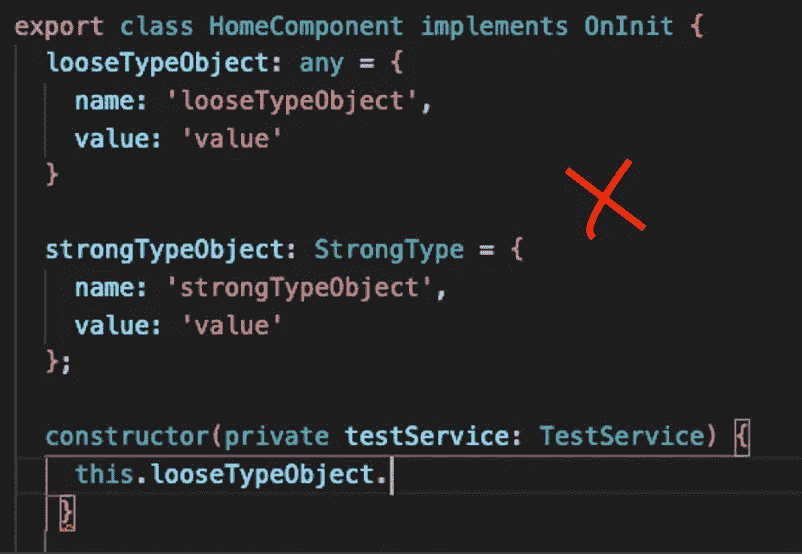

# 没人谈论的 2022 年的棱角练习

> 原文：<https://javascript.plainenglish.io/angular-practices-2022-that-no-one-talks-about-3fe483bf4bfc?source=collection_archive---------0----------------------->

## 不要忽视这些人们很少谈论的关于棱角分明的事情。上车出发吧！🏃🏼🏃🏼‍♀️🏃🏼‍♂️

# 1.使用管道而不是函数来防止不必要的重新渲染

Angular 模板绑定太棒了，你可以绑定变量，也可以绑定它的模板。你们中的许多人和我一样，使用函数调用来转换数据，因为它方便且易于实现。

看上面这个简单的例子，你不会注意到任何不同。但是您知道吗，每次检测到变化时都会调用函数调用，但是只有当输入值发生变化时才会调用管道。我不会过多地谈论这个问题。下面的链接是 Angular 拥有的生命周期钩子的数量，想象你的函数在每个生命周期钩子被调用，那将是一个完全的噩梦。所以，除非你知道你真正在做什么，否则请避免在你的模板中调用函数，相反，总是选择创建你自己的定制的纯管道来处理数据转换。

 [## 有角的

### Angular 是一个构建移动和桌面 web 应用程序的平台。加入数百万开发者的社区…

angular.io](https://angular.io/guide/lifecycle-hooks) 

# 2.基于您的应用程序在不同的级别注入服务

默认情况下，当我们使用`Angular CLI`为我们的应用程序创建服务时，所创建的服务是在根级别提供的。

注意到**@ injectible**decorator 拥有**提供的对象:“root”。**这意味着 Angular 为您创建了该服务的一个实例，供您在整个应用程序中使用。您可以将它注入到任何需要使用该服务的类组件中。

但是，如果您希望应用程序的不同模块中该服务的一个单独实例拥有不同的状态和逻辑，您可以选择移除提供的**:' root '**并在模块级别注册该服务(例如 main.module.ts，feature.module.ts)，这样每个模块都拥有该服务的一个新实例。

此外，如果您真的需要将它分离到组件级，这样每个组件都使用服务的一个新实例，您可以选择在组件级注册它。

# 3.避免嵌套订阅—改用 switchMap

在开发过程中，我们经常需要第一个 API 的响应来调用下一个 API，以获取一些需要在应用程序中显示的其他数据。许多人通常采用的方法如下。

这个实现并没有什么问题。但这实际上会带回过去的好时光😈如果您有许多相互依赖的订阅结果。这也产生了订阅管理问题。

更好的方法是使用 RxJS switchMap 方法。😎

这种方法防止了`callback hell`，你可以实现多个 switchMap 并将它们链接在一起。使用这个实现的另一个好处是 switchMap 将自动取消订阅以前的内部可观察对象。我会留下下面的链接，让你探索更多。

 [## 开关图

### switchMap 一次只维护一个内部订阅，这在

www.learnrxjs.io](https://www.learnrxjs.io/learn-rxjs/operators/transformation/switchmap) 

# 4.避免使用 any 类型，使用接口并声明变量类型

Angular 使用 TypeScript 而不是传统的 JavaScript 有一个明显的原因。不要因为没有对变量、对象和数组进行强类型化而让 Angular 团队失望。此外，为变量创建强类型接口有助于 IDE 为您提供静态类型检查和智能感知支持。

No IntelliSense support

IntelliSense support

您可以通过在类外部的组件文件中创建一个接口来轻松地强类型化您的对象，或者您可以创建一个`model.ts`文件来保存您的所有接口并分别导出它们，然后将它们导入到您的组件文件中。

# 5.缓存 API 调用不经常改变的响应

在我们的应用程序中，总有一些 API 在第一次加载后不会经常改变，但是这些信息在不同的模块和组件中使用。您可以使用 RxJS ShareReplay 实现缓存，而不是将其存储在变量中或多次调用同一个 API。

而不是多次调用这个 API。❌

您可以这样做，并在您的服务中缓存这个可观察值。✅

在您的服务中创建一个`getStaticData`基本函数，在您的构造函数中调用它一次以获取一次信息，您的组件可以继续多次调用函数`getCustomerInfoWithCache`，它不会触发对您的服务器的任何 API 调用，但会获得您在服务类中的构造函数中调用的缓存可见性。我将把下面的链接留给你去阅读更多的相关内容。

 [## 共享重播

### 当你有副作用或繁重的计算，你不希望在多个…

www.learnrxjs.io](https://www.learnrxjs.io/learn-rxjs/operators/multicasting/sharereplay) 

# 摘要

希望这篇文章能让你更好地构建更好、更优化的角度应用。我真的相信，只要我们持之以恒，小小的改变总会产生巨大的影响。这同样适用于这里，当我们一次一点点地重构我们的应用程序时，随着时间的推移，你的应用程序将会加速并变得更有性能。

如果你有其他没有人谈论的关于 Angular 的建议，请在下面的评论中告诉我。我很想谈谈这件事。干杯。

 [## 用我的推荐链接- DevJo 加入媒体

### 作为一个媒体会员，你的会员费的一部分会给你阅读的作家，你可以完全接触到每一个故事…

medium.com](https://medium.com/@devjo/membership) 

*更多内容请看*[***plain English . io***](https://plainenglish.io/)*。报名参加我们的* [***免费周报***](http://newsletter.plainenglish.io/) *。关注我们关于*[***Twitter***](https://twitter.com/inPlainEngHQ)*和*[***LinkedIn***](https://www.linkedin.com/company/inplainenglish/)*。加入我们的* [***社区不和谐***](https://discord.gg/GtDtUAvyhW) *。*