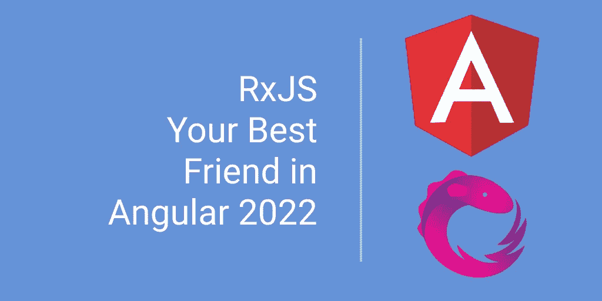
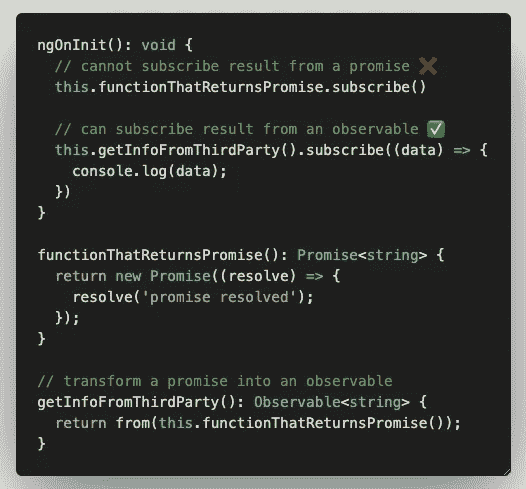
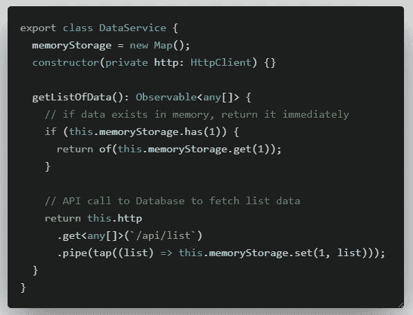
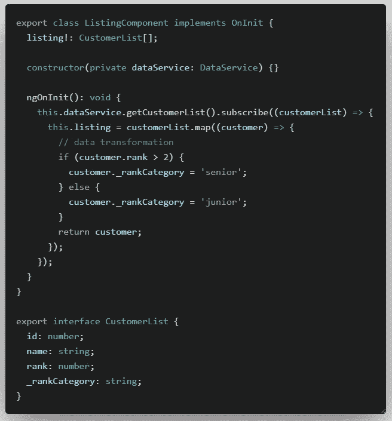
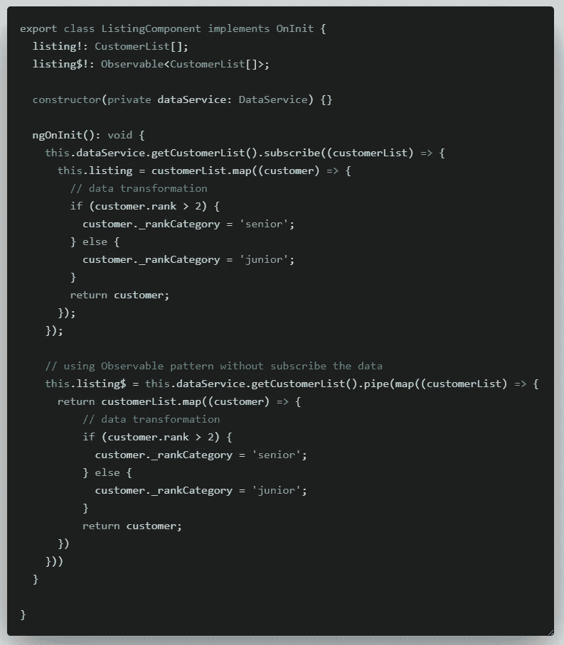
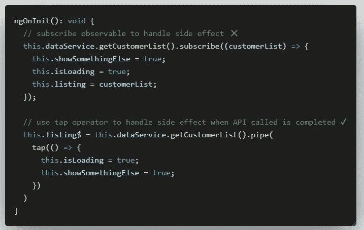
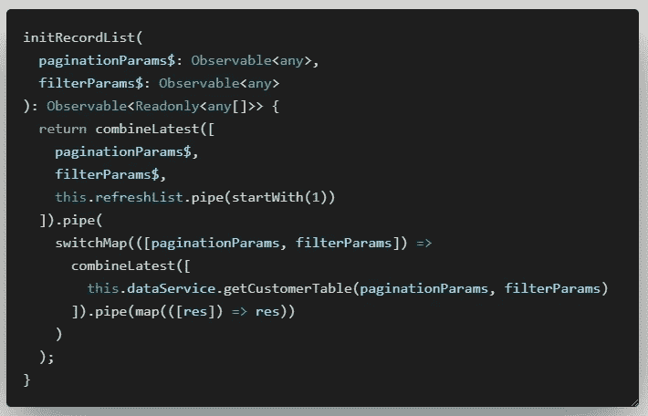
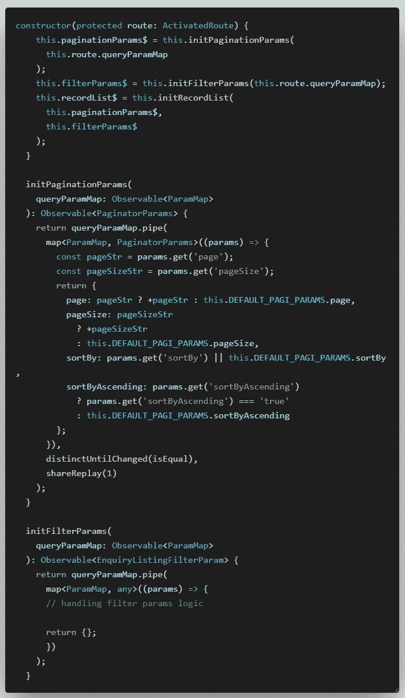
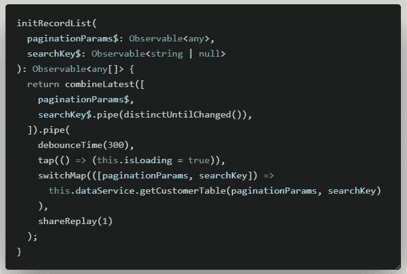
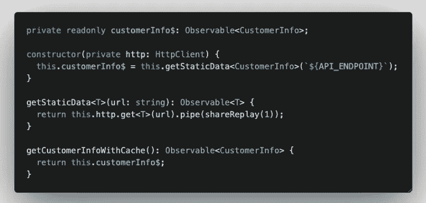

# 遇见 RxJS:2022 年你在 Angular 最好的朋友

> 原文：<https://javascript.plainenglish.io/angular-rxjs-dont-let-it-be-your-enemy-make-it-your-best-friend-22e90640d0c1?source=collection_archive---------1----------------------->

## 详细查看最常用的 RxJS 运算符。

如果你一直在使用 Angular，你会知道 Angular 在使用可观察模式和在其框架中采用反应式 JavaScript (RxJS)来构建高性能和反应式前端应用程序方面非常强大。今天，我将向您介绍一些最常用的 RxJS 运算符，希望您能够接受 RxJS，并能够使用其中一些运算符优化您的应用程序。

# 从

Angular **HttpClient** 返回我们发出的 HTTP 调用的可观察值，但是，如果您有返回承诺的第三方服务，请不要担心。您可以使用 RxJS `from`运算符将承诺转化为可观察的结果。通过将其转换为可观察的，您可以直接使用模板中的异步管道来显示可观察的值。

 [## 从

### 编辑描述

www.learnrxjs.io](https://www.learnrxjs.io/learn-rxjs/operators/creation/from) 

# 关于

有时，您有一个 JavaScript **映射**，它在内存中保存值，以防止过多的 API 调用。您将编写一个额外的方法或进行特殊的处理，以使用来自 Observable 和 JavaScript **Map** 的数据，您之前已经在其中存储了这些数据。然而，您实际上可以使用`of`操作符将一个值(字符串、对象、数字、数组等)转换成一个可观察值。通过这种方式，与您解析 API 调用可观察值的方式相同，您可以将它应用于`of`操作符的返回值。

 [## 关于

### 在序列中发出可变数量的值，然后发出完整的通知。

www.learnrxjs.io](https://www.learnrxjs.io/learn-rxjs/operators/creation/of) 

# 地图

你是不是也犯了下面的方法？🤔

你知道吗，你可以在不订阅的情况下从一个传入的可观测数据进行数据转换？

只需使用`pipe`，就可以在管道参数内部链接多个操作符。为了将数据从一个可观察对象中转换出来，我们可以使用`map`操作符，并在其中运行您的转换实现。现在使用这个方法，您不需要订阅或取消订阅这个可观察对象，您只需要使用模板中的异步管道来显示转换后的值。

 [## 地图

### 开始使用贴图、拾取和贴图到变换流

www.learnrxjs.io](https://www.learnrxjs.io/learn-rxjs/operators/transformation/map) 

# 轻敲，水龙头

当一个 API 调用完成时，需要切换一个布尔值或者触发一个主题或者在日志文件中记录一条记录吗？尝试使用`tap`操作符和 breeze 处理副作用，无需订阅。

 [## 点击/执行

### 编辑描述

www.learnrxjs.io](https://www.learnrxjs.io/learn-rxjs/operators/utility/do) 

# 组合最新测试

当过滤器参数或分页参数改变时，消除处理多个主题/观察值以触发数据表刷新的麻烦。将它们变成可观察的，并使用`combinedLatest`操作符在一个函数中处理它们。

分页或过滤器参数的任何更改都将触发并重新获取最新数据。`refreshList`如果你的表有一个刷新图标，允许用户手动刷新列表，则可以触发主题。

**快速提示**将常规分页和过滤对象转换为可观察对象。使用 **Angular 的** `ActivatedRoute`将分页和过滤参数初始化为可观察值。

如果您没有使用 **queryParams** ，您也可以使用本文中提到的方法将分页对象转换成可观察对象。

 [## 组合测试

### 组合测试抓到你了，因为不会有输出和错误，但你的一个(或多个)内部观察值可能不会…

www.learnrxjs.io](https://www.learnrxjs.io/learn-rxjs/operators/combination/combinelatest) 

# 去抖时间

这个神奇的操作符`debounceTime`可以帮助你设置用户停止输入和用文本框中的输入字符串调用 API 之间的延迟。它有助于防止每次击键都调用 API。这里的一个小技巧是为您的搜索关键字参数创建一个**主题**,并使用前面讨论过的`combinedLatest`操作符来创建一个完美的可搜索列表，而不改变数据。

 [## 去抖时间

### 丢弃输出间隔时间小于指定时间的发出值

www.learnrxjs.io](https://www.learnrxjs.io/learn-rxjs/operators/filtering/debouncetime) 

# **区分时间变化**

在前面的例子中，您会看到这个操作符。这是作为一个额外的过滤层添加的，这样只有当主体中的值发生变化时，可观察对象才会触发。默认情况下，它只对基本类型使用`===`比较。比较对象属性时，可以使用`distinctUntilKeyChanged`运算符。

 [## distinctUntilChanged

### 仅在当前值不同于上一个值时发出。

www.learnrxjs.io](https://www.learnrxjs.io/learn-rxjs/operators/filtering/distinctuntilchanged) 

# 共享重播

在我看来，最容易被忽视的操作符之一就是`shareReplay`操作符。当有多个订户访问同一个可观察对象时，它有助于重放最后发出的值。一个常见的用例是，当您的应用程序中有不需要从数据库中重新获取的静态数据时，您可以部署这个操作符，以便在浏览器会话的整个生命周期中只进行一次 API 调用。

在您的服务中创建一个`getStaticData`基本函数，并在您的构造函数中调用它一次以获取一次信息，您的组件可以继续多次调用函数`getCustomerInfoWithCache`,它不会触发对您的服务器的任何 API 调用，但会获得您在服务类中的构造函数中调用的缓存可观察值。

 [## 共享重播

### 当你有副作用或繁重的计算，你不希望在多个…

www.learnrxjs.io](https://www.learnrxjs.io/learn-rxjs/operators/multicasting/sharereplay) 

# 摘要

希望这篇文章向你展示了 **RxJS** 如何成为你的角度应用的**游戏规则改变者**。学习曲线可能很陡，但是一旦你掌握了它并完全接受了它，你就再也不会回到编写 Angular 应用程序的基本方法上去了！请在下面的评论中告诉我你最喜欢的 **RxJS** 操作符是哪一个，以及你是如何在你的 Angular 应用中实现它的。我很想了解一下。干杯。

 [## 用我的推荐链接- DevJo 加入媒体

### 作为一个媒体会员，你的会员费的一部分会给你阅读的作家，你可以完全接触到每一个故事…

medium.com](https://medium.com/@devjo/membership) 

*更多内容看* [***说白了。报名参加我们的***](https://plainenglish.io/) **[***免费周报***](http://newsletter.plainenglish.io/) *。关注我们关于*[***Twitter***](https://twitter.com/inPlainEngHQ)*和*[***LinkedIn***](https://www.linkedin.com/company/inplainenglish/)*。加入我们的* [***社区***](https://discord.gg/GtDtUAvyhW) *。***