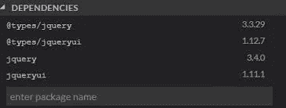

# Angular:在 StackBlitz 项目中设置 jQuery，没有任何错误

> 原文：<https://javascript.plainenglish.io/angular-setting-up-jquery-in-your-stackblitz-project-without-any-errors-baf4ef0d88f8?source=collection_archive---------11----------------------->

## 关于在 StackBlitz 项目中正确设置 jQuery 的分步指南。



在 Stackblitz 中安装 jQuery 非常简单，但是让它工作起来却是一项艰巨的任务。Stackblitz 节省了创建项目、安装模块和运行项目的大量时间。

我在本文中列出的这 4 个步骤(甚至是其中的一个)可以为您在 Stackblitz 中设置 jQuery 节省大量时间。

1.  同时安装 **jquery 和@types/jquery** 。

确保将这两个库都添加到**包中。**

```
“**jquery**”: “^3.6.0”,
“**@types/jquery**”: “3.5.5”,
```

2.将 jQuery JS 文件路径添加到 **angular.json** 的**构建**部分下的**脚本**子部分

```
“scripts”: [**“node_modules/jquery/dist/jquery.min.js”**]
```

3.确保在 **tsconfig.json** 中有 **"esModuleInterop": true** 。

```
{
“compileOnSave”: false,
“compilerOptions”: {
“baseUrl”: “./”,
“outDir”: “./dist/out-tsc”,
“sourceMap”: true,
“declaration”: false,
“downlevelIteration”: true,
“experimentalDecorators”: true,
**“esModuleInterop”: true,** “module”: “esnext”,
“moduleResolution”: “node”,
“importHelpers”: true,
“target”: “es2015”,
“typeRoots”: [
“node_modules/@types”
],
“lib”: [
“es2018”,
“dom”
]
},
“angularCompilerOptions”: {
“enableIvy”: false,
“fullTemplateTypeCheck”: true,
“strictInjectionParameters”: true
}
}
```

4.最后**将 jQuery 导入到组件**中，并根据需要使用它:)

```
import { Component } from ‘@angular/core’;
**import $ from ‘jquery’;**@Component({
selector: ‘my-app’,
templateUrl: ‘./app.component.html’,
styleUrls: [‘./app.component.css’],
})export class **AppComponent** {
**ngOnInit() {
console.log($(‘select’));
}**
}
```

现在你知道了。感谢您的阅读。

*更多内容请看* [***说白了就是***](https://plainenglish.io/) *。报名参加我们的* [***免费每周简讯***](http://newsletter.plainenglish.io/) *。关注我们* [***推特***](https://twitter.com/inPlainEngHQ) *和**[***LinkedIn***](https://www.linkedin.com/company/inplainenglish/)*。加入我们的* [***社区不和谐***](https://discord.gg/GtDtUAvyhW) *。**