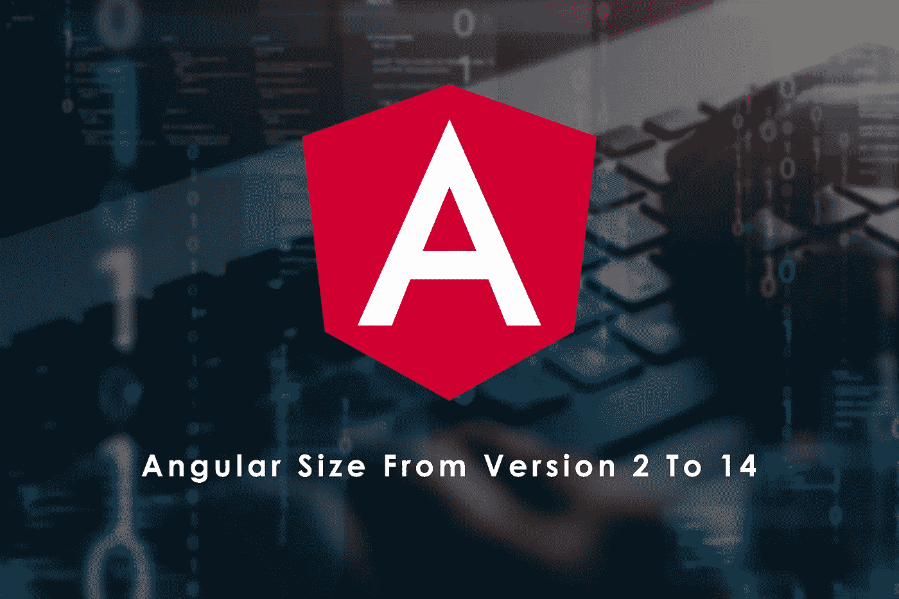

# 从版本 2 到 14 的角度尺寸

> 原文：<https://javascript.plainenglish.io/angular-size-from-version-2-to-14-23858d708914?source=collection_archive---------0----------------------->



您是否曾想过，与当前版本相比，Angular 2 的表现如何，或者说，在 Ivy 之前，Angular 2 的表现如何？在本文中，我将向您展示一个简单的 hello world 应用程序的构建时间，该应用程序是用 Angular 从版本 2 到版本 14 构建的。

# 让我们从数据本身开始

```
+=================+============+===============+================+
|     Version     | build time | Transfer size | Resources size |
+=================+============+===============+================+
| Angular 2       | 8426ms     | 106 KB        | 443 KB         |
+-----------------+------------+---------------+----------------+
| Angular 4       | 8000ms     | 84 KB         | 295 KB         |
+-----------------+------------+---------------+----------------+
| Angular 5       | 14749ms    | 68 KB         | 223 KB         |
+-----------------+------------+---------------+----------------+
| Angular 6       | 12761ms    | 73.4 KB       | 239 KB         |
+-----------------+------------+---------------+----------------+
| Angular 7       | 13081ms    | 61.5 KB       | 203 KB         |
+-----------------+------------+---------------+----------------+
| Angular 8       | 18910ms    | 58.4 KB       | 176 KB         |
+-----------------+------------+---------------+----------------+
| Angular 9       | 12443ms    | 50.6 KB       | 146 KB         |
+-----------------+------------+---------------+----------------+
| Angular 10      | 10045ms    | 49.2 KB       | 143 KB         |
+-----------------+------------+---------------+----------------+
| Angular 11      | 9874ms     | 48.6 KB       | 141 KB         |
+-----------------+------------+---------------+----------------+
| Angular 12      | 9132ms     | 49.7 KB       | 141 KB         |
+-----------------+------------+---------------+----------------+
| Angular 13      | 4104ms     | 45.4 KB       | 124 KB         |
+-----------------+------------+---------------+----------------+
| Angular 14      | 4606ms     | 45.3 KB       | 124 KB         |
+-----------------+------------+---------------+----------------+
| Angular 14 (SA) | 4815ms     | 43.7 KB       | 118 KB         |
+-----------------+------------+---------------+----------------+
```

> 注 1:没有发布 Angular 3，这就是它在这里丢失的原因
> 
> 注 2:最后一个(SA)为独立组件，无`NgModule`；如果您想了解更多信息，请阅读我的另一篇文章:[先看看独立组件:超出模块的角度](/first-look-at-standalone-components-angular-beyond-ngmodules-6360d30fca0d)。

# 见解很少

您可以看到尺寸一直在减小(除了角度 6)。

角度 4 (33%)的降幅最大。

在试图优化代码时，构建时间变得越来越长，但是从 Angular 13 开始，它改进了很多(55%)——主要是因为缓存——同时也减少了大小(9%)。

移除`*NgModule*` *对于资源大小减少 4%* 的规模(至少目前)没有多大好处，但对于实际数据传输来说只有 1.6%，同时会增加构建时间。

# 它是如何完成的？

你可能想知道它是如何完成的，如果回答这个问题很复杂，我会解释整个过程

我首先使用了一个 [npx](https://www.npmjs.com/package/npx) 包来指定使用哪个版本的[@ angle/CLI](https://www.npmjs.com/package/@angular/cli)例如，为了生成 Angular 10 版本，我运行了:

```
npx @angular/cli@10 new ng10
```

但这并不总是现成的，例如，Angular 2 CLI(实际上是版本 1.0 到 1.5，然后是 6.0)不够稳定，使用时会生成 Angular 5，所以我不得不降级版本，使其成为 Angular 2。

此外，旧的 Angular 版本需要旧的 Node 版本，我使用了 [nvm](https://github.com/nvm-sh/nvm) 来让它工作。

我在旧版本(在 Angular 6 之前)中遇到了一些错误，这让我非常欣赏 Angular CLI 的当前版本。

如果您想在这里查看代码并使用它:

 [## git hub-robertiaac/ng-size:从版本 2 到版本 14 的角度默认项目

### 您现在不能执行该操作。您使用另一个选项卡或窗口登录。您在另一个选项卡上注销，或者…

github.com](https://github.com/robertIsaac/ng-size) 

*更多内容请看*[***plain English . io***](https://plainenglish.io/)*。报名参加我们的* [***免费周报***](http://newsletter.plainenglish.io/) *。关注我们关于*[***Twitter***](https://twitter.com/inPlainEngHQ)[***LinkedIn***](https://www.linkedin.com/company/inplainenglish/)*[***YouTube***](https://www.youtube.com/channel/UCtipWUghju290NWcn8jhyAw)***，以及****[***不和***](https://discord.gg/GtDtUAvyhW) *对成长黑客感兴趣？检查* [***电路***](https://circuit.ooo/) ***。*****