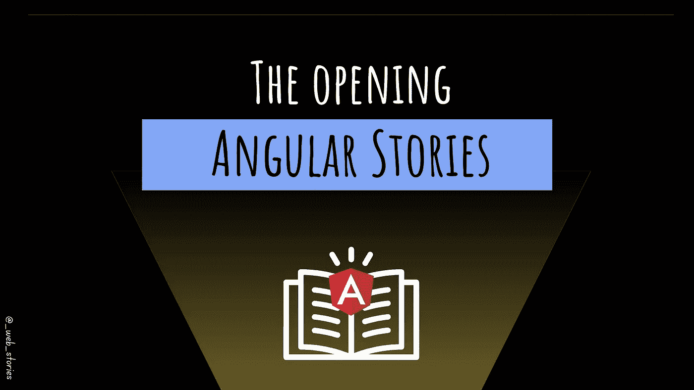

# 棱角分明的故事…开场！

> 原文：<https://javascript.plainenglish.io/angular-stories-the-opening-c44d6341e8f3?source=collection_archive---------9----------------------->

## 学习有史以来最好的前端框架之一！

By FAM

## 你好👋

**首先，我要感谢** [**菲尔科特**](https://medium.com/u/b057f495b12?source=post_page-----c44d6341e8f3--------------------------------) **对我的信任和成为我新推荐的会员。欢迎来到你的*作家*冒险。如有任何问题，请通过 LinkedIn 联系我😉**

这是 [2022 网络节目](https://medium.com/geekculture/2022-web-program-is-launched-f38a3280af1a)角度篇的开篇文章。本文将给出本章路线图的总体思路。

Angular 是最流行的前端框架之一。这个框架是大型应用程序的完整解决方案。例如，与 React 的学习曲线相比，学习这个框架并不快。这就是为什么与我们在本课程中学习的其他章节相比，本章将花费更多时间的原因。

众所周知，Angular 很难学。这一章将是一个温和的路线图，有许多 Angular 的故事，会让你对 Angular 感到舒服，为什么不成为 Angular 的开发者呢？

# 这是路线图！

[**直升机视角的角度**](https://medium.com/geekculture/helicopter-view-of-angular-636d52994b77)

**Angular 基础**
→[Angular js vs Angular](https://medium.com/geekculture/helicopter-view-of-angular-636d52994b77#1ce5)
→[设置环境](https://famzil.medium.com/vv-how-to-set-up-local-angular-environment-4d6e0cec48ed?source=your_stories_page-------------------------------------)
→ [架构概述](https://medium.com/geekculture/angular-architectural-overview-94d41edd32d1?source=your_stories_page-------------------------------------)
→ [一个 Angular app 如何启动？](https://famzil.medium.com/how-does-an-angular-app-start-f7032e5655bb?source=your_stories_page-------------------------------------)

**角形构件**
→ [角形构件构图](https://medium.com/gitconnected/angular-component-composition-eb292aad1f3d?source=your_stories_page-------------------------------------)
→ [角形构件挂钩](https://medium.com/geekculture/angular-component-hooks-6fa0d9279d60?source=your_stories_page-------------------------------------)
→ [角形构件类型](https://medium.com/geekculture/angular-component-types-4b9c57877639?source=your_stories_page-------------------------------------)
→ [创建角形构件的正确方法！](https://medium.com/javascript-in-plain-english/the-right-way-to-create-angular-components-69228c5cc0fd?source=your_stories_page-------------------------------------)

**角度模板**
→插值
→属性绑定
→事件绑定
→ #ref 变量

**角度渲染**
→结构指令`*ngIf`、`*ngFor`、`*ngClass`、…等

**角度表单**
→模板驱动表单
→反应式表单
→动态表单

**角度服务**
→ HTTP
→拦截器

**角度生命周期挂钩**

**角度路线和防护装置**

**高级角度:**
→自定义指令
→自定义管道
→模块
→惰性加载
→ DI
→区域
→ App 状态管理
→编译系统

**角度测试**
→管道
→依赖服务
→组件绑定
→指令
→组件模板

**设计角度 app**

**角度 app 指标**

下一篇文章再见，请继续关注😉

今天就到这里，看阿雅🙋

如果您有任何问题或反馈，请点击评论或通过 LinkedIn 联系我— **我洗耳恭听！**

[**想请我喝咖啡吗？☕️**](https://www.buymeacoffee.com/fatimaamzil)

> 让我们为 2022 年打造一个更好的‘我们’！

## 了解有关 2022 年网络快车计划的更多信息:

I- [通用网络知识](https://medium.com/geekculture/2022-web-program-chapter-n-1-is-done-499fb0707220?source=your_stories_page----------------------------------------)

[II-网页框架:HTML](https://famzil.medium.com/your-html-essentials-69d9b2349355?source=your_stories_page----------------------------------------)

[III-网页样式:CSS](https://medium.com/geekculture/recap-of-the-css-chapter-ae388d51e564?source=your_stories_page----------------------------------------)

[IV-网络互动:JavaScript](https://levelup.gitconnected.com/congrats-to-js-chapter-finishers-e38a3ca1612c)

[V- BOM & DOM](http://8c48)

[VI- Web 性能](/my-web-articles-roadmap-for-2022-20387cab9b07#e71b)

[VII-工具](https://famzil.medium.com/6-essential-frontend-tools-a95995f85eee?source=your_stories_page-------------------------------------)

## VIII-角形

*   …

 [## 2022 网络计划启动！

### 改变来自心态和习惯

medium.com](https://medium.com/geekculture/2022-web-program-is-launched-f38a3280af1a) 

与想成为 web 开发人员的人分享该程序！这将有助于保持进步，并在旅途中互相帮助。

> 如果你喜欢我的文章， [**订阅**](https://famzil.medium.com/subscribe) 获取我的最新。如果你自己喜欢体验媒介，可以考虑通过[**注册会员**](https://famzil.medium.com/membership) 来支持我和其他成千上万的作家。每月只需 5 美元，它支持我们，作家，你也有机会用你的作品赚钱。当然，你可以随时取消会员资格。通过注册[这个链接](https://famzil.medium.com/membership)，你将直接用你的一部分费用来支持我，不会花你更多的钱。如果你这样做了，万分感谢！

让我们在 [**上**取得联系****](https://medium.com/@famzil/)**[**Linkedin**](https://www.linkedin.com/in/fatima-amzil-9031ba95/)**[**脸书**](https://www.facebook.com/The-Front-End-World)**[**insta gram**](https://www.instagram.com/the_frontend_world/)**[**YouTube**](https://www.youtube.com/channel/UCaxr-f9r6P1u7Y7SKFHi12g)**或**********

****** [## 通过我的推荐链接——FAM 加入 Medium

### 作为一个媒体会员，你的会员费的一部分会给你阅读的作家，你可以完全接触到每一个故事…

famzil.medium.com](https://famzil.medium.com/membership) 

*更多内容看* [***说白了就是***](https://plainenglish.io/) *。报名参加我们的* [***免费周报***](http://newsletter.plainenglish.io/) *。关注我们关于* [***推特***](https://twitter.com/inPlainEngHQ) ，[***LinkedIn***](https://www.linkedin.com/company/inplainenglish/)***，****[***不和***](https://discord.gg/GtDtUAvyhW) ***。**********