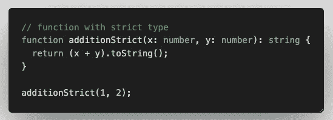

# Angular & TypeScript(一个 JS 超集)——2022 年 Web 开发的一个更好的集合

> 原文：<https://javascript.plainenglish.io/angular-typescript-in-2022-a-superset-of-javascript-a-better-set-for-web-development-66777e794683?source=collection_archive---------17----------------------->

## 你知道 TypeScript 已经存在，TypeScript 将成为 web 开发中优秀编码的未来。现在就了解一下吧！


TypeScript 的最大优势之一是，由于其严格的类型特性，您可以在开发过程中发现愚蠢的错误。

TypeScript 的好处是它是 JavaScript 的超集，这意味着无论你知道什么样的 JavaScript 代码/语法，你都可以在 TypeScript 中应用它，它仍然可以工作。👍它还可以支持未来的 Javascript 特性和遗留的 JavaScript 代码，因为它可以用不同版本的编译器编译。

# 安装程序类型脚本

要开始，首先下载并启动 nodeJS。您可以选择下载 LTS(稳定)版本或当前(最新)功能版本。

[](https://nodejs.org/en/) [## 节点. js

### Node.js 是基于 Chrome 的 V8 JavaScript 引擎构建的 JavaScript 运行时。

nodejs.org](https://nodejs.org/en/) 

安装完成后，您可以在您的终端或 git bash 中键入`node -v`来检查您的节点版本，键入`npm -v`来检查您的 npm 版本。


现在，通过键入以下命令，您可以使用`npm`全局安装 TypeScript:

```
npm install -g typescript
```

安装后，它将让您访问`tsc`命令，这是 TypeScript 编译器。您还可以快速检查安装在计算机上的 TypeScript 版本。


现在设置已经完成，让我们继续探索 TypeScript。

# 类型脚本编译器

首先，在你的目录下创建一个`index.ts`文件。放入一个典型的`console.log`语句并运行`tsc index.ts`来编译`.ts`文件。


一旦你这样做了，你会发现一个与`.js`相同的文件被创建了。这是因为`console.log`语句是一个常规的 JavaScript 语句，因此当代码从`.ts`编译到`.js`时没有任何变化。

默认情况下，TypeScript 会被编译成`ES3`，它不支持`async await`。因此，如果我们编写一个异步方法并用它运行`tsc`命令。您将看到在`.js`文件中输出了大量代码，以便我们在`.ts`文件中使用 async-await。


index.ts


index.js

ES 版本还有其他版本支持 async-await。然而，为了配置要使用的正确版本而不是使用默认的 TypeScript 编译器 ES 版本，我们可以创建一个`tsconfig.json`文件来配置这些设置。


tsconfig.json

一旦保存文件并运行`tsc`命令，您将看到生成的`.js`与`.ts`文件完全相同，因为`esnext`版本支持`async await`语法。

您还可以包含`watch`选项来监视文件更改并在运行时编译您的代码，而不是每次保存文件时都运行`tsc`命令，或者包含`lib`选项来选择您想要包含的库，以便它可以为某些 DOM 或方法提供自动类型，而不会出现编译错误。


tsconfig.json


compilerOption: watch = true


automatic typing on classes by including certain module in lib array in compilerOptions


auto intellisense on classes

# TypeScript 中的第三方库支持

接下来，您还可以安装第三方库来支持您在 TypeScript 中的开发。例如，我们可以探索`lodash`库。

`npm install lodash`

当我们试图将它导入到我们的`.ts`文件中时，我们可以看到编辑器开始抛出错误，说它不能识别模块的声明，这意味着它将不支持智能感知和输入错误。


幸运的是，我们有一个巨大的有用的社区，在 TypeScript 中维护大多数常用库的类型。要解决这个问题，只需运行以下命令。

`npm install -D @types/lodash`安装`lodash`的 devDependencies。

一旦完成，您可以看到错误消失了，智能感知和自动完成功能又回到了`lodash`库。


# 打字稿基础

现在我们知道了这个 TypeScript 编译器是如何工作的，让我们来看看如何在 TypeScript 中对我们的代码进行强类型化。有两种方法可以解决这个问题。


implicit v.s. explicit declaration of type


type assignment error will be thrown immediately in the editor


如果您需要更大的灵活性，您可能希望针对您的特殊情况探索类型`any`。然而，我强烈建议不要使用类型`any`，因为它违背了使用 TypeScript 的目的，并且编辑器将无法捕捉类型`any`变量的类型错误。

此外，您还可以声明自己的类型，以便只允许将某些参数传递给该字段。


myColor’s type is restricted to the 3 options declared

此外，您还可以创建一个接口来严格类型化一个对象。


通过这种方式，您将能够找出哪个对象有错误的字段。如果您再次需要灵活性，您总是可以在接口中声明另一个参数类型，以接受使用人机界面的其他对象可能拥有的任何附加字段。


虽然灵活性是存在的，但我不鼓励滥用它，因为它会使使用 TypeScript 变得多余，并使您的代码非常容易出错。

# 强类型函数

除了对变量进行类型化，你还可以对函数进行强类型化。让我们来探索如何做到这一点。


看看第一个没有声明类型的函数，即使向它传递了一个字符串，IDE 或编译器也不知道有错误。但是，如果您在函数及其返回类型中声明了参数的类型，如上面示例中的第二个函数，IDE 将立即标记类型不匹配。遵循 IDE 错误消息，您将能够修复这些错误，并让您的代码再次平稳运行。



2nd function with the correct type matching

如果您有不返回值的帮助函数，您可以将返回类型设置为`void`。

# 强类型数组

接下来，我们可以看看强类型数组。如果我们以通常的方式声明数组，任何类型的数据都可以很容易地被推入该数组，如下面的第一个示例所示:


但是，如果我们将数组强类型化为我们需要的数据类型，IDE 将立即标记出试图推入数组的任何不正确的数据类型，如上面的第二个示例所示。

# 类型脚本泛型

最后但同样重要的是，TypeScript 泛型。有时，您可能希望设置类的泛型类型，以便其他使用或扩展它的类不会有兼容性问题。


TypeScript Generics

一旦你这样做了，使用这个类的其他类或变量将能够在使用你的类时声明它们自己的类型。

# 摘要

我希望这篇文章已经点燃了您对与传统 JavaScript 方式相反的类型脚本世界的兴趣。没有一种语言是完美的，但是你可以通过我所有的例子看到 TypeScript 绝对是朋友而不是敌人。学习曲线是陡峭的，但是一旦你获得了牵引力，你就再也不会回头了。不要让那些愚蠢的错误或失误再次打破你的睡眠周期！让我们一起前进，让 TypeScript 前端开发变得轻而易举。🍃

[](https://medium.com/@devjo/membership) [## 用我的推荐链接- DevJo 加入媒体

### 作为一个媒体会员，你的会员费的一部分会给你阅读的作家，你可以完全接触到每一个故事…

medium.com](https://medium.com/@devjo/membership) 

*更多内容请看*[***plain English . io***](https://plainenglish.io/)*。报名参加我们的**[***免费周报***](http://newsletter.plainenglish.io/) *。关注我们关于*[***Twitter***](https://twitter.com/inPlainEngHQ)*和*[***LinkedIn***](https://www.linkedin.com/company/inplainenglish/)*。查看我们的* [***社区不和谐***](https://discord.gg/GtDtUAvyhW) *加入我们的* [***人才集体***](https://inplainenglish.pallet.com/talent/welcome) *。**