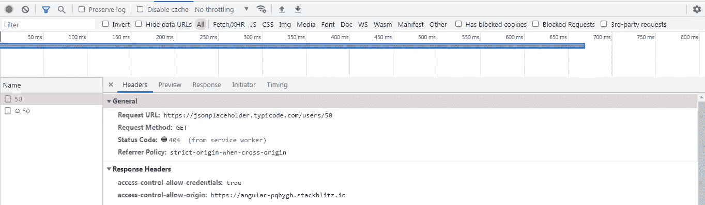
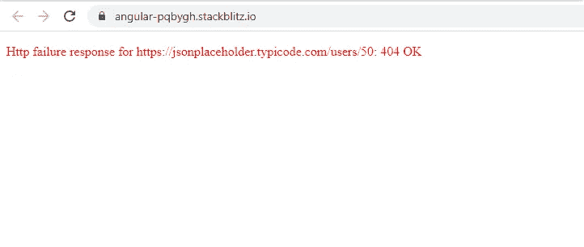

# 角度:使用可观察和可承诺的 APP_INITIALIZER DI 令牌

> 原文：<https://javascript.plainenglish.io/angular-using-app-initializer-di-token-with-observables-and-promises-d089c3127de0?source=collection_archive---------5----------------------->

## **APP_INITIALIZER** 如何与**可观察和承诺**一起使用。


Photo by [Chris Ried](https://unsplash.com/@cdr6934?utm_source=medium&utm_medium=referral) on [Unsplash](https://unsplash.com?utm_source=medium&utm_medium=referral)

使用和理解 **APP_INITIALIZER DI 令牌**非常耗时，但值得。在应用程序完成初始化之前获取数据或执行操作是一个非常有用的工具。

它的工作非常简单。

1.  DI 令牌接受将在应用程序初始化期间执行的工厂函数。
2.  工厂函数可以返回一个可观察到的或一个承诺。
3.  除非返回的承诺没有解决，或者返回的可观察到的没有完成，否则应用程序初始化将不会完成。

我们的**目标**是:

1.  演示如何将 **APP_INITIALIZER** 与**可观察到的和承诺**一起使用。最后一个选项在较低版本的 Angular 中很有用，在该版本中，服务返回可观察值，但是 DI 令牌不支持可观察值。
2.  如何使用此 DI 令牌向用户显示警报消息，以防承诺或可观察到的抛出错误。
3.  最后，演示如何在应用程序仍在初始化时显示加载微调器。

我们开始吧。我们的应用程序只有 **AppComponent** 和 **DataService** 。

让我们从 **AppComponent Class** 开始。为了向用户显示任何错误消息，我们创建了一个**消息$** 可观察到。**在**数据服务**中定义的 alertObservable** 每当初始化过程中执行的任何任务抛出错误时都会发出数据。

我们正在抓住这个错误，并显示给用户查看。

**AppComponent Template:** 我们刚刚订阅了使用**异步管道**可观察到的**消息$** 并显示错误消息:

```
<p style=”color:red” *ngIf=”message$ | async as mess”>{{ mess.message }}</p>
```

移至 **AppModule。**

在应用程序模块中，

= >我们已经定义了两个工厂函数**appinitializer using Promises()**和**appinitializer using Observables()**来演示如何使用 Observables 和 Promises 来使用 DI 令牌。

= >我们已经使用下面的代码注册了 **APP_INITIALIZER** DI 令牌。

**使用工厂**包含工厂函数，该函数将作为该 DI 令牌的值。我们将把**appinitializer using promises()**传递给 **useFactory** 以首先测试 Promise 方法。

**deps** 包含一个令牌数组，其值将作为参数传递给 factory 函数。

```
providers: [{
provide: **APP_INITIALIZER**,
// useFactory: appInitializerUsingObservables,
useFactory: appInitializerUsingPromises,
**deps: [DataService]**,
multi: true,
},
],
```

转到工厂函数，让我们从 **appInitializerUsingPromises()开始。**

我们已经传递了一个对**数据服务**的引用作为工厂函数的参数。使用这个引用，我们在数据服务中调用了一个方法**initialiappusingpromises**()。这个方法将在应用程序加载之前获取我们需要的数据。我们将在某个时候讨论这个问题。

DataService 中的这个方法返回一个承诺。不管承诺是成功还是抛出错误，我们在 **then 和 catch 块**中调用了 **resolve(true)** 。这是因为我们真的不希望应用程序因为错误而停止加载。如果我们这样做，用户只能在浏览器上看到一个空白屏幕。这会让用户感到困惑，因为他不知道幕后发生了什么。更好的方法是抓住错误，让应用程序加载，并向用户显示错误。

现在，下一个工厂函数，**appInitializerUsingObservables()**

该函数再次将**数据服务**引用作为参数，并调用在**数据服务**中定义的方法**初始化应用观察值()**。这个方法返回一个可观察的。

让我们进入**数据服务**来理解这些方法实际上是做什么的。这可能看起来令人不知所措，但它非常简单。

首先，我们定义了**行为主体** **报警主体**及其对应的**可观察报警对象。**我们正在订阅 AppComponent 中的这个可观察对象，以显示获取 ToDos 或用户数据时遇到的任何错误。

这里需要注意的是，我们使用了一个**行为主体**，而不是一个普通主体。原因是 AppComponent 只有在应用程序初始化之后才能订阅 subject，但是在初始化过程中错误数据会传递给 subject。因此有必要使用**behavior subject/replay subject/async subject**，它甚至可以向后期订阅者发送数据。

```
public alertSubject = new BehaviorSubject<any>(null);
public alertObservable = this.alertSubject.asObservable();
```

我们定义了 **getUser()** 来获取与用户相关的数据，定义了 **getToDos()** 来获取与用户相关的所有待办事项数据。

在 **setUser()** 和 **setToDos()** 中，我们存储了在 DataService 中提取的用户和 ToDos 数据。

最后，我们定义了**initialiappusingobservables()**和**initialiappusingpromises()**。这是在 AppModule 的工厂函数中调用的两个方法。

让我们从**初始化应用承诺()开始。**这是在 AppModule 的**appInitializerUsingPromises()**工厂函数中被调用的方法。

**initialiappusingpromises()**只是调用**initialiappusingobservables()**将后者返回的可观测值转换成一个承诺，返回给 AppModule 中的工厂函数**appInitializerUsingPromises()**。

所以我们只需要检查**initialiappusingobservables()**来了解数据是如何获取的，错误是如何处理的。

让我们一步一步来:

1.  **调用 getUser()** 传递 5 作为参数，取 userId 为 5 的用户的数据。获取数据时的任何错误都将被下面的 **catchError** 操作符捕获，以执行两个任务:

= >将错误传递给 **alertSubject** 以便在应用程序初始化完成后在 AppComponent 中显示错误。

= >用操作符的**创建的成功可观察值替换错误可观察值并返回。**

```
catchError((err) => {
**this.alertSubject.next(err);
return of(err);**
})
```

在 Promise 方法中，我们也可以选择重新抛出错误，并且可以在 AppModule 的工厂函数**appInitializerUsingPromises()**的 catch 块中捕获错误。

在可观察方法中，我们不应该重新抛出错误，因为在 AppModule 的工厂函数**appInitializerUsingObservables()**中没有捕捉错误的规定。

在这个例子中，我想在两种方法中使用一个通用的错误处理逻辑来避免混淆。

请注意**initialiappusingpromises()**的最后一行，这里我们使用了 **lastValueFrom()** 运算符将**initialiappusingobservables()**返回的可观测的 **obsv$** 转换为一个承诺。该操作符用于替代 **toPromise()** 操作符，后者现已被弃用。

返回的承诺将会成功，因为我们已经用成功的可观察值替换了错误可观察值，因此**然后**appInitializerUsingPromises()**工厂函数中的块**将会执行以解析承诺并恢复初始化过程。

为了演示这一点，如果我尝试使用 **userId 50** 获取一个不存在的用户的数据，而不是使用 **userId 5** ，那么从 **getUser()** 返回的可观察数据将出错，但是应用程序将加载并显示如下错误消息:



2.如果 **getUser()** 成功，则 **switchMap** 操作符执行，其中我们使用 **setUser()** 将用户数据存储在 DataService 中，并调用 **getToDos()** 来获取该用户的所有 ToDos 数据。

```
**this.setUser(x);**
return **this.getToDos**(x.id).pipe(tap((y) => **this.setToDos(y)**));
```

3.在 **getToDos()** 中遇到的任何错误都将在下面的同一个 **catchError** 操作符中被捕获:

```
catchError((err) => {
**this.alertSubject.next(err);
return of(err);** })
```

如果 **getToDos()** 成功，首先使用 **setToDos()** 将 ToDos 数据存储在 DataService 中，然后将成功的承诺返回给 AppModule 中的工厂函数。然后，工厂函数中的**块**执行，承诺被解析，应用程序初始化继续。

如果你想使用可观察的方法而不是承诺，在 AppModule 中，你可以注释掉语句:**use factory:appInitializerUsingPromises**并取消注释**use factory:appInitializerUsingObservables。**因此**appInitializerUsingObservables()**工厂函数将被执行，进而调用**数据服务**中定义的**初始化 AppUsingObservables()** 。

```
providers: [{
provide: **APP_INITIALIZER**,
**useFactory: appInitializerUsingObservables**,
//useFactory: appInitializerUsingPromises,
**deps: [DataService]**,
multi: true,
},
],
```

现在让我们看看如何在应用程序初始化过程中显示一个加载微调器。一旦初始化过程完成(失败/成功)，它将隐藏。

在**index.html**中，我在<app-root></app-root>中添加了一个< div >元素，如下图。

```
<body>
<my-app>
<div class=”loading”></div>
</my-app>
</body>
```

你现在需要做的就是给**<div class = " loading ">**元素添加一些 css，这样它就像一个旋转器。为此，我在<样式>内的<头部>内添加了下面的 css。

```
<head>
<style>
.loading {
border: 16px solid #f3f3f3; /* Light grey */
border-top: 16px solid #3498db; /* Blue */
border-radius: 50%;
width: 50px;
height: 50px;
margin: 0 auto;
animation: spin 2s linear infinite;
}

@keyframes spin {
0% {
transform: rotate(0deg);
}
100% {
transform: rotate(360deg);
}
}
</style>
</head>
```

您可以查看下面的完整工作示例:

[](https://stackblitz.com/edit/angular-pqbygh?file=src/app/data.service.ts) [## 角形(叉形)堆叠

### 一个基于 rxjs，tslib，core-js，zone.js，@angular/core，@angular/forms，@angular/common 的 angular-cli 项目…

stackblitz.com](https://stackblitz.com/edit/angular-pqbygh?file=src/app/data.service.ts) 

*更多内容请看*[***plain English . io***](https://plainenglish.io/)*。报名参加我们的* [***免费周报***](http://newsletter.plainenglish.io/) *。关注我们关于*[***Twitter***](https://twitter.com/inPlainEngHQ)[***LinkedIn***](https://www.linkedin.com/company/inplainenglish/)*[***YouTube***](https://www.youtube.com/channel/UCtipWUghju290NWcn8jhyAw)*[***不和***](https://discord.gg/GtDtUAvyhW) *。***