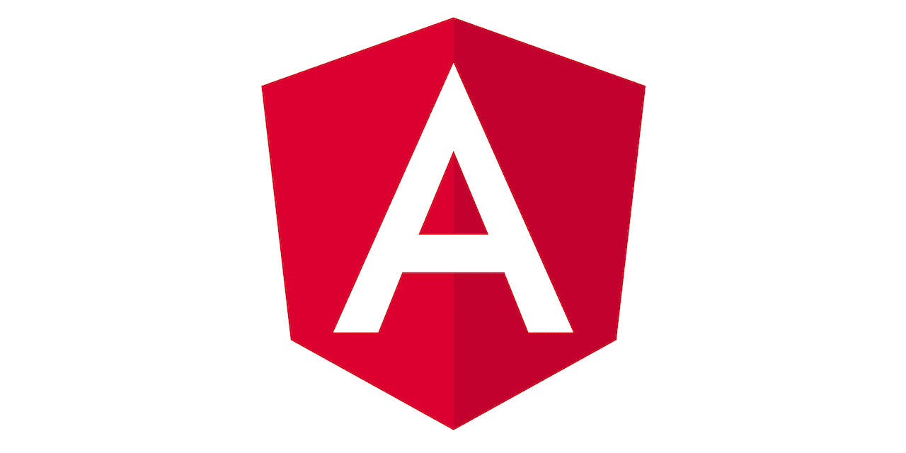
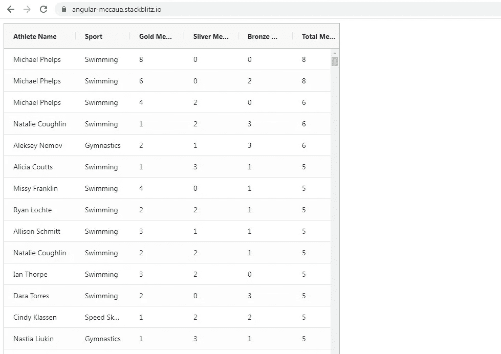
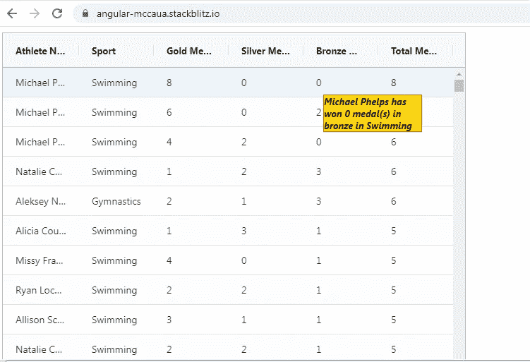
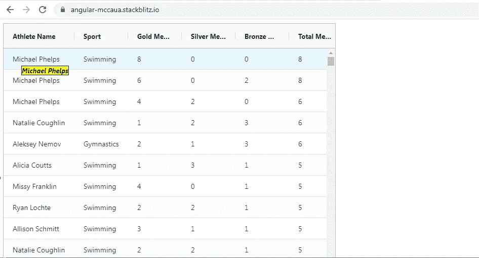

# 角度:对 Ag-Grid 表格中的每一列使用不同的工具提示模板

> 原文：<https://javascript.plainenglish.io/angular-using-different-tooltip-templates-for-every-column-in-an-ag-grid-table-without-using-546a40300969?source=collection_archive---------3----------------------->

## 不使用引导



使用**自定义工具提示组件**向 Ag-Grid 表格添加工具提示非常简单，在文档中已经提到过。我想通过给表格中的每一列添加不同的**工具提示模板**来分享一些更有趣的东西。

我已经写了一个关于使用 Bootstrap 而不是自定义工具提示组件向 Ag-Grid 表格添加工具提示和弹出窗口的故事。如果你对弹出窗口和工具提示使用 Bootstrap 更感兴趣，你可以看看下面的故事。

[](https://medium.com/geekculture/angular-adding-bootstrap-popovers-and-tooltips-with-dynamic-data-to-an-ag-grid-table-f6b386b78279) [## Angular:将带有动态数据的引导弹出窗口和工具提示添加到 Ag-Grid 表中

### 我一直倾向于使用 ngx-bootstrap npm 模块来为我的 Angular 应用添加任何引导组件。的…

medium.com](https://medium.com/geekculture/angular-adding-bootstrap-popovers-and-tooltips-with-dynamic-data-to-an-ag-grid-table-f6b386b78279) 

在我开始这个故事之前，我想澄清一下，这个故事要求读者了解 Ag-Grid 表格和使用<ng-template>在表格上显示数据的基本知识。如果你对这个概念不熟悉，你可以看看下面的故事。</ng-template>

[](/creating-a-reusable-component-for-using-templates-in-ag-grid-tables-6d9a8dfc88e3) [## Angular:如何创建一个在 Ag-Grid 表格中使用模板的可重用组件

### 如果你想让一个 Ag-Grid 表格与你的应用程序交互，在表格中插入模板是非常有用的。

javascript.plainenglish.io](/creating-a-reusable-component-for-using-templates-in-ag-grid-tables-6d9a8dfc88e3) 

为了演示这个例子，我将使用在不同运动中获得奖牌的运动员的数据集。因为这是一个巨大的 JSON，所以我没有展示要点，而是展示了这个数组中的一个对象的示例，以便您理解其结构。

```
{
**“athlete”**:”Michael Phelps”,
**”age”**:23,
**”country”**:”United States”,
**”year”**:2008,**”date”**:”24/08/2008",**”sport”**:”Swimming”,**”gold”**:8,”silver”:0,**”bronze”**:0,**”total”**:8
}
```

让我给你一个我们的应用程序会是什么样子的想法。我们已经在 Ag-Grid 表中填充了 JSON 数据，如下所示。



我们对下面的**金牌、银牌、铜牌和奖牌总数栏**使用相同的工具提示模板。



我们将为下面的**运动员栏**使用不同的工具提示模板。



让我们从 **AppComponent 模板**开始。

有两个带引用的模板: **toolTipTemplate** 和 **anotherToolTipTemplate** ，在工具提示的组件中定义。

我们使用参考模板**工具提示模板**用于列:**金牌、银牌、铜牌和奖牌总数。**引用 **anotherToolTipTemplate** 的模板用于**运动员栏。**

我们将在后面看到如何在模板中访问 JSON 数据。

最后，组件模板中还有 Ag-Grid 表。

现在，让我们转到 **AppComponent 类**。

```
public **rowData** = atheletes;
@ViewChild(‘toolTipTemplate’, { static: true })**toolTipTemplate**: TemplateRef<any>;@ViewChild(‘anotherToolTipTemplate’, { static: true })**anotherToolTipTemplate**: TemplateRef<any>;public **gridApi**: any;
public **frameworkComponents** = **{ toolTip: CustomToolTipComponent };**public **defaultColDef** = {
autoHeight: true,
resizable: true,
**tooltipComponent: ‘toolTip’,**
};public **columnDefs** = [];
```

**rowData** 是从 **athletes.ts** 导出的 JSON 数据，用于 Ag-Grid 表。

**CustomToolTipComponent** 是显示工具提示模板的组件。

我们已经更新了**ngafterviewit()**中 **columnDefs** 的值，以便访问工具提示模板引用: **toolTipTemplate** 和 **anotherToolTipTemplate。**

让我们首先看看工具提示模板引用 **toolTipTemplate** 将如何用于显示**运动员姓名列**的工具提示。下面是**运动员姓名列**的列定义。在 **tooltipValueGetter** 属性中，我们已经返回了在工具提示上显示数据所需的所有信息。

返回一个具有两个属性的对象: **ngTemplate** 和 **data** 。ngTemplate 将包含模板引用，而 **data** 将包含我想要在工具提示上显示的信息。

```
{
**headerName**: ‘Athlete Name’,
**field**: ‘athlete’,
**tooltipValueGetter**: function (params) {
return {
**ngTemplate**: that.anotherToolTipTemplate,
data: {
**athleteName**: params.data.athlete,
},
};
}
}
```

同样，让我们看看**金牌数栏**的配置。其他 3 栏也将使用类似的方法:**银牌、铜牌和总奖牌**。

```
{
**headerName**: ‘Gold Medals’,
**field**: ‘gold’,
**tooltipValueGetter**: function (params) {
return {
**ngTemplate**: that.toolTipTemplate,
**data**: {
athleteName: params.data.athlete,
type: params.colDef.field,
count: params.data.gold,
sport: params.data.sport,
},
};
},
},
```

现在，让我们检查一下**自定义工具提示组件**如何帮助显示这个工具提示。

模板非常简单。 **ngTemplateOutlet** 将包含已经讨论过的工具提示模板引用，而**ngTemplateOutletContext**将包含要显示的信息。

```
<ng-container
**[ngTemplateOutlet]=”template”**
**[ngTemplateOutletContext]=”context”**
></ng-container>
```

下面是班级。

在 **setTemplateAndParams()** 中，Params 参数的 **value 属性将包含返回到前面讨论的列定义中的 **tooltipValueGetter** 属性的整个对象。**

```
this.**template** = **params.value.ngTemplate**;
this.**context** = {
rowInfo: {
rowData: **params.value.data**,
},
};
```

我们正在从 **params.value** 访问 **ngTemplate** 属性和 **data** 属性，并分别将其分配给**模板和上下文属性**。

**模板属性**被分配给**ngtemplateeoutlet**，而**上下文属性**被分配给**ngtemplateeutletcontext。**

您可以查看下面的完整工作示例。

[](https://stackblitz.com/edit/angular-mccaua?file=src/app/app.component.ts) [## 角形(叉形)堆叠

### 一个基于 rxjs，tslib，core-js，zone.js，@angular/core，@angular/forms，@angular/common 的 angular-cli 项目…

stackblitz.com](https://stackblitz.com/edit/angular-mccaua?file=src/app/app.component.ts) 

*更多内容请看*[***plain English . io***](https://plainenglish.io/)*。报名参加我们的* [***免费周报***](http://newsletter.plainenglish.io/) *。关注我们关于*[***Twitter***](https://twitter.com/inPlainEngHQ)*和*[***LinkedIn***](https://www.linkedin.com/company/inplainenglish/)*。加入我们的* [***社区不和谐***](https://discord.gg/GtDtUAvyhW) *。*