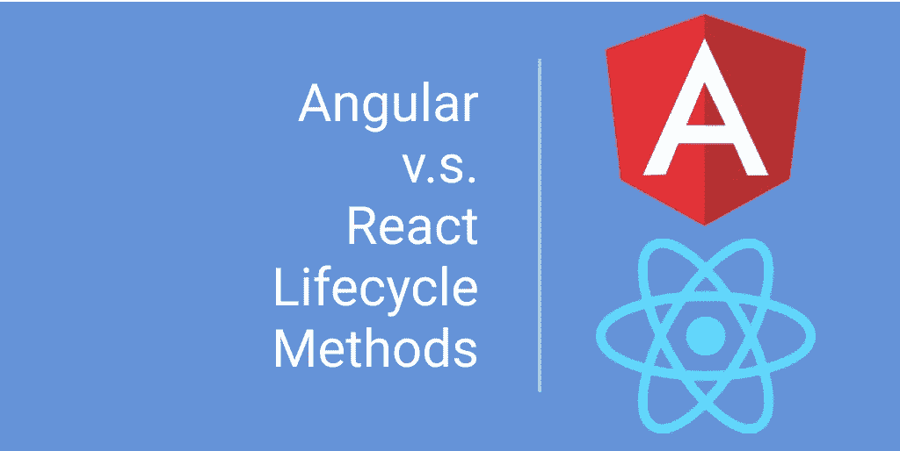
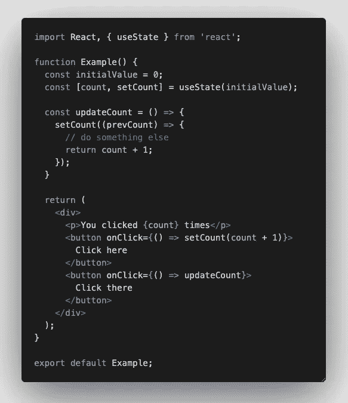
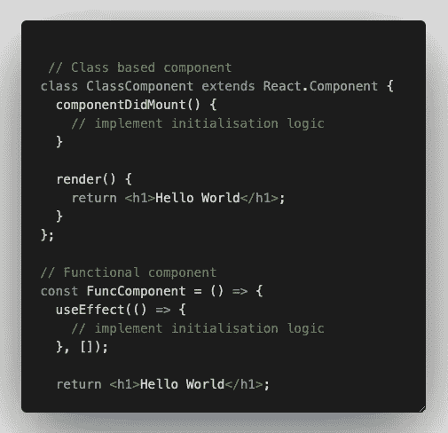
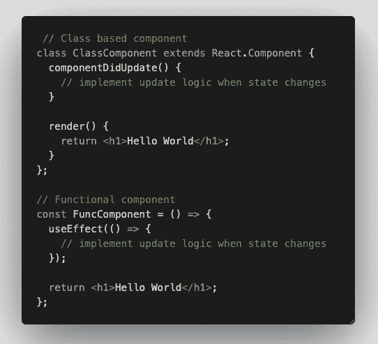
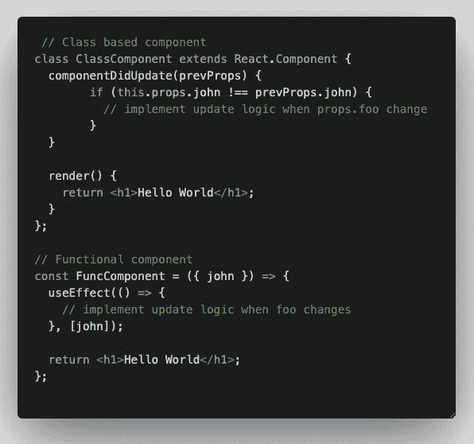
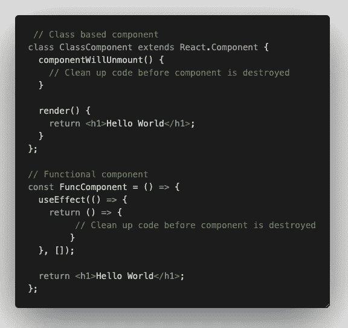

# 角度与反应—生命周期方法

> 原文：<https://javascript.plainenglish.io/angular-v-s-react-lifecycle-methods-4a9cd3b58891?source=collection_archive---------1----------------------->

## 知道这些生命周期方法何时被执行，并重构你的应用程序以正确利用它们。

你是 Angular 和 React 开发者吗？我是。你有没有想过，当数据改变时，你的 UI 组件的某些部分没有更新，你不得不求助于对`ngDoCheck/ngOnChanges`或`useEffect/shouldComponentUpdate`进行某种修改来更新那部分 UI？也许是框架或库的问题，但也许你没有完全理解每个生命周期方法的真正含义。今天，我将快速介绍 Angular 和 React 中可用的生命周期方法，您可以决定如何使用它们来优化您的应用。

# 有角度的生命周期挂钩

`constructor` —该方法在组件的整个生命周期中只运行一次。

`ngOnChanges` —此方法在 Angular 设置或重置数据绑定输入属性时响应，如果组件有绑定输入且输入改变时，此方法在`ngOnInit`之前调用。

`ngOnInit` —在`ngOnChanges`第一次运行后，该方法在组件的整个寿命期内只运行一次。

`ngDoCheck` —该方法在`ngOnChanges`之后立即调用，或者在模板中有数据变化时调用(在`changeDetection.default`模式下)，或者在`changeDetectionRef.markForCheck`被调用时调用(在`changeDetection.onPush`模式下)。

`ngAfterContentInit` —在第一个`ngDoCheck`之后，该方法在组件的整个生命周期中只运行一次。

`ngAfterContentChecked` —该方法在`ngAfterContentInit`之后首先被调用，然后在每个`ngDoCheck`之后被调用。

`ngAfterViewInit` —在第一个`ngAfterContentChecked`之后，该方法在组件的整个生命周期中只运行一次。

`ngAfterViewChecked` —该方法在`ngAfterViewInit`之后首先被调用，然后在每个`ngAfterContentChecked`之后被调用。

`ngOnDestroy` —在 Angular 破坏组件之前，该方法在组件的整个生命周期中只运行一次。

简单介绍一下上面的方法，把你的眼睛放在这几个性能猪身上——`ngOnChanges`(如果你有`@input`)、`ngDoCheck`、`ngAfterContentChecked`、`ngAfterViewChecked`。在这些 hogger 函数中保持你的方法简洁明了，你的应用程序将会再次活跃起来。

 [## 有角的

### Angular 是一个构建移动和桌面 web 应用程序的平台。加入数百万开发者的社区…

angular.io](https://angular.io/guide/lifecycle-hooks) 

# 基于类的 React 生命周期挂钩

***初始化阶段***

`constructor` —创建组件时调用一次。

`getDerivedStateFromProps` —在 DOM 中呈现元素之前调用此方法。

`render` —调用该方法来呈现 DOM 中的元素。

`componentDidMount` —在 DOM 中呈现组件后调用该方法。

***更新阶段——当状态或道具改变时***

`getDerivedStateFromProps` —此方法在组件更新时但在 DOM 更新前调用。

`shouldComponentUpdate` —该方法允许您运行比较逻辑来检查是否应该更新 DOM。

`render` —调用此方法来更新 DOM 中的元素。

`getSnapshotBeforeUpdate` —此方法允许您在此周期更新之前访问状态和属性。这个方法必须和 componentDidUpdate 一起使用。

`componentDidUpdate` —在 DOM 中更新组件后调用此方法。

***卸载阶段***

`componentWillUnmount` —此方法在 React 从 DOM 中移除此组件之前调用一次。

类似于 Angular，在`update phase`这里有一个快速注释，这里是性能霸。保持这些方法中的逻辑和检查简洁明了，这样就不会花费太多时间在每个状态或道具变化时运行它们。

# 基于函数的反应挂钩

`useState` —该方法有两个部分，数组的第一个元素属于初始化赋值，数组的第二个元素属于更新数组的第一个元素。

`useEffect` —该方法由许多部分组成，可以在单个组件中多次声明。让我们把它分成 4 个部分。

part 1

上面带方括号的`useEffect`实现只会在初始化时调用一次。

part 2

上面没有方括号的`useEffect`实现将在组件的任何状态或属性发生变化时运行代码。

part 3

上面方括号中变量的`useEffect`实现只有在变量被更改或更新时才会运行。

part 4

最后但并非最不重要的一点，相当于`componentWillUnmount`和`ngOnDestroy`，上面带有返回回调函数的`useEffect`实现将在组件从 DOM 中移除之前运行清理代码。

关于第 2 部分的实现，有一点需要注意，如果你正在使用它，不要在你计划运行的`useEffect`代码块中实现状态变化逻辑，否则，你将会陷入一个无限循环。

# 摘要

我希望这篇文章能提醒你使用正确的生命周期方法来呈现或重新呈现你的 UI 组件。在高性能生命周期方法中不正确实现的逻辑会严重影响你的用户和应用。现在你已经看到了 Angular 和 React 可用的每一个生命周期方法和钩子，你将如何重构你的应用程序以使它更有性能？如果你有任何有趣的代码重构，请在下面的评论中告诉我。我也很想了解一下。干杯。

 [## 用我的推荐链接- DevJo 加入媒体

### 作为一个媒体会员，你的会员费的一部分会给你阅读的作家，你可以完全接触到每一个故事…

medium.com](https://medium.com/@devjo/membership) 

*更多内容请看*[***plain English . io***](https://plainenglish.io/)*。报名参加我们的* [***免费周报***](http://newsletter.plainenglish.io/) *。关注我们关于*[***Twitter***](https://twitter.com/inPlainEngHQ)*和*[***LinkedIn***](https://www.linkedin.com/company/inplainenglish/)*。查看我们的* [***社区不和谐***](https://discord.gg/GtDtUAvyhW) *加入我们的* [***人才集体***](https://inplainenglish.pallet.com/talent/welcome) *。*