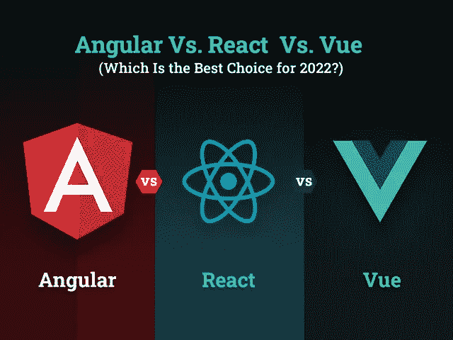
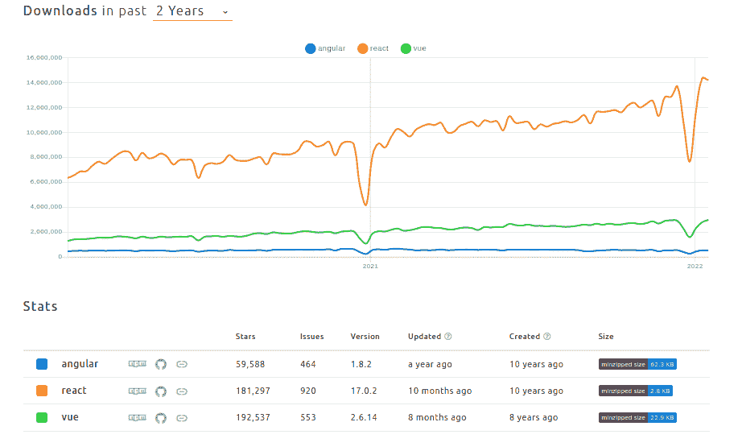
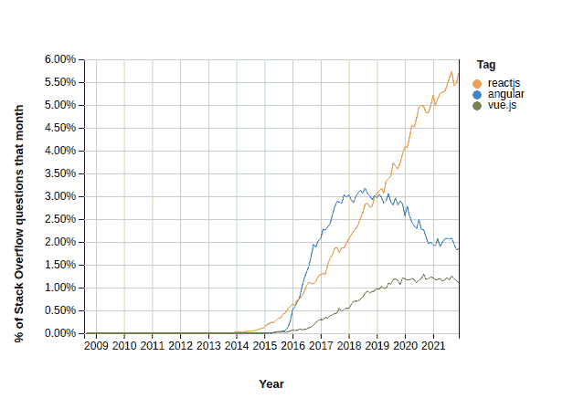
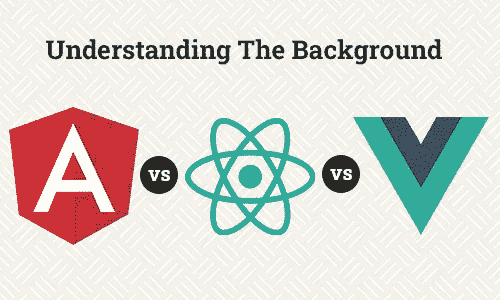
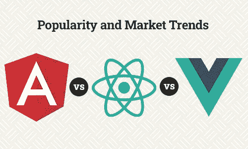
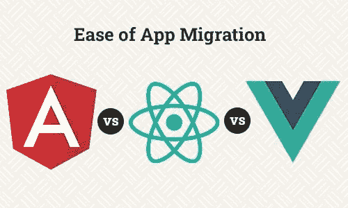
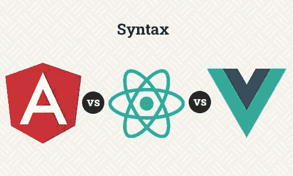
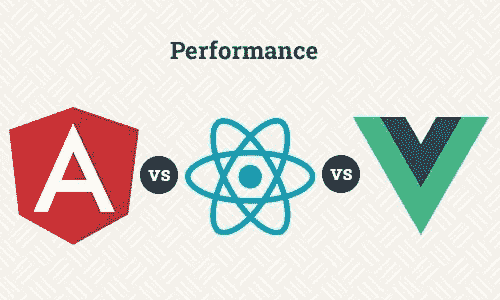
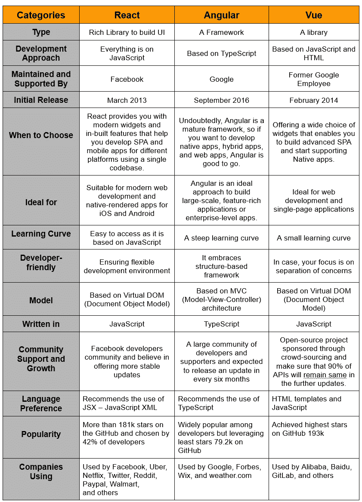

# angular vs React vs vue . js:2022 年选择哪个最好？

> 原文：<https://javascript.plainenglish.io/angular-vs-react-vs-vue-js-which-is-the-best-choice-for-2022-5ef83f2257ab?source=collection_archive---------0----------------------->

## angular vs React vs Vue:**2022 年框架选择哪个最好？**

毫无疑问，今天 web 应用程序已经成为每个人生活中不可或缺的一部分。从订票到点餐、打车到网上购物，应用程序显然正在主宰商业世界。事实上，技术进步和移动性已经给客户行为带来了巨大的变化。随着移动性的影响不断增加并改变全球的行业，因此，企业热切期待在 2022 年创建在线业务。

随着成千上万的应用程序开发的出现，创建一个应用程序并不是一项具有挑战性的工作，但同时，如果你认为打入移动应用程序市场是成功的关键，那么你就错了。为了在这个蓬勃发展的市场中取得成功，它包括深入的规划、独特的战略、广泛的规划以及获得顶级技术来创建企业级应用程序。

然而，当创建一个应用程序时，什么技术统治着应用程序开发市场？

***现在，你们大部分人的回答——JAVASCRIPT！***

毫无疑问，许多编程语言来来去去，但 JavaScript 一直保持着作为编程语言的突出选择的地位。现在的问题是，2022 年的 app 开发应该考虑哪个框架？

JavaScript 是一种编程语言，它提供了广泛的功能和大量的开发环境。虽然它的每个框架都提供了独特的功能和优势，但在为应用程序开发选择最佳框架时，许多程序员都在寻找哪一个更方便，哪一个是 2022 年更好的选择。

如果你正处于 2022 年考虑 JavaScript 的哪些 web app 开发框架的两难境地，那么你需要考虑下面的调查报告。

根据 [NPM 趋势](https://www.npmtrends.com/angular-vs-react-vs-vue)，React、Angular 和 Vue.js 是下载量最大的 JavaScript 框架，但这些框架之间的战争将在 2022 年继续。如果你估计过去两年所有三个 web 开发框架的下载量，毫无疑问 React 是领先的，而 Vue.js 下载量被证明高于 Angular。

[Image Source](https://www.npmtrends.com/angular-vs-react-vs-vue)

然而，在你相信这份调查报告之前，你需要明白不同的报告有不同的结果。

考虑到堆栈溢出的调查报告，它几乎类似于 NMP 调查，但仍然有一个变化值得注意。React 以 35.9%的开发者使用率领先市场。然而，Angular 正在超越 Vue.js 的受欢迎程度。Angular 被 25.1%的开发人员选择，而 Vue 被 17.3%的开发人员使用。

[Image Source](https://insights.stackoverflow.com/trends?tags=angular%2Creactjs%2Cvue.js)

简而言之，要做出最终决定，您需要深入挖掘每个框架的细节，以了解哪些特性适合您的需求。要决定哪种框架更适合你，你可以咨询一家 [**web app 开发公司**](https://www.xicom.biz/services/web-development/) 。然而，我们仍然比较了这三个 web 开发框架，以提供亮点。考虑到 web 应用程序开发的几个最常见的标准，这里我们在这些基础上比较这些框架:

**理解每个框架背后的哲学？**

*   他们是否足够成熟来处理项目开发的复杂性？
*   *您为项目选择的技术很容易找到开发者吗？*
*   *评估每个框架的社区支持和市场趋势？*
*   *评估这些框架的受欢迎程度？*
*   *它是否符合您的要求，并且能够构建可扩展的应用程序？*
*   *您是否分析过每个框架的性能、速度、语法和复杂性？*

所以你开始伸长脑袋东张西望，想得到这些问题的答案，让我们直接钻入 Angular、React 和 Vue.js 的对比。

## **详细对比**Angular**vs .**React vs . vue . js:2022 年哪个是最好的选择？****

**无论你是初学者、自由职业者还是科技初创公司，为你的应用开发选择合适的技术都是明智的决定。围绕这三个框架的争议将会持续很长时间，但通过这一详细的比较，我们正试图消除云，以便每个企业主都可以在 React vs Angular vs Vue 的永无休止的战斗中轻松选择自己的立场。**

**让我们开始比较吧…**

## ****1。** React Vs Angular **Vs Vue:了解其背景和背后的哲学****

****

**结论:React 是脸书推出的一个 JavaScript 库。Angular 是 Google 开发的基于类型脚本的 JavaScript 框架。Vue 是一个社区驱动的开源框架，也是一个快速增长的 JavaScript 框架。”**

> ****React 或 React 由脸书建造****

**React.js 或 React 是这个框架的不同名称。它基本上是一个基于 JavaScript 的框架，由 Jordan Walke 于 2013 年推出。它是一个开源框架，允许你创建交互式 UI 和应用程序的前端。从这个框架开始，你需要做的就是 [**雇佣一个网络开发人员**](https://www.xicom.biz/offerings/hire-web-developers/) 。尽管 React 是一个年轻的 JavaScript 库，但它通过提供出色的特性和功能保持了自己的地位。此外，包括优步、网飞、贝宝、沃尔玛在内的行业领先品牌都对 React 表现出信任。**

**在过去的几年里，React 发展迅速，因为它使用了虚拟 DOM，这使得比较以前的 HTML 代码差异更加容易，并且只加载不同的部分。此外，它还为您提供了所有工具，帮助您定义在什么情况下渲染什么。这将改善应用程序加载时间，并确保出色的应用程序性能。**

> **除此之外，React 还有一些优点和缺点。**

****在应用开发项目中使用 React 的优势****

*   **确保更快的装载；**
*   **使用 React 可以实现数据和表示的分离；**
*   **基于 JavaScript，开始更简单；**
*   **单个文件包含标记和逻辑(JSX)。**

****使用 React 的缺点****

*   **它只是一个 JavaScript 库，不是一个完整的框架；**
*   **React 无法实现 MVC 架构；**
*   **没有其他库的支持，不足以构建 web app**

> ****谷歌打造的 Angular】****

**毫无疑问，Angular 是这三个选项中最大的框架。事实上，它有时被称为平台而不是框架。然而 React 无可匹敌的特性已经超越 Angular。**

**Angular 由谷歌在 2009 年开发，是一个由 Misko Hevery 和 Adam Abrons 开发的开源动态 web 应用框架。之后，Angular 为许多事情提供了开箱即用的支持，因此允许开发人员完全控制 UI，对用户输入做出反应，在表单中验证输入，路由和状态管理发送 AJAX HTTP 请求等等。**

**凭借广泛的内置功能选择，Angular 允许您更高效地构建、管理和测试您的应用程序。此外，它是一个广泛流行的前端开发框架，因此 Google、Forbes、Whatsapp 和其他 500 强公司等大型组织都对该框架感兴趣。除此之外，下面是在应用程序开发项目中使用 Angular 的利与弊。**

****使用角度的好处****

*   **确保出色的应用性能；**
*   **为应用程序开发提供离线支持和 PWA 功能；**
*   **创建大规模应用程序的理想选择，因为它提供了内置功能；**
*   **用 Angular 开发的项目是可扩展的，可伸缩的，开发速度更快；**
*   **它包含 Angular-CLI 命令行工具；**
*   **Angular 提供了一个开发 web 应用程序和管理它的基本框架，不需要任何其他库的支持。**
*   **确保端到端测试。**

> **Vue.js 是一个社区驱动的框架**

**Vue.js 是讨论最多、发展最快的基于 JavaScript 的框架，由谷歌前雇员尤雨溪发起。这是一个介于 React 和 Angular 之间的框架。一个 [**web app 开发公司**](https://www.xicom.biz/services/web-development/) 可以给你讲解它的特点。但是在你做任何决定之前，请记住 Vue 并不像 Angular 那么大，它包括了一些使它在反应和 Angular 方面具有竞争力的特性。**

**Vue.js 是一个渐进的框架，允许你创建渐进的单页应用。像 Angular 和 React 一样，Vue 也是通过组合可重用的组件来开发用户界面。但除此之外，Vue 给你更多的反应和更少的角度，这就是为什么它是超越角度。最重要的是，以下是 Vue.js 的一些优点和缺点:**

****vue . js 对项目开发的好处****

*   **Vue 提供了详细的文档。**
*   **这个框架的可重用组件使得开发过程更快更容易。**
*   **存在基于组件的架构(CBA)的可能性。**
*   **它为应用程序开发提供了灵活性和简洁性。**
*   **Vue 提供了一系列工具和库，如官方 CLI、开发工具、Vue 路由器、状态管理等等。**

****使用 Vue 进行应用开发的缺点****

*   **社区支持不像 Angular 和 React 那样广泛**
*   **有限数量的可用插件**

## ****2。Angular Vs React Vs Vue:比较受欢迎程度和市场趋势****

****

***“总结:考虑到 GitHub 的统计数据，React 的分叉数量领先，而 Vue 的星数最高，Angular 介于两者之间。”***

*   **react:[GitHub Stars](https://github.com/facebook/react)181k/Fork 36.9k/Contributors 1538/880 万用户使用**
*   **angular:[GitHub Stars](https://github.com/angular/angular)79.2k/Fork 20.8k/投稿人 1528/210 万用户使用**
*   **vue . js:[GitHub Stars](https://github.com/vuejs/vue)193k/Fork 31.3k/投稿人 404**

**从这些数据和事实来看，显然 Vue 领先，并接近超越 React，将 Angular 甩在身后。尽管它是一个社区驱动的框架，但它有能力吸引开发人员的注意力。通过提供一系列的特性，它确保了为开发者构建良好且简单的应用程序开发架构。**

**但是，我们不能忽视棱角分明的特点而做出反应。毕竟，这些巨型行业已经表现出对这些框架的兴趣。Google 在他们的项目中大量使用 Angular，并在他们的开发环境中使用 React。**

## ****3。Angular Vs React Vs Vue:应用迁移的简易性****

****

***“总结一下:当创建一个应用程序时，没有人想和编码一起迁移。因此，在雇佣一家* [***软件开发公司***](https://www.xicom.biz/) *时，首要关注的是寻找一个不需要太多改变的框架。在这一点上，Angular 每六个月进行一次更新。React 和 Vue 确保更稳定的更新。”***

> ****通过角度进行应用程序迁移****

**毫无疑问，Angular 发布的更新比 React 和 Vue 更频繁。Angular 每六个月发布一次更新。然而，在发布任何主要的 API 之前，还需要另外六个月的时间，这最终给了你两个发布周期的时间。**

> ****React 中的 App 更新发布****

**在 React 中，像 React codemod 这样的脚本可以帮助你比 Angular 和 Vue 更舒适地进行迁移。因为脸书说稳定性是他们最关心的问题，所以像 Twitter 和 Airbnb 这样的大公司都做出了反应。**

> ****使用 Vue 进行应用迁移****

**有了 Vue，应用程序迁移变得容易得多，因为他们认为如果从 1.x 迁移到 2，90%的 API 都是相同的。除此之外，还有一个迁移助手工具可以在控制台上访问站点的状态。**

## ****4。比较语法:Angular Vs React Vs Vue****

****

**“总之:应用程序的语法和代码的结构可能是开发者个人偏好的问题。一些开发人员更喜欢使用 TypeScript，而其他人则坚持使用 JavaScript。所以这里没有争论，也没有胜利者可以宣布！”**

**但是在你进入细节和评估它之前，你需要明白语法不会影响应用的性能。**

***我们来详细对比一下……***

**就复杂性而言，哪个框架更容易学习或者哪个框架的学习曲线更陡，我们将 Vue 与 Angular 进行比较，但 React 是要求最低的框架。**

**另一方面，语法和结构方面的复杂性，Angular 将是最苛刻的，因为 Angular 使用 TypeScript，一个 JavaScript 超集，这是你必须额外学习的东西。**

**Vue 是基于组件的框架；它利用单个文件组件和普通 JavaScript。此外，您可能会发现用 JS 编写的代码，因此它也提供了 TypeScript 支持。**

## ****5。比较性能:角度对比反应对比 Vue****

****

***“总之:无论你的应用程序开发结构有多复杂，它的性能都是最重要的。为了捕捉 DOM 中的所有变化，Angular 为每个绑定创建了一个观察器。但是，React 和 Vue 用的是虚拟 DOM。”***

**应用程序性能是一个重要的考虑因素，因此 Angular 会在每次视图更新时创建一个观察器，将新值与旧值进行比较。一方面，作为一个成熟的框架 Angular 被用于开发大规模的应用程序。不过，在你头雇佣一家[**网络开发公司**](https://www.xicom.biz/services/web-development/) 之前，对于有棱角的大型应用，你需要了解它的性能方面。通过创建一个观察器来监视每一次更新会导致大规模应用程序的性能下降。**

**然而，这都归功于 React 和 Vue，它们使用虚拟 DOM 来比较变化或视图何时被修改。虚拟 DOM 在复杂程序的情况下非常有用。它有助于保持速度和多功能性，并确保更好的性能。**

# ****您如何决定哪个框架更适合您的项目？****

**毫无疑问，所有这些 web 应用程序开发框架都是各自领域的巨头。然而，没有一个适合所有企业的解决方案。最重要的是，即使了解了每个平台的优缺点，在这些框架之间进行选择也是一项艰巨的工作。因此，我们通过此表快速比较了角度、反应和 Vue。**

****

**这份详细的比较指南将帮助您正确理解应该为不同的应用程序类型选择哪种框架。但是，万一你还是很困惑或者有什么疑问，那么还是值得咨询一下 app 的专家。**

## ****结论:Angular Vs React Vs Vue:谁胜谁负？****

**在这篇博客的最后，让我们总结一下每个框架的特点，并尝试得出这个问题的恰当答案:Angular Vs React Vs Vue:web app 开发框架的最佳选择是哪个？然而，在你寻找一家 [**网络开发公司**](https://www.xicom.biz/services/web-development/) 之前，你需要考虑这个关键的比较，以决定 2022 年哪些选项更适合你……为了帮助你更清楚地评估每个框架的特点，我们在这里总结了这些框架的关键。**

****Angular:** Angular 是成熟的框架之一，有很好的贡献者，保证了 app 开发的全套。另一方面，它需要大量的学习和创建观察者来查看更新，这可能会吓跑新的应用程序开发者。总而言之，Angular 是需要大规模应用程序的公司的理想选择。**

****React:** React 现在已经有五年的历史了，有一个发展壮大的社区来支持它。它得到了全世界的认可，是前端开发的好选择。它非常适合希望创建水疗中心的初创公司。**

****Vue:** 这是一个年轻的图书馆，没有任何大公司的支持，但仍然被认为是 Angular 和 React 的有力竞争对手。由于其灵活性和易用性，它已经成为行业巨头的选择。**

**正如您所注意到的，每个框架都有不同的属性。因此，角度 Vs 反应 Vs Vue 的争论没有明确的答案。所以 [**雇佣一个网络开发人员**](https://www.xicom.biz/offerings/hire-web-developers/) 是一个很好的选择。然而，在开始之前，你最好自己做些研究，决定哪种选择对商业风险投资有用。**

**=======================================**

## **进一步阅读**

** [## 使用 Angular 创建多页工作申请表

### 一步一步的教程，以建立一个多页的工作申请表使用 Angular 和 SurveyJS，一个免费的，开源的…

javascript.plainenglish.io](/create-a-multi-page-job-application-form-using-angular-f0b1640f4195) 

*更多内容看* [***说白了。报名参加我们的***](https://plainenglish.io/) **[***免费周报***](http://newsletter.plainenglish.io/) *。关注我们关于* [***推特***](https://twitter.com/inPlainEngHQ) ，[***LinkedIn***](https://www.linkedin.com/company/inplainenglish/)*，*[***YouTube***](https://www.youtube.com/channel/UCtipWUghju290NWcn8jhyAw)*，以及* [***不和***](https://discord.gg/GtDtUAvyhW) ***。*****

***有兴趣规模化你的软件创业*** *？检查* [***电路***](https://circuit.ooo/?utm=publication-post-cta) *。***