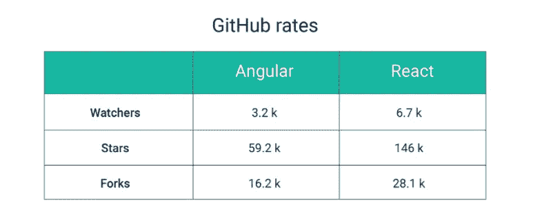

# 角度与反应:无论你选择哪个，你都可以在 Fathym 使用

> 原文：<https://javascript.plainenglish.io/angular-vs-react-whichever-you-choose-you-can-use-at-fathym-aea7c4fcd120?source=collection_archive---------14----------------------->

如果你是一名开发人员，你可能会使用 Angular 或 React，或者两者都用，这取决于你的项目。

根据 Stack Overflow，React 是目前使用最多的框架，Angular 紧随其后，排在第三位。但是在我们进入他们的流行之前，让我们做一个快速的比较。

## 角度与反应比较

在顶部，Angular 是一个 JavaScript 框架，而 React 是一个 JavaScript 库。Angular 由谷歌在 2010 年创建并发布，然后在 2016 年重新制作并重新发布。该框架目前被谷歌用于他们的谷歌广告中。

总的来说，Angular 被定义为比 React 具有更陡峭的学习曲线，但它也是更有可能被用于大规模开发的一种。它以代码的一致性、高性能和一旦你开始学习后的易用性而闻名。像 HBO、福布斯和索尼这样的大公司都使用 Angular。

## 反应

React 是脸书在 2013 年创建的，他们的 Instagram 以及网飞和 Dropbox 等网站都在使用它。

React 的学习曲线没有那么陡，部分原因是它没有 Angular 那么健壮。

与 Angular 相比，它的安装时间稍长，但 React 有助于比竞争对手更快地交付成品。它还为开发人员提供了现成的工具和大量的库。React 最适合用于单页应用程序以及最终产品周转时间很快的情况。它最出名的不仅仅是它的灵活性，还有更丰富的用户界面，快速渲染和整体渲染比角度渲染更节省时间。

## angular vs . React 2018–2022:受欢迎程度

根据 Stack Overflow，Angular 轻松保持领先 React 直到 2018 年。那是两者用户数相同的时候。从那以后，React 只是继续快速增长，成为最受欢迎的框架。

正如你在这里看到的，React 有 146k 星和 28.1k 叉，而 Angular 有 79k 星和 16.2k 叉。此外，与 27k Angular 存储库相比，React 存储库有 79k。虽然这有些不完美，但它说明了 React 在 GitHub 上使用得更多，这就是 Fathym 在我们的 git 存储库中使用的。

至于实际用户，Stack Overflow 在 2020 年的一项民意调查显示，React 的 71%用户会再次使用它，而 Angular 的用户只有 22%。另外 12%听说过 React 并想学习它，而 36%听说过 Angular 并想学习该框架。

## 角度与反应性能

两者之间的一个主要区别是 DOM，即文档对象模型，Angular 使用真实的 DOM，React 使用虚拟的 DOM。如果我们把编程接口的组织想象成一棵树，那么真正的 DOM 意味着做出一个改变会影响整棵树，而虚拟 DOM 允许开发人员在不影响整棵树的情况下改变一个特定元素。这意味着虚拟 DOM (React)更适合持续/定期更新内容(例如 Instagram feed)，而真正的 DOM (Angular)更适合不经常更新的网站。更新整个树比较慢。

谈到工具和灵活性，React 是明显的赢家。它们给开发者提供了大量的库，而 Angular 迫使用户在 HTML 中嵌入代码。

一般来说，React 是创建单个页面的一种更快的方法，尤其是具有生动用户界面的页面。Angular 速度较慢，但可以被致力于相同目标的大型团队使用。

## 肥胖中的角度与反应

那么，你会用哪一个；反应还是角度？

好消息是，你可以使用其中一个，或者两个都用 Fathym。这是因为 Fathym 是一个微前端平台。

[什么是微前端？](https://www.fathym.com/blog/articles/2022/february/2022-02-14-fathym-vs-netlify-and-vercel-micro-frontends)简单来说，就是将整体前端分解成更小的部分。这意味着个人开发人员或团队可以从事他们自己的项目，如博客或照片库，而其他人则从事电子商务商店。所有东西都无缝地集成在一个站点中。

我们的工作类比是这样的:想象一片白杨林，所有的树木都被捆绑在一个巨大的根系中。所以，实际上，它们都是一个活的实体(你的站点或应用程序)。现在，想象一下白杨林，但是所有的树都是不同的种类——黑松、枫树、白杨等等。—代表您可以在 Fathym 的各个“路线”上主持的不同项目。

它们是不同种类的树的原因是因为你，开发者，可以对你的站点的一部分(/blog)使用 GitHub repo，而对另一部分(/store)使用 NPM。也许更强大的是，你还可以为你网站的每一部分使用不同的框架。例如，对/blog 使用 React，对/store 使用 Angular。同样，对你的站点访问者来说，它看起来和感觉起来就像一个普通的站点。但是有了 Fathym，您可以利用微前端在独立、自治的团队之间扩展您的软件交付。

在 Angular 和 React 方面，Fathym 有工程师同时使用这两者。

例如，我们的高级工程师在 Fathym 应用中使用 Angular。与此同时，我们的许多初级工程师经常使用 React——仅仅因为他们更了解这种语言——来创建更小的项目和其他组件。我们的工程团队使用其中一种，或者两种都用，这取决于项目。

所以，有角 vs 有反应？有了 Fathym，就不必非此即彼了。

现在处于用户采纳阶段，我们鼓励您今天就[免费加入](https://auth.fathym.com/fathymcloudprd.onmicrosoft.com/oauth2/v2.0/authorize?p=b2c_1_sign_up_sign_in&client_id=98f014f1-2547-4bcc-a583-3edc8f1190f2&redirect_uri=https%3A%2F%2Fwww.lowcodeunit.com%2F.oauth%2FB2C_1_SIGN_UP_SIGN_IN&response_type=id_token&scope=openid%20profile&response_mode=form_post&nonce=637789907534834707.OWNhMWZkZGMtODQ2NC00YTg0LWFjZWQtYjlkNzg0YTIzMDhkYTcxMzVkZmYtN2E2Mi00ZDRlLWIxODQtZjMxMjBkNWI2OTEx&state=CfDJ8C5COa2dn0dMrEVjdLxcXm-FCakeBxrXIOHa_lF_u0ckh9rvLFuKJ30MWBprExUQA_N5HmWWWPdxqWlni-KFqpg_jVjPahrQdGw79U0sMBN8dTvgrlAMeT9--L-7VgMBsZfFPAho9dcKUN1jO6lAaxL13PM1_vGer-vJc6tcpigRpNr5jcHtitGIKjexLmQqkIslp3MFKCKAi-5IiVd3JbpibPm4gbmDQpYtgstmG9SSlpjvEqJk_2AIqtMHkiojK3kE4WSc5mcYS3FQ3hiRqVQRPlL3jI7U3bUsqGYtLuoJr_St6mGBbHvGmB6M0MCeFn_G5LDsRzyHZhBWf9a1qo6dktz_kEcsAahYPLWjAI_2&x-client-SKU=ID_NETSTANDARD2_0&x-client-ver=6.11.1.0)！

*最初发表于*[T5【https://www.fathym.com】](https://www.fathym.com/blog/)*。*

*更多内容看* [***说白了。报名参加我们的***](https://plainenglish.io/) **[***免费周报***](http://newsletter.plainenglish.io/) *。关注我们关于*[***Twitter***](https://twitter.com/inPlainEngHQ)*和*[***LinkedIn***](https://www.linkedin.com/company/inplainenglish/)*。加入我们的* [***社区不和谐***](https://discord.gg/GtDtUAvyhW) *。***