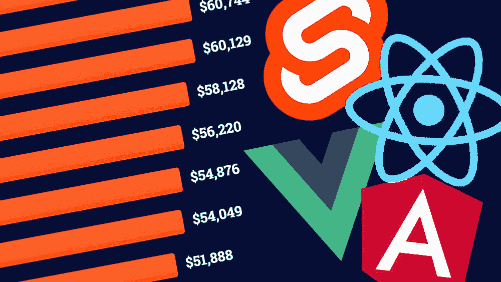
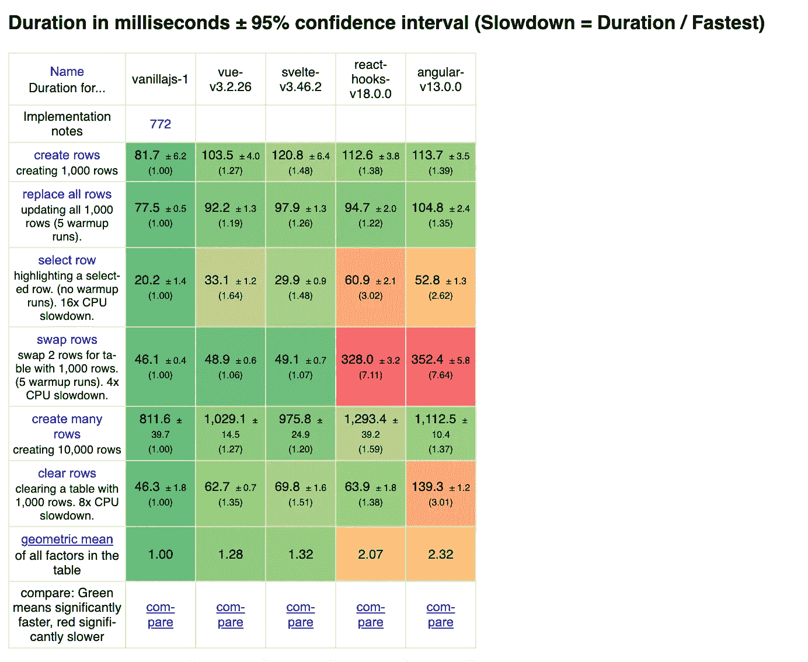
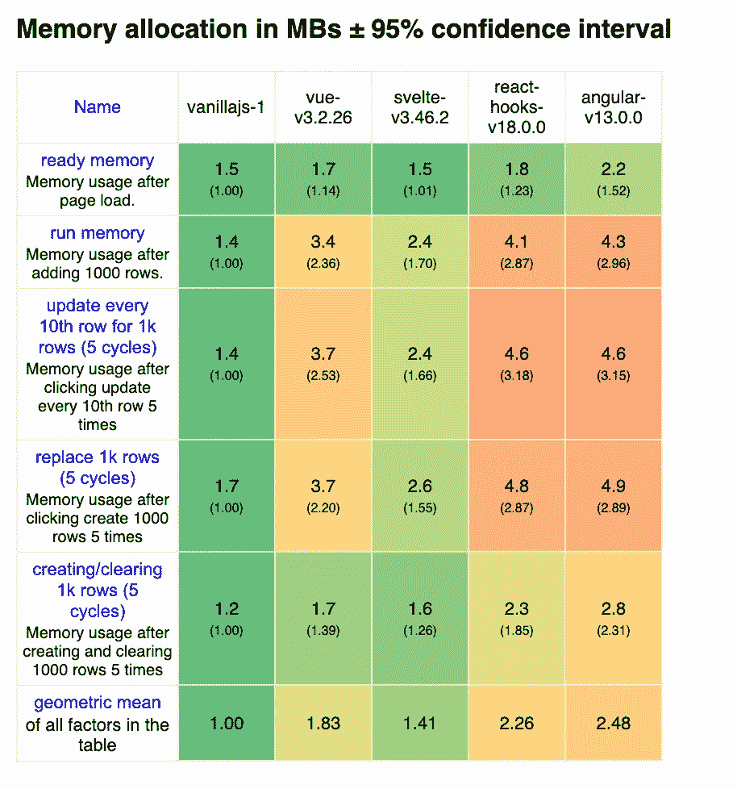
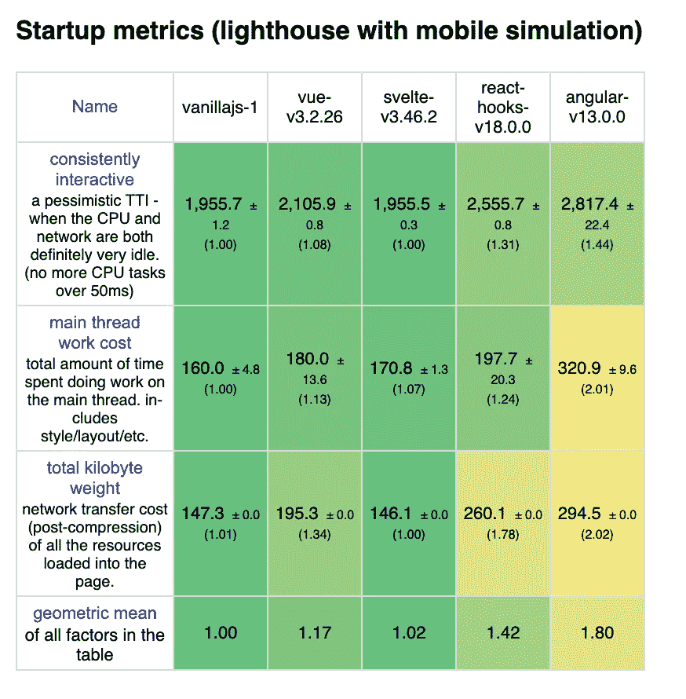
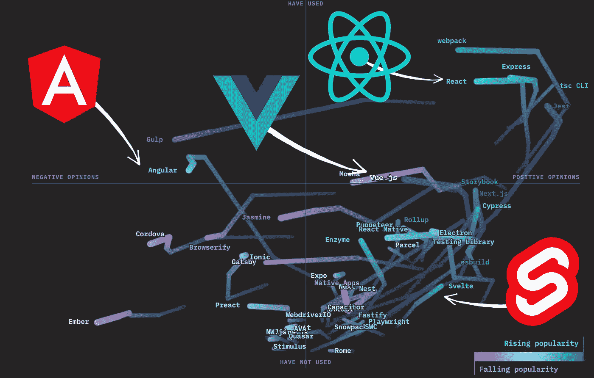

# 2022 年 Angular vs Vue.js vs React vs Svelte:数字说明了什么？

> 原文：<https://javascript.plainenglish.io/angular-vs-vue-js-vs-react-vs-svelte-in-2022-what-do-the-numbers-say-7ae38a549d8d?source=collection_archive---------1----------------------->

## 哪个 JavaScript 框架值得投入时间？

Angular，Vue.js，React，Svelte 有什么区别？不是从这些框架的基本原理的角度，也不是从它们在开发者体验方面的差异的角度，而是使用数字的冷酷事实？

为了找到答案，我们将依赖堆栈溢出和“JavaScript 状态”调查，以及 JavaScript 性能基准。这使我们能够客观地比较不同标准下的这些框架。

我们将一起看看这些不同框架的使用水平、满意度、效率，以及使用它们的开发人员的收入。

对于这些标准中的每一个，我将指定总共 10 分，我们将看到最后我们能学到什么教训。

# 使用级别。

如果我们看看堆栈溢出服务器:

*   40%的开发人员使用过 React
*   22%使用角度
*   19%使用 Vue
*   3%使用苗条

“JS 状态”调查显示了类似的数字，尽管由于调查的重点是 JS 开发人员而扩大了规模:80%的 JS 开发人员使用 React，54%使用 Angular，51%使用 Vue.js，20%使用 Svelte。

Angular 和 Vue.js 的使用率大致相当，React 大幅领先，Svelte 大幅落后。这导致**反应**5 分，Vue.js 和 Angular 各 2.5 分，Svelte 0 分。

# 开发商满意度(和 DX)

现在让我们来看看开发者的满意度。这些框架有多让人想用？开发人员对使用这些技术有多满意或沮丧？

栈溢出调查显示，Svelte 的满意度为 71%，是所有框架中的佼佼者。

接下来是 React 获得了 69%的高分。然后 Vue 有 64%。最后稍微落后一点，我们有 55%的棱角，所以在那些爱和那些恨之间几乎是一个平衡。

JavaScript 调查的状态也是这么说的，Svelte 的满意率是 90%，React 是 84%，Vue.js 是 80%，Angular 只有 45%。

所以就吸引力而言，**苗条**领先，然后 React 和 Vue.js 稍落后。所以我给 Svelte 打 4 分，给 React 和 Vue.js 打 3 分。

# 表演

现在我们来看看表演。

为此，我们将使用 [JavaScript 框架基准测试](https://github.com/krausest/js-framework-benchmark#:~:text=This%20is%20a%20simple%20benchmark,various%20operations%20including%20rendering%20duration.)工具。它是不完美的，它衡量的东西不一定在现实世界中有直接的应用，但仍然允许我们得出一些有趣的教训。

对于每个度量，它允许我们将框架与普通的 JavaScript 进行比较。

该基准分为三个主题:执行时间、使用的内存和启动时间。

如果你看一下[输出表格](https://krausest.github.io/js-framework-benchmark/2022/table_chrome_101.0.4951.41.html)，表格的每个单元格从绿色到红色再到黄色和橙色，越接近红色，我们越偏离“基本”JavaScript 的引用。

在这里，我将为这三个标准中的每一个标准指定 10 分，然后将它们平均，以给出总体相对绩效分数。

## 执行速度

如果我们从执行时间开始，对于这些测试中的许多测试，Svelte 领先，Vue.js 紧随其后，React 和 Angular 落后。所以 5 分代表苗条，4 分代表 Vue，0.5 分代表反应和棱角分明。

## 内存使用

对于使用的内存，苗条脱颖而出，Vue 稍微领先于 React 和 Angular，两者并驾齐驱。

所以 6 分代表苗条，3 分代表 Vue，0.5 分代表反应和棱角分明。

## 启动时间

在启动速度上，Svelte 表现非常出色。Vue.js 稍逊一筹，React 和 Angular 紧随其后。

这次的结果比之前的测试更同质，所以我给 Svelte 打 4 分，给 Vue.js 打 3 分，给 Angular 和 React 打 1 分。

## 绩效分数

性能方面，最终评分为:Svelte 5 分 vue . js 3.5 分，React 和 Angular 0.5 分。

# 薪水

开发人员从这 4 项技术中的每一项技术中(平均)获得多少收入。

根据 Stack Overflow，每个框架的工资中位数如下:Angular 为 49k 美元，Vue 为 50k 美元，React 为 58k 美元，最后 Svelte 为 62k 美元。

Angular 和 Vue.js 在同一范围内，React 和 Svelte 遥遥领先，Svelte 具有优势。因此，我们假设角度和 Vue 各 1.5 分，反应 3 分，苗条 4 分

# 最终比分

这给了我们以下的最终总成绩，还有 40 分可以争夺:

*   角度:4.5 度
*   Vue: 10.5
*   反应:12
*   苗条:13 岁

从中我们能得出什么结论？

好了，这是回过头来看看 JS 调查的机会。它呈现了一种形象，我认为它很好地表达了事物。它跟踪不同时间的受欢迎程度和满意度。

这个视图结合了用户满意度(从左到右)和使用率(从下到上)，我发现这个方法很有趣，它甚至显示了不同时间的轨迹。

source: State of JavaScript 2021 Survey

svelte 90%的满意率来自早期采用者，他们乐于尝试新技术。

另一方面，React 在使用方面占据主导地位，并且仍然保持着很高的满意率。

如果我们看一下使用和满意度的 4 个象限:Angular 被适度使用，但也很少被欣赏。Vue.js 被赞赏但不一定被使用，它的赞赏率似乎随着使用而降低，仿佛在失去速度。React 被广泛使用并受到赞赏，这一点尤为重要，因为……人们很容易喜欢上一个不常使用的框架，尤其是当你花时间研究它的时候。

Svelte 正在成长，越来越多的人发现并欣赏它，但它仍然非常年轻。所以我推荐学什么？

如今，React 已经成为事实上的标准。它已经在前端框架“市场”中确立了自己的地位，但由于 Next.js 和 Remix，它也开始在服务器端占据一席之地。

如果你喜欢冒险，我建议你也看看[如何减肥](/svelte-from-a-react-perspective-its-weird-but-fun-d9cc9ba242d7)。

*更多内容看* [***说白了就是***](https://plainenglish.io/) *。报名参加我们的* [***免费周报***](http://newsletter.plainenglish.io/) *。关注我们关于*[***Twitter***](https://twitter.com/inPlainEngHQ)*和*[***LinkedIn***](https://www.linkedin.com/company/inplainenglish/)*。查看我们的* [***社区不和谐***](https://discord.gg/GtDtUAvyhW) *加入我们的* [***人才集体***](https://inplainenglish.pallet.com/talent/welcome) *。*