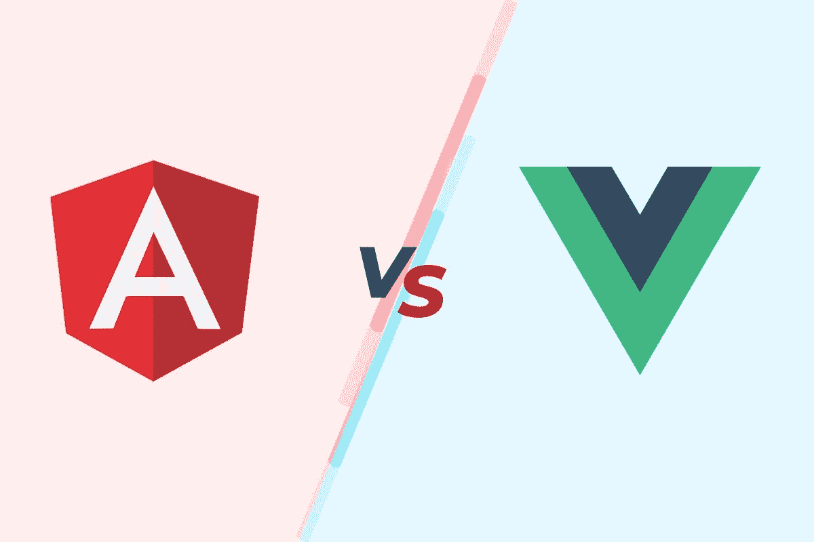
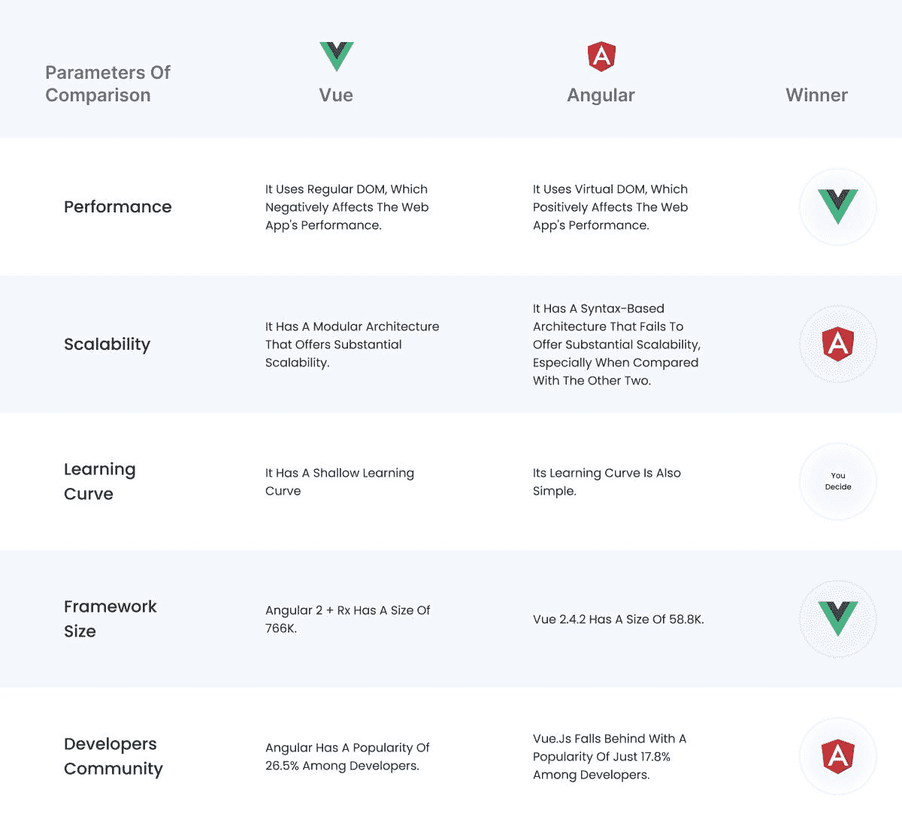
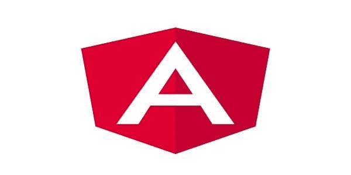
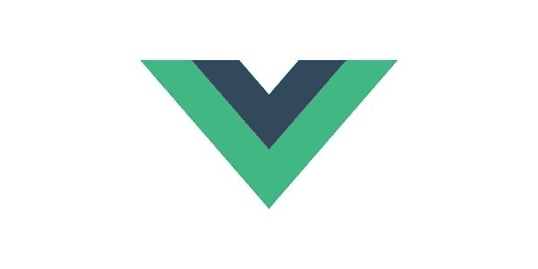
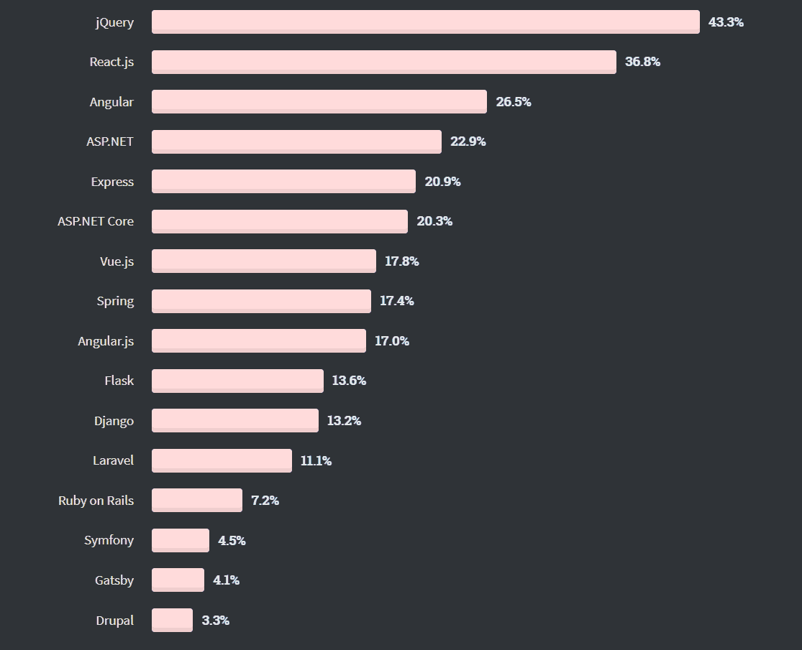

# Angular vs. Vue:我的 Web 应用程序项目的更好选择

> 原文：<https://javascript.plainenglish.io/angular-vs-vue-the-better-bet-for-my-web-app-project-d94d3a4418d9?source=collection_archive---------14----------------------->

在创建前端接口时，您可以从众多的框架和库中进行选择。然而，并不是每个框架或库都能满足所有需求，这意味着你需要尽可能多的熟悉它们。

如果你想避免每次开始一个新项目时重复编写相同的代码，你必须选择著名的优秀代码。Angular & Vue.js 是当今最流行的 JavaScript 框架之一。两者都是很好的选择，但是理想的选择很大程度上取决于你想从框架中利用什么。

为了帮助您决定您的项目，我们将在本文中比较 Angular 和 Vue，并向您展示哪个框架是更好的选择。

下面是一个简明的表格，提供了对这两个框架的深入了解:

那么哪个是最好的呢？

下面我们来详细探究一下答案。

# **Angular:被证明是创建高性能水疗中心的绝佳选择**

AngularJS(也叫 Angular)是一个开源的 web 应用框架。它由谷歌和一个社区维护，该社区帮助**创建单页应用程序，以及**在客户端只需要 HTML、CSS 和 JavaScript 的单页 web 应用程序。

网页设计者可能想要使用 angular 的一个原因是它以一种非常有效的方式使用层叠样式表(CSS)。虽然有些框架不太适合 CSS，但是 Angular development company 可以帮助你在网页设计中最大限度地利用 CSS。

因此，你会发现使用 angular 意味着你比使用其他框架更能控制你的站点的外观。您可以使用它来快速更改站点上的页面布局，并毫不费力地快速组合新页面。

由于它是如此的灵活和易于使用，许多网页设计专家认为使用 angular 可以节省你的时间和精力，同时建立你的网站。

**使用角框架的优点**

*   使用 Angular 构建大型复杂的 web 应用程序更简单。
*   该框架附带了许多特性，使开发人员的生活更加轻松。
*   您将可以使用各种工具和组件，这些工具和组件构建在彼此的基础上，并且可以和谐地工作。
*   它最终允许您快速创建可伸缩的 web 应用程序。
*   它使你的代码更容易组织。您将能够专注于构建功能，而不是编写样板 HTML、CSS 和 JavaScript。
*   您需要对 HTML、CSS 和 JavaScript 有很深的了解——但是您不需要了解任何高级概念，如数据库或服务器端逻辑，因为 Angular 会自动为您处理这些内容。
*   学习曲线有些陡峭，因为在 Angular(控制器、范围继承、指令等)中使用了太多的概念。).但是一旦你习惯了这些东西，它们会让你觉得处理大型应用程序毫不费力！

**使用角形框架的缺点**

*   学习起来有点棘手，所以雇佣有经验的开发人员并不总是容易的。
*   第二个不利因素与培训成本有关。由于 Angular 需要一些基本的 JavaScript 知识，如果员工还不熟悉它，他们可能需要从他们的时间表中抽出额外的时间进行培训。

# **Vue。JS:一个简单的轻量级框架，提供了大量的特性**

Vue 是一个开源的 JavaScript 框架，非常容易使用，并且由于其灵活性，可以集成到任何现有的应用程序中。它是轻量级的、快速的，并且与其他库和框架集成得很好。

Vue 库很简单，可以很容易地与现有项目集成。它是**又快又好学**。它将帮助您显著减少开发时间，因为它易于理解、简单，并且基于熟悉的概念，如组件、指令等。

因此，您不必学习新的框架、库或 API 来构建用户界面。但是它与其他流行的前端框架相比表现如何呢？哪些好处使它成为如此伟大的选择？

请继续阅读，了解关于 Vue 的更多信息，以及为什么您应该考虑使用它作为前端开发项目的首选框架。

**使用 Vue.js 框架的好处**

*   Vue 更容易学习，并且与其他库(如 jQuery)配合良好。它为新开发人员提供了顺畅的工作流程，也受到了阿里巴巴和三星等行业巨头的青睐。
*   对于初学者和有经验的开发人员来说，它简单、轻量、直观。这使得它成为原型开发或需要大量用户体验/设计工作的一次性项目的绝佳选择。
*   Vue 是一个比 Angular 或 React 适应性更强的框架。这对那些想避免被束缚在某一方面的人来说更好。
*   Vue.js 目前有 694 个扩展，对于大多数开发者来说已经足够了。对于那些希望将元素添加到站点的人，有一个丰富的库可供使用，您可以利用它以最小的努力满足他们的需求。
*   Vue 最大的优势之一是它最低调的特点:一个优秀且非常活跃的社区。因为它相对较新，所以 Stack Overflow 和 GitHub 上都有很多开发者希望帮助初学者学习如何用 Vue 编码。

**使用 Vue.js 框架的缺点**

*   对于知道如何使用 React 或 Angular 等其他框架的人来说，它有一个学习曲线。
*   然而，如果你需要有更多功能的东西，你可能会想看看其他地方，因为与 Angular 或 React 等其他框架相比，Vue 的功能有限。

这是一个关于这些框架作为一个个体是什么的详细讨论。现在让我们详细讨论一下他们的表现如何。

# **角度 V/s Vue.js**

> **性能:增强软件的 UX**

虚拟 DOM 只是物理 DOM 的抽象表示。从概念上讲，它离现实有一层距离。虚拟 DOM 的好处是我们可以完全控制它。因此，它可以运行各种优化，比如对某些部分进行多重表示。

然后，它只在必要时应用更新，或者删除元素，然后在它们不可见时重新插入它们，从而节省内存(基本上是批处理操作)。

Angular 使用常规 DOM，这会对项目的速度、性能和开发时间产生负面影响。相比之下， **Vue.js 使用虚拟 DOM，**减少了开发时间&提高了 web app 的速度性能。所以，当你试图创建一个高速运行的应用程序时，你应该 [**雇佣 Vue.js 开发者**](https://www.pixelcrayons.com/hire-vuejs-developer) 。

**获胜者是:*vue . js***

> **可扩展性:随着客户群的增长，确保持续出色的性能**

所有应用程序都必须随着流量的增加而增长。然而，业绩不能在压力下崩溃。框架通常是在考虑性能的基础上构建的，并提供了可轻松集成到应用程序中的可选工具，以确保其未来的可伸缩性。

Angular 通过其**模块化结构提供高可扩展性。**另一方面，Vue 并不是一个出色的选择，因为它遵循的是一种基于语法的架构，这种架构并没有前途。

**获胜者是:*棱角分明***

> **学习曲线:利用最易访问的框架**

框架的学习曲线出奇的短，主要是如果你关注更简单的库，而不是大型的、功能丰富的库。在你开始用它们做出真正非凡的东西之前，需要一些时间。

幸运的是，这两个框架都有一个简单的学习曲线，这里没有真正的赢家。

**获胜者是:*由你决定***

> **框架大小:为高性能网络应用选择一个较轻的框架**

框架可能很重，会使你的站点膨胀；你不想浪费你的装货时间。选择框架前评估尺寸。框架甚至可以从 10kb 到 100kb+。为了减轻重量，选择一个较轻的框架，并在目标用户中进行测试。

**注:** Vue 2.4.2 尺寸为 58.8K，Angular 2 尺寸为 566K。

Vue 比 Angular 轻好几倍，是这一类别的决定性赢家。

**获胜者是:*vue . js***

> **成熟的社区支持:轻松联系合格的开发人员**

围绕一个特定框架的开发者社区必须是巨大的，所以你有机会很快找到帮助。此外，许多人投入了大量精力来改进这些框架，他们的贡献使您能够从不断增长的功能和修复库中受益。

Source: [Stack Overflow Developers Survey](https://insights.stackoverflow.com/survey/2020#technology-web-frameworks-professional-developers2)

Angular 的受欢迎度为 26.5%，是这里的赢家，而 Vue.js 的受欢迎度仅为 17.8%。

**获胜者是:*棱角分明***

# **包装**

尽管在 Angular 和 Vue.js 之间做出选择似乎很困难，但我想你会同意，这两种技术都非常优秀，这一点是毋庸置疑的。

这简单地归结为一个偏好问题。Angular 拥有更成熟、更活跃的社区，更好的文档，以及针对 Bootstrap 等流行框架的更广泛的软件包选择。

然而，它也比 Vue 重，并且在没有第三方包的情况下不提供太多的灵活性或便利性。在开发过程中，这些额外的东西会增加额外的配置时间。

如果你需要建议或者仍然不知道哪一个适合你的项目，联系一家 [**IT 咨询公司**](https://www.pixelcrayons.com/technology-consulting-services) 获得免费建议。

*更多内容请看* [***说白了就是***](http://plainenglish.io/) *。报名参加我们的* [***免费每周简讯***](http://newsletter.plainenglish.io/) *。在我们的* [***社区***](https://discord.gg/GtDtUAvyhW) *获得独家获得写作机会和建议。*