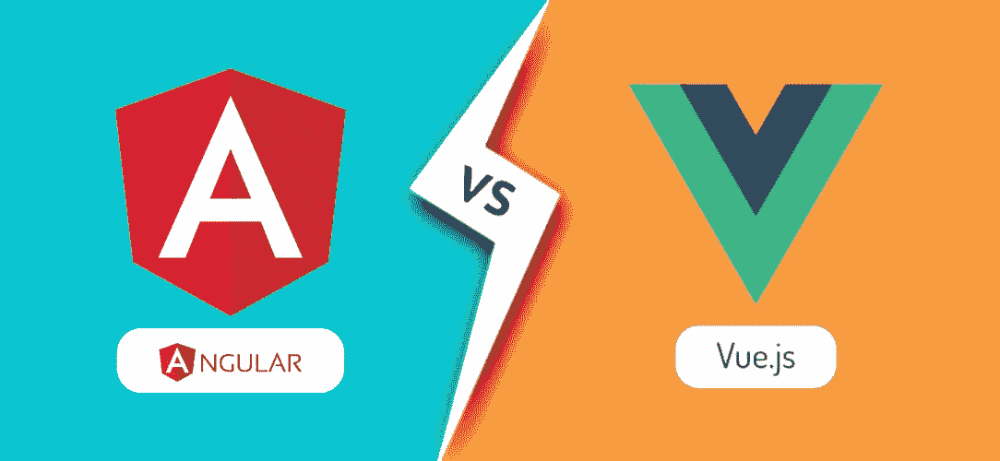

# angular Vs Vue:2022 年选择哪个框架？

> 原文：<https://javascript.plainenglish.io/angular-vs-vue-which-framework-to-choose-in-2022-579efcb50e82?source=collection_archive---------4----------------------->

## 在为您的需求选择合适的 JavaScript 框架时，需要记住的 14 个关键区别。

在前端开发的世界里，JavaScript 框架总是流行的。除了更容易创建跨平台的应用程序，它们也更有利于未来的发展。然而，并不是每个框架都受欢迎。

Angular 和 Vue 是 2022 年最流行的两个 JavaScript 前端框架。但是好处多多，哪个框架会对你的业务更有帮助呢？在我们比较这两种 JavaScript 框架之前，将简要讨论以下几点！

# **什么是棱角分明？**

企业可以使用 Angular 构建可伸缩的 web 应用程序，Angular 是一个基于 typescript 的 Javascript 框架。使用这个框架的应用程序不会变慢，因为它内置了所有的工具和库。因为代码可以在任何部署目标上重用，所以它可以在所有平台上开发。通过其动态 UI 绑定，它将属性级别的 UI 元素绑定到对象级别的数据。

最初的 AngularJS 发布发生在 2010 年，并在 2016 年被完全重写。谷歌的 Angular 团队和 Misko Hevery 开发了应用程序框架。在其他外部开发人员的帮助下，该框架现在由同一个团队管理。

# **什么是 Vue？**

称为 Vue 的轻量级和灵活的基于 JavaScript 的框架为开发现代 spa 和前端 web 应用程序提供了高级 web 工具。像 Vue 这样的 JavaScript 框架是通用的和渐进的，因为它们允许在不影响核心特性的情况下修改代码，并且提供了一种构建渐进 UI 组件的方法。由于其高度的解耦性，Vue 还提供了使用定制模块和可视化组件来扩展 web 应用程序功能的机会。

## **1。学习曲线**

如果你打算创建一个 Angular 应用程序，你必须了解 MVC 和 TypeScript 等概念。Vue 是这个规则的一个例外。它比 Angular 更容易使用，因为 Vue 提供了更多的定制和内置模板。

该应用程序由 React 和 Angular 提供支持。因此，开发人员可以使用 Vue.js 平台轻松构建基于 Angular 或 React 的移动解决方案。

## **2。应用程序的性能**

在构建 web 应用程序时，您可以单独通过 DOM(文档对象模型)来实现性能。更重要的是，这个元素会影响整个网页的性能。在这场竞赛中，尽管 Angular 和 Vue 都支持虚拟 DOM 特性，但 Vue 还是赢了。

对虚拟 DOM 的更新会更新所呈现的元素。因此，该应用程序运行速度更快。

## **3。复杂性**

Vue 的 API 和设计比 Angular 简单得多，因为它的创建比其他 JavaScript 框架晚得多。相比较而言，Angular 的开发环境比 Vue 更复杂。

## **4。可扩展性**

Vue 不灵活，而 Angular 采用模块化设计。另一方面，Vue 基于模板的语法减少了大规模应用程序中的代码重用。

## **5。灵活性**

虽然 Angular 为开发者提供了各种各样的开发系统，但 Vue 更加灵活，不会强迫开发者改变他们应用的结构。所以从灵活度来说，Vue 是比 Angular 更好的选择。

## **6。开发者社区和可访问性**

随着我们对这两个系统的熟悉，我们可以看到 Vue 和 Angular 都有来自大型实体如脸书和谷歌的强大网络支持。

Autodesk、微软、Adobe、苹果、Upwork、Freelancer、EuroNews、Telegram、小米、阿里巴巴、GitLab、WizzAir 和 Grammarly 正在使用的正是这些技术。

## **7。数据绑定**

Vue 的基础是单向数据绑定，它防止在修改模型之前更改 UI 组件。然而，Angular 使用双向数据绑定，当 UI 组件改变时，模型状态改变，反之亦然。

双向绑定可能看起来更简单，但在创建更快的数据流和使重要的应用程序更快方面，双向绑定落后于单向绑定。

## **8。架构**

影响 web 应用程序框架选择的一个重要因素是架构。使用 Angular 开发动态 web 应用和网站是通过 MVC(模型-视图-控制器)和 MVVM(模型-视图-视图模型)完成的。

另一方面，Vue 主要关注视图模型，提供的信息很少。因此，在建筑方面，Angular 赢得了比赛。

## **9。测试**

就测试而言，Angular 是比 Vue 更好的选择。测试很容易，因为它提供了许多工具，比如 Karma 和 Jasmine，它们分别检查整个开发代码。

或者，Vue 提供的测试指南更少，导致开发人员很难制作出完美的应用。

## **10。类型脚本支持**

JavaScript 的升级版 TypeScript 与 Angular 完美集成。没有打字稿，有角度的生态系统无法编码。

与普遍的看法相反，Vue 更喜欢用 JS 来写代码。此外，它为开发人员提供了官方装饰器和类型，以协调 TypeScript 功能。

## **11。易于部署**

Angular 的更新版本包括了惰性路由的动态导入、CLI 增强、差异加载等功能。这简化了部署过程。

相反，Vue development 允许您将任何东西导入应用程序领域，或者使用命令行界面建立复杂的本地机构来管理代码优化。预编译 Vue.js 中的模板将利用元素的惰性加载。

## 12.应用程序加载时间和大小

Angular 最近的版本包括诸如摇树和 AOT 编译等功能，这些功能大大减少了应用程序的大小。虽然基于角度的应用比基于 Vue 的应用更轻，但角度应用并没有那么轻。

此外，加载时间很大程度上取决于应用程序的大小。这使得 Vue 应用程序的响应速度更快。

## 13。人气

Vue 在 GitHub 上收到了许多 forks 和 stars，但是它没有足够数量的提交者和贡献者。由于这个问题，Angular 和 Vue 之间没有明确的赢家。

## **14。移动解决方案**

Angular 作为一个 web 应用程序框架，用于构建即时聊天或消息应用程序等实时应用程序。相比之下，Vue 用于创建界面简单的轻量级 web 应用程序。

# **结论**

[Angular](https://www.wingstechsolutions.com/outsourcing/angularjs-developers/) 更高级，工具范围更广，而 [Vue](https://www.wingstechsolutions.com/outsourcing/hire-vuejs-developer/) 更基础，更直观；然而，两者都有一些共同的特征。在牢记您的[应用](https://www.wingstechsolutions.com/service/mobile-app-development/)需求的同时，为工作选择合适的框架将确保成功。

它不是关于每个框架中可用的每个功能；它是关于权衡你的业务需求和每个框架所能提供的。为您的应用程序选择合适的框架比随大流更重要。

如果您对这些框架有任何问题、看法或意见，请随时发表评论。如果你有兴趣为你的下一个项目雇佣最好的开发人员，请在这里联系我们。

*更多内容请看*[*plain English . io*](http://plainenglish.io/)*。报名参加我们的* [*免费每周简讯*](http://newsletter.plainenglish.io/) *。在我们的* [*社区不和谐*](https://discord.gg/GtDtUAvyhW) *获得独家获得写作机会和建议。*