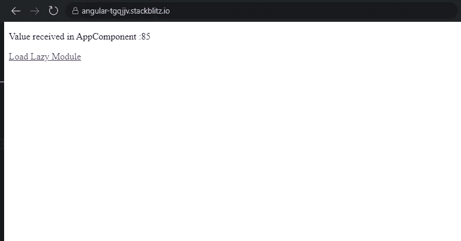
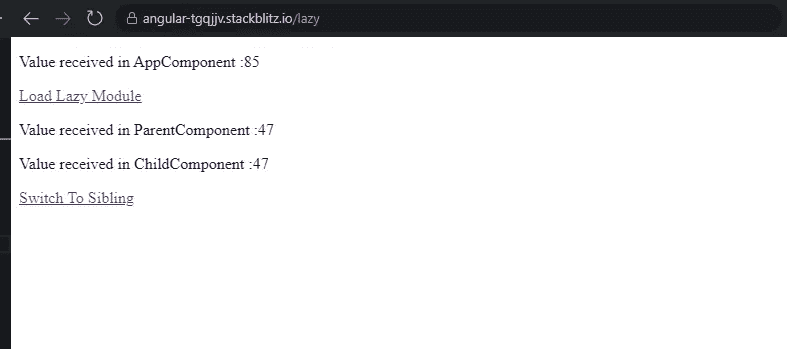
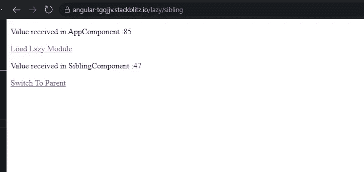
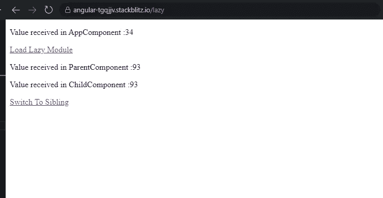
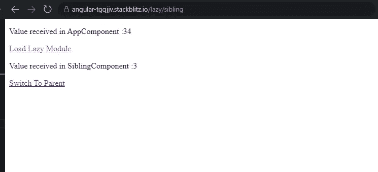

# Angular:您可以提供服务的方式和位置，以及它对服务的单体状态的影响——第三部分

> 原文：<https://javascript.plainenglish.io/angular-ways-and-places-you-can-provide-services-and-the-impact-it-has-on-the-singleton-status-of-4b79a5c6231c?source=collection_archive---------7----------------------->

这是 3 部分系列的最后一部分。这个故事关注的是如何在延迟加载的特性模块中提供服务，以及它如何影响创建的服务实例的数量。

如果你对同一个主题更感兴趣，但是对一个 **AppModule** 更感兴趣，你可以看看下面的故事。

[](/angular-different-ways-and-places-you-can-provide-services-and-their-impact-on-the-singleton-81fc2fe538bf) [## Angular:你可以提供服务的不同方式和地点以及它们对单身者的影响…

### 缺省情况下，Angular 中的服务是单例的。就这样结束了吗？不完全是。大多数时候，我们唯一的两个地方…

javascript.plainenglish.io](/angular-different-ways-and-places-you-can-provide-services-and-their-impact-on-the-singleton-81fc2fe538bf) 

对于**急切加载的功能模块**你可以查看下面的故事。

[](https://ramya-bala221190.medium.com/angular-different-ways-and-places-you-can-provide-services-and-its-impact-on-singleton-status-of-1e9330c60744) [## Angular:你可以提供服务的不同方式和地点及其对单身状态的影响…

### 这个故事只关注在一个加载功能模块中提供服务。如果你有兴趣探索…

ramya-bala221190.medium.com](https://ramya-bala221190.medium.com/angular-different-ways-and-places-you-can-provide-services-and-its-impact-on-singleton-status-of-1e9330c60744) 

我已经创建了一个带有一个名为 **LazyModule** 的延迟加载功能模块的项目。该模块有 3 个组件: **ParentComponent、ChildComponent 和 SiblingComponent** 。

顾名思义，ChildComponent 是 ParentComponent 的子级，SiblingComponent 是 ParentComponent 的同级。

我们只有一项服务**数据服务**。

下面是 **AppModule @NgModule()定义**。

```
export const routes: Routes = [
{
path: ‘lazy’,
loadChildren: ‘./lazy/lazy.module#LazyModule’,
},
];

@NgModule({
imports: [BrowserModule, FormsModule, RouterModule.forRoot(routes)],
declarations: [AppComponent],
bootstrap: [AppComponent],
providers: [DataService],
})

export class AppModule {}
```

我们已经编写了加载 **LazyModule** 的路径。

我们已经将**数据服务**添加到 NgModule 的**【providers】**中。提供服务不会创建服务的实例。只有当服务被注入到需要它的类的构造函数中时，才会创建实例。

**这意味着每当 DataService 被注入到应用程序中任何类的构造函数中时，DataService 的同一个实例将对所有其他类可用。**

这种说法确实有例外。我们很快就会看到这一点。

移动到 **LazyModule @NgModule()定义**。

```
export const routes: Routes = [
{
path: ‘’,
component: ParentComponent,
},
{
path: ‘sibling’,
component: SiblingComponent,
}
];

@NgModule({
imports: [CommonModule, RouterModule.forChild(routes)],
declarations: [ParentComponent, ChildComponent, SiblingComponent],
providers: [DataService],
})

export class LazyModule {}
```

当 **LazyModule** 加载时，正如你从上面的 Route 定义中所猜测的，默认情况下，ParentComponent 及其子 ChildComponent 将被加载。

我们还在 LazyModule 级别通过**【providers】**提供了数据服务。

这就是数据服务的样子。我们已经创建了一个属性 **randomNum** 来保存一个随机数。 **fetchNumber()** 返回这个随机生成的数字。

```
@Injectable()
export class DataService {
constructor() {}

public randomNum: number = Math.floor(Math.random() * 100);

fetchNumber() {
return this.randomNum;
}
}
```

如果数据服务的**同一个实例被注入到所有的类中，那么所有的类都必须接收到**同一个随机数**。**

转到组件，所有组件类都是彼此的精确副本。

让我只展示一下 **AppComponent 类**。我们调用了数据服务的 **fetchNumber()** 来获取生成的随机数。这个随机数将显示在模板中。

其他组件类将遵循相同的模式。

```
@Component({
selector: ‘my-app’,
templateUrl: ‘./app.component.html’,
styleUrls: [ ‘./app.component.css’ ]
})

export class AppComponent {
constructor(private service: DataService) {}
public randomNumber: number;

ngOnInit() {
this.randomNumber = this.service.fetchNumber();
}
}
```

就组件模板而言，

LazyModule 的组件将被加载到 AppComponent 的 **< router-outlet >** 中。

ChildComponent 通过引用承载在 ParentComponent 内部。

下面是这个应用程序现在的样子。如您所见，AppComponent 从 DataService 接收到了一个随机数。现在让我们加载 LazyModule 来检查 Parent、Child 和 SiblingComponent 收到的随机数。



点击**“Load Lazy Module”**链接将加载< router-outlet >中的 **LazyModule** ，如下所示。默认情况下，当模块加载时，ParentComponent 及其子 ChildComponent 已经加载。



Parent 和 ChildComponent 收到了与 AppComponent 不同的随机数。

SiblingComponent 呢？点击**“切换到同级”**链接将加载<路由器出口>中的 SiblingComponent。如下所示，SiblingComponent 也收到了与 Parent 和 ChildComponent 相同的随机数。



通过观察，我们得出结论, **AppComponent 使用的 DataService 实例不同于 LazyModule 组件使用的 DataService 实例。**

下一个出现的问题是，为什么实例是不同的？

AppModule 和 LazyModule 都提供数据服务。AppModule 与 **RootModuleInjector** 相关联。

当路由器延迟加载一个特征模块时，**它创建一个新的执行上下文，它有自己的注入器，并且这个注入器是 RootModuleInjector** 的子。

**路由器还将 LazyModule 的提供者及其导入的 NgModules 的提供者添加到这个子注入器。**

由于 AppModule 和 LazyModule 使用不同的注入器，它们将产生不同的 DataService 实例。

由于实例不同，由数据服务提供的随机数的值也将不同。

让我稍微调整一下 ParentComponent，这样**也可以提供数据服务**。

```
@Component({
selector: ‘app-parent’,
templateUrl: ‘./parent.component.html’,
styleUrls: [‘./parent.component.css’],
providers:[DataService]
})

export class ParentComponent implements OnInit {
/*
Nothing changes here. The code remains the same.
*/
}
```

现在请注意，AppModule、LazyModule 和 ParentComponent 提供数据服务。

应用程序现在看起来是这样的。



只有父组件和子组件接收的随机数匹配。但这次它们与 SiblingComponent 不同。SiblingComponent 收到了不同的随机数。

为什么，**即使这 3 个组件属于同一个特征模块，兄弟组件从父组件和子组件接收到不同的随机数？**

1.  当我将 DataService 注入到 AppComponent 的构造函数中时，DI 系统将检查服务实例对于与 AppComponent 关联的注入器是否可用。

由于 DataService 不是在 AppComponent 级别提供的，并且由于 AppComponent 没有任何父级，DI 系统将使用与 **AppModule** 相关联的 **RootModuleInjector** 来检查服务实例是否可用。

在 AppModule 的【providers】中提供了**数据服务。因此，DI 系统可以使用 **RootModuleInjector** 找到服务实例。**

2.当我将 DataService 注入到 **SiblingComponent** 的构造函数中时，DI 系统将检查服务实例是否可以使用与 SiblingComponent 关联的注入器。

不要！**在 SiblingComponent 级别没有提供数据服务**。因此，DI 系统向上移动一个级别，并且**检查与 SiblingComponent(即 AppComponent)的父组件相关联的注入器。**

**在 AppComponent 级别没有提供 data service**，由于 AppComponent 没有任何父级，DI 系统将在模块级别开始检查。

它首先**检查数据服务是否在 LazyModule 级别**提供。是的，它提供了！但是我们已经知道，LazyModule 和 AppModule 与不同的注入器相关联。

因此，与 LazyModule 关联的注入器将为 SiblingComponent 创建一个新的 DataService 实例。这解释了为什么 AppComponent 和 SiblingComponent 收到了不同的随机数。

3.当我将 DataService 注入到 **ParentComponent** 的构造函数中时，DI 系统将检查服务实例是否可以使用与 **ParentComponent** 关联的注入器。

是的，它是可用的！正如我们前面看到的， **DataService 是通过 ParentComponent** 中的【providers】提供的。因此与 ParentComponent 关联的**注入器将创建一个新的 DataService 实例。**

这解释了为什么 ParentComponent 收到的随机数不同于 AppComponent 和 SiblingComponent。

4.当我将 DataService 注入到**子组件**的构造函数中时，DI 系统将检查服务实例是否可以使用与**子组件**关联的注入器。

不，它不可用！因此，DI 系统向上移动一个级别，并且**检查实例是否可用于与子组件的父组件(即 ParentComponent)相关联的注入器。**

是的，它是可用的！DataService 通过 ParentComponent 中的[providers]提供。因为与 ParentComponent 关联的 injector 已经创建了一个 DataService 实例，所以它不会再创建另一个实例。DI 系统为 ChildComponent 重用相同的 DataService 实例。

这解释了为什么 ParentComponent 和 ChildComponent 从 DataService 接收到相同的随机数。

在这个例子的最后，我们有 3 个**数据服务**的实例，

= >一个是在 AppModule 级别创建的。

= >秒是在 LazyModule 级别创建的。

= >第三个在 ParentComponent 级别创建。

您可以在下面找到完整的工作示例。

[](https://stackblitz.com/edit/angular-tgqjjv?file=src/app/app.component.ts) [## 角形(叉形)堆叠

### 一个基于 rxjs，tslib，core-js，zone.js，@angular/core，@angular/forms，@angular/common 的 angular-cli 项目…

stackblitz.com](https://stackblitz.com/edit/angular-tgqjjv?file=src/app/app.component.ts) 

*更多内容看* [***说白了就是***](https://plainenglish.io/) *。报名参加我们的* [***免费周报***](http://newsletter.plainenglish.io/) *。关注我们关于* [***推特***](https://twitter.com/inPlainEngHQ) ， [***领英***](https://www.linkedin.com/company/inplainenglish/) ***，***[***YouTube***](https://www.youtube.com/channel/UCtipWUghju290NWcn8jhyAw)***，*** *和****不和*** *对成长黑客感兴趣？检查出* [***电路***](https://circuit.ooo/) ***。***