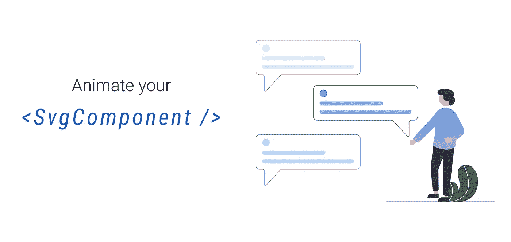
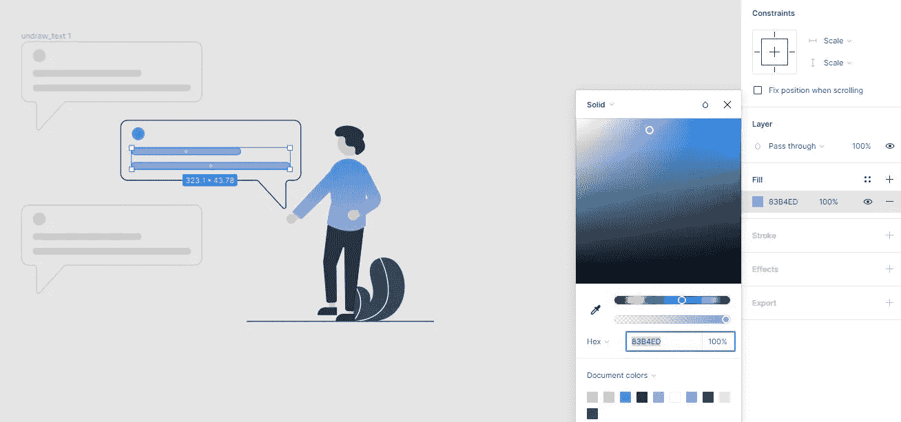
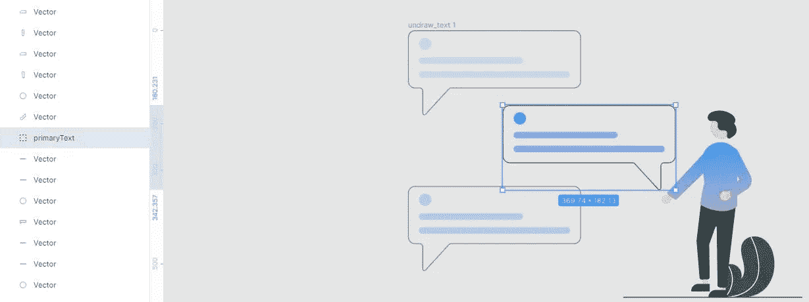
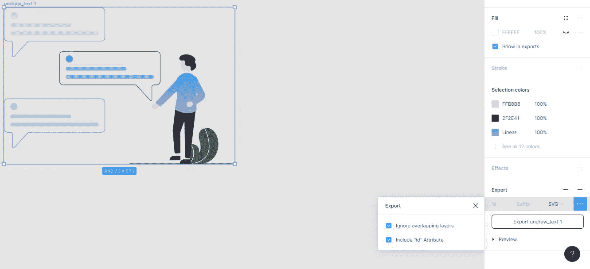
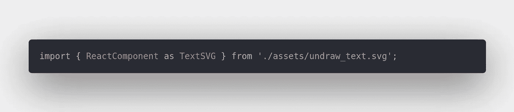

# 将 SVG 作为反应组件制作动画

> 原文：<https://javascript.plainenglish.io/animate-svgs-as-react-components-233b0df3caf6?source=collection_archive---------3----------------------->

## 使用 Figma 轻松制作您最喜欢的 SVG 动画，并做出反应

一直吸引我注意力的一件事是动画制作——让事物变得栩栩如生，并额外努力确保它们看起来像 T2 一样干净。

在本文中，我们将使用来自 Undraw.co**—*一个明星项目和我的插图指南*的开源插图。虽然这里的例子相当简单，但可能性几乎是无限的。尽情发挥你的想象力吧！**

## **第一步。找到你最喜欢的 SVG 并导入到 **Figma****

**在这一点上，您也可以决定微调每个矢量的颜色，通过选择它，然后用填充十六进制值，甚至添加自定义渐变。**

****

****Adjusting the vector colors****

## **第二步。对要制作动画的向量进行分组**

**在这里，我们希望根据我们的最终目标，以一种有意义的方式对我们希望制作动画的向量进行分组。为了清楚起见，我将把组成**每个**消息气泡的向量组合在一起，因为每个消息的动画效果都不同。另一组是植物包含的两种载体。**

**在 Windows 上，**选择**多个矢量的快捷方式是 *Shift + Click* 。一旦我们选择了我们想要分组的向量，我们可以用 *Control + G* 对选择进行**分组。****

**此时，我们的组被分配了一个通用名称(见组 1)，并且在*层菜单*中可见。用一个唯一的标识符来重命名它是非常重要的，因为我们稍后将使用它来制作那个组的动画。**

****

****Grouping the vectors and assigning a unique ID****

## **第三步。导出 SVG**

**为了导出整个帧，我们通过*图层菜单*选择父帧，然后通过右边的*设计菜单*将导出的文件类型定义为 *SVG* 、*。***

**这里**重要的**是检查**‘包含 id 属性’**选项，因为这个*将允许我们使用我们之前定义的组名*。**

****

****Exporting the SVG with the corresponding identifiers****

## ****第四步。导入 React 并将其用作组件****

**只要您使用的是*React-scripts @ 2 . 0 . 0*&*React @ 16 . 3 . 0**【或更高版本】*就可以直接导入并渲染 SVG 作为 [React 组件](https://create-react-app.dev/docs/adding-images-fonts-and-files/)，使用以下语法:**

**提示:不要忘记添加一个可访问的标题道具。**

****

****Importing it as a React component****

## **第五步。定义你的动画**

**此时，你可以*让你的想象力天马行空*。唯一需要记住的是，为了**应用动画**，你将使用我们之前通过 Figma 设置的 id，作为典型的 CSS **id 选择器**。**

**我准备了一个 s *和盒子*给你玩，所以[可以随意叉一下，实验一下](https://codesandbox.io/s/animating-svgs-pl95f?file=/src/App.js)。**

****Interactive code sandbox****

**我真的希望你喜欢阅读这篇文章，并发现它很有用。以一种创造性的方式让 SVG 活起来当然是一种乐趣，但是避免过度使用它是很重要的，因为它会影响用户的体验和应用程序的可访问性。**

**一如既往，我强烈建议遵循 WGAC 的建议，将动画融入到你的设计中，以一种有意义的 T21 和有用的方式。**

**谢谢你花时间阅读这篇文章，我期待着在下一篇文章中见到你！**

***更多内容请看*[***plain English . io***](http://plainenglish.io/)*。报名参加我们的* [***免费每周简讯***](http://newsletter.plainenglish.io/) *。在我们的* [***社区***](https://discord.gg/GtDtUAvyhW) *获取独家写作机会和建议。***