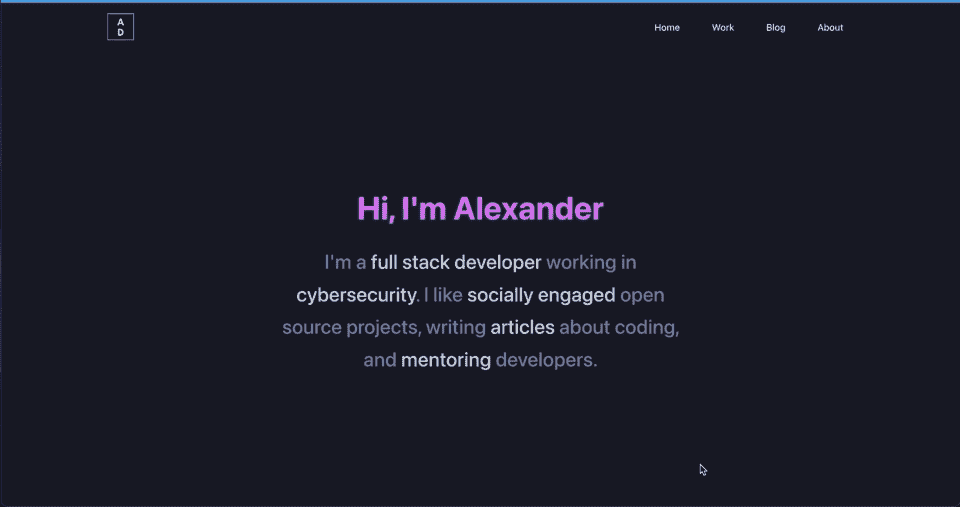
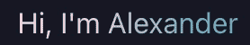

# 带有反应和样式组件的动画文本渐变

> 原文：<https://javascript.plainenglish.io/animated-text-gradients-with-react-and-styled-components-93891797eaf1?source=collection_archive---------3----------------------->

## 一个简单的和可扩展的方法来激活文本渐变。

Animated text gradient example — see [https://alexanderdarby.com](https://alexanderdarby.com) for a live example

我最近完成了我自己的个人网站。大声喊出我从 Nirmalya Ghosh 那里使用的优秀造型[模板](https://github.com/ghoshnirmalya/nirmalyaghosh.com)！无论如何，我对登陆页面非常满意，正如你在上面看到的，它有一个整洁的渐变。

然而，我对此采取的方法有点不太好。我没有自己想出如何微调渐变之间的过渡，而是使用了`hue rotate`滤镜功能，它只是动态地改变颜色。它确实做到了它在罐子上所说的——旋转所有的颜色。

虽然这看起来不错，但如果你不得不，比如说，匹配一家公司的品牌颜色，那就不太好了。因此，我想弄清楚如何正确地做到这一点，因为没有多少关于如何用样式化组件在线做到这一点的例子。

这是我想出来的:

这会产生如下所示的结果:

More precise example

这里的技巧是给文本一个真正大的背景，在上面第 32 行用`background-size`处理。然后你可以制作动画来过渡你在渐变描述中列出的所有颜色——这里指的是第 31 行的`#ee9ca7,#ffdde1, #2193b0, #6dd5ed`。

就这样:-)

*更多内容看* [***说白了。报名参加我们的***](http://plainenglish.io/) **[***免费周报***](http://newsletter.plainenglish.io/) *。在我们的* [***社区不和谐***](https://discord.gg/GtDtUAvyhW) *获得独家获取写作机会和建议。***