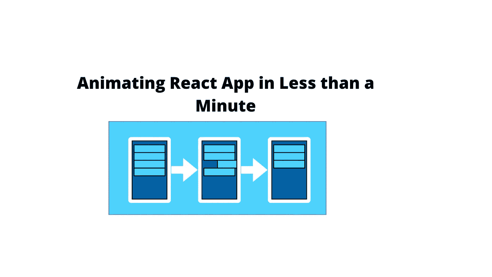

# 如何在不到一分钟的时间内制作一个 React 应用程序的动画

> 原文：<https://javascript.plainenglish.io/animating-react-app-in-less-than-a-minute-bb602f88261b?source=collection_archive---------6----------------------->

## 使用 AutoAnimate 在不到一分钟的时间内制作 React 应用程序动画的快速指南



# 动机:

构建任何类型的 web 应用程序都需要动画看起来很好，我们可以通过第三方库添加动画，如 Framer motion 或普通的旧 CSS，但问题是所有这些选项都需要我们编写大量的代码，并定义所有的动画定时和东西，我们今天将跳过所有这些，使用[自动动画](https://auto-animate.formkit.com/)为我们制作动画。

# 简介:

auto imate 是一个零配置的嵌入式动画工具，可以为你的 web 应用添加平滑过渡。您可以使用 React、Vue.js、Svelte 或任何其他 JavaScript 框架。

# 安装:

```
yarn add @formkit/auto-animate
```

这就是安装和配置的全部内容。

# 用法:

只需导入表单 [@formkit](https://dev.to/formkit) /auto-animate 并使用`useRef`传递父元素的引用。
现在，无论何时添加、删除或移动所有子元素，它们都将被激活。

```
import { useState, useRef, useEffect } from 'react'
import autoAnimate from '@formkit/auto-animate'const Dropdown = () => {
  const [show, setShow] = useState(false)
  const parent = useRef(null) useEffect(() => {
    parent.current && autoAnimate(parent.current)
  }, [parent]) const reveal = () => setShow(!show) return <div ref={parent}>
    <strong className="dropdown-label" onClick={reveal}>Click me to open!</strong>
    { show && <p className="dropdown-content" >Lorum ipsum...</p> }
  </div>
}export default Dropdown
```

就是这样。你的下拉菜单是动态的。
您可以传递任何元素的 ref，所有子元素也将像 List 一样被动画化。

# 定制:

AutoAnimate 也为`useAutoAnimate`提供了一个钩子来定制动画，如果我们需要的话。

```
App.jsx
import { useState } from 'react'
import { useAutoAnimate } from '@formkit/auto-animate/react'const App = function () {
  const [items, setItems] = useState([0, 1, 2])
  const [parent] = useAutoAnimate({ duration: 500 })
  const add = () => setItems([...items, items.length])
  return <>
  <ul ref={parent}>
    {items.map(
      item => <li key={item}>{ item }</li>
    )}
  </ul>
  <button onClick={add}>Add number</button>
  <button onClick="{() => enableAnimations(false)}">Disable</button>
</>
}export default App
```

这篇文章的重点是 React，它在普通的 JS 上更容易，基本上你可以在任何 JS 项目上使用它。

这里是官网的[链接。干杯。](https://auto-animate.formkit.com/)

*更多内容请看*[***plain English . io***](https://plainenglish.io/)*。报名参加我们的* [***免费周报***](http://newsletter.plainenglish.io/) *。关注我们关于*[***Twitter***](https://twitter.com/inPlainEngHQ)[***LinkedIn***](https://www.linkedin.com/company/inplainenglish/)*[***YouTube***](https://www.youtube.com/channel/UCtipWUghju290NWcn8jhyAw)*[***不和***](https://discord.gg/GtDtUAvyhW) *。对增长黑客感兴趣？检查* [***电路***](https://circuit.ooo/) *。***