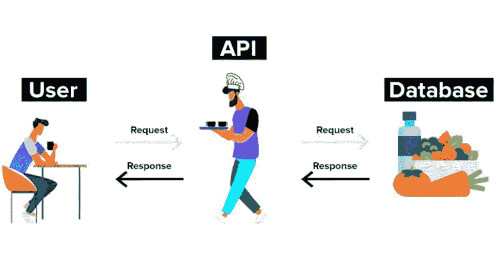
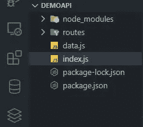
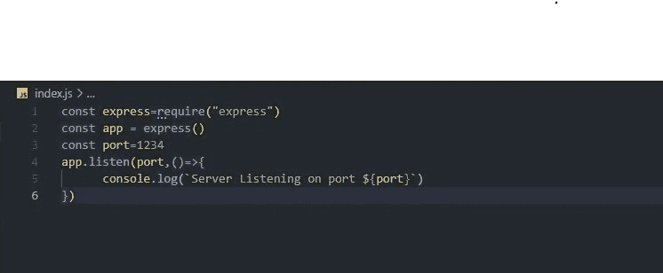
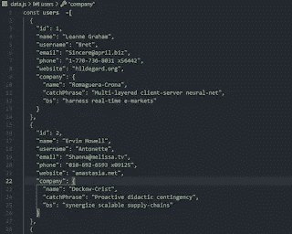
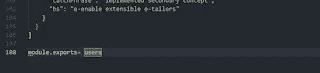
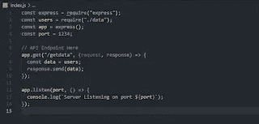
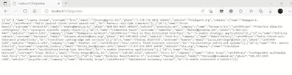

# Express 中的 API 端点

> 原文：<https://javascript.plainenglish.io/api-endpoint-in-expressjs-mern-stack-part-4-94399afb92f0?source=collection_archive---------16----------------------->

## MERN 堆栈第 4 部分:如何编写一个演示 API 端点，在这里我们可以发送请求并获得一些响应。

[API 端点](https://www.mayhemcode.com/2022/06/api-endpoint-in-expressjs-mern-stack.html)就像是 web 应用前端和后端之间的桥梁。所有相关信息都使用这种方法在系统之间传递。 **API 代表应用程序接口**，顾名思义是 web 应用的接口。

在前几篇文章中，我们看到了如何为 MERN 堆栈开发建立一个环境，我们还看到了如何使用名为 npm 的节点管理器安装相关的依赖项。在本文中，了解如何编写一个演示 API 端点，在这里我们可以发送请求并获得一些响应。

链接到以前的文章:[使用 Express 创建 API 端点](https://www.mayhemcode.com/2022/01/creating-api-endpoints-using-expressjs.html)

# 什么是 API？

第一个问题很重要，但我们在之前的文章中没有回答，那就是 API 到底是什么，它在 web 开发和 MERN 堆栈中有什么用？。我们用一个简单的例子来理解这一点。假设我们去一家酒店，我们点了几样东西。服务员或其他人负责点菜。然后将请求发送给厨师，让他制作所需的菜肴。然后服务员会再一次把东西送过来。处理网络应用程序的整个过程。你是一个用户，请求页面和网站，然后服务员或 API 将把请求发送到后端服务器，后者处理并发送相关的响应。

# 步骤 1:创建 Express 应用程序。

首先，我们需要创建一个 express 应用程序，这是我们在上一篇文章中创建的，如果您还没有看到它，请查看上面的链接，在这一步，我们安装依赖项，如 **Express、Axios、Nodemon、**等。然后我们创建一个名为 index.js 的入口点或主文件。

Index.js 是入口点，除此之外，我们还创建了 1 个文件 data.js 和一个名为 routes 的文件夹，data.js 将包含用于测试的虚拟 API 数据，routes 文件夹将包含所有页面和路由。我们将在本文的后面研究这些文件。

# 步骤 2:启动 Express 服务器。

现在我们将看到如何用一个特定的端口号启动一个 express 服务器，你可以随意给定任何端口号。代码非常容易理解。

首先，我们需要将库添加到文件中，就像我们在 python 中做的那样，比如导入“库名”，或者在 C 中做的那样，比如#include <stdio.h>，在 javascript 中，我们使用 require()方法添加库。所以常量变量 express 会有 express 库的所有模块，那么我们通过初始化 express 模块来创建一个 app。这里我们使用了端口号 1234，你可以使用任何你想要的数字，只要看到端口没有被其他服务占用。</stdio.h>

**注意:JavaScript 的所有语法都是基于 ES6 版本的 JavaScript。**

接下来，我们使用 listen()方法让应用程序监听指定的端口 1234。我们可以看到，这个方法有两个参数，一个是数字，另一个是元组或列表。第一个值是端口号，下一个值可用于请求和响应。

# 步骤 3:制作虚拟 API 数据。

大多数 web 应用程序使用数据库数据和 API 从这些数据库中获取数据并显示给最终用户，为了使本教程简单，我们将使用一个 javascript 文件来存储所有信息。你可以用**JSON(JavaScript Object Notation)**格式创建自己的数据，这里我使用了来自一个名为 [JSON placeholder](https://jsonplaceholder.typicode.com/) 的网站的数据，你也可以获得不同大小的 JSON 数据来测试应用。

所以我已经复制了所有的信息，保存在 data.js 文件中。变量名为 users。我们还需要在这个文件的末尾再添加一行代码，这样我们就可以在其他文件中使用它。

因此代码 **module.exports** 将导出用户的变量，这样它就可以导入到其他文件中以访问数据。

# 步骤 5:创建请求数据的端点。

我们已经使用 listen()方法让服务器在端口 1234 上进行侦听，就像我们可以使用指定的路径让不同的端点连接到服务器一样。例如“/主页”和“/主页”，它们将作为服务器的不同端点，提供不同类型的信息。在这里，我们可以创建两种类型的请求:GET 请求和 POST 请求。

我们将使用一个 GET 页面，因为在本文中，我们不会动态地请求特定的用户，我们是唯一请求整个数据的用户，所以 GET 请求适合于获取信息。当我们向服务器发送一些信息(如用户名、密码或其他具体细节)时，可以使用 POST 请求。为了获取相关数据，我们可以使用 POST 方法。我们将看到关于如何为请求各种各样的数据制作一个动态 API 端点的文章。

我们已经使用了 **get()** 方法制作了一个名为“/getdata”的端点，接下来的参数是请求和响应对象。假设这是一个 POST 方法，我们可以从请求对象访问参数，并使用响应对象发送对象。不要忘记导入用户的文件。

在上面的片段中。当用户转到“/getdata”页面时，服务器将检查应用程序中是否存在该端点，然后执行其中的代码并发送响应。在这种情况下，我们发送数据对象作为响应。

# 步骤 6:测试端点。

为了检查端点，为此启动服务器，我们需要使用命令 **nodemon index.js** 运行带有 index.js 文件的 nodemon 服务器，然后转到[**https://localhost:PORT/get data**](https://localhost:PORT/getdata)点，查看数据是否显示在浏览器中。

因此，在传统方法中，这些数据将在客户端进行处理，并使用其他技术和 CSS 以更漂亮的方式显示。在我们的例子中，我们将在未来的文章中使用 react。

更多文章请访问:

 [## 伤害代码

### 最新的技术新闻，采矿加密货币，weebs 动画新闻，游戏更新和硬件提示计算机…

www.mayhemcode.com\](https://www.mayhemcode.com/search/label/web-tech) 

*原载于 2022 年 6 月 9 日*[*https://www.mayhemcode.com*](https://www.mayhemcode.com/2022/06/api-endpoint-in-expressjs-mern-stack.html)*。*

*更多内容请看* [***说白了就是***](https://plainenglish.io/) *。报名参加我们的* [***免费每周简讯***](http://newsletter.plainenglish.io/) *。关注我们*[***Twitter***](https://twitter.com/inPlainEngHQ)*和*[***LinkedIn***](https://www.linkedin.com/company/inplainenglish/)*。查看我们的* [***社区不和谐***](https://discord.gg/GtDtUAvyhW) *加入我们的* [***人才集体***](https://inplainenglish.pallet.com/talent/welcome) *。*