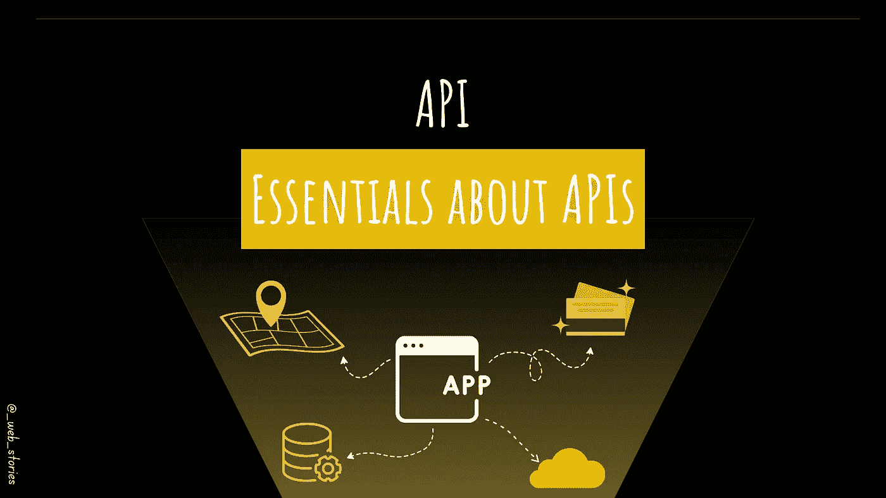
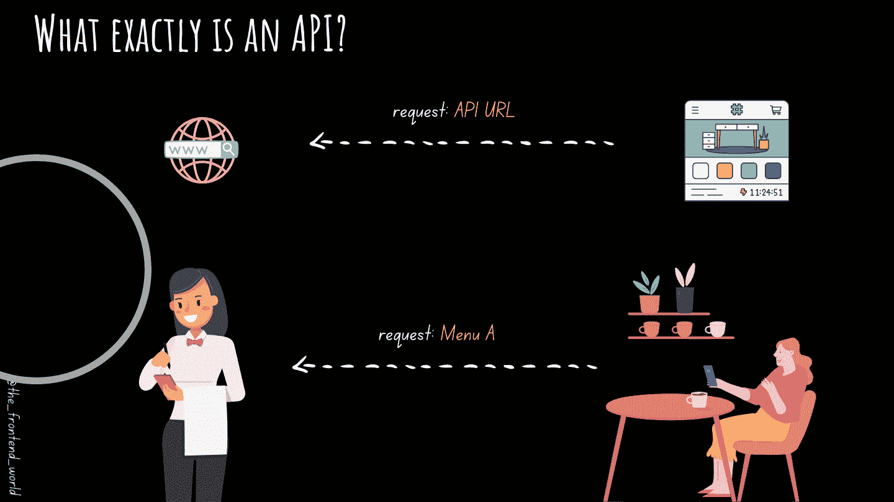

# APIs，大局！

> 原文：<https://javascript.plainenglish.io/apis-the-big-picture-73353397a30d?source=collection_archive---------12----------------------->

## 面向开发人员的 API 综合视图。

By FAM

## 你好，👋

我们即将结束 BOM & DOM 这一章。在这一章中我想让你知道的最后一件事是 API。因为你将终生使用这个东西，或者你已经在使用它们了。

# 大图

By FAM

# 你需要知道的！

*   API 代表应用程序编程接口。
*   它的工作是帮助你**访问数据**或**服务。**
*   API 在您的应用程序(消费者)和提供您想要使用的数据/服务的应用程序之间扮演角色。

# 一个场景？

你想在你的应用程序中查看你当前位置附近的餐馆。

*   对于地图，你将使用，例如，**谷歌地图应用编程接口。**
*   获取餐厅数据(名称、位置、明星等)。)通过餐馆 API(例如 Tripadvisor API)。
*   要获得您的当前位置，您可以使用 **Web API** [**地理定位**](https://developer.mozilla.org/en-US/docs/Web/API/Geolocation_API) **。**
*   您的用户可以通过使用 **PayPal API 付款来完成订单。**

# 总结

*   你可以快速开发出一个完整的应用程序。
*   您需要阅读 API 文档并按照说明进行操作。
*   它们已经存在、工作并得到维护。
*   您不维护或管理这些 API。你只是使用/消费它们。
*   有免费和付费的 API。
*   有一些 API 叫做 REST API。它们是尊重网络标准的 API。API 是(你想要的服务/数据)，REST 是你得到你想要的数据/服务的方式。

# 想了解更多？

 [## API 到底是什么？

### API 的主要目的是什么？API 有哪些例子？

levelup.gitconnected.com](https://levelup.gitconnected.com/what-exactly-is-an-api-ab0f46062da0) 

今天就到这里，看阿雅🙋

如果您有任何问题或反馈，请点击评论或通过 LinkedIn 联系我— **我洗耳恭听！**

[**想请我喝杯咖啡吗？☕️**](https://www.buymeacoffee.com/fatimaamzil)

> 让我们为 2022 年打造一个更好的‘我们’！

## 了解有关 2022 年网络快车计划的更多信息:

I- [通用网络知识](https://medium.com/geekculture/2022-web-program-chapter-n-1-is-done-499fb0707220?source=your_stories_page----------------------------------------)

[II-网页框架:HTML](https://famzil.medium.com/your-html-essentials-69d9b2349355?source=your_stories_page----------------------------------------)

[III-网页样式:CSS](https://medium.com/geekculture/recap-of-the-css-chapter-ae388d51e564?source=your_stories_page----------------------------------------)

网络互动:JavaScript

## 虚拟物料清单和 DOM

*   [什么是 BOM 和 DOM](https://medium.com/geekculture/what-are-the-dom-and-bom-9fb1a3ed736f?source=your_stories_page-------------------------------------) ？
*   [元素选择器](/selecting-dom-elements-e33fb235e81d?source=your_stories_page-------------------------------------)
*   [操纵 DOM](https://famzil.medium.com/dom-manipulation-13959986300?source=your_stories_page-------------------------------------)
*   [Ajax &获取](https://levelup.gitconnected.com/calling-for-data-d9523c7c62e2?source=your_stories_page-------------------------------------)
*   [DOM 中的事件阶段](https://famzil.medium.com/events-phases-inside-the-dom-8ca5d8929ade?source=your_stories_page-------------------------------------)
*   [事件循环](https://levelup.gitconnected.com/event-loop-visualized-78c5861e98fb?source=your_stories_page-------------------------------------)

> **原料药**

 [## 2022 网络计划启动！

### 改变来自心态和习惯

medium.com](https://medium.com/geekculture/2022-web-program-is-launched-f38a3280af1a) 

与想成为 web 开发人员的人分享该程序！这将有助于保持进步，并在旅途中互相帮助。

> 如果你喜欢我的文章， [**订阅**](https://famzil.medium.com/subscribe) 获取我的最新。如果你自己喜欢体验媒介，可以考虑通过[**注册会员**](https://famzil.medium.com/membership) 来支持我和其他成千上万的作家。它只需要每月 5 美元，它支持我们，作家，你也有机会用你的作品赚钱。当然，你可以随时取消会员资格。通过注册[这个链接](https://famzil.medium.com/membership)，你将直接用你的一部分费用来支持我，它不会花费你更多。如果你这样做了，万分感谢！

让我们在 [**上**取得联系****](https://medium.com/@famzil/)**[**Linkedin**](https://www.linkedin.com/in/fatima-amzil-9031ba95/)**[**脸书**](https://www.facebook.com/The-Front-End-World)**[**insta gram**](https://www.instagram.com/the_frontend_world/)**[**YouTube**](https://www.youtube.com/channel/UCaxr-f9r6P1u7Y7SKFHi12g)**或**********

****** [## 通过我的推荐链接——FAM 加入 Medium

### 作为一个媒体会员，你的会员费的一部分会给你阅读的作家，你可以完全接触到每一个故事…

famzil.medium.com](https://famzil.medium.com/membership) 

*更多内容看* [***说白了就是***](https://plainenglish.io/) *。报名参加我们的* [***免费周报***](http://newsletter.plainenglish.io/) *。关注我们关于*[***Twitter***](https://twitter.com/inPlainEngHQ)*和*[***LinkedIn***](https://www.linkedin.com/company/inplainenglish/)*。查看我们的* [***社区不和谐***](https://discord.gg/GtDtUAvyhW) *加入我们的* [***人才集体***](https://inplainenglish.pallet.com/talent/welcome) *。*******