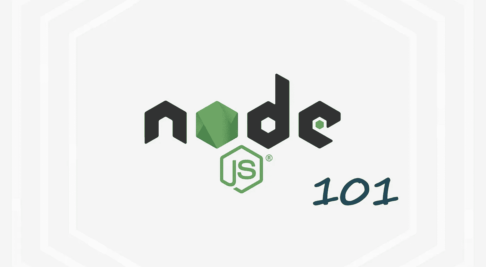
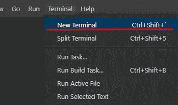
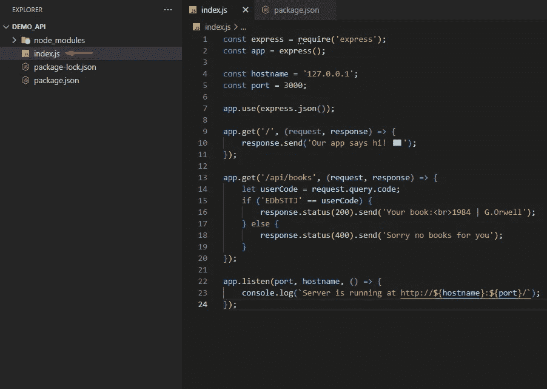

# 用 Node.js + Express 101 构建 API

> 原文：<https://javascript.plainenglish.io/apis-with-node-js-express-the-easy-way-d1447c4501ab?source=collection_archive---------11----------------------->

## 用 Node.js 和 Express 构建 API 的初学者指南。



## 介绍

这是一个简单的，初学者友好的教程。Node.js /异步执行中的阻塞与非阻塞调用、跨原点资源共享等任何难以理解的概念我们都不会深入讨论。因此，如果你没有 Node.js 的经验，只是想体验一下，请继续阅读。

## 用简单的话来说 Node.js 是什么

它只是一个帮助你在服务器上运行 JavaScript 的运行时。它只是给你一个在后端运行 JavaScript 代码的“机会”。早在 20 世纪 90 年代，JavaScript 只是一种脚本语言，你不能在服务器上运行它，直到 2009 年，Node.js 首次推出并实现了全栈 JavaScript 体验(这是一种有利有弊的策略)。

## 让我们构建有史以来最简单的 API

让我们创建一个简单的租赁书籍的应用程序，其中一个名为 Mike 的用户可以在枯燥的纯文本中看到他所租赁的书籍。Mike 访问互联网上的一个特定 URL，该 URL 指向您的服务器。假设是:[http://worlds-best-library.com](http://worlds-best-library.com)。您还实现了**终极**认证方法😊因为您已经给了 Mike 一个代码，并向他解释说，如果他键入这个代码，他将会看到他租借的图书。于是迈克高兴地向**提出**请求，希望他能看看自己租的书，并等待**得到关于这些书的信息。您的 Node.js 服务器获得该请求并对其进行操作。它给他一个带有 HTML 的**响应**，其中包含了他想要的所有信息。这当然是一个过于简单的解释，但是它给了你一个基本 API 如何工作的概念。通常，记住这个请求和响应过程。这是经常发生的事情，尤其是在 RESTful APIs 中。你可能认为这是一场乒乓球比赛。每次客户端请求某样东西，服务器都会响应…**


## 安装 Node.js 并在 Windows 上运行它

从[官网](https://nodejs.org/)下载 Node.js，安装到 PC 上。它还安装 npm(节点程序包管理器)。npm 只是帮助你访问其他人的代码。它是世界上最大的软件注册中心，开发者用它来分享软件。纱线是另一种受欢迎的替代品。您可以从下面的链接下载 Node:

[https://nodejs.org/](https://nodejs.org/)->下载并安装最新的 LTS 版本(如 16.17.1)

打开终端并执行以下命令，检查安装是否成功:

1.  获取节点的版本:

```
node -v
```

2.获取 npm 的版本:

```
npm -v
```

如果未安装 npm，请运行:

```
npm install -g npm
```

现在你需要一个 **IDE** 或者一个**代码编辑器**，来编写你的代码。如果你还没有安装，你可以安装 [VSCode](https://code.visualstudio.com/) 。VSCode 是一个轻量级且易于使用的代码编辑器，被成千上万的开发人员使用。下载后，在你的终端中键入“code”来打开它。

## 项目设置

第一步:首先，创建一个文件夹，项目文件将存放在这个文件夹下。我将这个文件夹命名为 demo_api。然后，您需要打开一个新的终端(在 VSCode 内部)。

您可以在顶部的菜单栏中找到终端。
1。点击‘终端’
2。在下拉菜单中选择“新终端”:



**步骤 2** :通过键入以下命令创建一个最小的 package.json:

```
npm init -y
```

**第三步**:创建一个文件，例如 index.js



**第四步**:安装 express

```
npm i express
```

> Express.js 是 NodeJS 的一个最小后端 web 应用程序框架，它提供了许多主要用于 web 的特性，但也用于移动应用程序。当我们开发 web 应用程序和 API 时，它让我们的生活变得更加轻松。

## 发展

现在，让我们在更高的层次上讨论你的应用程序需要做什么。

*   你需要你的应用程序在一个有端口的主机上运行:这是至关重要的，这样用户(例如 Mike)就可以看到你的站点并发出请求。为了简单起见，让我们假设 Mike 使用您的机器，并且可以向您的应用程序发出请求，该应用程序将在 **localhost** 上运行。
*   您需要一些逻辑，如果 Mike 向端点发出请求，就会执行这些逻辑。在这个逻辑被执行之后，Mike 需要得到一个响应，并被告知发生了什么。
*   最后，你可以使用一些像 [Express.js](https://expressjs.com/) 这样的库来实现上述功能，以使你的生活更加轻松。

让我们给 **index.js** 添加一些代码:

## 图书馆

在顶部包括库:

```
const express = require('express');
const app = express();
```

*   具体来说，第一行用于导入 express 模块，在名为 *express 的变量中引用它。*这样，我们可以访问从 *express* 导出的所有方法。
*   第二行引入了一个名为 app 的变量。这用于初始化 express 模块的一个实例，我们稍后会用到它。

## 主机名和端口

让我们将主机名和端口添加到一个变量中，并给它们一些值。如果您需要您的变量是可重用的，与应用程序逻辑分离，并且能够从任何地方访问，您也可以为此使用环境变量。有一个名为 [dotenv](https://www.npmjs.com/package/dotenv) 的库可以帮助您管理和加载环境变量，但这是另一个故事的主题🙄。

```
const hostname = '127.0.0.1';
const port = 3000;
```

请记住，我们的服务器需要做的是响应客户端请求。所以让我们来处理用户对根 URL (/)的请求。你也可以称之为路线。这是你的应用程序拥有的最基本的路径，你可以访问它，但是输入 [http://URL](http://URL) 。例如 [http://localhost:3000/](http://localhost:3000/)

```
app.get('/', (request, response) => {
    response.send('Our app says hi 📖')
})
```

该应用程序回复“我们的应用程序向您问好📖"对于请求到这条路线(/)。对于每一个其他路径，它当前将以未找到的 **404 来响应。**

最后，我们需要让我们的服务器监听本地主机端口 3000 上的连接。您可以选择任何您喜欢的端口，但是 3000 是 Node.js 应用程序的常用端口。

```
const express = require('express');
const app = express();

const hostname = '127.0.0.1';
const port = 3000;

app.get('/', (request, response) => {
    response.send('Our app says hi 📖')
})

app.listen(port, hostname, () => {
    console.log(`Server is running at http://${hostname}:${port}/`);
});
```

## 添加一些简单的逻辑

所以当用户输入 ***/api/books*** 或者一些前端代码做同样的事情时，你的服务器应该检查用户给的参数。如果用户是 **Mike** 并使用正确的代码(在这种情况下是: [EDbSTTJ](http://localhost:3000/api/books?code=EDbSTTJ) )进行请求，他将得到他所租赁的书籍。所以，如果 Mike 键入:[http://localhost:3000/API/books？code=EDbSTTJ](http://localhost:3000/api/books?code=EDbSTTJ) ，他现在将看到所请求的书。

```
const express = require('express');
const app = express();

const hostname = '127.0.0.1';
const port = 3000;

app.get('/', (request, response) => {
    response.send('Our app says hi 📖')
})

app.get('/api/books', (request, response) => {
    let userCode = request.query.code;
    if ('EDbSTTJ' == userCode) {
        response.status(200).send('Your book:<br>1984 | G.Orwell');
    } else {
        response.status(400).send('Sorry no books for you');
    }
});

app.listen(port, hostname, () => {
    console.log(`Server is running at http://${hostname}:${port}/`);
});
```

❕ **注** : HTTP 响应**状态**码表示一个特定的 HTTP 请求是否已经成功完成。回答分为五类:

*   信息回复:T21
*   200: 表示成功的响应
*   300: 重定向消息
*   400: 客户错误响应和客户错误
*   服务器错误响应——在这种情况下，您的服务器中的代码有问题。

上面代码中的状态( **200** )或 **200 OK** ，表示请求成功。状态( **400** )或 **400 错误请求**意味着服务器由于被认为是客户端错误的原因(例如，格式错误的请求语法、无效的请求消息组帧或欺骗性的请求路由)而无法或不愿处理请求。另外需要注意的是，在这种情况下，可能会给出一个**更具体的 4xx** 状态代码。但是为了简单起见，我们还是不要让这个例子变得更复杂。

## 如何运行您的应用程序并查看结果？

现在，使用`node index.js`运行您的 web 服务器。您的应用程序通过 http 协议在本地主机 3000 端口上运行。我们还应该为迈克提供一个代码。所以通过访问[http://localhost:3000/API/books？在浏览器中，迈克看到了他租来的书。如果密码是错的，迈克会收到一条信息说“对不起，没有你的书”](http://localhost:3000/api/books?code=EDbSTTJ)

**恭喜你！**

你已经成功了！祝贺您成功构建了 Node.js + Express 应用程序。当然这只是开始。在现实世界的应用中，您需要添加更多的依赖项，考虑保护您的端点并实现完整的(可能基于令牌的)身份验证，考虑一个好的项目结构(例如，路由、控制器、服务、模型、中间件等)。您还可以连接到数据库来获取、插入、删除或更新数据。可能性是无限的。


下一步是什么？[在 Medium 上关注我](https://medium.com/@gthanos)成为第一个阅读我的故事的人。

*更多内容看* [***说白了。报名参加我们的***](https://plainenglish.io/) **[***免费周报***](http://newsletter.plainenglish.io/) *。关注我们关于* [***推特***](https://twitter.com/inPlainEngHQ) ，[***LinkedIn***](https://www.linkedin.com/company/inplainenglish/)*，*[***YouTube***](https://www.youtube.com/channel/UCtipWUghju290NWcn8jhyAw)*，* [***不和***](https://discord.gg/GtDtUAvyhW) *。对增长黑客感兴趣？检查* [***电路***](https://circuit.ooo/) *。***