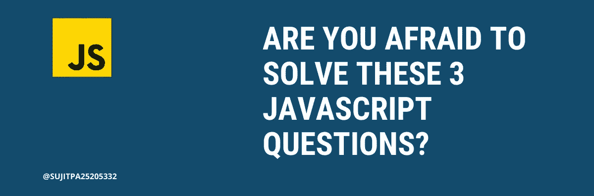

# 你害怕解决这 3 个 JavaScript 问题吗？

> 原文：<https://javascript.plainenglish.io/are-you-afraid-to-solve-these-3-javascript-questions-3a7eed176932?source=collection_archive---------1----------------------->

## 我也是。



最近换了工作，参加了 30 多场面试。这是一次相对愉快的经历，我轻松地面对了所有的问题。然而，有一些问题很难回答。

## 1.偶然全局变量

```
function crazyFunction() { var a = (b = 10);}crazyFunction();console.log("b", typeof b === "undefined");console.log("a", typeof a === "undefined");
```

## 2.视力测试

```
const numbers = [1, 2, 3];for (var index = 0; index < numbers.length; index++);{ const number = numbers[index]; console.log(number);}
```

## 3.巧妙的收尾

```
let i;for (i = 0; i < 3; i++) { const log = () => { console.log(i); }; setTimeout(log, 100);}
```

## 你准备好检查答案了吗？在这里展示它们。

```
1\. b false
   a true2\. undefined3\. 3
   3
   3
```

我希望你能找到这些问题的答案。

你可以点击查看更多问题

你想要我读书的摘要吗？在[推特](https://twitter.com/SUJITPA25205332)上关注我，我会在那里发布书籍和文章的精华！

干杯！

[](/12-useful-vs-code-extensions-to-help-make-web-development-easier-6960680c56d4) [## 12 个有用的 VS 代码扩展，帮助简化 Web 开发

### 使用这些 12 VS 代码扩展提高您作为开发人员的生产力

javascript.plainenglish.io](/12-useful-vs-code-extensions-to-help-make-web-development-easier-6960680c56d4) [](/3-note-taking-apps-i-use-for-3-different-purposes-11bb62cadf94) [## 我用 3 个笔记应用程序做 3 种不同的用途

### 学生、专业人士以及介于两者之间的所有人的 3 款最佳笔记应用

javascript.plainenglish.io](/3-note-taking-apps-i-use-for-3-different-purposes-11bb62cadf94) [](https://sujit-patil.medium.com/subscribe) [## 每当 Sujit Patil 发布时，都收到一封电子邮件。

### 每当 Sujit Patil 发布时，都收到一封电子邮件。注册后，如果您还没有，您将创建一个中型帐户…

sujit-patil.medium.com](https://sujit-patil.medium.com/subscribe) 

*更多内容看* [***说白了就是***](https://plainenglish.io/) *。报名参加我们的* [***免费周报***](http://newsletter.plainenglish.io/) *。关注我们关于*[***Twitter***](https://twitter.com/inPlainEngHQ)*和*[***LinkedIn***](https://www.linkedin.com/company/inplainenglish/)*。加入我们的* [***社区***](https://discord.gg/GtDtUAvyhW) *。*