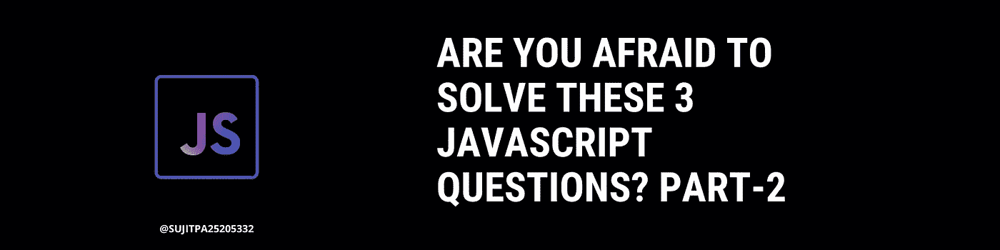

# 你害怕解决这 3 个 JavaScript 问题吗？

> 原文：<https://javascript.plainenglish.io/are-you-afraid-to-solve-these-3-javascript-questions-8a66457fa7c6?source=collection_archive---------0----------------------->

## 第 2 部分:准备好面对一些棘手的 JavaScript 问题了吗？



在这篇文章中，你会发现第二组让你思考的 JavaScript 问题。你可以在文章的最后找到第一部分。

让我们开始吧。

## 问题 1

## 问题 2

## 问题 3

## 急切地等待结果？

## 答案

```
**Question 1**
xyz
['123', '567']
['abc','def','9999']**Question 2**
undefined**Question 3**
1
2
```

我希望这些问题是令人愉快的。你可以点击查看更多问题

我很欣赏你的阅读:)

[](/are-you-afraid-to-solve-these-3-javascript-questions-3a7eed176932) [## 你害怕解决这 3 个 JavaScript 问题吗？

### 我也是。

javascript.plainenglish.io](/are-you-afraid-to-solve-these-3-javascript-questions-3a7eed176932) [](/12-useful-vs-code-extensions-to-help-make-web-development-easier-6960680c56d4) [## 12 个有用的 VS 代码扩展，帮助简化 Web 开发

### 使用这些 12 VS 代码扩展提高您作为开发人员的生产力

javascript.plainenglish.io](/12-useful-vs-code-extensions-to-help-make-web-development-easier-6960680c56d4) [](https://medium.com/axis/how-can-you-make-the-most-out-of-the-amazing-stuff-on-youtube-2b05f5b8957b) [## 你如何充分利用 YouTube 上的精彩内容？

### 这个奇妙的概念对我有效，也很可能对你有效

medium.com](https://medium.com/axis/how-can-you-make-the-most-out-of-the-amazing-stuff-on-youtube-2b05f5b8957b) 

*更多内容看* [***说白了。报名参加我们的***](https://plainenglish.io/) **[***免费周报***](http://newsletter.plainenglish.io/) *。关注我们关于*[***Twitter***](https://twitter.com/inPlainEngHQ)*和*[***LinkedIn***](https://www.linkedin.com/company/inplainenglish/)*。查看我们的* [***社区不和谐***](https://discord.gg/GtDtUAvyhW) *，加入我们的* [***人才集体***](https://inplainenglish.pallet.com/talent/welcome) *。***