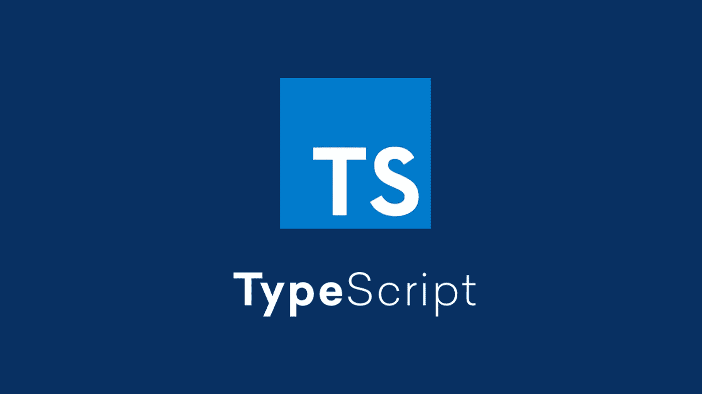

# 了解类型脚本重写的概念

> 原文：<https://javascript.plainenglish.io/are-you-interested-in-learning-about-typescript-override-78e516914348?source=collection_archive---------13----------------------->

## 您有兴趣了解 TypeScript 重写吗？

Photo by Chrome Search

# 前提

确保您的 TypeScript 版本≥ 4.3

# 为什么使用 TypeScript 重写

首先，让我们看一个普通的例子:

很好，它工作了，但是，如果有人决定去掉`show`和`hide`并用一个方法替换它们，会发生什么呢？

Note, here to delete ‘show’ and ‘hide’ methods

*哦不！我们的`SpecializedComponent`没有更新。现在只是添加了这两个无用的`show`和`hide`方法，它们可能不会被调用。*

这里的部分问题是，用户不能清楚地知道他们是想添加一个新方法，还是想覆盖一个现有的方法。这就是为什么 TypeScript 4.3 增加了`override`关键字。

当一个方法用`override`标记时，TypeScript 会一直确保基类中存在同名的方法。

这是一个很大的改进，但是如果你*忘记*在一个方法上写`override`也没有用——这也是用户可能遇到的一个大错误。

> 提示:override 关键字与抽象关键字
> 配合使用效果更好。这是一个标准示例:

**解释**:

*   我们用 [**抽象类**](https://www.tutorialsteacher.com/typescript/abstract-class) 来定义一个`Animal`类和**两个抽象方法**
*   **然后我们使用子类** `**Dog class**` **中的 override 关键字来实现父类**的抽象方法

## **额外知识**

我们可以用这篇文章的知识来反应:)

如果有其他方式，请留言:)

## 参考

 [## 文件-打字稿 4.3

### TypeScript 4.3 发行说明

www.typescriptlang.org](https://www.typescriptlang.org/docs/handbook/release-notes/typescript-4-3.html) 

*更多内容请看*[***plain English . io***](http://plainenglish.io/)*。报名参加我们的* [***免费每周简讯***](http://newsletter.plainenglish.io/) *。在我们的* [***社区不和谐***](https://discord.gg/GtDtUAvyhW) *获取独家写作机会和建议。*