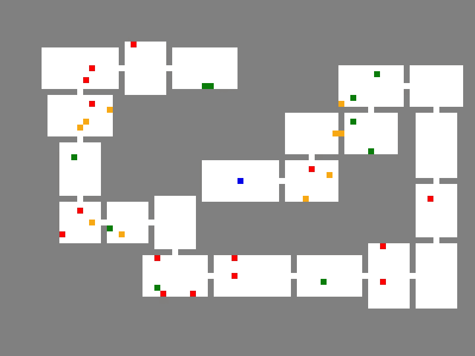

# 用 JavaScript Roguelike 构建一系列房间

> 原文：<https://javascript.plainenglish.io/arranging-adjacent-rooms-in-a-javascript-roguelike-a5c178772d31?source=collection_archive---------11----------------------->


Photo by [Malcolm Lightbody](https://unsplash.com/@mlightbody?utm_source=unsplash&utm_medium=referral&utm_content=creditCopyText) on [Unsplash](https://unsplash.com/?utm_source=unsplash&utm_medium=referral&utm_content=creditCopyText)

最近我一直在探索如何开发 rogue likes——有程序生成关卡的游戏。在五部分系列的第一篇教程中，我编写了随机放置房间的逻辑。该系列的[最终教程](/making-all-rooms-reachable-in-a-javascript-roguelike-eb1265cadf99)在一个[游戏](https://stellular-biscuit-6757a3.netlify.app/solution/index.html)中达到高潮，游戏中房间通过通道相连。


Roguelike with random room placement.

我在这些关卡中发现的主要问题是，长通道需要一段时间才能通过，这降低了游戏的速度。因此，为了提高步调——以及为与项目相关的目标搭建舞台——我编写了新的逻辑，构建了没有长通道的房间序列。


A level produced with the new room sequence algorithm.

本教程将向您展示如何编写按顺序排列房间的逻辑。

# 入门指南

在 Github 上下载[启动代码的](https://github.com/nevkatz/js-roguelike-sequence)[压缩文件](https://github.com/nevkatz/js-roguelike-sequence/archive/refs/heads/main.zip)。提取之后，您会看到一个项目目录，其中有一个您可以使用的`sequence.js`文件，以及每个阶段的解决方案目录。

```
js-roguelike-sequence
  |
  *--project
  |    |
  |    *--sequence.js
  |    |
  |    *--index.html
  |
  *--phase-1-solution
  |
  *--phase-2-solution
  |
  *--phase-3-solution
  |
  *--phase-4-solution
  |
  *--index.html
  |
  *--css
  |
  *--js
```

## 支持文件

JavaScript 目录中的文件包含现有的游戏逻辑。

```
 js
 |
 *--script.js
 |
 *--room.js
 |
 *--game.js
 |
 *--path.js
```

## 游戏课

让我们看一下一些支持文件。`game.js`文件存储了`Game`类，如下所示。

游戏的`map`属性将地牢配置存储在一个 2D 数组中。例如，如果一个 4x3 的房间被添加到一个 6x5 的地图的中心，那么`map`数组将如下图所示，其中`1`是楼层代码，`0`是墙壁代码。

```
[[0,0,0,0,0,0],
 [0,1,1,1,1,0],
 [0,1,1,1,1,0],
 [0,1,1,1,1,0],
 [0,0,0,0,0,0]]
```

一个`Game`对象还存储了对`<canvas>`元素及其被称为`context`的绘图方法包的引用。此外，它还是一个存储`Room`对象的`rooms`数组。

## 房间类

`room.js`文件有一个`Room`类，如下所示，以及它的方法。

本文中最重要的属性是`start`、`center`和`end`对象，每个对象存储`x`和`y`值。`start`对应左上角，而`end`坐标对应右下角。


A Room’s start, center, and end properties.

## 其他 JS 文件

*   在`script.js`中，你会发现生成关卡和运行游戏的函数。
*   `path.js`文件存储`Path`类，用于连接房间。

## 在最高层

*   `css`目录包含一个`style.css`文件，其中包含一些基本样式。
*   一个`index.html`文件包含项目和解决方案的链接。

## sequence.js 文件

我们来看看`project`目录。

*   在您的`sequence.js`文件中，有一个`generateSequence`函数的早期版本。
*   到目前为止，它会重置游戏地图，并根据`Game`对象的 2D `map`数组在`<canvas>`元素上绘制图块。


The initial sequentialRooms function.

*   下面是`game.js`中的`resetMap`方法，用墙代码填充 2D 地图。
*   结果，当`drawMap`被调用时，只有墙砖被绘制在画布上。

The resetMap method in game.js.

如果你在浏览器中打开你的`index.html`文件，你会看到一个灰色的空白地图，代表一堵墙。


The initial game map before the coding begins.

因为除了墙砖之外什么都没有画，我让`sequentialRooms`返回`false`，这阻止了程序更新 stat 显示和添加玩家、敌人、武器和药剂。在`script.js`中，`sequentialRooms`的返回值在`startGame`函数中起作用。

The startGame function that calls sequentialRooms in script.js.

# 阶段 1:添加一个房间

现在我们已经看了代码库，让我们开始编码吧！首先，我们将扩展`sequentialRooms`功能，使其增加一个大房间。

在`script.js`文件的顶部，你会注意到游戏网格尺寸是由两个常量决定的:`ROWS`和`COLS`。

```
const COLS = 80;
const ROWS = 60;
```

在`sequence.js`中，让我们用`ROWS`和`COLS`在地图的中心生成一个房间。首先，我们将定义一个名为`center`的常数。

```
game.resetMap();**const center = {
      x:Math.round(COLS/2),
      y:Math.round(ROWS/2)
};**
```

在`center`内，你可以看到`x`是`COLS`的一半，`y`是`ROWS`的一半。

中心位置确定后，我们来指定房间尺寸。

```
let width = 50, height = 40;
```

接下来，让我们通过调用`script.js`中一个名为`generateRoom`的函数来添加一个以此为中心的房间。

```
let baseRoom = generateRoom(center, width, height);
```

在我们得到我们的`baseRoom`之后，让我们把它添加到游戏中。首先，让我们增加游戏的`curRoomId`，这样每个房间都有一个唯一的 ID。

```
game.curRoomId++;
```

接下来，我们可以调用名为`carveRoom`的方法，将房间添加到 2D 地图中。

```
game.carveRoom(baseRoom);
```

最后，让我们将`baseRoom`对象推入游戏的`rooms`数组。

```
game.rooms.push(baseRoom);
```

现在我们生成了一个实际的房间，有空间来放置玩家和其他游戏元素，所以让我们返回`true`，这样我们在`startGame`中的其他函数就可以运行了。

```
return true;
```

第 1 阶段结束时，整个功能应该是这样的。

the sequentialRooms function at the end of phase 1.

请随意将您的作品与这个[演示](https://roguelike-sequence.netlify.app/phase-1-solution/index.html)进行比较，下面是来自第一阶段游戏的一个级别。


The one large room at the end of phase 1.

# **第二阶段:添加多个房间**

在进一步展开`sequentialRooms`之前，让我们写下创建一个房间的逻辑，该房间与前面的房间相邻。在`sequence.js`中，你会看到一个名为`addAdjacentRoom`的空函数。

首先，让我们设定房间的尺寸。

```
function addAdjacentRoom (room) { let width = 11, height = 6;}
```

现在，让我们编写四个帮助函数来放置和测试具有这些尺寸的新房间。

## 寻找房间之间的距离

首先，让我们写下`distBetween`，它决定了现有房间的中心和一个新的相邻房间的中心之间的距离。

```
const distBetween = (axis) => {}
```

它需要一个参数，`axis`。

*   如果新房间在上方或下方，则`axis`为`y`。
*   如果房间在右边或左边，则`axis`为`x`。

让我们为房间之间的通道长度添加一条线，这将是一个瓷砖。

```
const distBetween = (axis) => {

     let passageLength = 1;}
```

如果新房间在上面或者下面，我们来找由`genDim`确定的`height`。如果新房间在右边或左边，让我们得到它的`width`。

```
const distBetween = (axis) => {

     let passageLength = 1; let newSize = (axis == 'y') ? height : width;}
```

现在让我们使用`start`和`end`属性以及`axis`来找出*现有*房间的高度或宽度。

```
const distBetween = (axis) => {

     let passageLength = 1; let newSize = (axis == 'y') ? height : width; let roomSize = room.end[axis] - room.start[axis] + 1;}
```

最后再加上这条把每个房间的一半高度或宽度加在一起然后再加上通道长度的线。这给出了现有房间和新房间之间的距离。

```
return Math.ceil(newSize/2) + Math.ceil(roomSize/2) + passageLength;
```

下面是完整的函数，返回总距离。

The distBetween function.

## 检查一个新房间是否适合地图

现在我们将创建`withinLimits`，它决定一个给定的房间是否在游戏地图的范围内。

The withinLimits function.

该函数在`script.js`中使用了一个名为`OUTER_LIMIT`的常数，它决定了最外面可能的图块和地图边缘之间的距离。

```
const OUTER_LIMIT = 3;
```

## 检查重叠

接下来，让我们编写`overlapsAny`，它检查一个新房间是否会与任何现有的房间重叠。该函数调用的`overlaps`方法在`room.js`中。

The overlapsAny function.

## 生成可能的中心

最后，我们将创建`possibleCenters`，它返回一个新房间的四个可能中心坐标的数组。

The possibleCenters method.

可选参数`diff`是房间中心之间的差异。对于上面的房间，它将指定两个房间中心的`x`坐标之间的差异。如果`diff`为`0`，则两个中心对齐。

```
// new room above
{
  x:room.center.x + diff,
  y:room.center.y - distBetween('y')
}
```

注意`distBetween`决定了新房间的高度。

## 测试可能的中心

我们的助手完成后，让我们实例化一个新的数组，`possibleRooms`，我们将用任何适合地图并且不与其他房间重叠的房间来填充它。

```
function addAdjacentRoom(room) { let width = 11, height = 6; // four hidden helper functions l**et possibleRooms = [];**
}
```

现在让我们在`addAdjacentRoom`中编写逻辑，根据可能的中心生成新的房间。注意，当我建立下面的循环时，我正在调用`possibleCenters()`。

```
let possibleRooms = [];for (let center of **possibleCenters()**) {}
```

在这个循环中，让我们调用`generateRoom`函数。

```
let possibleRooms = [];for (let center of possibleCenters()) { **let r = generateRoom(center, width, height);**}
```

创建房间后，我们测试它是否在地图的范围内，以及它是否与其他房间重叠。如果它通过了这些测试，它将被添加到`possibleRooms`数组中。

```
let r = generateRoom(center, width, height);**if (withinLimits(r) && !overlapsAny(r)) {** **possibleRooms.push(r);
}**
```

下面是完整的循环。

Logic for creating and testing rooms based on centers.

## 选择房间

在`addAdjacentRoom`结束的时候，我们从`possibleRooms`阵中随机挑选一个房间加入游戏。

The logic for selecting the room at random.

如果数组是空的，我们将没有空间，所以我们必须在调用`addAdjacentRoom`时处理这种可能性。

现在`addAdjacentRoom`已经写好了，让我们更新一下`sequentialRooms`函数。

将我们的中心房间添加到游戏后，我们创建一个名为`maxSeqLen`的常数，它代表一个序列中房间的最大数量(不包括第一个中心房间)。

```
**game.rooms.push(baseRoom);**const maxSeqLen = 20;
```

然后我们开始一个循环来构建这个序列。

```
let baseRoom = addRoom(center, 6, 5, 'wide');**const maxSeqLen = 20;****for (var i = 0; i < maSeqLen; ++i) {**
```

在循环中，我们首先尝试调用`addAdjacentRoom`。

```
for (var i = 0; i < maxSeqLen; ++i) { **let newRoom = addAdjacentRoom(baseRoom);**
```

如果没有返回新房间，这意味着没有可行的房间选项，所以我们退出循环，房间生成结束。

```
let newRoom = addAdjacentRoom(baseRoom);**if (!newRoom) {
      break;
}**
```

如果一个新的房间*被*返回，原始房间使用一种叫做`directConnect`的方法连接到它，这在房间之间形成一条直线路径。

```
if (!newRoom) {
      break;
}**baseRoom.directConnect(newRoom);**
```

然后`baseRoom`变成`newRoom`，循环结束。因此，新房间成为添加的下一个房间的参考点。

```
baseRoom.directConnect(newRoom);**baseRoom = newRoom;**
```

旁白:如果你想了解更多关于`directConnect`的工作原理，你可以在`Room.js`中探索它，并查看这个[连接房间](/connecting-rooms-in-a-javascript-roguelike-8e6212c54c9)教程。

以下是第 2 阶段的完整`sequentialRooms`功能。

The sequential rooms function for Phase 2

下面是游戏的截图，你可以查看这个[演示](https://roguelike-sequence.netlify.app/phase-2-solution/index.html)进行比较。


A level produced from the completed phase 2 code.

现在，我们来看看如何让房间尺寸和摆放更加多样化。

# 第三阶段:使房间多样化

建立顺序逻辑后，让我们调整`sequence.js`中的代码，这样房间的尺寸和位置会有更多变化。

我们可以快速改变尺寸。回想一下，在`addAdjacentRooms`中，我们直接设置房间尺寸。

```
let width = 11, height = 6;
```

让我们用一个使用`script.js`中名为`genDim`的函数随机生成尺寸的代码来替换这个代码行。

```
let { width, height } = genDim();
```

在`sequentialRooms`中，我们也可以通过换入`genDim`随机生成第一个中心房间的尺寸。

```
**let { width, height } = genDim();**let baseRoom = generateRoom(center, width, height);
```

这样做了之后，你应该会得到类似下面这个级别的东西。



One sequence of rooms with varied dimensions that connect at the centers.

## 多样化的房间布置

现在，让我们添加一些逻辑，为房间的布置带来更多变化。与其让每一对相连的房间都在它们的中心对齐，不如让我们添加其他可能的中心，它们不会与前一个对齐。

记住在`posssibleCenters`中我们有那个`diff`参数。


The possibleCenters helper within addAdjacentRoom.

如果我们将`diff`设为非零，那么生成的四个中心将不会与原始房间的中心对齐。

在`addAdjacentRooms`中，在声明空的`possibleRooms`数组后，让我们建立一个`maxDiff`常数，它代表房间中心之间的最大可能差异。

```
let possibleRooms = [];**const maxDiff = 3;**
```

现在，让我们将我们的`possibleCenters`循环嵌套在一个外部循环中，该循环遍历由`maxDiff`限定的一系列负值和正值。

Adding an outer loop to handle a wider range of possible room centers.

在新循环的开始，我们使用`maxDiff`设置了可能的中心范围。

```
for (var diff = -1*maxDiff; diff <= maxDiff; ++diff) {
```

然后，我们为`diff`的每个值创建四个可能的中心，并立即遍历它们。

```
for (let center of possibleCenters(diff)) {
```

在循环中，我们基于该中心生成一个房间。

```
let r = generateRoom(center, width, height);
```

如果房间通过测试，它将被添加到数组中。

```
if (withinLimits(r) && !overlapsAny(r)) {
       possibleRooms.push(r);
}
```

在`-3`和`3`之间的`maxDiff`范围内，外环运行 7 次。每次有四个可能的中心——上、下、左、右——我们现在有 28 种可能的房间排列方式。结果是完成了阶段 3，如下所示。


请随意将您的工作与这个[演示](https://roguelike-sequence.netlify.app/phase-3-solution/index.html)和`phase-3-solution`目录进行比较。

# 阶段 4:分支序列

在本教程的最后阶段，让我们为从现有序列分支的房间序列编写逻辑。

在我们的`sequence.js`文件中，让我们将一个序列中房间的最大数量减少到 10。

```
const maxSeqLen = 10;
```

现在让我们再添加两个常量:

*   `minTotalRooms`，为一个级别中的最小总房间数；
*   和`maxTries`，用于序列添加尝试的最大次数。

```
const maxSeqLen = 10;
**const minTotalRooms = 20;
const maxTries = 100;**
```

使用`maxTries`可防止重复找不到好的房间位置时出现无限循环。我们将使用一个新变量`tries`来跟踪我们的尝试。

```
let tries = 0;
```

然后，我们将在两个条件下将`for`循环包装在`while`循环中:我们还有尝试的机会，并且我们还没有达到最小房间总数。这个循环会一直循环下去，直到我们有了最少的房间数，或者尝试次数已经用完。

```
**while (game.rooms.length < minTotalRooms && tries < maxTries) {** for (var i = 0; i < maxSeqLen; ++i) {
```

在循环中，我们从`game.rooms`数组中选择一个现有的房间。虽然第一次只有中间的房间可供选择，但在放置第一系列房间后，还有更多房间可供选择。

```
while (game.rooms.length < minTotalRooms && tries < maxTries) { **let idx = Math.floor(Math.random()*game.rooms.length);** for (var i = 0; i < maxSeqLen; ++i) {
```

然后，我们在生成的索引处从`game.rooms`数组中选择我们分支的房间。

```
while (game.rooms.length < minTotalRooms && tries < maxTries) { let idx = Math.floor(Math.random()*game.rooms.length); **baseRoom = game.rooms[idx];** for (var i = 0; i < maxSeqLen; ++i) {
```

加上循环的结尾，让我们递增`tries`。

```
for (var i = 0; i < maxSeqLen; ++i) { // hidden code
}
**tries++;**
```

下面是新的逻辑，带有常量以及嵌套在`while`循环中的`for`循环。

The phase 4 while loop

如果你已经做到了这一步，祝贺你！您已经完成了教程。下面是一个第 4 阶段水平的截图。


A phase 4 level.

## 建议的后续步骤

*   将您的代码与这个[演示](https://roguelike-sequence.netlify.app/phase-4-solution/index.html)进行比较。
*   试验一下`minTotalRooms`和`maxSeqLen`的值，看看它是如何影响分支级别的。
*   尝试添加其他可收集的项目。
*   看看下面这篇文章，它用相同的游戏机制展示了不同的关卡生成算法。

[](/how-to-build-a-dungeon-crawler-game-with-javascript-57189bdd9f08) [## 让我们用随机漫步算法建立一个 Roguelike

### 我们可以用普通的 JS 来完成它。

javascript.plainenglish.io](/how-to-build-a-dungeon-crawler-game-with-javascript-57189bdd9f08) 

我希望你喜欢这篇教程，并且你已经学到了一些新的 JavaScript 技术，你将会把它们带到其他项目中。下次见！

*更多内容请看*[***plain English . io***](https://plainenglish.io/)*。报名参加我们的* [***免费周报***](http://newsletter.plainenglish.io/) *。关注我们关于*[***Twitter***](https://twitter.com/inPlainEngHQ)*和*[***LinkedIn***](https://www.linkedin.com/company/inplainenglish/)*。加入我们的* [***社区不和谐***](https://discord.gg/GtDtUAvyhW) *。考虑* [***加入介质***](https://medium.com/@nevkatz/membership) *。*