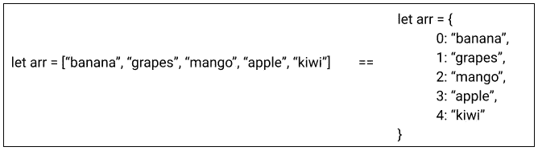
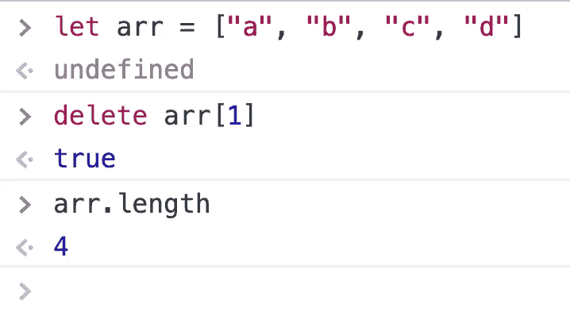
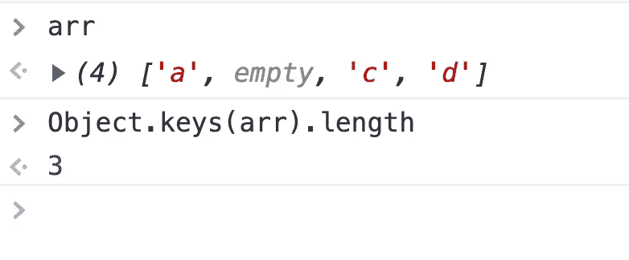
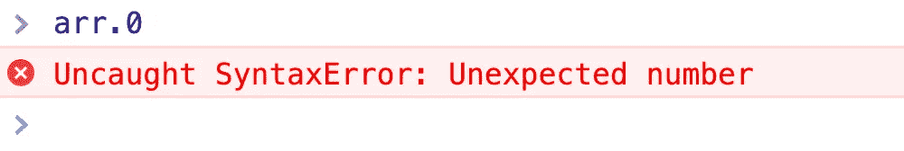

# 数组。长度可能会导致意外错误

> 原文：<https://javascript.plainenglish.io/array-length-can-lead-to-unexpected-errors-ce4fbfa74fc5?source=collection_archive---------5----------------------->

## 你得到的数组长度是否比你实际看到或预期的要长？

如果你得到的数组长度比你实际看到的或预期的要长，这可能是因为你使用了`Array.length`来寻找长度。

但是如果我告诉你`Array. length`不是在 JavaScript 中寻找数组长度的最佳方法呢？

但是为什么呢？这是因为 JavaScript 很疯狂还是我们理解不够好？

让我想想。

在 JavaScript 中，数组不是原语，而是对象。

这意味着数组的方括号声明可能作为声明数组的语法糖，但实际上，在幕后，创建一个对象，将索引(从 0 开始)作为键，将数组内容作为各自的值。

> 假设我们使用`𝚍𝚎𝚕𝚎𝚝𝚎 𝚊𝚛𝚛[𝚒]`从你的数组中删除一个元素，但是现在如果我们运行`arr.length`，我们会得到 4——比如 whaaaat？

Delete operation on an array item

这是因为 delete 不会修改原始数组，而是在指定的索引处放置一个
𝚎𝚖𝚙t𝚢值。

因此，要获得数组中非空项的数量，应该使用`𝙾𝚋𝚓𝚎𝚌𝚝.𝚔𝚎𝚢𝚜()`方法，它给出一个对象中键的数组。

Result of delete operator on an array

# 额外的

想想看，如果 JavaScript 中的数组是对象，那么我们应该能够使用点符号(`arr.0`)和方括号符号(`arr[0]`)来访问数组项。

但是`arr.0`抛出了一个语法错误:

嗯，这是因为 JavaScript 语法的一般规则要求使用[括号符号](https://developer.mozilla.org/en-US/docs/Web/JavaScript/Guide/Working_with_Objects#objects_and_properties)而不是[点符号](https://developer.mozilla.org/en-US/docs/Web/JavaScript/Reference/Operators/Property_Accessors)来访问以数字开头的属性。

您可以查看[详细文档](https://developer.mozilla.org/en-US/docs/Web/JavaScript/Reference/Global_Objects/Array)以获得进一步的说明。

希望我的解释有助于你理解这个概念。然而，我对这个概念的理解可能是错误的，所以我愿意接受各种反馈。你可以在 [LinkedIn](https://www.linkedin.com/in/jainlokesh318/) *上轻松联系到我。*

*更多内容请看*[***plain English . io***](https://plainenglish.io/)*。报名参加我们的* [***免费周报***](http://newsletter.plainenglish.io/) *。关注我们关于*[***Twitter***](https://twitter.com/inPlainEngHQ)*和*[***LinkedIn***](https://www.linkedin.com/company/inplainenglish/)*。查看我们的* [***社区不和谐***](https://discord.gg/GtDtUAvyhW) *加入我们的* [***人才集体***](https://inplainenglish.pallet.com/talent/welcome) *。*