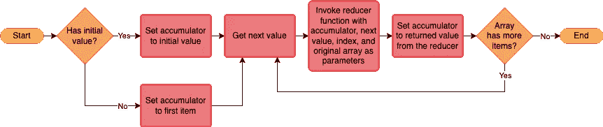
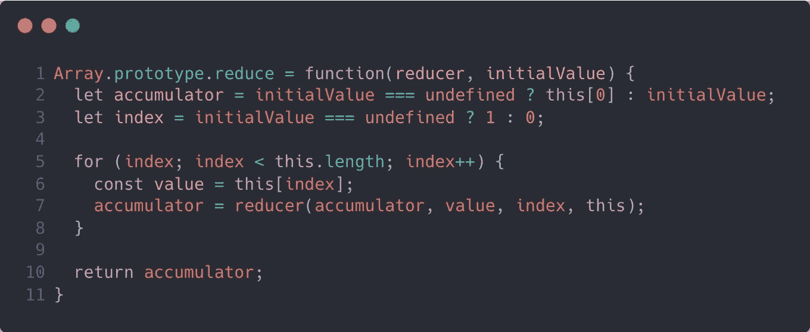
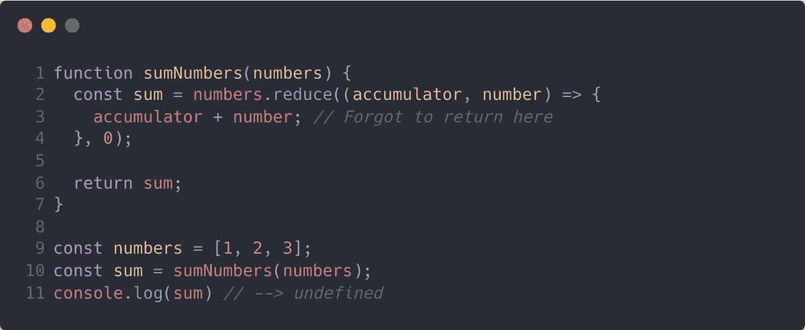
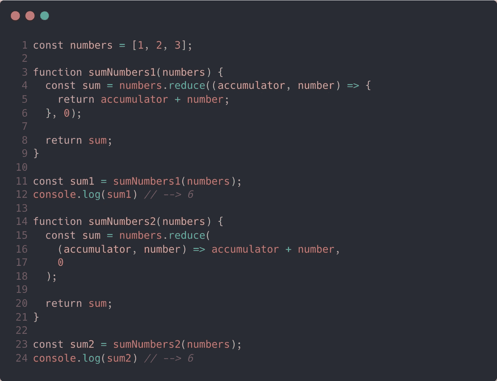
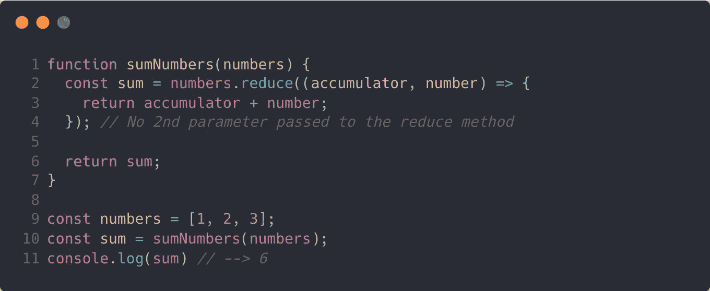
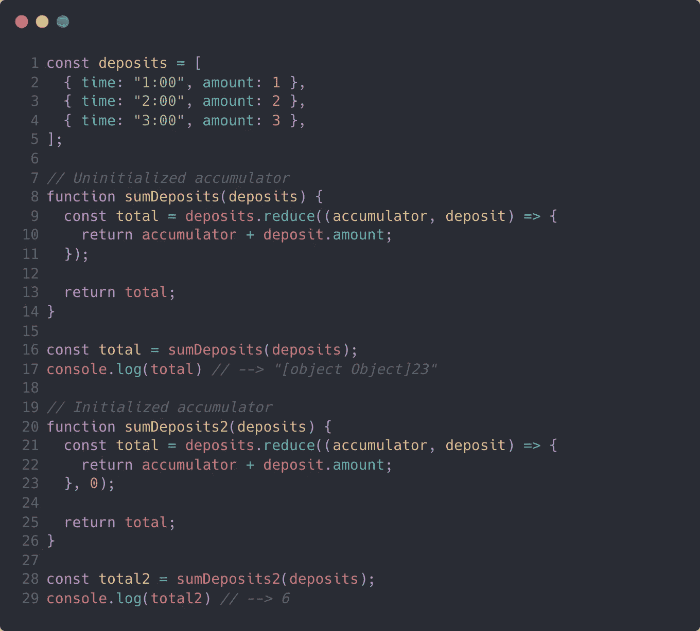
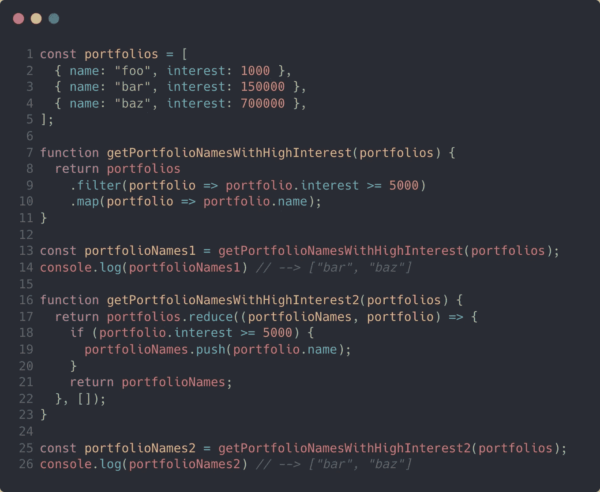

# JavaScript 中解释的数组简化方法

> 原文：<https://javascript.plainenglish.io/array-reduce-method-explained-in-javascript-c74146e553d5?source=collection_archive---------13----------------------->

Photo by [Nathan Dumlao](https://unsplash.com/@nate_dumlao?utm_source=medium&utm_medium=referral) on [Unsplash](https://unsplash.com?utm_source=medium&utm_medium=referral)

当面试软件工程候选人时，我寻找的一个小但重要的细节是他们是否在习惯性地[编程。程序员编写惯用代码的一种方法是使用语言内置的工具和约定，而不是从头开始显式编写。解释这一点的另一种方式是坚持这句话:“不要重新发明轮子。”同样，这是一个小细节，但它显示了经验和对手边语言的掌握。](https://en.wikipedia.org/wiki/Programming_idiom)

JavaScript 有一段独特的、漫无边际的历史，现在仍在被书写。要理解 reduce 方法是如何工作的，首先必须理解 JavaScript 中的原型继承是如何工作的。

# 原型方法

实际上 JavaScript 中的一切都是对象。即使是字面实例化的原语(即不是从`class`构造的)，如字符串和数字，也有一些类似对象的行为。这些行为继承自实例的`prototype`。这种继承也可以被链接。例如，数组原型继承自对象原型。

`Array.prototype`有几个方法使得使用数组非常方便。数组的内容是有序的，所以自然地，当处理数组时，你经常需要遍历它们。`Array.prototype.reduce`是这些方法中的一种，它允许我们以声明的方式遍历数组，同时也允许将逻辑作为参数传入。

# 解释减少方法

当我第一次学习 JavaScript 时，我倾向于避免使用`Array.prototype.reduce`，部分原因是我对自己的理解没有信心。我应该花时间构建一个坚实的心智模型，而不是依赖不太习惯的方法来解决 reduce 方法最适合的问题。

## 在后台

理解正在发生的事情的最好方法之一是建立一个流程图。一旦这个方法被分解成它的原子组成部分，它就显得不那么可怕了。

A flowchart illustrating the logic of Array.prototype.reduce.

理解 reduce 方法的另一个好方法是通过从头重写方法的逻辑来强化你的心智模型。当我参加 [Hack Reactor](https://www.hackreactor.com/) 时，这是我们被分配的许多介绍性任务之一。让我们来看看一些代码。

A custom implementation of Array.prototype.reduce.

在上面的代码中，我将`Array.prototype.reduce`重新分配给了我的新函数，这样我就可以像平常使用 reduce 方法一样使用它了。这意味着我们将使用数组上的属性访问来调用这个方法，因此，我们的`this`关键字将被赋给我们调用方法的数组。在这段代码中，你可以期望`this`是你试图减少的数组。让我们浏览一下代码。

我声明了一个`accumulator`变量，并将其初始化为传入的初始值或数组中的第一项。类似地，如果没有给我们初始值，我将一个`index`变量初始化为`1`，否则为`0`。从这里开始，我简单地遍历数组，在每次迭代中，我都将`accumulator`重新赋值为等于`reducer`函数的返回值。

# 逮到你了

记住一个编程概念的最好方法是花几个小时调试由这个概念引起的问题。这些年来，我自己也有过一些这样的经历。

## 记得归还蓄电池

早些时候，当我在公司面试以获得我的第一份软件工程工作时，我发现自己在最后阶段的现场面试中，我决定在我的编码问题解决方案中使用`Array.prototype.reduce`。亲自编写代码的问题可能会带来压力，并可能导致您犯一些平时不会犯的错误。在这种情况下，我忘记从我的 reducer 函数返回一个值。那是在 [ES6](https://en.wikipedia.org/wiki/ECMAScript#ES2015) 的早期，我在用一个箭头函数。然而，通过使用代码块(即花括号)来定义我的函数体，我忘记了我将不再受益于不使用代码块的 arrow 函数中内置的隐式返回。像这样:

An example of not returning a value from the reducer function.

当您没有从 reducer 函数返回值时，累加器被重新分配为`undefined`。发生这种情况是因为当你没有从一个函数显式返回值时，`undefined`被隐式返回。因此，随着数组的迭代，累加器只是重复地被重新分配为`undefined`。

相反，我可以使用内联 arrow 函数的隐式 return，或者添加一个 return 语句。

Examples of properly returning a value from the reducer function.

## 请记住，累加器默认为第一项

使用 reduce 方法时出现的另一个常见错误是忘记传入初始值参数。如果没有用第二个参数调用 reduce 方法，累加器默认为数组中的第一项，循环从数组中的第二项开始迭代。

在我们的求和例子中，这不是一个问题，因为我们得到了相同的和。

An example of using the reduce method without a 2nd parameter.

然而，当累加器具有不同的结构或者是完全不同的 JavaScript 类型时，不初始化您的累加器会引入一个 bug。

Examples of using the reduce method with and without the 2nd parameter.

在上面的例子中，我们试图对存款进行求和。每个存款都是包含一个`amount`属性的对象。因为累加器应该是一个数字，而数组项是对象，所以当我们不初始化累加器时，就会引入一个错误。

当执行代码的第一部分时，JavaScript 解释器被迫尝试添加一个带有数字的对象。结果是一个字符串，因为解释器会将对象和数字强制转换成字符串，并将它们连接在一起。当我们将累加器初始化为`0`时，我们得到了想要的结果。

# 何时使用 Reduce

为了用惯用法编写代码，你需要对手头的语言有很强的理解。对于 JavaScript 数组，有几种原型方法可以用在各种情况下。对于 reduce，我喜欢在一些关键场景中使用它。

## 将数组转换为另一种数据结构

通常在处理数组时，您需要将条目列表转换成一个值。无论是处理需要求和的一组数字，还是筛选投资组合列表以使用特定策略计算它们的数量，使用 reduce 方法可能是最惯用的选择。

其他时候，您需要将数组转换为对象或地图。对对象和映射的属性访问具有恒定的时间复杂度(即`O(1)`，因此有时最好是遍历数组并映射那些项，以便稍后引用该映射。

## 当将多个数组方法链接在一起的计算开销很大时

我经常不得不处理有几十万行的数据集。根据运行时环境中可用的资源，遍历这么多行可能需要几秒钟甚至几分钟。这意味着涉及这些数据集的算法不能承受非线性时间复杂度，并且每次优化都很重要。

因此，即使我只需要将`Array.prototype.filter`和`Array.prototype.map`链接在一起以过滤数组项，然后映射它们，遍历数据集两次也太多了，即使这在技术上是线性时间复杂度(即`O(n)`)。

因此，我们可以减少数组并将两部分逻辑结合在一起，而不是将两个方法链接在一起。

A comparison of chaining two array methods versus using reduce.

您会注意到我们得到了相同的答案，但是我们只需要使用 reduce 遍历数组一次。同样，当我们有硬件资源限制时，这种优化是最有益的。

# 结论

习惯性地写代码。为了做到这一点，你需要知道并在适当的时候使用原型方法。reduce 方法在正确使用时非常有用，有时通过使用流程图和代码来构建您的心智模型会非常有帮助。

*最初发表于*[*【https://codingbootcampguides.com】*](https://codingbootcampguides.com/)*。*

*更多内容看* [***说白了。报名参加我们的***](https://plainenglish.io/) **[***免费周报***](http://newsletter.plainenglish.io/) *。关注我们关于*[***Twitter***](https://twitter.com/inPlainEngHQ)*和*[***LinkedIn***](https://www.linkedin.com/company/inplainenglish/)*。加入我们的* [***社区***](https://discord.gg/GtDtUAvyhW) *。***