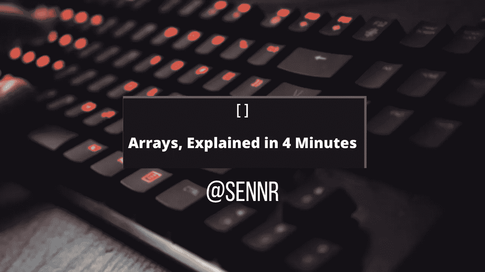
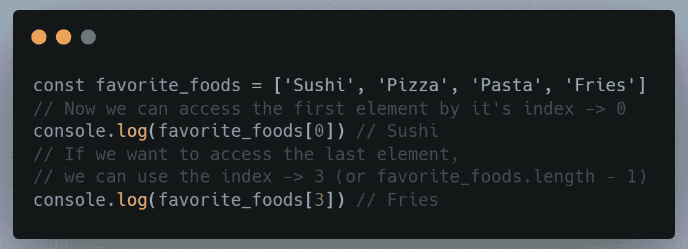
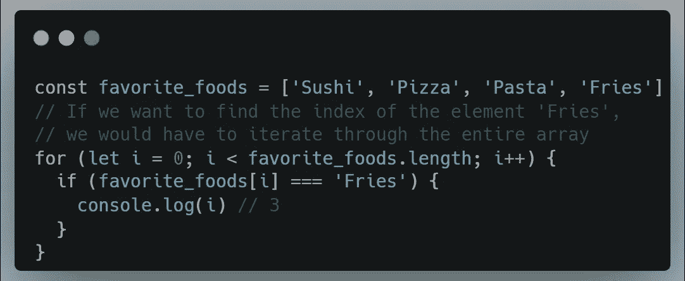
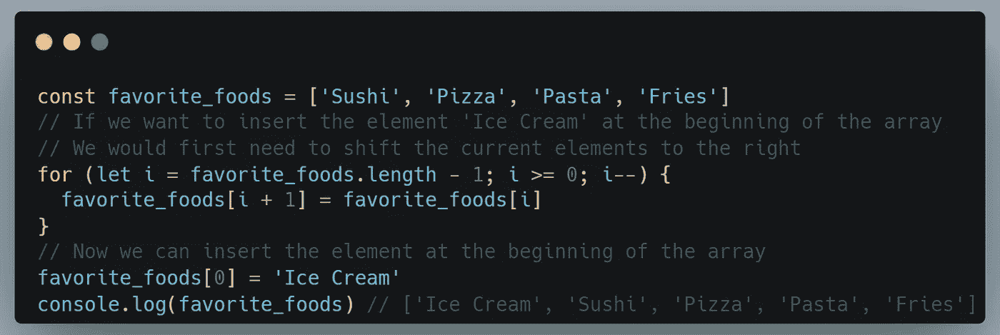
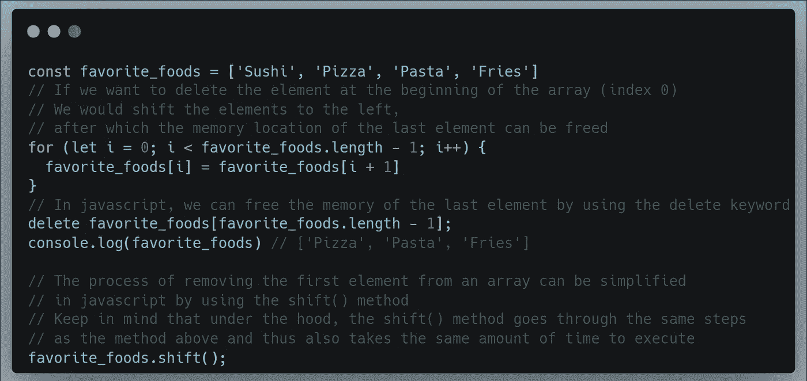

# 阵列，用 4 分钟解释

> 原文：<https://javascript.plainenglish.io/arrays-explained-in-3-minutes-fe97a7edb3e5?source=collection_archive---------14----------------------->

数组是最常用的数据结构之一，也可能是大多数软件工程师最先了解的数据结构之一。

数组是一种存储元素集合的数据结构。数组中的每个元素都有一个特定的索引，可以用来访问它。数组通常用于以特定的顺序存储数据。*

# 使用现实世界的问题进行解释

例如，假设你有一张你最喜欢的食物的清单。你可以将这个列表存储在一个数组中。数组中的第一个元素是你最喜欢的食物，第二个元素是你第二喜欢的食物，依此类推。然后，您可以通过索引访问数组中的每种食物。

# **访问时间**

如果我们让数组的大小为 n，我们可以在 O(1)时间内通过索引访问数组中的元素。

这是可能的，因为元素存储在内存中的连续位置。在上面的代码示例中可以看到这种直接访问。

**在本文的剩余部分，我们将假设数组的大小为 n**

# **搜索时间**

如果我们想在数组中找到一个元素，我们可以在 O(n)时间内完成。

这是因为，在最坏的情况下，我们必须遍历整个数组来找到元素。这可以在下面的代码示例中看到。

如果我们假设数组是排序的，那么搜索时间可以缩短。

这是可能的，因为给定一个排序数组，我们可以使用二分搜索法在 O(log n)时间内找到元素。

想了解更多关于二分搜索法的信息，请看我关于二分搜索法算法的帖子

 [## 二分搜索法在 3 分钟内解释道

### 什么是二分搜索法？这是一种用于在排序列表中查找值的算法。

javascript.plainenglish.io](/binary-search-explained-in-3-minutes-61c65cc1280a) 

# **插入时间**

将元素插入数组所需的时间取决于我们想要插入元素的索引。

如果我们想在数组的末尾插入元素，并且我们知道数组的长度是 n，那么我们可以在 O(1)时间内插入元素。

这是因为已经存储在数组中的元素可以保留在内存中的相同位置，新元素可以插入到数组的末尾(在索引 n+1 处)。

相反，如果我们想在数组的开头插入元素，插入需要 O(n)时间。

这是因为已经存储在数组中的元素必须向右移动，以便为新元素腾出空间。如下面的代码示例所示。

# **删除时间**

像插入一样，从数组中删除元素所需的时间取决于我们要从中删除元素的索引。

按照与插入相同的逻辑，删除的最坏情况时间是 O(n)，这发生在我们删除数组中的第一个元素时。

这是因为被删除元素之后的元素必须向左移动以填充间隙。

[链接到代码](https://gist.github.com/SennR-1952135/0887238318f9efdd2cb65cbfb0ebd322)

# 该系列

本文是一个新系列的一部分，在这个系列中，我以清晰简洁的方式解释了复杂的算法和数据结构——同时消耗了最少的阅读时间。

 [## 快速清晰地解释算法(无废话)

### 开始一个新系列

medium.com](https://medium.com/@sennr/algorithms-explained-fast-and-clear-no-bs-13134a7077fc) 

请确保[关注我](https://medium.com/@sennr)、[订阅我的时事通讯](https://medium.com/subscribe/@sennr)，或者看看上面提到的文章来获取该系列的更新。

*更多内容看* [***说白了就是 io***](https://plainenglish.io/) *。报名参加我们的* [***免费周报***](http://newsletter.plainenglish.io/) *。关注我们关于*[***Twitter***](https://twitter.com/inPlainEngHQ)*和*[***LinkedIn***](https://www.linkedin.com/company/inplainenglish/)*。加入我们的* [***社区***](https://discord.gg/GtDtUAvyhW) *。*