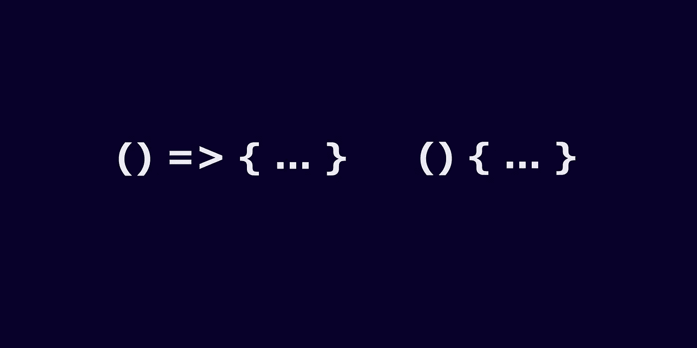

# JavaScript 中的箭头函数与常规函数——综合指南

> 原文：<https://javascript.plainenglish.io/arrow-functions-vs-regular-functions-in-js-fa1a1f235c86?source=collection_archive---------7----------------------->

## JavaScript 中箭头函数和普通函数的比较



箭头函数是 ECMAScript 6(ES6)中引入的一个奇妙特性。ES6 发布于 2015 年。2017 年开始了我的开发者生涯。所以当我写我的第一个 JavaScript 程序时，箭头函数就在其中。在我个人看来，我更喜欢尽可能地使用箭头函数。原因是，当我们与常规函数进行比较时，带有箭头函数的代码是清晰易读的，而且我对使用箭头函数感到很舒服。

如果箭头函数很容易实现，那么常规函数就不可能被箭头函数完全取代。有些情况下我们必须使用常规函数。所以阿罗函数并不是包治百病的良药。

***“箭头函数和普通函数有什么区别？”*** 是 JavaScript 面试中普遍存在的问题。所以如果你的目标是掌握 JavaScript，不要错过这个内容。

让我们从基本的事情开始，然后讨论这个话题的高级项目。

我们使用关键字`function`定义的函数称为常规函数。我们可以用两种方式定义正则函数:

1.  函数声明
2.  函数表达式

```
*// Function declaration* function sayHello(name) {
   return `Hello ${name}`
}*// Function expression* const sayHello = function(name) {
   return `Hello ${name}`
}
```

我们可以将上述常规函数定义为箭头函数，如下所示:

```
const sayHello = (name) => `Hello ${name}`;
```

定义箭头函数时要遵循的准则。

*   当一个函数只有一个参数时，`=>`符号前的括号不是必需的。但是这个函数不仅仅需要参数；括号是强制性的。
*   如果函数体只有一行表达式，则不需要在`=>`符号后使用花括号。如果不是这样，花括号是强制性的。

请参考下面的代码来阐明上述准则。

```
const add = (a, b) => a + b;const sayHello = name => `Hello ${name}`;const someFunction = (x, y, z) => {
  *// do some stuff* ...
  return z;
}
```

***基本的事情都做完了。现在，让我们进入正题。***

## **使用“this”关键字的不同行为**

***在常规函数中****`this`关键字是动态的，这取决于执行上下文。*

****在箭头函数中，***`this`的行为与常规函数的`this`行为有很大不同。`this`的值总是等于外部函数的`this`值，而不是定义自己的执行上下文。换句话说，`this`是按词法解析的，不管 arrow 函数是如何执行的，也不管它在哪里执行。*

```
*function myFunction() {
  console.log(this); // global object
}
myFunction();*
```

*在一个 ***简单调用*** 的过程中，就像上面的代码片段一样，`this`等于`global`对象。如果我们把`myFunction`转换成一个箭头函数，效果也是一样的。*

```
*const myFunction = () => {
  console.log(this); *// global object* }
myFunction();*
```

*如果我们在常规函数中使用`new myFunction()`、
执行一个 ***构造函数调用*、
，`this`等于新创建的`myFunction {}`实例，但是如果我们对一个箭头函数执行同样的操作，它会给出一个错误`TypeError: myFunction is not a constructor`。***

```
*function myFunction() {
  console.log(this);   *//* myFunction {}}
// constructor invocation
new myFunction();const myFunction = () => {
  console.log(this);   *//* TypeError: myFunction is not a constructor}
// constructor invocation
new myFunction();*
```

****所以，普通的函数可以用来构造对象，但是箭头函数不支持这一点，因为箭头函数是按照词汇来解析*** `this` ***的。****

```
*const dog = {
  name: 'Lassie',
  bark: function () {
    console.log(this);   // { name: 'Lassie', bark: ƒ }
  }
}
// Normal function method invocation
dog.bark();const dog = {
  name: 'Lassie',
  bark: () => {
    console.log(this);  // global object
  },
}
// Arrow function method invocation
dog.bark();*
```

*在 ***方法调用期间*** 与上面的代码片段一样，在常规函数中，`this`等于其拥有的对象，但是在箭头函数中，`this`指的是外部函数的词法范围。在上面的代码片段中，`this`等于`global`对象，因为`dog`对象是在脚本的根级别中声明的。*

```
*const dogObject = { name: 'Lassie' };// Normal Function
function createDog() {
  console.log(this); // { name: 'Lassie' }
}
createDog.call(dogObject);
createDog.apply(dogObject);// Arrow Function
const createDog = () => {
console.log(this); // global object
};
createDog.call(dogObject);
createDog.apply(dogObject);*
```

*在 ***使用`function.call(context)`或`function.apply(context)`间接调用*** 时，在常规函数中，`this`等于第一个参数；在上面的代码片段中，是`dogObject`。在 arrow 函数中，`this`的值不变，并且`this`仍然按词法解析。在上面的代码片段中，`this`等于`global`对象，因为`createDog`函数是在脚本的根级别中声明的。*

## *参数绑定*

*常规函数有参数绑定。这就是为什么我们可以在函数体内使用`arguments`关键字来访问它们。但是箭头函数没有参数绑定。如果我们试图使用关键字`arguments`访问这些文件，它会给出错误:`ReferenceError: arguments is not defined`。
参见下面的例子。*

```
*function x() {
  console.log(arguments);
  // [1, 2, 3, callee: ƒ, Symbol(Symbol.iterator): ƒ]
}
x(1, 2, 3);const y = () => {
  console.log(arguments); 
  // ReferenceError: arguments is not defined}
y(1, 2, 3);*
```

*但是我们可以使用 spread 运算符访问 arrow 函数中的参数，如下所示:*

```
*const y = (...n) => {
  console.log(n);
}
y(1, 2, 3);*
```

# *不应该使用箭头函数的地方*

*   ****定义对象内部的函数。****

```
*const person = {
  age: 30,
  sayAge: () => {
    console.log(`I am ${this.age} years old.`);
    // I am **undefined** years old.
  },
}
person.sayAge();*
```

*现在你应该知道打印年龄的原因是`undefined`😎。*

*   ****担任建造师****

```
*const Employee = () => {};
const employee = new Employee(); 
*// TypeError: Employee is not a constructor**
```

***注:** *理解箭头函数和常规函数的区别有助于为特定需求选择正确的语法。**

****你知道什么是封闭吗？
没有？然后看我之前的文章*** [***JS 封***](https://medium.com/@sudarshanadayananda/what-is-a-closure-in-js-eab2fcb68ccc) ***。
是的？还在读。你肯定会学到新的东西。****

*感谢阅读。😍*

> *希望你能从这篇文章中学到一些新的东西。请跟随我阅读这类文章。干杯！*

**更多内容请看*[***plain English . io***](https://plainenglish.io/)*。报名参加我们的* [***免费每周简讯***](http://newsletter.plainenglish.io/) *。关注我们* [***推特***](https://twitter.com/inPlainEngHQ)**和*[***LinkedIn***](https://www.linkedin.com/company/inplainenglish/)*。查看我们的* [***社区不和谐***](https://discord.gg/GtDtUAvyhW) *加入我们的* [***人才集体***](https://inplainenglish.pallet.com/talent/welcome) *。***