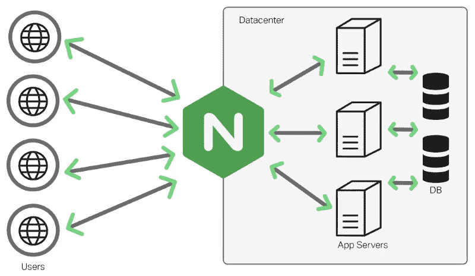
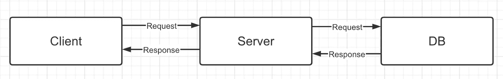
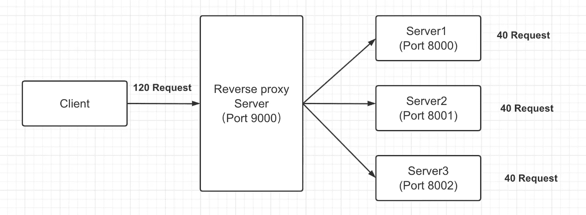
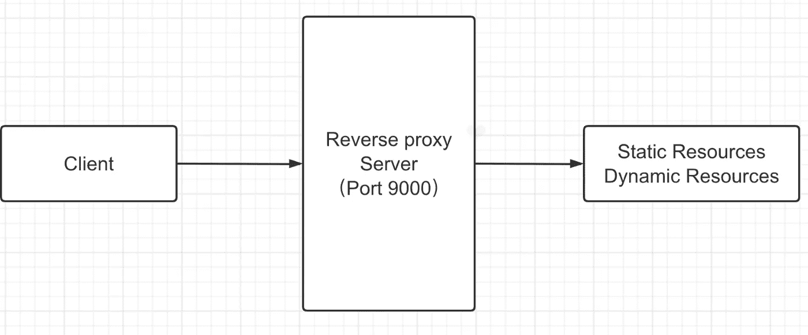
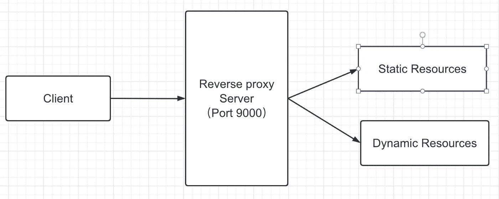

# 作为一名前端开发者，你对 NGINX 了解多少？

> 原文：<https://javascript.plainenglish.io/as-a-front-end-developer-how-much-do-you-understand-nginx-45e06c9f7dd9?source=collection_archive---------0----------------------->

## 我一个前端朋友去面试的时候被问到这样一个问题。

我一个前端朋友去面试的时候被问到这样一个问题。他只回答了一部分，想让我回来给他科普一下，所以我写了这篇文章。

# NGINX 是什么？

NGINX (engine x)是一个**轻量级**、**高性能 HTTP** 和**反向代理服务器**，也是一个通用代理服务器(TCP/UDP/IMAP/POP3/SMTP)，最初由俄罗斯人`Игорь Сысоев.`编写

NGINX 是一个高性能的 HTTP 和反向代理服务器，特点是内存占用低，并发能力强。现实中 NGINX 的并发能力比同类型的 web 服务器要好。

NGINX 是专门为性能优化而开发的。最重要的要求是性能，非常注重效率。据悉，NGINX 最多可以支持 50000 个并发连接。

# 正向代理和反向代理

NGINX 是反向代理服务器，那么什么是反向代理呢？让我们首先来看看什么叫做正向代理

**转发代理**:局域网内的计算机用户直接访问网络是不可行的，只能通过代理服务器(server)访问。这种代理服务称为转发代理。

**反向代理**:客户端无法感知代理，因为客户端访问网络不需要配置网络，只要向反向代理服务器发送请求，反向代理服务器选择目标服务器获取数据，然后返回给客户端。反向代理服务器和目标服务器对外只是一个服务器，暴露了代理服务器地址，隐藏了真实的服务器 IP 地址。

# 负载平衡

**负载平衡**:高可用性网络基础设施的关键组件，通常用于在多个服务器之间分配工作负载，以提高网站、应用程序、数据库或其他服务的性能和可靠性。

如果没有负载均衡，客户端和服务器之间的操作通常是:客户端向服务器请求，然后服务器去数据库查询数据，把返回的数据带给客户端:

然而，随着客户端数量的不断增加以及数据和流量的快速增长，这种情况并不令人满意。从上图我们可以看到，客户端的请求和响应都是通过服务器的，所以我们增加服务器的量来允许是不是可以通过共享多台服务器来解决这个问题？

但是这个时候对于客户端来说，他访问这个地址是固定的，所以他不会在意服务器的时间。你只需要把数据返回给我就 OK 了，所以我们需要一个“经理”，找到这些服务器的老板，客户端直接找到老板，然后老板指派谁处理谁的数据，从而减轻服务器的压力，而这个“老板”就是反向代理服务器，端口号就是这些服务器的员工。号码

像这样，当有 120 个请求时，反向代理服务器会平均分配给服务器，即每个会处理 40 个请求。这个过程叫做:负载均衡。当然，实现分配的方式有很多种，我只是简单介绍一种。

# 动静分离

当客户端发起请求时，正常情况是这样的:

静态资源:如 HTML、CSS

动态资源:作为 Java

为了减轻服务器的压力，我们把动态资源和静态资源分开，交给不同的服务器解析，这样既加快了解析的速度，又减轻了单台服务器的压力。

# 安装 NGINX

要安装 NGINX，可以参考在线教程，或者我写下一篇文章

这里我列出了一些常用的命令:

*   查看版本:`nginx -v`
*   开始:`nginx`
*   关机:`nginx -s stop`
*   确定配置文件是否正确:`nginx -t`
*   重装配置:`nginx -s reload`

**NGINX 配置文件**

配置文件分为三个模块:

**全局块**:从配置文件开始到 events 块，主要是设置一些影响 NGINX 服务器整体运行的配置指令。(按理说在配置并发处理服务的时候，值越大越能支持并发处理，但此时会受到硬件、软件、其他设备的限制)。

**事件阻塞**:影响 NGINX 服务器和用户之间的网络连接。常见的设置包括是否在多个工作进程下启用网络连接的序列化，是否允许同时接收多个网络连接等。

**HTTP block** :比如这里配置了反向代理和负载均衡。

# 位置匹配规则

有四种方法:

`=`:精确匹配，用于没有正则表达式的 URL，要求字符串与 URL 严格匹配，只有完全相等才能停止向下搜索和请求过程。

`^~`:NGINX 服务器在用于没有正则表达式的 URL 之前，需要找到 URL 和字符串匹配度最高的位置，然后使用这个位置立即处理请求，不再进行匹配。

`~`:最佳匹配，用于表示 URL 包含正则表达式，区分大小写。

`~*`:与`~`相同，除了不区分大小写。

*更多内容看* [***说白了就是***](https://plainenglish.io/) *。报名参加我们的* [***免费周报***](http://newsletter.plainenglish.io/) *。关注我们关于* [***推特***](https://twitter.com/inPlainEngHQ) ， [***领英***](https://www.linkedin.com/company/inplainenglish/) *，以及* [***不和***](https://discord.gg/GtDtUAvyhW) *。*