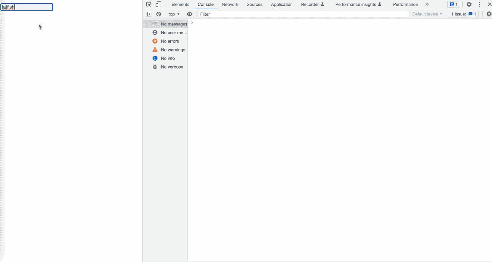
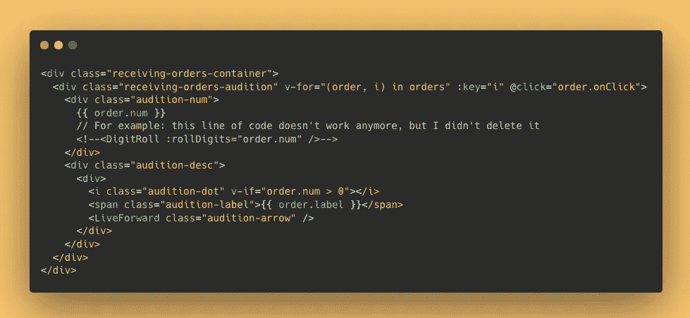
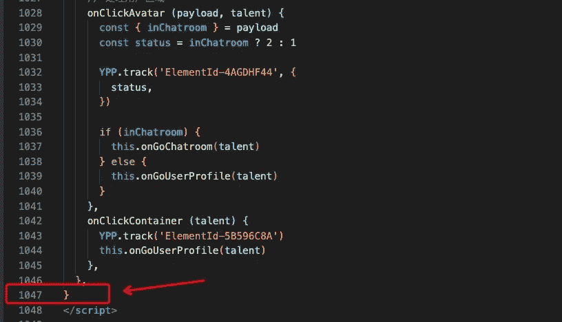

# 作为前端工程师，您应该知道的 10 个 JavaScript 技巧和提示

> 原文：<https://javascript.plainenglish.io/as-a-front-end-engineer-10-javascript-tricks-and-tips-you-should-know-about-6f4df0082407?source=collection_archive---------0----------------------->

## 请一定要学会这些技巧。

# 前言

以前写了很多垃圾代码，现在**那个看起来很可怕。**

当我再次看到那些代码片段的时候，我甚至怀疑自己是否适合做程序员。

所以，这里有 10 个 JavaScript 技巧来帮助你避免写我曾经写过的那种垃圾代码。

# 1.承诺回调地狱

**承诺**提供了一种优雅的方式来处理 JavaScript 中的异步操作。这也是避免“**回调地狱**”的解决方案之一。但是我没有真正理解它的意思，所以我写了这个代码片段。

我做了这些事情:

1.  先获取用户的基本信息。
2.  通过用户信息获取所有文章的简要摘要。
3.  通过文章简单获取文章细节。

我一点也没有利用承诺。我们应该像下面的代码片段一样处理它:

# 2.不处理错误消息

我经常只写成功请求的代码逻辑，而忽略失败的请求。

这是没有经验的，我们应该给出一个用户友好的提示，而不是什么都不做。

# 3.为一个函数设置太多参数。

当一个函数有太多的参数时，它会变得可读性更差，甚至让我们想知道如何正确地传递参数。

**示例**

我们想获得用户的一些基本信息，如**姓名**、**性别**、**年龄**、**等**。

太可怕了。如果你的同事这样写代码，你会揍他一顿吗？

事实上，当函数参数过多时，应该使用对象来传递所需的信息，这样其可读性和可扩展性都会得到提高。

# 4.幻数

朋友们，你们写过这样的代码吗？很多地方用数字做逻辑判断似乎很正常。是的，我搞不清楚`1`、`2`、`3`到底是什么意思。

我们最好将这些数字定义为常数。

# 5.使用。l `ength`判断字符串的长度

大多数时候，我们使用`.length`来判断字符串的长度是安全的，但是在表单输入的情况下，你应该小心。

当我们键入`🍫`时，`nameLen`的值是 2 —这不奇怪吗？

是的，这是有原因的，你猜怎么着？

# 6.永远不要写代码注释

我们经常向别人抱怨“为什么不写代码注释？”但实际上，我从来不写！

天哪，你知道‘DPR’是什么意思吗？我从来没想过它的意思是`window devicePixelRatio`.

# 7.无意义的代码注释

与其不写代码注释，不如写无意义的代码注释，因为浪费你的时间。

你不妨解释一下“a”是什么意思，或者使用有意义的变量名！

# 8.随机命名

过去，我常常编写一些笨拙的代码片段，随机命名变量。

朋友们，请不要学我。你应该给变量一个合适的有意义的名字。

# 9.不要删除不推荐使用的代码

很多时候，我们的网站会不断调整功能，有新的，有弃用的功能，但我总是担心以后会用到，所以只是评论，而不是删除。

其实这种担心完全没有必要，因为以后用上的可能性非常小。即使将来会用到，也可以通过‘git’追溯。

# 10.超过一千行组件代码

我在一个组件中写了一千多行代码。这太糟糕了，我们应该将组件的功能进一步分割成更小的组件。

# 最后

**感谢阅读。**我期待期待您的关注和阅读更多高质量的文章。

 [## 记者:在 JavaScript 中(a==1 && a==2 && a==3)能计算为真吗？

### 是的，这可能是真的，而且有 6 种方式——太神奇了！

javascript.plainenglish.io](/interviewer-can-a-1-a-2-a-3-ever-evaluate-to-true-in-javascript-d2329e693cde)  [## “我失去了一个工作机会，只是因为承诺。所有”

### 一次让我好难过的面试经历。

javascript.plainenglish.io](/i-lost-a-job-opportunity-just-because-of-promise-all-be396f6efe87)  [## 采访者:“npm 跑 xxx”怎么了？

### 一个大多数人都不知道的秘密。

javascript.plainenglish.io](/interviewer-what-happened-to-npm-run-xxx-cdcb37dbaf44)  [## 面试官:可以“x！== x "在 JavaScript 中返回 True？

### 你可能不知道的五个神奇的 JavaScript 知识点！

javascript.plainenglish.io](/interviewer-can-x-x-return-true-in-javascript-7e1d1fa7b5cd)  [## 现在是 2022 年，不要再滥用箭头功能了

### 不应该使用箭头函数的 4 种情况。

javascript.plainenglish.io](/its-2022-don-t-abuse-the-arrow-function-anymore-905862a9c668) 

*更多内容请看*[***plain English . io***](https://plainenglish.io/)*。报名参加我们的* [***免费周报***](http://newsletter.plainenglish.io/) *。关注我们关于*[***Twitter***](https://twitter.com/inPlainEngHQ)[***LinkedIn***](https://www.linkedin.com/company/inplainenglish/)*[***YouTube***](https://www.youtube.com/channel/UCtipWUghju290NWcn8jhyAw)***，以及****[***不和***](https://discord.gg/GtDtUAvyhW) *对成长黑客感兴趣？检查* [***电路***](https://circuit.ooo/) ***。*****