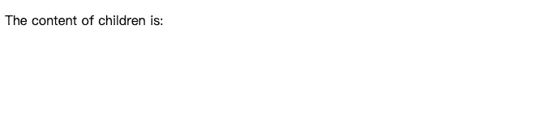
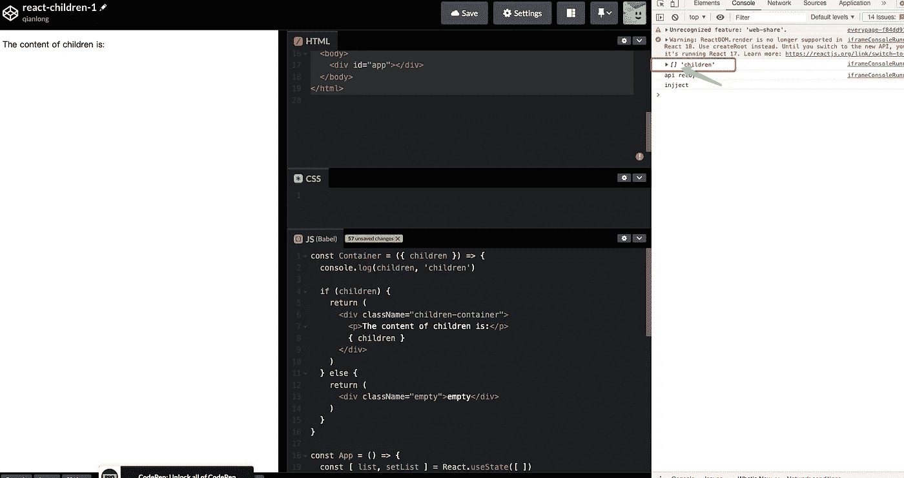

# 作为一名前端工程师，你应该知道的 4 个反应陷阱

> 原文：<https://javascript.plainenglish.io/as-a-front-end-engineer-4-react-traps-you-should-know-about-4adb126672f6?source=collection_archive---------0----------------------->

## 你必须远离的 4 个反应陷阱

Photo by [zhang kaiyv](https://unsplash.com/@zhangkaiyv?utm_source=medium&utm_medium=referral) on [Unsplash](https://unsplash.com?utm_source=medium&utm_medium=referral)

我非常喜欢 React，这是我在工作中最常用的框架之一。但是因为控制不好条件句，差点就放弃了，有段时间 React 感觉真的很难。

朋友，你遇到过这些问题吗？在 React 中应该如何写好条件语句？

# 1.0 是魔鬼，请远离它

您必须编写这样的代码，我们需要从服务器中提取数据并显示列表。如果数据为空，则不应显示。

我的天，这是为什么？为什么`list`是空数组时会显示数字 0？

**为什么？**

谢天谢地，这不是一个反应错误。这和 JavaScript 本身的运行机制有关。

> *提示(来源于*[*MDN*](https://developer.mozilla.org/en-US/docs/Web/JavaScript/Reference/Operators/Logical_AND)*):“一组布尔操作数的逻辑 AND ( & &)运算符(逻辑合取)为真当且仅当所有操作数为真。否则就是假的。*
> 
> *更一般地，当从左到右求值时，运算符返回遇到的第一个假操作数的值，或者如果它们都为真，则返回最后一个操作数的值。”*

当我们在使用**a&b**时，如果`a`为 0，则立即返回，并且不计算`b`的值。所以你一定明白为什么上面的列表显示的是 0。

**如何解决这个问题？**

我们有很多方法可以解决这个问题，大致可以分为两种。

1.  将`a`变成布尔型
2.  使用三元表达式

# 2.请减少嵌套的多层三元表达式

我经常在公司的项目中看到嵌套了多个三元表达式的代码。简直是噩梦。我不能理解它。它的可读性真的很差。

朋友们，如果你的同事正在写这种代码，请务必给他买 100 个汉堡，让他吃到再也写不出程序了。

**怎么修？**

当我们遇到复杂的逻辑判断时，使用`if else`是个不错的选择。

# 3.小心使用“||”和“&&”

如果你需要混合“||”和“&&”，请非常小心，因为这很容易让你出错。

当属性`name`或`name2`被传递一个值时，我想显示“fatfish ”,但显然，这不是我们所期望的。

**为什么？**

这个`&&`操作符有更高的优先级，所以它相当于下面的代码。

朋友们，当你使用“||”时，这是一个充满错误的地方，或者你可以尝试使用“()”来改变他们的优先级。

是的，这就是我们想要的答案。太好了！！！

# 4.不要用“道具.儿童”作为条件判断

这段代码非常简单，它实现了一个类似于 Vue 中 slots 的功能，当它被传递时渲染`children`，如果没有被传递则显示一个空元素。

这也是一个巨大的陷阱，我的朋友，它可能会让你丢掉工作。

**1。清空列表数据**

你认为这个例子会显示什么——“空”吗？

**不幸的是，答案是另一个。**你是不是也觉得不可思议？朋友们，一定要非常谨慎地使用“props.children”，否则老板可能会扣你的工资。

**为什么？**

让我们给“容器”组件添加一行代码，试着打印出孩子是什么！

是的，你是对的。此时“children”是一个空数组，所以显示“children 的内容是:”而不是“empty”。

**如何解决？**

使用[做出反应。Children.toArray](https://reactjs.org/docs/react-api.html#reactchildrentoarray) ，解决这个问题会很容易，这时你会看到“空”显示出来。所以如果你真的需要用孩子作为条件判断，我建议你用这个方法！

# 最后

**感谢阅读。**我期待着您的关注和阅读更多高质量的文章。

 [## “我失去了一个工作机会，只是因为承诺。所有”

### 一次让我好难过的面试经历。

javascript.plainenglish.io](/i-lost-a-job-opportunity-just-because-of-promise-all-be396f6efe87)  [## 采访者:“npm 跑 xxx”怎么了？

### 一个大多数人都不知道的秘密。

javascript.plainenglish.io](/interviewer-what-happened-to-npm-run-xxx-cdcb37dbaf44)  [## 面试官:可以“x！== x "在 JavaScript 中返回 True？

### 你可能不知道的五个神奇的 JavaScript 知识点！

javascript.plainenglish.io](/interviewer-can-x-x-return-true-in-javascript-7e1d1fa7b5cd)  [## 现在是 2022 年，不要再滥用箭头功能了

### 不应该使用箭头函数的 4 种情况。

javascript.plainenglish.io](/its-2022-don-t-abuse-the-arrow-function-anymore-905862a9c668) 

*更多内容请看*[***plain English . io***](https://plainenglish.io/)*。报名参加我们的* [***免费周报***](http://newsletter.plainenglish.io/) *。关注我们关于*[***Twitter***](https://twitter.com/inPlainEngHQ)[***LinkedIn***](https://www.linkedin.com/company/inplainenglish/)*[***YouTube***](https://www.youtube.com/channel/UCtipWUghju290NWcn8jhyAw)*[***不和***](https://discord.gg/GtDtUAvyhW) ***。*****

*****对缩放您的软件启动感兴趣*** *？检查* [***电路***](https://circuit.ooo?utm=publication-post-cta) *。***