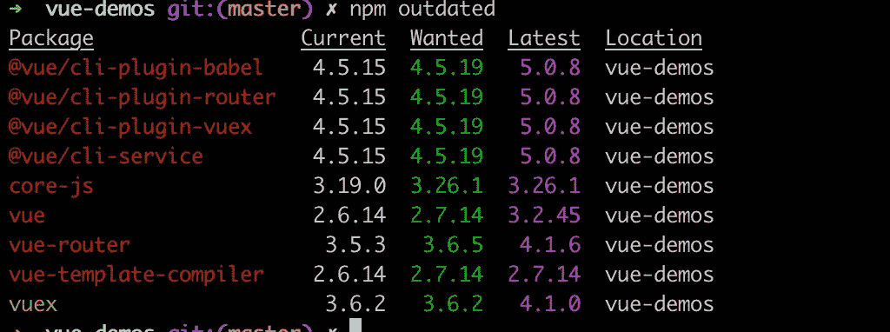
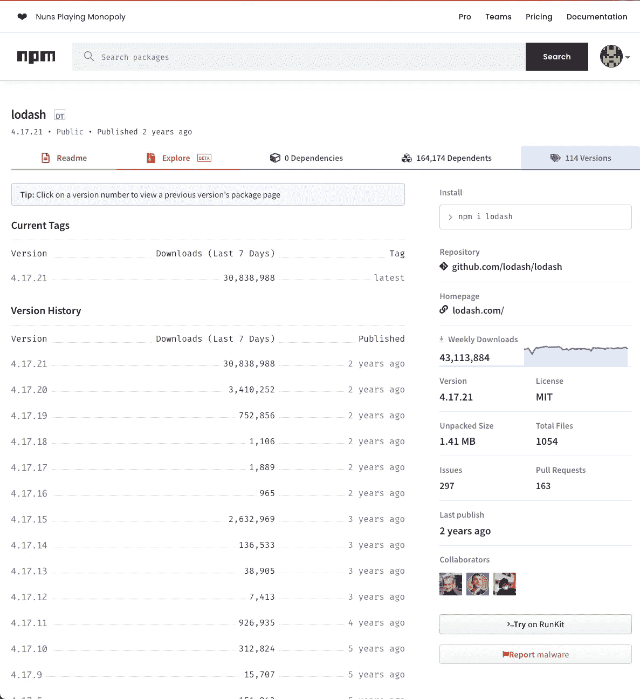
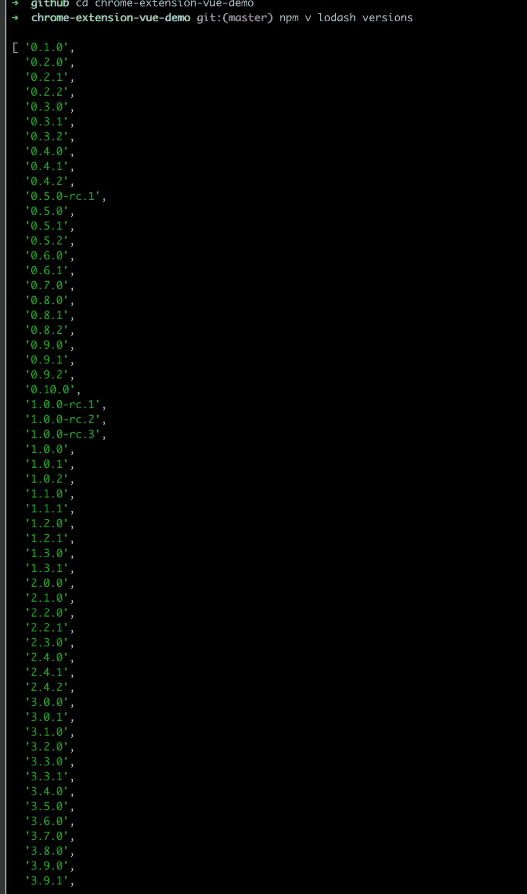
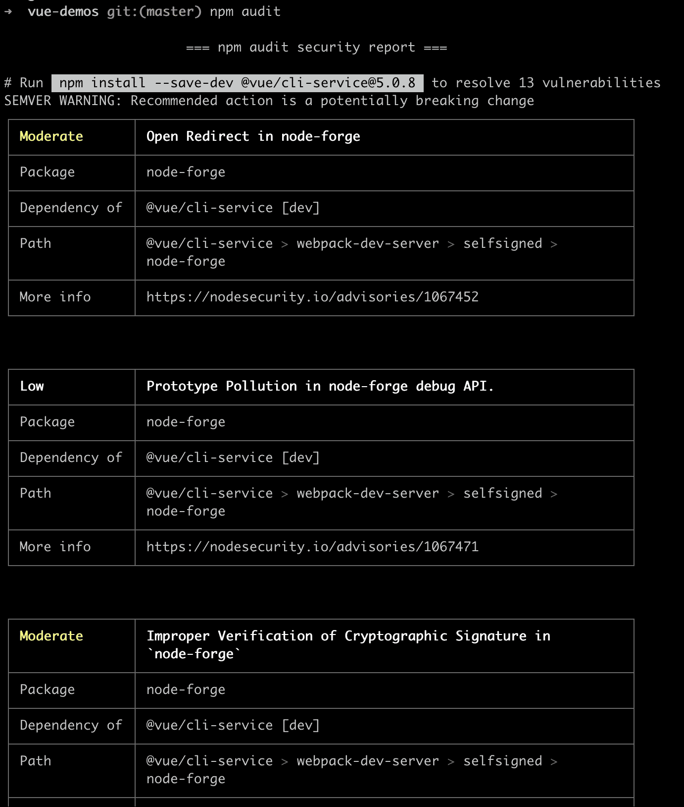
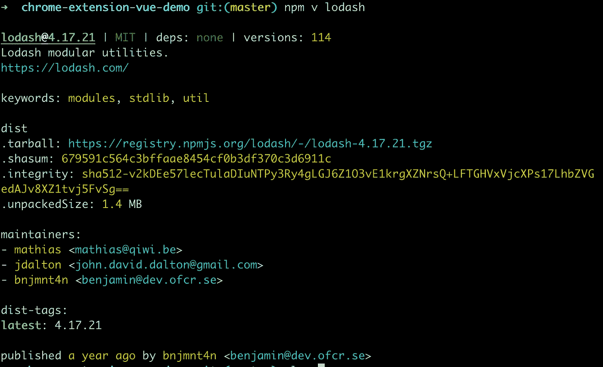
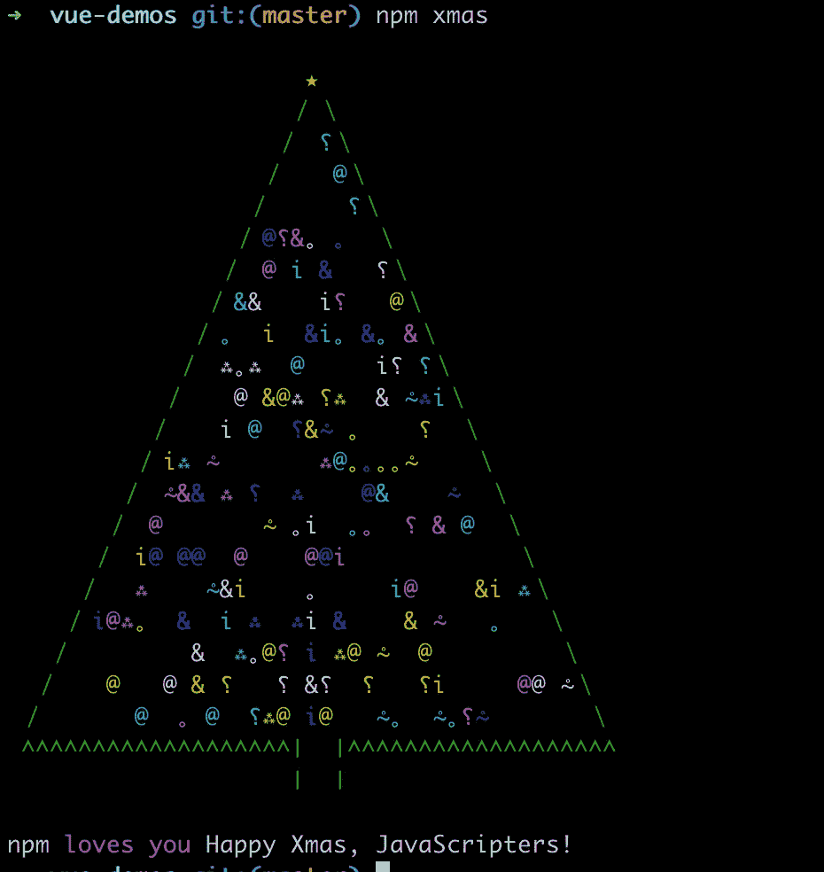
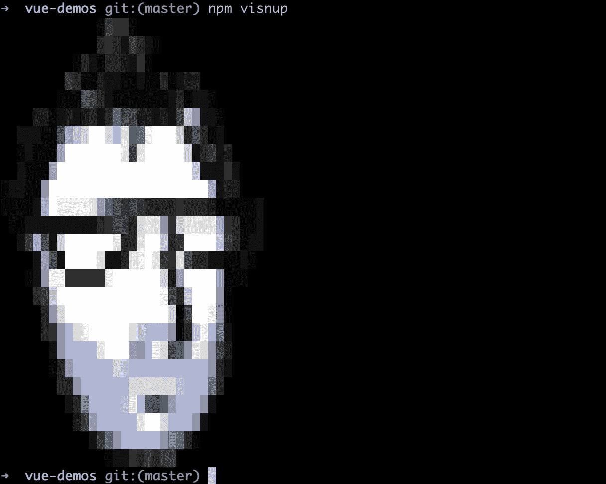

# 作为一名前端工程师:你应该使用的 8 种有用的 Npm 编码技术

> 原文：<https://javascript.plainenglish.io/as-a-front-end-engineer-8-useful-npm-coding-techniques-that-you-should-use-bc30b8503ba4?source=collection_archive---------0----------------------->

## 我希望我能早点知道他们


Photo by [Radu Florin](https://unsplash.com/@raduflorin?utm_source=medium&utm_medium=referral) on [Unsplash](https://unsplash.com?utm_source=medium&utm_medium=referral)

# 1.#打开软件包的文档页面

朋友们，如果我早一点知道这个窍门，我会节省很多时间。

以前我想查询`lodash`的使用文档时，总是通过`google`搜索它的地址。

事实上，npm 可以帮助你快速实现这个目标。你只需要运行`npm docs xxx`就可以快速打开`xxx`的文档

```
npm docs [package-name] // npm docs lodash
```

2.#打开包的 GitHub repo

作为一名程序员，我猜你也喜欢`github`，它是程序员的宝库。

有时候想知道一个包的源代码，只能在`github`上搜索包名吗？

答案是否定的，`npm`可以帮你快速打开一个包的 GitHub repo

```
npm repo [package-name] // npm repo lodash
```

## 对扩展您的软件启动感兴趣吗？检查[电路](https://circuit.ooo/?utm=publication-post-cta)。

# 3.#检查包中过时的依赖项

在您的项目中运行`npm outdated`命令，它将检查所有包的当前版本、所需版本和最新版本。



```
npm outdated
```

# 4.#查看包的所有历史版本

你知道如何查看一个包的所有历史版本吗？

是的，我们可以通过国家预防机制的网站做到这一点。

那就像下面这个链接…

[https://www.npmjs.com/package/lodash?activeTab=versions](https://www.npmjs.com/package/lodash?activeTab=versions)



还有别的办法吗？太神奇了，你所需要的就是这一行命令。

```
npm v [package-name] versions // npm v lodash versions
```



# 5.#在您的项目中查找有风险的包

[从 NPM](https://docs.npmjs.com/cli/v9/commands/npm-audit)audit 命令向默认注册表提交项目中配置的依赖项的描述，并要求提供已知漏洞的报告。如果发现任何漏洞，将计算影响和适当的补救措施。如果提供了 fix 参数，则修正将应用于程序包树。

```
npm audit
```



# 6.#查看包的详细信息

嗯！也许这个命令不是很有用，但是你可以用它来了解一个包的很多信息，比如它的作者，联系信息等等。

```
npm v [package-name] // npm v lodash
```



# 7.# npm 圣诞节

没想到 npm 会这么有趣，哈哈！

当你跑`npm xmas`的时候，你会看到一棵圣诞树。

```
npm xmas
```



# 8.# npm visnup

朋友们，如果你知道原因，请告诉我。为什么一个人会出现？

```
npm visnup
```



# 最后

**感谢阅读。**我期待着期待您的关注和阅读更多高质量的文章。

[](/interviewer-what-happened-to-npm-run-xxx-cdcb37dbaf44) [## 采访者:“npm 跑 xxx”怎么了？

### 一个大多数人都不知道的秘密。

javascript.plainenglish.io](/interviewer-what-happened-to-npm-run-xxx-cdcb37dbaf44) [](/my-boss-you-dont-know-react-at-all-f493970f1807) [## 我老板:你根本不知道反应！😠

### 你必须知道的 React 的 3 种错误用法。

javascript.plainenglish.io](/my-boss-you-dont-know-react-at-all-f493970f1807) [](/8-cool-github-tricks-to-make-you-look-like-a-senior-developer-ab8fe9ae9b14) [## 让你看起来像高级开发人员的 8 个很酷的 GitHub 技巧

### 使用 GitHub 可以做的 8 件很酷的事情

javascript.plainenglish.io](/8-cool-github-tricks-to-make-you-look-like-a-senior-developer-ab8fe9ae9b14) [](/interviewer-can-x-x-return-true-in-javascript-7e1d1fa7b5cd) [## 面试官:可以“x！== x "在 JavaScript 中返回 True？

### 你可能不知道的五个神奇的 JavaScript 知识点！

javascript.plainenglish.io](/interviewer-can-x-x-return-true-in-javascript-7e1d1fa7b5cd) [](/what-does-123-tostring-length-123-print-out-in-javascript-2c804a414325) [## 123['toString']。length + 123)用 JavaScript 打印出来？

### 95%的前端开发者回答错误的问题。

javascript.plainenglish.io](/what-does-123-tostring-length-123-print-out-in-javascript-2c804a414325) 

*更多内容请看*[***plain English . io***](https://plainenglish.io/)*。报名参加我们的* [***免费周报***](http://newsletter.plainenglish.io/) *。关注我们关于*[***Twitter***](https://twitter.com/inPlainEngHQ)[***LinkedIn***](https://www.linkedin.com/company/inplainenglish/)*[***YouTube***](https://www.youtube.com/channel/UCtipWUghju290NWcn8jhyAw)*[***不和***](https://discord.gg/GtDtUAvyhW) *。对增长黑客感兴趣？检查* [***电路***](https://circuit.ooo/) *。***