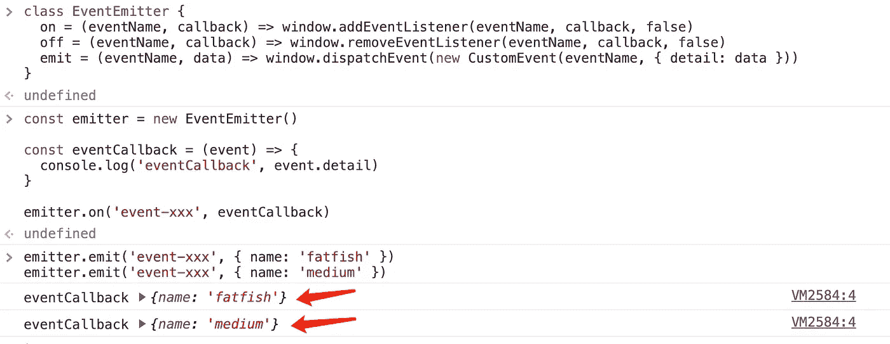
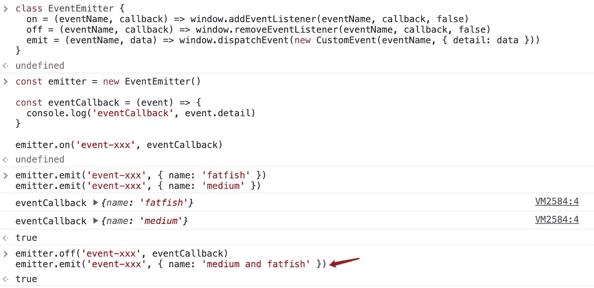
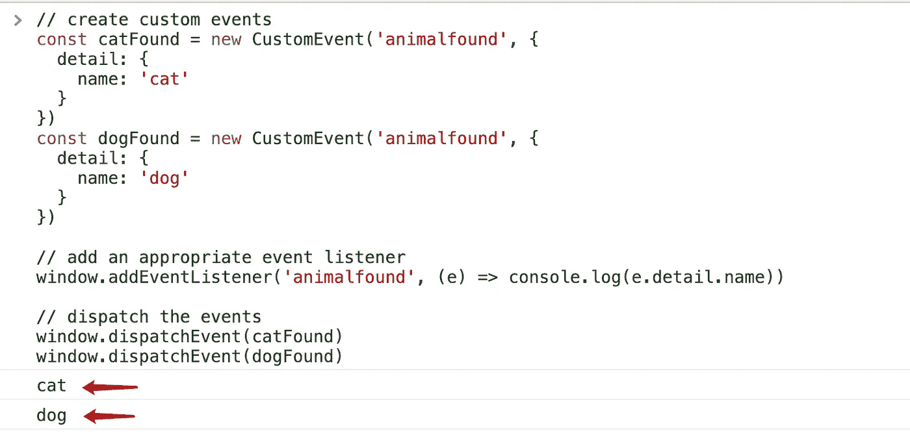
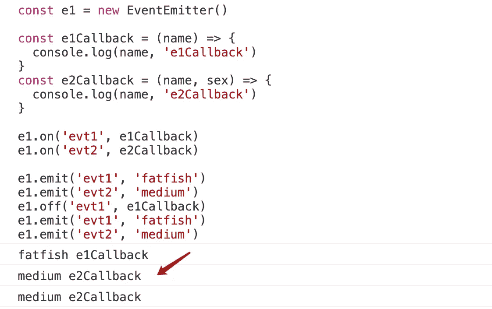

# 作为一名前端工程师:你应该知道的 JavaScript 中“事件发射器”背后的魔力

> 原文：<https://javascript.plainenglish.io/as-a-front-end-engineer-the-magic-behind-event-emitter-in-javascript-that-you-should-know-about-d30a62bc4bce?source=collection_archive---------0----------------------->

## 实现事件发射器的 5 行代码。

Photo by [Mikhail Vasilyev](https://unsplash.com/@miklevasilyev?utm_source=medium&utm_medium=referral) on [Unsplash](https://unsplash.com?utm_source=medium&utm_medium=referral)

# 什么是“事件发射器”？

朋友们，作为一名软件工程师，你们一定用过`Event Emitter`。我们经常用它来处理跨组件的通信场景。

**它触发一个人人都可以听的事件，当事件被触发时它可以发送数据。**

不同的库提供不同的实现，用于不同的目的，但基本思想是提供一个发布和订阅事件的框架。

**你想知道它背后的魔力吗？本文将与您分享一个非常简单的解决方案来实现它。**

# 试一试

请暂时看一下这个例子。

当你点击`Please send me data`按钮时，你会看到`count`的值越来越大，但是当你点击`Cut off contact`后，它就不再变化了。

这个例子很简单，但足以说明关于`Event Emitter`的一切。

# 我们开始吧

很神奇的是`Event Emitter`只用几行代码就能搞定。

1.  **监听事件**

**2。发布事件**

eventCallback 将打印数据两次，因为我们发布了两次`event-xxx`事件。

**3。解除事件**

当我们解除`event-xxx`事件时，`medium and fatfish`将不再被打印。

# CustomEvent 是这个难题的答案

实现`EventEmitter`的关键是`CustomEvent`和浏览器的事件机制，你可以从[这里](https://developer.mozilla.org/en-US/docs/Web/API/CustomEvent/CustomEvent)得到。

(来自[MDN](https://developer.mozilla.org/en-US/docs/Web/API/CustomEvent/CustomEvent))CustomEvent()构造函数创建一个新的 CustomEvent 对象。

# 实现事件发射器的另一种方式

尽管这种方法很简单，但它依赖于浏览器环境。有没有其他更好的解决办法？

# 最后

感谢阅读。我期待着您的关注和阅读更多高质量的文章。

 [## 记者:在 JavaScript 中(a==1 && a==2 && a==3)能计算为真吗？

### 是的，这可能是真的，而且有 6 种方式——太神奇了！

javascript.plainenglish.io](/interviewer-can-a-1-a-2-a-3-ever-evaluate-to-true-in-javascript-d2329e693cde)  [## “我失去了一个工作机会，只是因为承诺。所有”

### 一次让我好难过的面试经历。

javascript.plainenglish.io](/i-lost-a-job-opportunity-just-because-of-promise-all-be396f6efe87)  [## 采访者:“npm 跑 xxx”怎么了？

### 一个大多数人都不知道的秘密。

javascript.plainenglish.io](/interviewer-what-happened-to-npm-run-xxx-cdcb37dbaf44)  [## 面试官:可以“x！== x "在 JavaScript 中返回 True？

### 你可能不知道的五个神奇的 JavaScript 知识点！

javascript.plainenglish.io](/interviewer-can-x-x-return-true-in-javascript-7e1d1fa7b5cd)  [## 现在是 2022 年，不要再滥用箭头功能了

### 不应该使用箭头函数的 4 种情况。

javascript.plainenglish.io](/its-2022-don-t-abuse-the-arrow-function-anymore-905862a9c668) 

*更多内容请看*[***plain English . io***](https://plainenglish.io/)*。报名参加我们的* [***免费周报***](http://newsletter.plainenglish.io/) *。关注我们关于*[***Twitter***](https://twitter.com/inPlainEngHQ)[***LinkedIn***](https://www.linkedin.com/company/inplainenglish/)*[***YouTube***](https://www.youtube.com/channel/UCtipWUghju290NWcn8jhyAw)***，以及****[***不和***](https://discord.gg/GtDtUAvyhW) *对成长黑客感兴趣？检查* [***电路***](https://circuit.ooo/) ***。*****