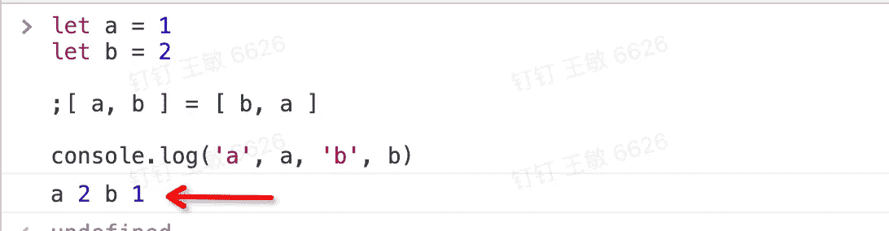

# 你应该知道的 7 种交换变量值的方法

> 原文：<https://javascript.plainenglish.io/as-a-software-engineer-7-ways-to-swap-the-value-of-variables-you-should-know-about-d9b4ad5afe23?source=collection_archive---------6----------------------->

我很惭愧，因为我只知道两种方法

Photo by [Tran Mau Tri Tam ✪](https://unsplash.com/@tranmautritam?utm_source=medium&utm_medium=referral) on [Unsplash](https://unsplash.com?utm_source=medium&utm_medium=referral)

**我的朋友们，你们知道有多少种方法可以交换两个变量的值？**

**事实上，这太不可思议了，至少有 7 种方法可以做到这一点。**

什么，你不相信我？我不骗你，跟我来！

# 1.使用临时变量交换两个值

这是每个前端开发工程师都应该知道的一个方法，我们可能在学生时代就已经学会了这个技巧。

这种方法的优点是非常简单，容易理解。缺点是需要多声明一个变量，这意味着程序需要占用更多的计算机内存。

# 2.在 ES6 中使用解构的赋值

朋友们，我相信你们对`ES6`已经非常熟悉了，它有一个很大的特点，叫做解构。

使用解构特性，我们可以很容易地交换两个变量的值。

哇！我太喜欢这种方式了，我们不需要使用任何额外的代码来完成这项工作。

# 3.使用异或(^)

朋友们，如果你对它非常感兴趣，可以点击这里([链接](https://developer.mozilla.org/en-US/docs/Web/JavaScript/Reference/Operators/Bitwise_XOR))对它进行深入研究。

不过不用担心，我相信看完这张表的内容你就知道是怎么回事了:

哪怕我们只需要知道这两个知识点就足够了:

1.  (“0"^any 值”)等于这个值。
2.  100 ^ 100 等于 0

**你这么聪明，肯定已经猜到要做什么了！**

# 4.使用加法交换两个变量的值

什么？你在开玩笑吗？您可以使用加法交换两个变量的值。

# 5.使用减法交换两个变量的值

既然我们可以用加法交换两个变量的值，为什么不试试减法呢？

那么用加减法到底有什么区别呢？朋友们，你们一定知道`JavaScript`里有一个最大安全数，那么如果我们用加法会超过这个数吗？是的，这个问题可以通过使用减法来避免。

# 6.使用对象交换两个变量的值

我们可以用对象作为桥梁来交换两个变量，让它链接这一切。

朋友们，你们能用数组来完成这个吗？

# 7.使用“，”逗号运算符

1.  **数组和“，”的组合:**

**2。对象与“，”的组合:**

# 最后

**感谢阅读。**我期待着您的关注和阅读更多高质量的文章。

 [## “我失去了一个工作机会，只是因为承诺。所有”

### 一次让我好难过的面试经历。

javascript.plainenglish.io](/i-lost-a-job-opportunity-just-because-of-promise-all-be396f6efe87)  [## 采访者:“npm 跑 xxx”怎么了？

### 一个大多数人都不知道的秘密。

javascript.plainenglish.io](/interviewer-what-happened-to-npm-run-xxx-cdcb37dbaf44)  [## 面试官:可以“x！== x "在 JavaScript 中返回 True？

### 你可能不知道的五个神奇的 JavaScript 知识点！

javascript.plainenglish.io](/interviewer-can-x-x-return-true-in-javascript-7e1d1fa7b5cd)  [## 现在是 2022 年，不要再滥用箭头功能了

### 不应该使用箭头函数的 4 种情况。

javascript.plainenglish.io](/its-2022-don-t-abuse-the-arrow-function-anymore-905862a9c668) 

*更多内容请看*[***plain English . io***](https://plainenglish.io/)*。报名参加我们的* [***免费周报***](http://newsletter.plainenglish.io/) *。关注我们关于*[***Twitter***](https://twitter.com/inPlainEngHQ)[***LinkedIn***](https://www.linkedin.com/company/inplainenglish/)*[***YouTube***](https://www.youtube.com/channel/UCtipWUghju290NWcn8jhyAw)*[***不和***](https://discord.gg/GtDtUAvyhW) *。***