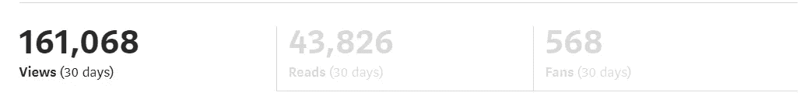

# 作为一个富有的程序员，这里是我的 7 个愚蠢简单的收入流

> 原文：<https://javascript.plainenglish.io/as-a-wealthy-programmer-here-are-my-7-stupidly-simple-income-streams-1b5192006114?source=collection_archive---------0----------------------->

## 不，我不会告诉你做联盟营销或制作 YouTube 视频。

Photo by [Maxim Ilyahov](https://unsplash.com/@glvrdru?utm_source=medium&utm_medium=referral) on [Unsplash](https://unsplash.com?utm_source=medium&utm_medium=referral)

罗伯特清崎一直建议我，与其为钱工作，不如让钱为我工作。

但是你需要钱来让它为你工作，对吗？

有了这个指导，我学会了编程，这样我就可以增加我的价值，并按照 Robert Kiyosaki 的建议开始我的道路。

老实说，我不想银行账户里有一百万美元，也不想住在纽约或获得 1000 个比特币。

那么，我在找什么？

我想拥有众多的生意，以及副业，并最终与自然共存。不要让我做朝九晚五的工作；我鄙视企业文化。

所有这些的结果是，我更加关注那些起步简单、不需要任何资金的副业。

是的，你可以说我愚蠢。

1.  **Web3**

在学习了 web 开发之后，我尝试学习 web3。当时我不知道这会帮我赚钱。

几个月后，一家公司邀请我参与他们的 Web3 项目。

听起来很有希望。

在讨论了工作程序并填写了一些文件后，我得到了这份工作。这不是一份朝九晚五的工作，也不是我想要的。

那么，到底是什么呢？实际上，我必须在某些开发人员工作期间指导他们。有时我甚至为 web3 应用程序创建了一些功能。

这就是事情的全部。

如果你想学习 web3，这里的[是一个很好的起点。](/im-a-self-taught-web3-developer-and-here-are-the-resources-that-i-used-f64b1909fed1)

**2。网页开发**

实话告诉你，网络开发让我变得富有。一开始我也没有别的赚钱方式，于是 web 开发就派上了用场。

在学习了 web 开发之后，我能够找到足够数量的低成本项目。为了挣钱，它们必须由我来完成。它很快就变成了我的金矿。

确切的说，写代码建网站需要足够的时间。你永远不知道什么时候你能弥补错误。简而言之，创建一个网站需要大量的时间和精力。

一开始你可能会认为这是我的全职工作，但随着我开发了几个收入来源，然后它变成了一个副业。

由于可用性的限制，我现在一次只接一到两个网站开发的工作。

 [## 我是一个自学成才的网络开发人员，这里是我使用的资源

### 这同样会帮助你学习和成功。

javascript.plainenglish.io](/im-a-self-taught-web-developer-and-here-are-the-resources-that-i-used-d7f37c47cc1a) 

**3。技术内容写作**

Google is the source of the majority of my views. That is why I have fewer readers.

老实说，我不能每天都写代码，因为我超负荷了，需要休息。从那时起，我开始写技术材料。

Medium 吸引我的主要原因是它庞大的读者群、它的运营方式以及它支付的金额。

是的，作者可以通过各种方式赚钱，包括赞助、联盟营销和自由职业。

另一方面，我不知道。

我至今没有做过任何付费推广，原因有二:我不想卖任何东西，也没有人找过我。

除此之外，我偶尔会推荐一些我拿不到足够钱的书。

我过去每周发布 2-3 篇文章，但现在我发布的次数最多。这可能是因为我喜欢在业余时间写更多的东西。

**4。出售设计**

我不想夸大其词，也不想做误导性的陈述。

准确地说，我没有足够的时间去开始新的东西。这就是为什么我把我的设计卖给我一个朋友的公司。

实际上，他负责把我的设计卖给公司，然后把钱直接打到我的银行账户上。我现在要做的就是发送设计。

是的，因为他的工作，我给他一部分佣金。

尽管我有很多可能性，比如在 Gumroad 或通过 Canva 销售，但我选择不这样做。

**5。咨询**

我不能自称是商业或编程专家。但是，更准确地说，我知道如何经营与编程相关的业务。

这就是为什么有些人，甚至公司，给我建议，然后付钱给我。

除了赚钱之外，我还能够与公司建立更多的联系，他们会在任何时候通知我他们想要生产任何新产品。

如果我喜欢这份工作，我也会投资其中。

**6。NFTs**

你可以相信我正在 Opensea 或其他地方出售我的 NFTs。不，我没这么说。是的，我尝试过，但是没有得到满意的答复，所以我放弃了。

接下来，班加罗尔的一家初创公司给了我一个项目。它仍处于早期阶段，平台本身还没有完成。

我正在和团队一起工作，通过增加某些功能来改进它。如果一切顺利，我想在那个平台上卖我的 NFTs。

到目前为止，在这家公司工作是我唯一的收入来源。不过，可能很快就会爆发，让我赚钱。

我还试图在 NFTs 中生成内容。但是我还没有找到一个更好的平台来做这件事。

此外，由于这些平台是新的，它们缺乏受众，甚至缺乏能够吸引客户的可行模式。

**7。服装生意**

这与我的编程能力无关。这更像是一种完成与我的技术能力无关的事情的愿望。

拜托，尼廷，实话实说吧。

老实说，我父亲有一家公司，我把钱投资在里面。这更像是一种投资，因为我信任我的父亲。

而且，在大多数情况下，我获得的回报率高于股票或金融衍生产品。

我不需要在这里投入任何时间和精力。我爸爸负责整个过程。

我也通过分红、期权交易、加密投资、加密赌注和其他来源赚钱。

然而，因为每个人都知道他们所有人，所以我没有将他们包括在这篇文章中。

> 这就是我要说的——谢谢。
> 
> 如果你喜欢阅读这样的故事，并想帮助我成为一名作家，考虑成为一名媒体成员。它每月收费 5 美元，给你[无限的媒体内容](https://nitinfab.medium.com/membership)。如果你通过我的链接注册，我会得到一点佣金。

*更多内容看* [***说白了就是***](https://plainenglish.io/) *。报名参加我们的* [***免费周报***](http://newsletter.plainenglish.io/) *。关注我们关于*[***Twitter***](https://twitter.com/inPlainEngHQ)*和*[***LinkedIn***](https://www.linkedin.com/company/inplainenglish/)*。查看我们的* [***社区不和谐***](https://discord.gg/GtDtUAvyhW) *加入我们的* [***人才集体***](https://inplainenglish.pallet.com/talent/welcome) *。*