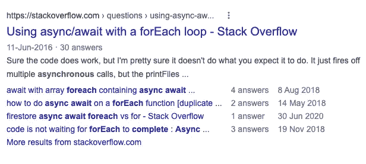
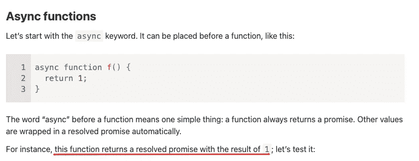
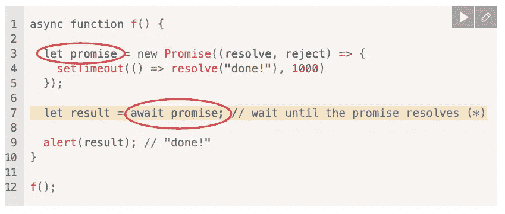
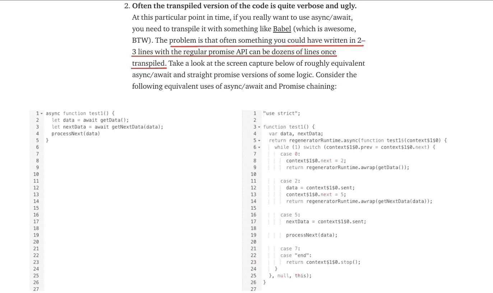

# 在 JavaScript 中使用 Async/Await 和 forEach()的最简单指南(带示例)

> 原文：<https://javascript.plainenglish.io/async-await-foreach-81d4859f2b8c?source=collection_archive---------1----------------------->

## 对 forEach()使用 async/await 并不一定是一场噩梦！这里有 4 个解决你问题的方法。

Why is my async/await not working? (Source: [Andrea Piacquadio on pexels.com](https://www.pexels.com/photo/young-ethnic-male-with-laptop-screaming-3799830/))

问问任何一个 JavaScript 开发人员，他们都会同意:

> 简直是疯了！有那么好。
> 
> 除非你决定在一个`*forEach()*`里面使用它。然后它会变得非常丑陋非常快。

在 JavaScript 中使用`async/await`和`forEach()`搜索任何查询，第一个结果会是一个 StackOverflow 问题。

Source Search query: [https://www.google.com/search?q=using+Async%2FAwait+with+forEach%28%29+in+JavaScript](https://www.google.com/search?q=using+Async%2FAwait+with+forEach%28%29+in+JavaScript)

有无数的开发者已经成为这头野兽的猎物，并努力清理这个烂摊子。这正是本指南将帮助你克服的。

一旦你完成了这个指南，你就再也不需要碰到类似这样的谷歌搜索结果了:

Source: [https://www.youtube.com/watch?v=4lqJBBEpjRE](https://www.youtube.com/watch?v=4lqJBBEpjRE)

所以，不再拖延，让我们冲一杯新鲜的咖啡，然后开始吧！

# 在使用 forEach()的 JavaScript 代码中，async/await 会引起什么问题

## 问题？

让我们看一些代码来理解这个问题:

代码的意图相当简单明了:

1.  `subscribedUsers`等待从昨天获取我的新订户的函数的结果。
2.  对于`subscribedUsers`数组中的每个`user`，我将发送一个我产品的促销代码。
3.  一旦每个用户都收到了促销代码，系统就会给我发一封邮件，通知我活动已经**成功**完成。

这是您希望这个代码块做的事情。

> 这也是一个相当常见的用例。你会用这样的代码来表示一堆不同的期望结果。所以，很有可能，你在更早的时候就已经遇到了这样的问题。

但是这段代码有很多问题，这是幕后实际发生的情况:

*   促销代码发送流程没有错误处理。因此，如果其中一个迭代抛出了一个错误，这个错误就不会被捕获。*不好！*(但是，我们暂时忽略错误处理— *一次一个问题，我的朋友。一次解决一个问题。*)
*   添加一个带有`currentTime`指令的 console.log，您会发现每次迭代都是并行进行的。但是，从代码编写的方式来看，你会期望它们一个接一个地发生。
*   在发送任何促销代码电子邮件之前，循环完成迭代。是的，发送电子邮件的过程已经开始，但是代码没有等待过程解决就继续。这不是你想要的代码流程。
*   即使尚未发送任何促销代码，管理员也会收到确认电子邮件。也许他们中的一些人会失败，也许他们都会失败。管理员永远不会知道，因为他被发送的邮件独立于承诺如何解决自己。

## 这个问题背后的原因:

简单地说，`[Array.prototype.forEach](https://developer.mozilla.org/en-US/docs/Web/JavaScript/Reference/Global_Objects/Array/forEach)`从来就不是为异步代码设计的。

它不适合承诺，即使在你周围看到的所有代码中都有`[Promise.then()](https://developer.mozilla.org/en-US/docs/Web/JavaScript/Reference/Global_Objects/Promise/then)`。而现在，在`async/await`的世界里，依然不适合`async/await`。

**那么，我们如何解决呢？**

有几种不同的方法可以解决这个问题。

最基本和最简单的答案是不要在 async/await 中使用`forEach()`。

毕竟，如果`forEach()`不是为异步操作设计的，为什么要期待它做一些它不应该做的事情。

`For….of`将完美地适用于您想要使用`forEach`的任何用例。

但是，如果您更喜欢`forEach`方法呢？好吧，挑剔先生！我们也会有一个解决方案。但是，公平的警告——你可能更适合其他方法！

然而，让我们离题一点。解决让 async/await 在 forEach 循环中完美工作的问题(使用两种方法— `for…of`和`forEach`)。

让我们花点时间了解一下我们的基本知识，并简要理解:

*   JavaScript 中的 Async/Await 到底是什么？
*   为什么 JavaScript 开发人员熟悉 async/await 很重要？
*   如何在 JavaScript 代码中使用 async/await？
*   你应该在代码中使用 async/await over Promises 吗？哪个更好？

那我们继续吧！

# JavaScript 中的 Async/Await 是什么，为什么要关注它？

## 什么是异步/等待？

Async/await 允许异步 JavaScript 代码在不阻塞主线程的情况下执行。

async 关键字将函数指定为异步操作。这确保了函数将总是返回一个承诺。

Source: [https://javascript.info/async-await](https://javascript.info/async-await)

在该功能中，`return 1`与 return `Promise.resolve(1)`基本相同

await 关键字指定应该等待哪个函数。请注意:await 关键字只在异步函数内部起作用(*或者可以用*)。

> 请注意:随着最新的更新，如果你在一个模块中工作，大多数现代浏览器将允许你使用顶层等待。但是现在，让我们把事情简单化。

await 关键字所做的只是暂停代码的执行，直到它所使用的承诺被解决。

这段来自 javascript.info 的代码块将澄清一些事情:

因此，在 await 行之后出现的任何代码片段都会等待轮到它，并且只有在承诺被解析后才会被执行。

让我重申一下。关键字`await`将实际上暂停函数的任何进一步执行，直到承诺被解决。就在那时(*，只有在那时*，功能恢复，当它恢复时，它以我们从承诺中得到的结果恢复。

## 你为什么要在乎？

*   这是一种更优雅的代码编写方式。
*   这样效率更高。
*   它不太耗费资源。由于函数的执行已经被挂起，JavaScript 引擎没有为这些特定的函数使用任何 CPU 资源，同时可以自由地执行其他任务。

您的代码受益于遵循比`promise.then()`更优雅的代码语法来从承诺中获得结果，并且您(*作为一名程序员*)得到的是一种更易于阅读和编写的语法。

# 如何在 JavaScript 中使用 Async/Await

关于如何在 javaScript 代码/项目中使用 async/await，有很多很好的参考资料。

[这里有一张](https://catalins.tech/how-to-use-asyncawait-in-javascript)由 [Catalin 的 Tech](https://medium.com/u/e345593e211e?source=post_page-----81d4859f2b8c--------------------------------) 制作，我认为它完美地抓住了本质。

[这里有一张](https://dev.to/somedood/best-practices-for-es2017-asynchronous-functions-async-await-39ji)由[巴斯蒂·奥提兹](https://twitter.com/BastiDood)创作。

> 这两种资源都在故事的结尾“建议的资源”下进行了链接。

由于我是 fireship 教程的超级粉丝，他们能够以初学者友好的方式解释复杂的主题，这里有一个来自 [Jeff Delaney](https://medium.com/u/be68cb994bb8?source=post_page-----81d4859f2b8c--------------------------------) 的短片(12 分钟)。

> 相比之下，你会在 YouTube 上找到的其他 async/await 视频的长度在 40 分钟到 1.5 小时之间。

为什么我在其他例子中加入了 fireship 教程视频？看看评论就知道了:

# 你应该选择异步/等待而不是承诺吗？

这是一个高度个人化的选择，这里两边都有人。

有些人坚信 async/await 为您的代码增加了惊人的价值，而不是简单的承诺。还有人认为 async/await 是在地狱之火中诞生的。

下面是许多开发人员反对使用 async/await 的一个理由:

他们是对还是错？您必须根据具体情况做出判断，这取决于您对代码做了什么。

但是，从个人经验来说，我对我使用的是 async/await 还是`Promise.then()`非常无所谓。我在我的代码中使用了这两种方法，我发现它们都很容易使用。

但是，有我更喜欢异步/等待的场景吗？是的。当我掉进了一个充满了面试和复试的兔子洞。我发现在这种情况下，async/await 是一个更干净的解决方案。

当你在几个星期后回到你的代码时，或者当你有另一个开发人员在同样的代码库工作时，更干净、更整洁和更短的代码确实有它的优势。

底线呢？如果干净整洁的代码对您很重要，请选择 async/await。你的代码看起来不同，更干净，更整洁，更短。并且提高了错误处理的简单性。

但是，如果您因为一些主要的性能增强而考虑选择 async/await 而不是 Promise.then()，您会发现自己很失望。

Async/Await 本质上与您的`Promise.then()`代码块做同样的事情。

因此，是的，您的代码看起来会有所不同，但是逻辑流程和功能将保持不变。

那好吧。既然我们已经简要介绍了关于 async/await 的所有知识，那么让我们回到手头的问题，并尝试解决我们之前在 forEach()中使用 async/await 时遇到的问题。

# 如何在 JavaScript 中用 forEach()修复 async/await 用法？

好吧。

我们之前看到的促销代码发送循环。让我们现在就解决这个问题。

## #1.解决方案的 for……

这个循环将在继续下一个迭代之前等待发送一封促销代码电子邮件。

> PS:Airbnb 的牛人发布了一个 [JavaScript 风格指南](https://airbnb.io/javascript/react/)。它遵循并推荐了他们所谓的“最合理的 JavaScript 方法”。github 上也有[风格指南。它非常受欢迎，被全世界成千上万的 JavaScript 开发者所追随。](https://github.com/airbnb/javascript)
> 
> 如果你还不知道，我强烈建议你看一看。
> 
> 无论如何，我提出 Airbnb 风格指南的原因很简单，它建议不要在网络应用中使用`*for…of*`,因为它需要一个大的多填充。
> 
> 如果您愿意，也可以使用`*Array.reduce()*`来达到同样的效果。

## #2.Array.reduce()解决方案

愿 Airbnb 的神对这个解决方案满意！

我们习惯于使用第二个参数作为前面代码执行的输出— *对事情进展的总结，如果可以的话*。但是，在这种特殊的情况下，事情有点不同。

我们使用参数— *referencePoint* —只是作为一种将承诺从上一次迭代的回调传递到下一次迭代的手段。

这有助于我们的代码在开始处理下一个迭代之前等待上一个迭代完成。

我不太喜欢这种方法。

虽然它没有任何问题，并且它的行为几乎与我们在解决方案#1 中看到的`for…of`示例完全相同，但我发现这个解决方案是:

*   沉闷的
*   难以阅读
*   有点困惑— *特别是对于初学者*

但是，这是 Airbnb JavaScript 风格指南推荐的方法。可能是因为它不会像`for…of`那样使用迭代，所以会减少你的浏览器包大小。

当你的代码有迭代器时，一些浏览器确实需要一个 polyfill，polyfill 确实很有效。话虽如此，如果我必须在包大小和我的便利性之间做出选择，你好便利性！😜

传统的`for`方法，以及我们刚刚看到的`Array.reduce()`方法，串行处理您的代码。它发送一封促销邮件，等待承诺得到解决，然后转向下一个用户。

但是在很多情况下(例如，这个例子本身就是)，循环迭代的顺序并不重要。

你只是想让每个用户独立地收到一个促销代码。

因此，与其串行处理，不如并行循环所有新订户更快。这让我们想到了列表中的下一个解决方案。

## #3.`Array.map()`解决方案

这种解决方案是优雅的，因为它启动了同时向所有用户发送促销代码的过程。但是，它会等待它们中的每一个完成执行，然后再将电子邮件发送给管理员。

现在，让我们最终进入今晚的重头戏。

对 forEach()使用 async/await

## #4.async/await，使用 forEach()…以正确的方式完成

剧透警告:太恐怖了！只需使用#1 或#3。我不是#2 的超级粉丝(抱歉，Airbnb 的主人)，这个是…只是…的…*最差！*

太恶心了！

这可能有用，但这并没有减少它的恶心程度。

# 结论

不要试图让某事做它不应该做的事。

forEach()从来不是为异步代码设计的。因此，如果你试图让它这样做，你将需要做一些额外的跑腿工作只是为了让它发生。

当你有更好、更简单、更容易的方法来达到同样的产出时，做这些又有什么意义呢？

现在交给你了。

*   你是否遇到过 async/await 的问题，因为你没有意识到你在 forEach()中使用了它？
*   在这段时间里，当你试图解决问题时，你打破了什么？

你还想让我在这里报道什么？如何在可迭代场景中使用 async/await？请在评论中告诉我！

# 建议的资源:

*   [https://catalins.tech/how-to-use-asyncawait-in-javascript](https://catalins.tech/how-to-use-asyncawait-in-javascript)
*   [https://dev . to/some dood/best-practices-for-es 2017-async-functions-async-await-39ji](https://dev.to/somedood/best-practices-for-es2017-asynchronous-functions-async-await-39ji)

*更多内容看* [*说白了。报名参加我们的*](http://plainenglish.io/) [*免费周报*](http://newsletter.plainenglish.io/) *。在我们的* [*社区*](https://discord.gg/GtDtUAvyhW) *获得独家写作机会和建议。*