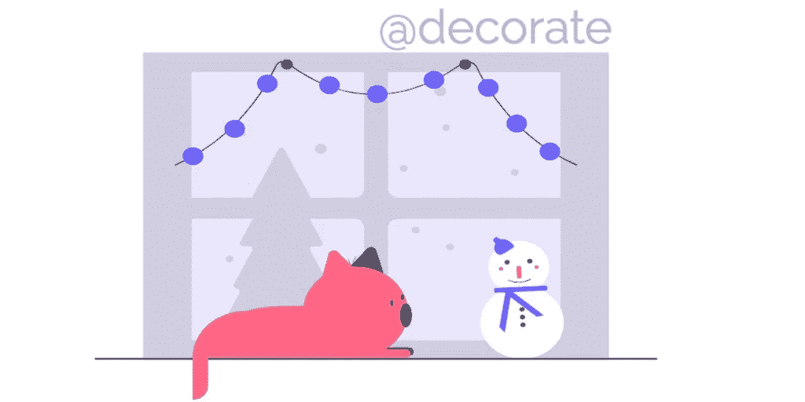

# 使用 TypeScript 装饰器在 Angular ngOnInit 中异步/等待

> 原文：<https://javascript.plainenglish.io/async-await-in-angular-ngoninit-using-typescript-decorator-b8b35963407c?source=collection_archive---------1----------------------->



很多时候，在页面加载或类初始化之前，需要使用 API 的承诺来加载数据。

为了实现这一点，我看到我的许多开发伙伴在`ngOnInit`上使用`async`，这样他们就可以在`ngOnInit`内对数据获取 API 方法进行`await`

```
async ngOnit {
  this.movies = await this.service.getMovies();
}
```

但是如果你仔细观察，没有人在等`ngOnInit`，即使你想等也等不到`await ngOnInit`。

它将运行异步函数，但不会等待它完成，它只允许你使用`await`关键字，但它不是`aysnc`函数，尽管有`async`关键字。

这看起来有点尴尬，有点难以理解，似乎不是传统。

理想情况下，方法是使用路由解析器，以便在路由完成导航之前加载数据，并且我可以知道在视图加载之前数据是可用的。

许多堆栈溢出的答案指出了一种可读性更好的方法，不用给`ngOnInit`添加`async`关键字，但是解决方案的行为是一样的。

```
ngOnInit() {
  (async () => {
    this.movies = await this.service.getMovies();
  });
}
```

> 乔纳森·甘布尔(Jonathan Gamble)在迫使 Angular 等待你的异步函数(Async Function)方面也有一个有趣的地方。

这不仅仅是角度分量。想象一个简单的类，它装载一些数据，并且有数据的 getters 和 setters。

```
class MovieService {
  private movies: Movie[]; constructor(){
    this.loadMovies();
  } getMovieById(id: number) {
    return this.movies.find(movie => movie.id === id);
  } getAllMovies() {
    return this.movies;
  } private async loadMovies(){
    this.movies = await MovieStore.getTodos();
  }
}
```

在上面的例子中，当类的实例被创建时，数据将立即开始加载，并且构造函数不能被阻塞，直到数据被完全提取。因此，如果在请求挂起时调用 getters，它可能会以默认的 empty 或`undefined` movies 对象结束。

所以你只能希望在调用任何 getters 的时候数据已经被加载了。改变这种情况的方法是添加一些延迟加载，让访问器等待加载请求，如下所示。

```
async getMoviesById(id: number){
  if(!this.movies){
    await this.loadMovies();
  }
  return this.movies.find(movie => movie.id === id);
}
```

看起来不错，但是这段代码现在变成了重复的代码，如果我们能够找到一种方法用其他东西抽象所有这些连接，加载请求可能会被触发不止一次。

## [打字稿装饰工](https://www.typescriptlang.org/docs/handbook/decorators.html#decorator-composition)来救场了🎉

*装饰器*是一种特殊的声明，可以附加到[类声明](https://www.typescriptlang.org/docs/handbook/decorators.html#class-decorators)、[方法](https://www.typescriptlang.org/docs/handbook/decorators.html#method-decorators)、[访问器](https://www.typescriptlang.org/docs/handbook/decorators.html#accessor-decorators)、[属性](https://www.typescriptlang.org/docs/handbook/decorators.html#property-decorators)或[参数](https://www.typescriptlang.org/docs/handbook/decorators.html#parameter-decorators)上。

简单明了地说，**装饰器是** **一个函数，它接受另一个函数并扩展后一个函数的行为，而无需显式修改它。**

抽象连接的一个好方法是在我们可以等待的地方使用 decorators，首先调用所有要运行和完成的方法，然后运行依赖于这些方法的方法。如下图所示:

Movies Service using Init decorator

以下是如何让这些装饰工作。您可以将每个装饰器添加到任意多的方法中。

Init/WaitForInit Decorator implmentation

## 对装饰新手的代码解释

为了理解 init/waitForInit 装饰器代码，我们首先必须理解装饰器是如何被评估的。

> 这里很好地解释了装饰者是如何被评估的，我推荐你去看看。

让我们以下面的例子来理解评估:

同上，我们所有的`init`修饰的方法将首先被评估，其中在电影服务案例中，`loadMovies`将被注册为`INIT_METHODS`之一，然后当任何一个用`waitForInit`修饰的方法如`getAllMovies`被调用时，它将首先运行`loadMovies`承诺，然后运行相应的调用函数。

> 等待🤔我们正在讨论代码在哪里？👊

别担心，我们会掩护你的。下面是如何在`ngOnInit`上使用相同的`init/waitForInit`装饰器。

下面是 Stackblitz 示例，演示了`ngOnInit`上的装饰器。

[https://angular-ivy-kq23e 9 . stack blitz . io](https://angular-ivy-kq23e9.stackblitz.io)

init/waitForInit on ngOnit in Angular

最后，我们简要讨论了在 Angular 中使用 TypeScript decorator 预加载任何类中的数据或在模板初始化之前的实现。

请在下面留下评论，让我知道其他各种方法，如果有的话，或者如果有任何即兴创作。我很乐意回答这些问题。

**推荐人:**

1.  [强制 Angular 等待您的异步函数](https://dev.to/jdgamble555/forcing-angular-to-wait-on-your-async-function-2ck1)
2.  [@init / @waitOnInit 类型脚本方法装饰器](https://romkevandermeulen.nl/2018/05/10/waitoninit.html)
3.  [打字稿装璜师](https://www.typescriptlang.org/docs/handbook/decorators.html#decorator-composition)
4.  [[stack overflow]async/await in Angular ` ngoninit](https://stackoverflow.com/questions/56092083/async-await-in-angular-ngoninit/58474585#58474585)`中

*更多内容请看* [***说白了。报名参加我们的***](https://plainenglish.io/) **[***免费周报***](http://newsletter.plainenglish.io/) *。关注我们*[***Twitter***](https://twitter.com/inPlainEngHQ)*和*[***LinkedIn***](https://www.linkedin.com/company/inplainenglish/)*。查看我们的* [***社区不和谐***](https://discord.gg/GtDtUAvyhW) *加入我们的* [***人才集体***](https://inplainenglish.pallet.com/talent/welcome) *。***