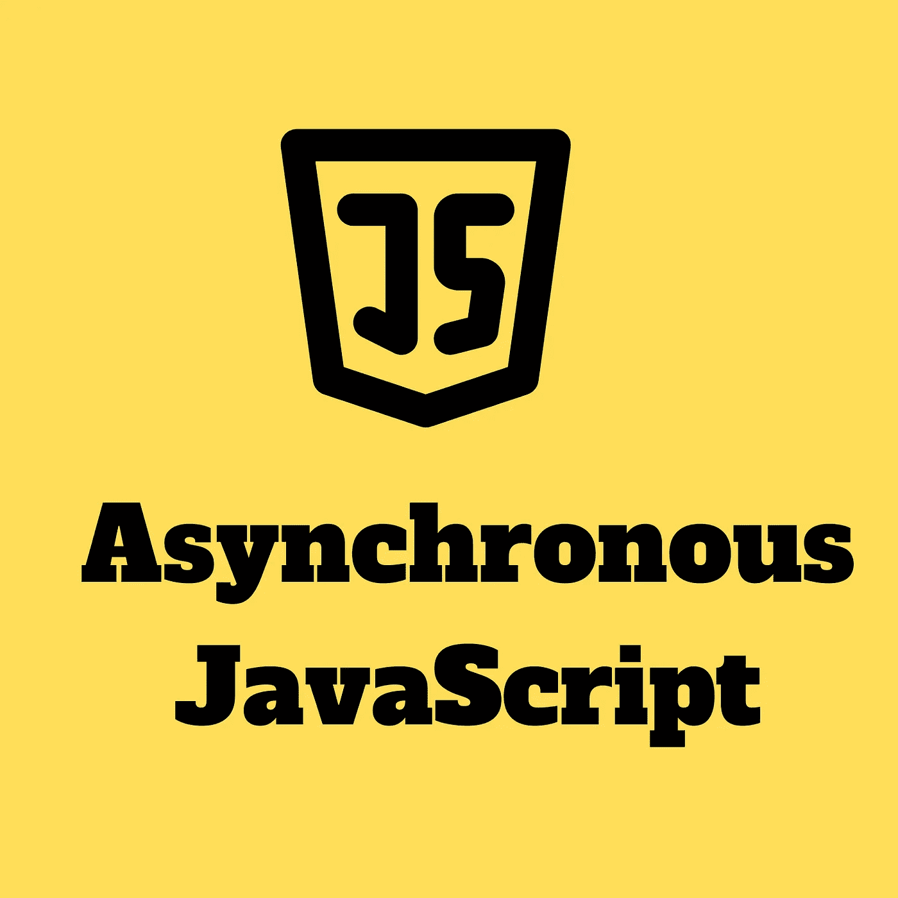
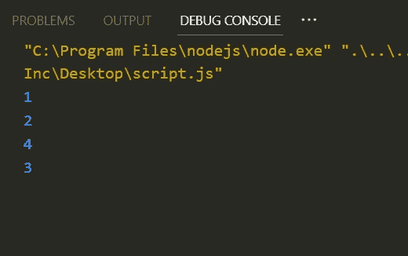
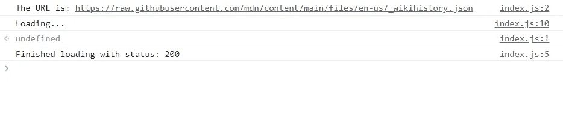

# 异步 JavaScript

> 原文：<https://javascript.plainenglish.io/asynchronous-javascript-f4da24dd0a21?source=collection_archive---------15----------------------->

The above image is created by Divyojyoti Ghosh(me) on [www.canva.com](http://www.canva.com/) using different elements available for making designs.

在开始理解 JavaScript 中的异步编程之前，让我们先了解一下 JavaScript 中的同步编程是什么意思。我们用 JavaSript 编写的大部分代码都是同步的。

同步代码的执行逐行发生**，这意味着，在一行的执行开始之前，它等待最后一行的执行结束。**

**这一切都工作得很好，但是如果一个**长时间运行的同步任务**发生，它就成了代码的一个障碍，它必须等待长任务的完成。例如，有时网页需要加载一些数据或为页面的一部分执行一个函数，这可能会花费很多时间，如果我们使用同步代码，整个 UI 将变得无响应，直到函数或数据的执行被完全加载。**

**脸书的通知可以是一个很好的例子，如果脸书在通知中使用同步代码进行更新，每次新的通知到来时，整个 UI 都会停止加载新的通知，在加载新的通知期间，滚动将不起作用，我们也不能喜欢或评论任何帖子。**

**JavaScript 中的异步编程允许程序执行一个潜在的长时间运行的任务，并且仍然响应其他事件，当长时间运行的任务被完全执行时，它的结果被呈现。**

# **复试**

**异步任务的一个问题是，如果它在后台运行，我们如何知道它已经完成了？回调就是对这个问题的回答，回调是一个传递给另一个函数并在任务完成时被调用的函数。我们还需要理解回调的使用并不总是意味着它是异步的，它完全取决于回调作为参数传递的函数。`setTimeout()`函数是一个很好的例子，其中我们将计时器计数作为第一个参数传递，将回调作为第二个参数传递。**

**Code Snippet 1**

**上述代码片段的输出是:**

****

**Output for Code Snippet 1**

**3 在 4 之后被记录，这是因为 setTimeout 函数，它在后台运行一个 5000 毫秒的计时器，然后将 3 记录到控制台，但是 setTimeout 函数不会阻止它下面的代码，因为它是异步工作的。`function(){print(3)}`作为 setTimeout 函数的回调函数，一旦超过 5000 毫秒，调用回调函数，然后记录 3 作为输出。**

# **事件处理程序**

**addEventListener 函数是一个非常常见的函数，用于处理任何事件。它至少有两个参数，第一个是“事件类型”，第二个是“事件处理程序”。**事件处理器**基本上是一个回调函数，一旦事件发生就会被执行。**

**该函数异步工作，因为它不阻塞任何其他代码，并且它在后台运行，一旦事件异步完成，就调用事件处理函数。**

**除了许多 UI 事件，addEventListener 还可以用于处理 API 调用，作为参数传递的事件处理程序可以在 API 调用完成后发出通知。下面的代码片段就是一个很好的例子。**

**Code Snippet 2**

**在上面的代码片段中，用户请求一个 API URL，一旦用户输入该 URL，该 URL 将作为对用户输入的反馈记录在控制台上，并且异步进行 API 调用。同时，没有代码被阻塞，最后一条语句在控制台上记录“Loading…”。一旦 API 调用完成，状态就会记录在控制台上。**

**上述代码片段的输出如下-**

****

**Output for code snippet 2**

# **资源**

**[介绍异步 JavaScript —学习 web 开发| MDN(mozilla.org)](https://developer.mozilla.org/en-US/docs/Learn/JavaScript/Asynchronous/Introducing)**

**[https://www . udemy . com/course/the-complete-JavaScript-course/](https://www.udemy.com/course/the-complete-javascript-course/)**

** [## 发现要点

### 以下问题列表摘自…

gist.github.com](https://gist.github.com/) 

## 更多内容请访问 [PlainEnglish.io](https://plainenglish.io/) 。

*报名参加我们的* [***免费每周简讯***](http://newsletter.plainenglish.io/) *。关注我们关于* [***推特***](https://twitter.com/inPlainEngHQ) 、 [***领英***](https://www.linkedin.com/company/inplainenglish/) ***、***[***YouTube***](https://www.youtube.com/channel/UCtipWUghju290NWcn8jhyAw)***，以及****[***不和***](https://discord.gg/GtDtUAvyhW) *

## *想扩大你的软件创业规模吗？检查[电路](https://circuit.ooo/?utm=publication-post-cta)。***